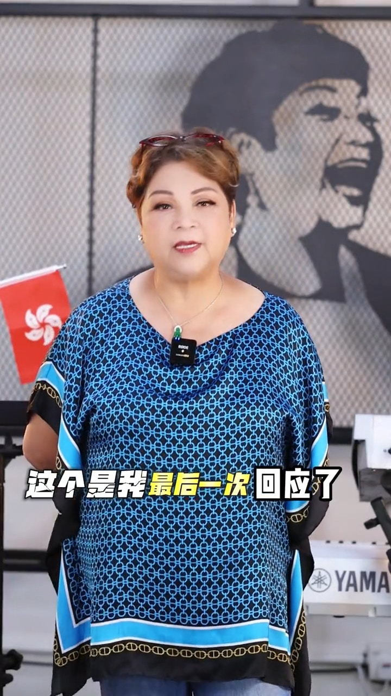
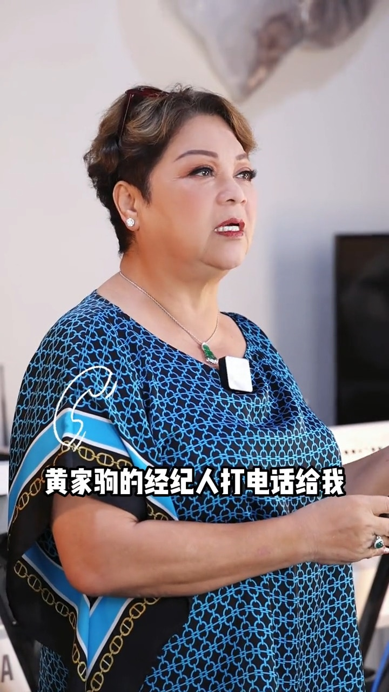
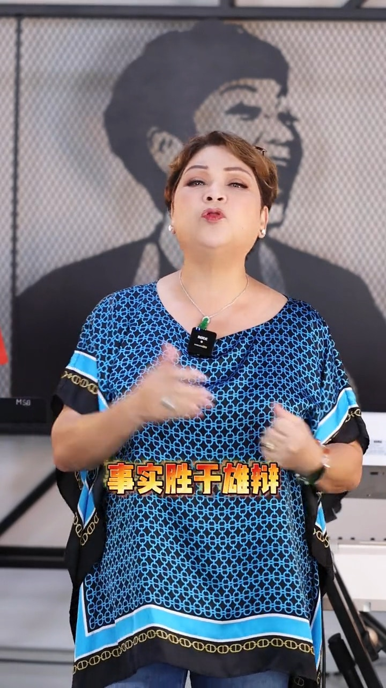

最近肥媽與黃家強因為黃家駒生前的《肥媽》demo而鬧得沸沸揚揚，二人更隔空展開罵戰，肥媽一再澄清自己沒有「抽水」，昨日（27日）有網民找到2008年黃家強的一篇訪問而真相大白。肥媽今日（28日）在影視平台上載回應影片，指自己是最後一次回應有關事件。

肥媽話係最後一次回應有關事件。（影片截圖)

肥媽片中說道年初的時候，黃家駒的經紀人打電話給她，問她知不知道家駒做了一首歌給她，更問她願不願意唱這首歌？之後肥媽當然說願意。事情發展到這樣，肥媽便感嘆道：「為什麼要變成這樣呢？」她又感謝粉絲幫助找到以前的報道，說明黃家強真的講過那句話：「作品的歌名是人名，他當時想作給誰便起那人的名字，其中一個譜是給肥媽瑪利亞，估計當時他們曾傾談合作。」

肥媽片中說道年初的時候，黃家駒的經紀人打電話給她。（影片截圖)

肥媽又表示會唱這首歌是因為自己對黃家駒的尊重：「他是永遠、永遠、永遠，神級嚟㗎啦家駒係。我喜歡家駒，希望唱到他的歌，我是用心唱的。」最後她都不忘說自己十分心痛及「事實勝於雄辯」。

肥媽話「事實勝於雄辯」。（影片截圖)
