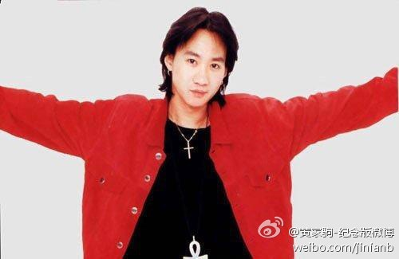
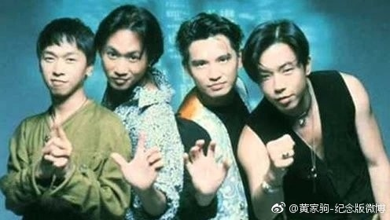
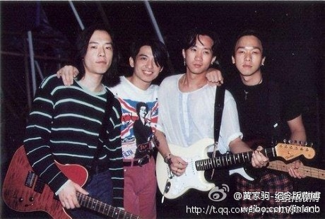
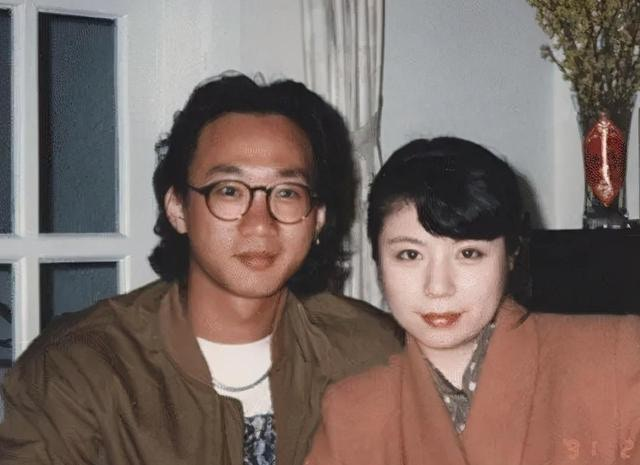

黃家駒逝世30年（Weibo@黃家駒-紀念版微博）

## 黃家駒逝世30年｜死因是一場意外而昏迷 終與世長辭

1993年6月24日，樂隊Beyond正為宣傳即將推出的日文專輯而被日本富士電視台邀請前往拍攝遊戲節目《小內小南的想做什麼就做什麼》時，不幸發生嚴重意外，黃家駒因當時身於狹窄並沾滿水漬的台上奔跑不慎滑倒，使身後三塊佈景板的裝置脫落。當時黃家駒及主持人內村光良一同墜落三米高台，主持人內村光良受了輕傷，而黃家駒後腦卻不幸先落地，即時進入昏迷狀態。後來院方當局公開了死因指出，由於黃家駒頭部嚴重受創，因急性腦膜下血腫、頭蓋骨骨折、腦挫傷及急性腦腫脹，未能清去腦內瘀血，最終在6月30日不幸逝世。

> 不要悲傷盼望我別去後共你在遠方相聚，每一天望海，每一天相對，盼望你已沒有讓我別去後的感覺，我即使離開，也在你的天空裡。
黃家駒

黃家駒逝世30年｜一場意外與世長辭（Weibo@黃家駒-紀念版微博）

## 黃家駒逝世30年｜Beyond兄弟情不在 多年傳不和？

自黃家駒逝世後，Beyond其他成員黃家強、黃貫中、葉世榮等都深受沉重打擊，足足整理了4個月多才能夠重新出發。其後3名成員黃家強、黃貫中、葉世榮繼續承傳黃家駒的音樂理念，相繼發行不同的專輯，可惜人氣下滑，銷量亦不及以前。直至2005年，三人舉行了最後一場的演唱會《Beyond The Story Live 2005》告別世界巡迴音樂會，後宣佈Beyond團隊正式解散。

> 不是BEYOND需要我，而是我需要BEYOND！
黃家駒

外傳因內部不和，尤其是黃家強及黃貫中的矛盾最為深，其後二人更不時在社交平台疑似影射對方，甚至2008年有報導指二人因一首歌曲意見不合而大打出手，外界更確信二人不和的傳聞。

黃家駒逝世30年｜兄弟情不在 多年傳不和（Weibo@黃家駒-紀念版微博）

直到2017年葉世榮參加了節目《圍爐音樂會》，而節目組要求他邀請兩位圈內好友成為助陣表演。正當外界以為葉世榮將會邀請黃家強及黃貫中時，大家都期待著Beyond的再次合體，然而讓人出奇是，葉世榮最後邀請了黃貫中及Beyond初期成員劉志遠。相信已間接解釋了多年間的不和傳聞，或許已故黃家駒看到兄弟們的不和絕對痛心不已。

> 我們希望將BEYOND的音樂帶往世界，使BEYOND國際化，這是一個野心很大的理想，雖然路並不容易行，但我們會努力把它實現。
黃家駒

黃家駒逝世30年｜1999年三人舉行了最後一場的演唱會《Beyond 2000》後宣佈Beyond正式解散。（Weibo@黃家駒-紀念版微博）

## 黃家駒逝世30年｜才子黃家駒 讓Beyond打開知名度

黃家駒留下的最後作品《海闊天空》至今仍然是街知巷聞的名曲，但黃家駒初時的音樂之路都經過一波三折。他由作詞、作曲、演唱及編曲一手包辦，黃家駒亦曾在受訪時把他熱愛音樂之心完完全全表達出來。多年的努力𡚒鬥終於受到重視，不少歌曲亦引起聽眾的共鳴，終讓Beyond打開知名度，更成為香港本地的搖滾樂隊。

黃家駒逝世30年｜才子黃家駒讓Beyond打開知名度（Weibo@黃家駒-紀念版微博）

> 我想如果沒有音樂我會死的，我真的會死。
黃家駒

> 我屬於非常走火入魔的那種，不是隨隨便便玩玩的。
黃家駒

> 香港只有娛樂圈，沒有樂壇。
黃家駒

> 在最光輝燦爛的時候把生命一下子玩到盡頭，就是永恆！
黃家駒

## 黃家駒逝世30年｜經歷幾段感情 唯一承認女友是他？遺憾來不及成家

至於感情方面，黃家駒曾經歷幾段感情遺憾來不及成家，其中最為人熟悉的戀情相信是他跟林楚麒的一段情。當時林楚麒跟黃家駒的交往是最具爭議性，雖則不受男方家人接受，但她卻是黃家駒第一個亦是最後一個親口承認的女友。

據傳林楚麒是首位支持他玩音樂的女友，她不但唱功了得，更懂得作詞，亦曾為Beyond寫了《曾經擁有》的國語詞，林楚麒跟黃家駒因趣味相投而相互吸引並互生好感終相戀，林楚麒曾在《無聲的告別》MV中出現，相信這亦能力證女友地位。

直到黃家駒的靈堂上，女友林楚麒戴上白花出席喪禮，據傳她更以「未亡人」身份出席，更花了10多年時間才接受黃家駒的離開，有指現時林楚麒仍是單身，堅守30多年為黃家駒終身不嫁，她曾表示：「在我心中已和家駒成為夫妻。」

黃家駒逝世30年｜幾段感情遺憾來不及成家（Weibo@白眼狼全是爱Koma）

**【黃家駒逝世Q&A】**

> 黃家駒的死因是甚麼？

黃家駒因在台上不慎滑倒，後腦先落地，頭部嚴重受創，未能清去腦內瘀血，最終在6月30日不幸逝世。

> 黃家駒的女友是誰？

黃家駒曾經歷幾段感情遺憾來不及成家，其中最為人熟悉的相信是他跟女友林楚麒的一段情，詳情請細閱內文。
