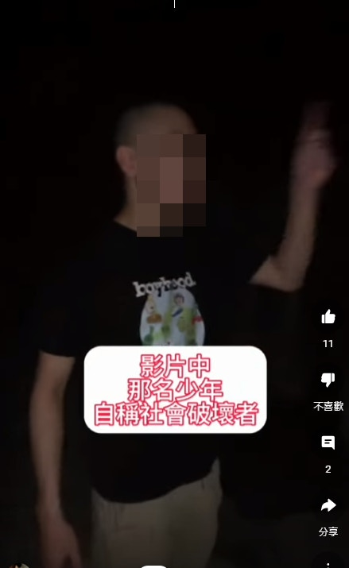
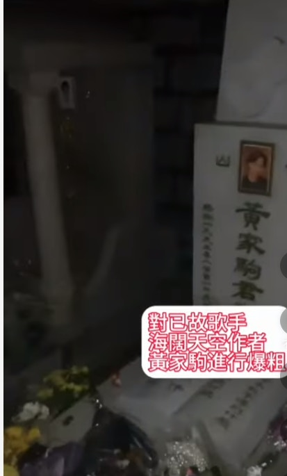

涉案光頭少年用腳踩歌迷獻上的鮮花祭品之餘，更用錘扑遺照，導致遺照毀爛。（網上片段）

去年2月，5名當時年齡介乎14至28歲的男子，闖入阿布泰國生活百貨（現被Big C收購，全線改名「Big C」），位於旺角荷李活商業中心的分店高聲叫囂，並滋擾顧客。案中被控兩項「遊蕩導致他人擔心罪」的其中一名少年，正是今日毀壞黃家駒墳墓的光頭男子，在庭上播放的錄影會面中，他表示為「挑戰」、「過癮」，而大罵阿布泰創辦人林景楠。裁判官批准5名被告以簽保守行為方式處理，自簽2,000港元，守行為兩年，控罪獲撤銷。

光頭少年在守行為期間，今日卻偕友到將軍澳華人永遠墳場，毀壞樂隊Beyond已故主音黃家駒墳墓，涉嫌刑事毀壞被捕。他不斷以粗言辱罵黃家駒，向墓碑淋潑汽水後上前舔走，用腳踩歌迷獻上的鮮花祭品之餘，在墓碑上寫字，更用錘扑遺照，導致遺照毀爛。

翻查資料，光頭少年並非第一次到黃家駒墳墓搗亂。去年8月，已有人上載片段譴責此人到墳墓粗口辱罵黃家駒，批評黃「垃圾」、「海闊天空好X難聽」。

刑毀片段被上載到網絡，一名光頭男子自稱「社會破壞者」，粗言辱罵黃家駒，向墓碑淋潑汽水後上前舔走。（網上片段）

刑毀片段被上載到網絡，一名光頭男子自稱「社會破壞者」，粗言辱罵黃家駒，向墓碑淋潑汽水後上前舔走。（網上片段）

刑毀片段被上載到網絡，一名光頭男子自稱「社會破壞者」，粗言辱罵黃家駒，向墓碑淋潑汽水後上前舔走。（網上片段）

一名光頭男子自稱「社會破壞者」，粗言辱罵黃家駒，向墓碑淋潑汽水後上前舔走，用腳踩歌迷獻上的鮮花祭品。（網上片段）

一名光頭男子用腳踩歌迷獻上的鮮花祭品。（網上片段）

光頭少年在墓碑上寫字。（網上片段）

一名光頭男子自稱「社會破壞者」，粗言辱罵黃家駒，向墓碑淋潑汽水後上前舔走，用腳踩歌迷獻上的鮮花祭品之餘，更用錘扑遺照，導致遺照毀爛。警方經調查後拘捕一名15歲少年及一名23歲男子，涉嫌刑事毀壞。（網上片段）

翻查資料，光頭少年並非第一次到黃家駒墳墓搗亂，去年8月已有人上載片段譴責此人到墳墓粗口辱罵黃家駒，批評黃「垃圾」、「海闊天空好X難聽」。（Beyond Forever youtube片段）

翻查資料，光頭少年並非第一次到黃家駒墳墓搗亂，去年8月已有人上載片段譴責此人到墳墓粗口辱罵黃家駒，批評黃「垃圾」、「海闊天空好X難聽」。（Beyond Forever youtube片段）
