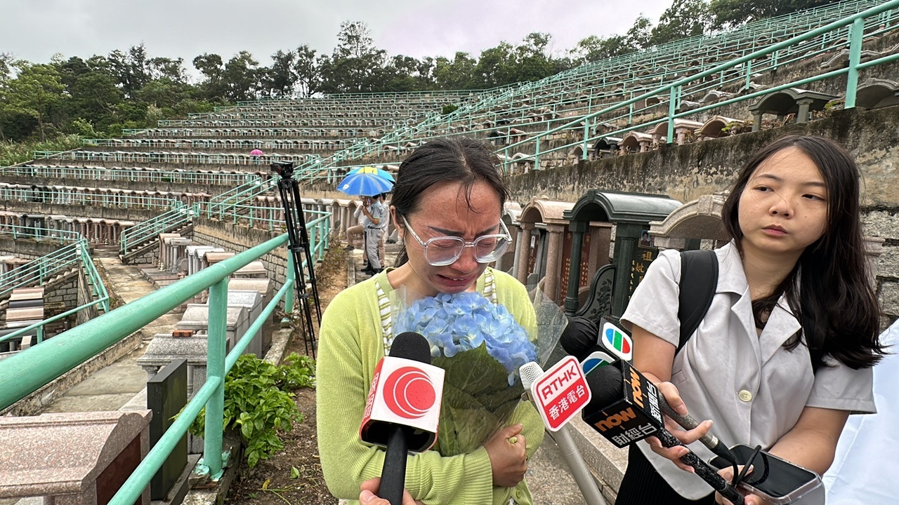
由四川來港的阿英，驚悉偶像填墓被毀，手持鮮花，泣不成聲。（馬耀文攝）

家駒墳墓被毀消息傳出，有人員趕抵以白布遮蓋墓碑保護；不少歌迷得知事件冒雨致祭。來自四川涼山彜族的女歌迷阿英泣不成聲，她指小學開始便喜歡黃家駒，「他就是唯一的男神！以後結婚了，也一定要放黃家駒的歌！家駒我永遠愛你！」她稱，今日特意提前來港探望家駒，結果第一次來便驚悉偶像墳墓被毀，她手持鮮花跪地致祭，聲淚俱下稱：「來到這裡就看到這個樣子‥‥‥太心痛了！我不知道為什麼會有那麽惡的人！黃家駒那麼好的人‥‥‥」她又指犯案者會有報應，「善有善報、惡有惡報、不是不報、時候未到！」

來自安徽的儲先生亦是第一次來港拜祭黃家駒，他指中學時已喜歡家駒，至今逾20年，認為其音樂影響了他的人生，包括創業至今的種種挑戰，「是一種傳遞、一種永不放棄的精神、也可能是一種獅子山精神。」他抵埗後才知發生刑毀案，對事件感到莫名奇妙，「有一點遺憾，就是有點不理解，有些氣憤。」如有機會，將來他會再來香港致祭。

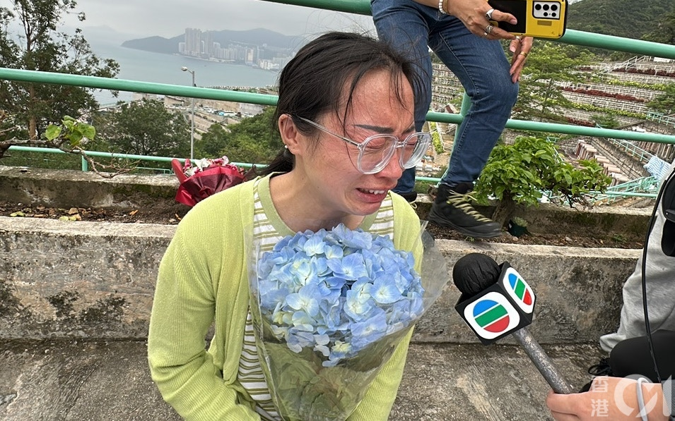
由四川來港的阿英，驚悉偶像填墓被毀，手持鮮花，泣不成聲。（馬耀文攝）

黃家駒的友人、黃家強的助手劉先生亦趕抵了解，他感到十分憤怒。（馬耀文攝）

來自安徽的儲先生亦是第一次來港拜祭黃家駒，對事件不理解及氣憤。（羅日昇攝）

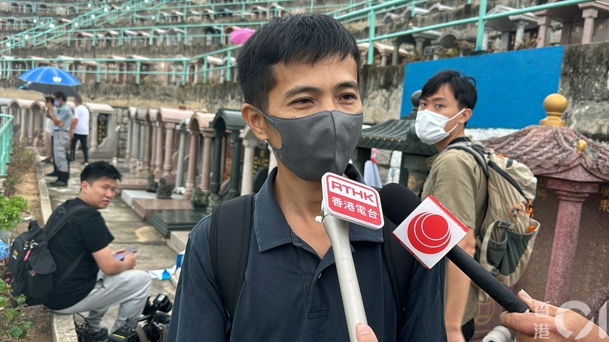
歌迷區先生大感錯愕，稱：「唔係好開心‥‥‥聽到有啲想喊。」（鄭嘉惠攝）

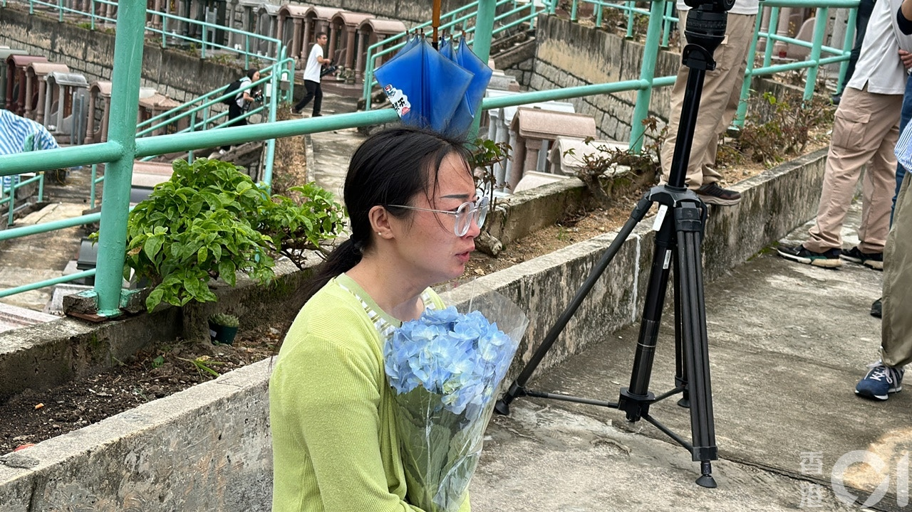
由四川來港的阿英，驚悉偶像填墓被毀，手持鮮花跑地致祭，泣不成聲。（馬耀文攝）

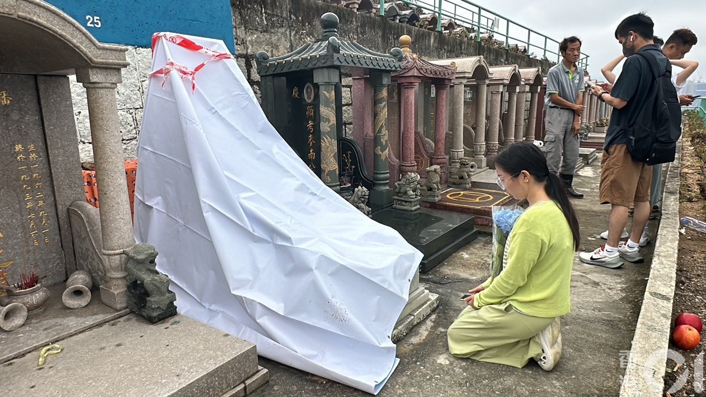
四川來港的女歌迷聲淚俱下稱：「太心痛了！」（鄭嘉惠攝）

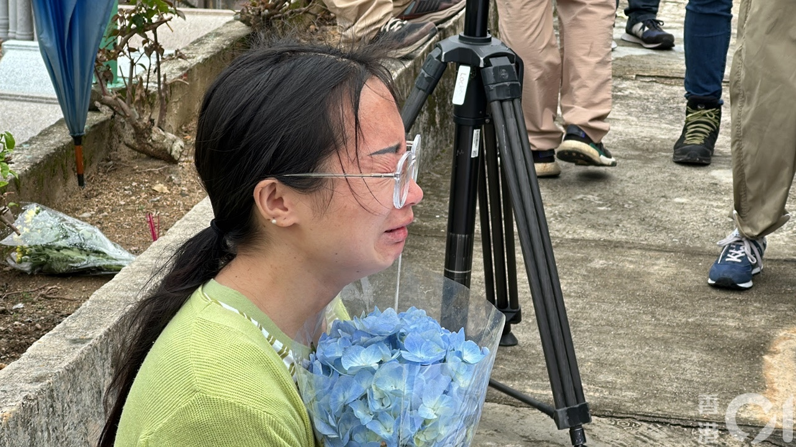
由四川來港的阿英，驚悉偶像填墓被毀，手持鮮花跑地致祭，泣不成聲。（馬耀文攝）

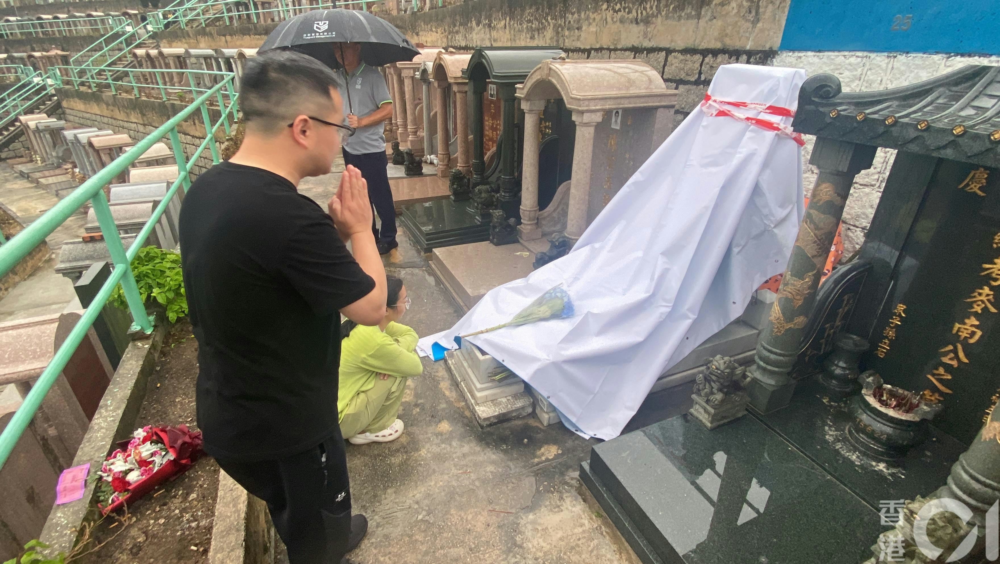
來自安徽的儲先生亦是第一次來港拜祭黃家駒，對事件不理解及氣憤。（羅日昇攝）

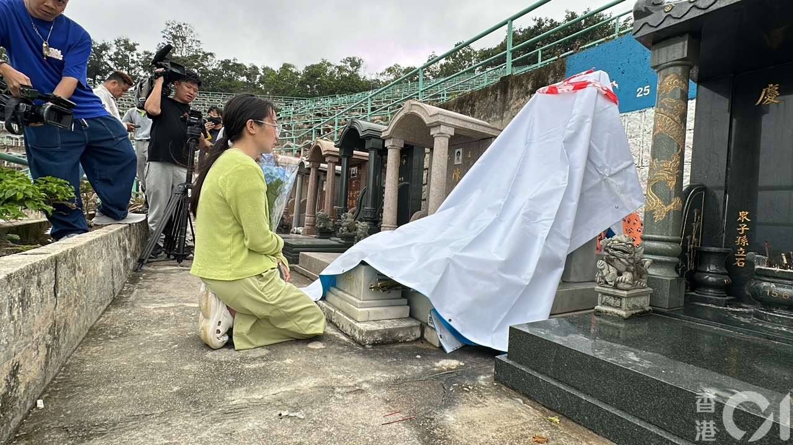
由四川來港的阿英，驚悉偶像填墓被毀，手持鮮花跑地致祭，泣不成聲。（馬耀文攝）

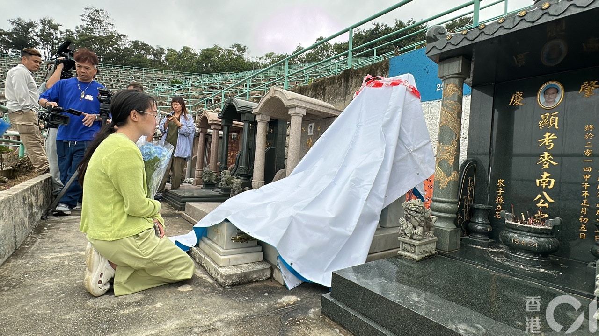
由四川來港的阿英，驚悉偶像填墓被毀，手持鮮花跑地致祭，泣不成聲。（馬耀文攝）

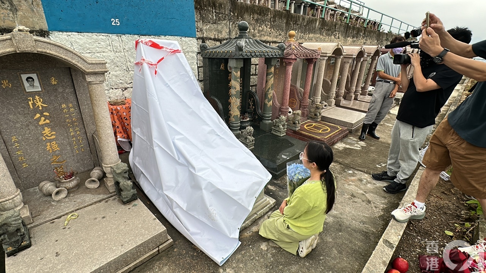
由四川來港的阿英，驚悉偶像填墓被毀，手持鮮花，泣不成聲。（馬耀文攝）

黃家駒的友人、黃家強的助手劉先生亦趕抵了解，他指家強不在香港，仍未知事件，他是收到粉絲傳來片段才驚悉事件。他認為犯案者不正常、不理性，「好激憤，其實家駒一直都係好受到大家愛戴，我覺得好激氣，好唔應該，我相信每一個愛beyond愛家駒嘅朋友，都會好憤怒！」他指，家駒一直宣揚「和平與愛」，已成為香港以至中華地區的文化象徵，是「香港人的驕傲」，促警方和相關部門嚴肅跟進。

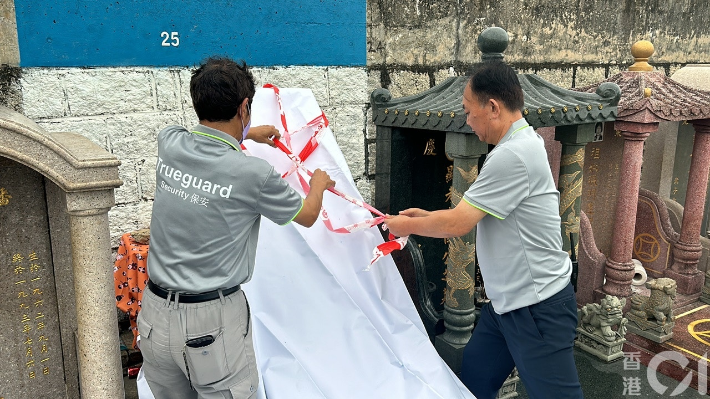
有人員以白布遮蓋家駒墳墓。（鄭嘉惠攝）

另外，居於葵芳的區先生，今日亦是首次到家駒墳墓致祭，詎料見到墳頭被白布遮蓋才得知事件，他大感錯愕，「唔係好開心‥‥‥聽到有啲想喊。」區先生批評疑犯行為，應予以譴責。他指，自己14歲開始已喜愛家駒，「讀書嗰時好似一個潮流，好興佢啲歌，成個校園都鐘意佢啲歌！」而他最愛的歌為海闊天空。

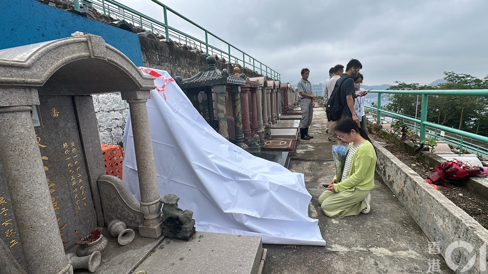
由四川來港的阿英，驚悉偶像填墓被毀，手持鮮花，泣不成聲。（馬耀文攝）

有人員以白布遮蓋家駒墳墓。（鄭嘉惠攝）

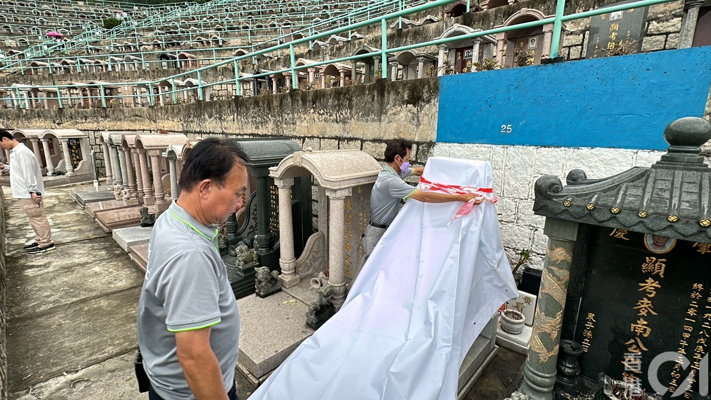
有人員以白布遮蓋家駒墳墓。（馬耀文攝）

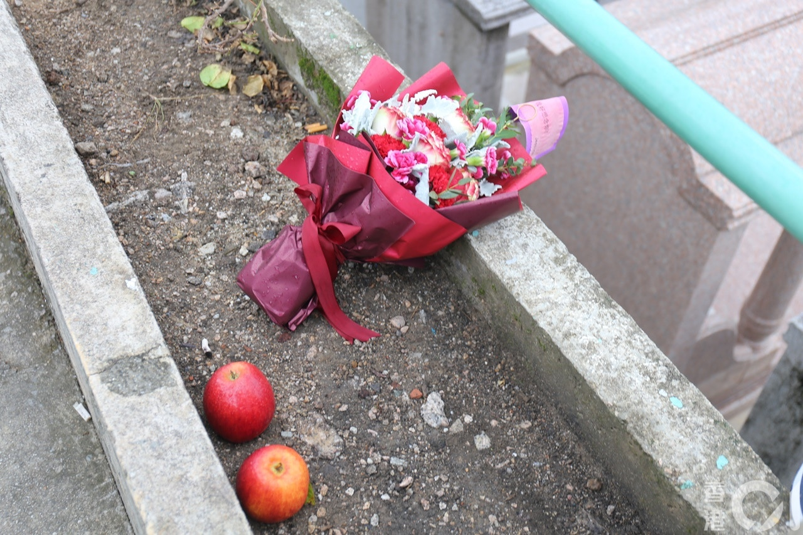
現場有歌迷擺放的鮮花。（鄭嘉惠攝）

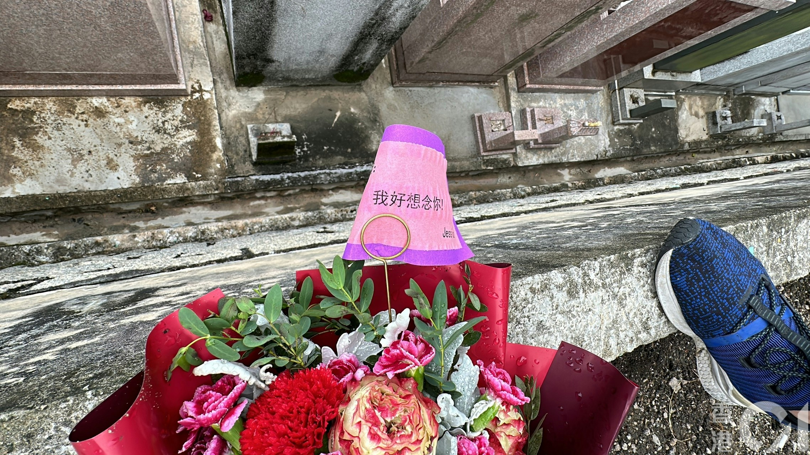
現場有歌迷致祭的鮮花。（馬耀文攝）

> ▼ 涉案毀壞片段截圖 ▼

刑毀片段被上載到網絡，一名光頭男子自稱「社會破壞者」，粗言辱罵黃家駒，向墓碑淋潑汽水後上前舔走。（網上片段）

刑毀片段被上載到網絡，一名光頭男子自稱「社會破壞者」，粗言辱罵黃家駒，向墓碑淋潑汽水後上前舔走。（網上片段）

刑毀片段被上載到網絡，一名光頭男子自稱「社會破壞者」，粗言辱罵黃家駒，向墓碑淋潑汽水後上前舔走。（網上片段）

一名光頭男子自稱「社會破壞者」，粗言辱罵黃家駒，向墓碑淋潑汽水後上前舔走，用腳踩歌迷獻上的鮮花祭品。（網上片段）

一名光頭男子用腳踩歌迷獻上的鮮花祭品。（網上片段）

光頭少年在墓碑上寫字。（網上片段）

一名光頭男子自稱「社會破壞者」，粗言辱罵黃家駒，向墓碑淋潑汽水後上前舔走，用腳踩歌迷獻上的鮮花祭品之餘，更用錘扑遺照，導致遺照毀爛。警方經調查後拘捕一名15歲少年及一名23歲男子，涉嫌刑事毀壞。（網上片段）

黃家駒

黃家駒在華人樂壇有著崇高的地位。（微博圖片）

黃家駒。(微博圖片)

黃家駒。（網上圖片）

黃家駒。
