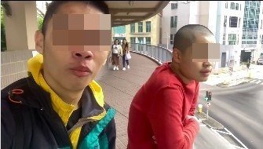
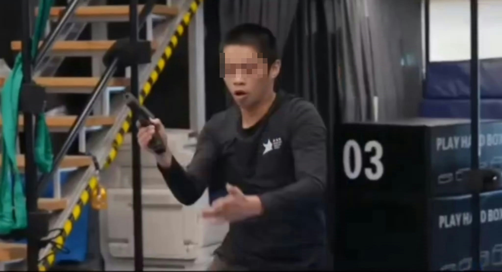
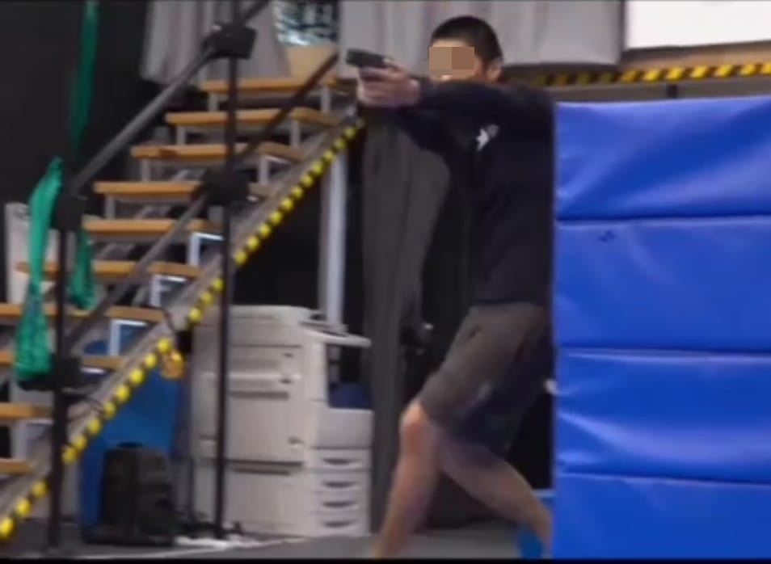
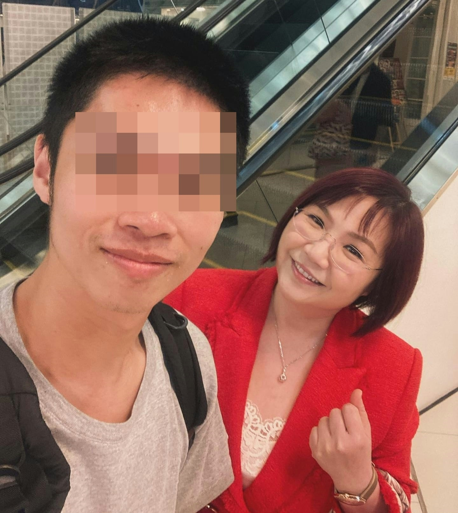
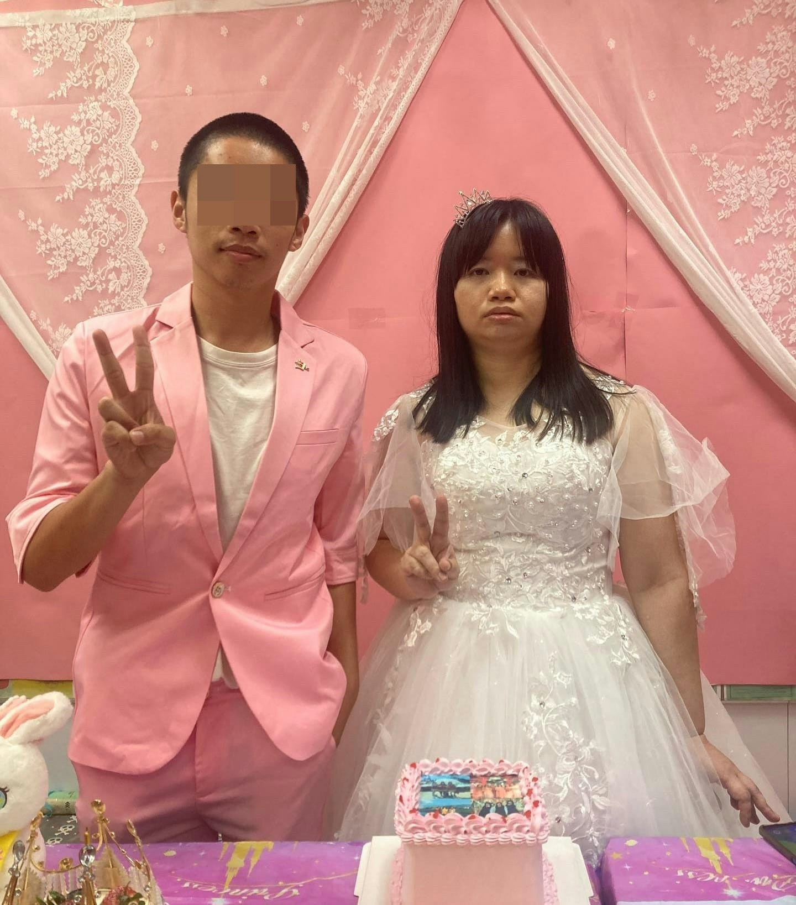

涉案兩人毀壞黃家駒墳墓後，當場就擒。（網上影片截圖）

據網上片段可見，涉案兩人毀壞家駒墳墓後，當場就擒。除了15歲光頭少年外，還有負責拍攝的葉男。根據葉男的Instagram可見，兩人經常外出拍片及合照，不時表示「兄弟，好耐冇見」。Instagram的簡介可見，葉男自稱為「Actor（演員）」，又開設影片頻道，接洽工作；且經常與大量藝人合照，包括車婉婉、樊亦敏、郭富城等，「集郵」之多數之不盡。

被捕兩人經常外出拍片及合照，不時表示「兄弟，好耐冇見」。（Instagram影片截圖）

被捕姓葉（23歲）男子，曾亮相電視台節目，表演凌空翻及持槍等高難度動作。（Instagram影片截圖）

被捕姓葉（23歲）男子，曾亮相電視台節目，表演凌空翻及持槍等高難度動作。（Instagram影片截圖）

被捕姓葉（23歲）男子，曾亮相電視台節目，表演凌空翻及持槍等高難度動作。（Instagram影片截圖）

被捕姓葉（23歲）男子經常「集郵」，與大量藝人合照。（Instagram圖片）

被捕姓葉（23歲）男子經常「集郵」，與大量藝人合照。（Instagram圖片）

被捕姓葉（23歲）男子經常「集郵」，與大量藝人合照。（Instagram圖片）

被捕姓葉（23歲）男子經常「集郵」，與大量藝人合照。（Instagram圖片）

被捕姓葉（23歲）男子經常「集郵」，與大量藝人合照。（Instagram圖片）

被捕姓葉（23歲）男子經常「集郵」，與大量藝人合照。（Instagram圖片）

被捕姓葉（23歲）男子經常「集郵」，與大量藝人合照。（Instagram圖片）

此外，葉男亦上載不少健身、功夫、跨欄及舞雙節棍等影片。去年8月，他曾亮相電視台節目，表演凌空翻及持槍等高難度動作。本月初，「亞視一姐」薛影儀舉辦「婚禮」主題派對，聲稱嫁給「亞視高層」；當時新郎頭笠寫上「亞視高層」的紙袋，葉男自揭該「亞視高層」新郎哥正是自己。

被捕姓葉（23歲）男子經常「集郵」，與大量藝人合照。（Instagram圖片）

被捕姓葉（23歲）男子，自揭是「阿儀新郎」。（Instagram圖片）

> ▼ 涉案毀壞片段截圖 ▼

刑毀片段被上載到網絡，一名光頭男子自稱「社會破壞者」，粗言辱罵黃家駒，向墓碑淋潑汽水後上前舔走。（網上片段）

刑毀片段被上載到網絡，一名光頭男子自稱「社會破壞者」，粗言辱罵黃家駒，向墓碑淋潑汽水後上前舔走。（網上片段）

刑毀片段被上載到網絡，一名光頭男子自稱「社會破壞者」，粗言辱罵黃家駒，向墓碑淋潑汽水後上前舔走。（網上片段）

一名光頭男子自稱「社會破壞者」，粗言辱罵黃家駒，向墓碑淋潑汽水後上前舔走，用腳踩歌迷獻上的鮮花祭品。（網上片段）

一名光頭男子用腳踩歌迷獻上的鮮花祭品。（網上片段）

光頭少年在墓碑上寫字。（網上片段）

一名光頭男子自稱「社會破壞者」，粗言辱罵黃家駒，向墓碑淋潑汽水後上前舔走，用腳踩歌迷獻上的鮮花祭品之餘，更用錘扑遺照，導致遺照毀爛。警方經調查後拘捕一名15歲少年及一名23歲男子，涉嫌刑事毀壞。（網上片段）

> ▼ 歌迷泣不成聲 ▼

由四川來港的阿英，驚悉偶像填墓被毀，手持鮮花，泣不成聲。（馬耀文攝）

黃家駒的友人、黃家強的助手劉先生亦趕抵了解，他感到十分憤怒。（馬耀文攝）

來自安徽的儲先生亦是第一次來港拜祭黃家駒，對事件不理解及氣憤。（羅日昇攝）

歌迷區先生大感錯愕，稱：「唔係好開心‥‥‥聽到有啲想喊。」（鄭嘉惠攝）

由四川來港的阿英，驚悉偶像填墓被毀，手持鮮花跑地致祭，泣不成聲。（馬耀文攝）

四川來港的女歌迷聲淚俱下稱：「太心痛了！」（鄭嘉惠攝）

由四川來港的阿英，驚悉偶像填墓被毀，手持鮮花跑地致祭，泣不成聲。（馬耀文攝）

來自安徽的儲先生亦是第一次來港拜祭黃家駒，對事件不理解及氣憤。（羅日昇攝）

由四川來港的阿英，驚悉偶像填墓被毀，手持鮮花跑地致祭，泣不成聲。（馬耀文攝）

由四川來港的阿英，驚悉偶像填墓被毀，手持鮮花跑地致祭，泣不成聲。（馬耀文攝）

由四川來港的阿英，驚悉偶像填墓被毀，手持鮮花，泣不成聲。（馬耀文攝）

黃家駒

黃家駒在華人樂壇有著崇高的地位。（微博圖片）

黃家駒。(微博圖片)

黃家駒。（網上圖片）

黃家駒。
