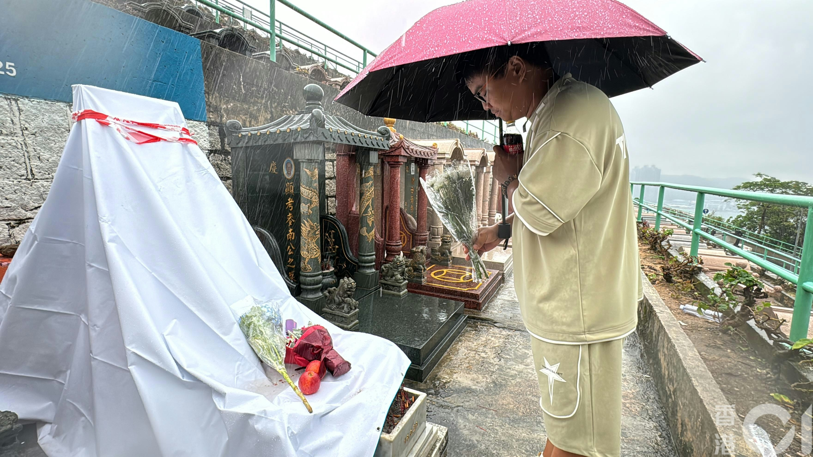
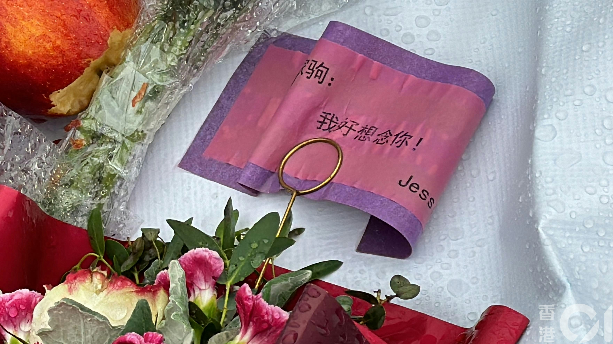

深圳歌迷赫先生前往黃家駒墳前致意。（翁鈺輝攝）

深圳歌迷赫先生是黃家駒逝世30周年紀念群群主，這個千人粉絲群昨日一片轟動，兩名男子涉嫌毀壞黃家駒墳墓的消息傳遍兩岸三地，歌迷哭泣，感到「非常不可理解、不可相信」。赫先生集合粉絲心意，今日（20日）特意駕車前來黃家駒墳前，帶備鮮花及黃家駒生前喜好的可樂，以慰在天之靈。

赫先生指黃家駒「在中國人心中是精神象徵，愛好和平」，對事件感到氣憤和不解，認為「你可以不喜歡他，可以不喜歡家駒的音樂，但你不可以去破壞他。」

梁女士專程由屯門搭車到將軍澳懷念家駒，在墳邊坐着良久，雨中播放《海闊天空》，不禁流淚。她表示由中學開始成為歌迷至今30多年，昨日看毀壞墳墓的片段時哭了起來，兒子叫她不要再看。

雨水打濕歌迷送來的鮮花祭品，有歌迷留言「我好想念你！」（翁鈺輝攝）

樂隊Beyond已故主音黃家駒位於將軍澳華人永遠墳場的墳墓，被人用淋潑汽水及用鐵錘破壞，黃家駒墓碑被白布圍封。（翁鈺輝攝）

毀黃家駒墓碑事件轟動全城，Beyond成員及歌迷震怒，大批傳媒今日（20日）到華人永遠墳場繼續跟進。（翁鈺輝攝）

兩名被捕男子除了自稱患有自閉症及過度活躍症的15歲少年外；亦有一名姓葉（23歲）男子。據網上片段可見，涉案兩人毀壞家駒墳墓後，當場就擒。除了15歲光頭少年外，還有負責拍攝的葉男。消息稱，該名男子活躍於演藝圈，曾亮相電視台節目，表演高難度動作；又經常與大量藝人合照「集郵」。本月初，他更成為「阿儀新郎」，與亞視一姐薛影儀舉辦「婚禮」主題派對。

涉案兩人毀壞黃家駒墳墓後，當場就擒。（網上影片截圖）

被捕兩人經常外出拍片及合照，不時表示「兄弟，好耐冇見」。（Instagram影片截圖）

被捕姓葉（23歲）男子，曾亮相電視台節目，表演凌空翻及持槍等高難度動作。（Instagram影片截圖）

被捕姓葉（23歲）男子，曾亮相電視台節目，表演凌空翻及持槍等高難度動作。（Instagram影片截圖）

被捕姓葉（23歲）男子，曾亮相電視台節目，表演凌空翻及持槍等高難度動作。（Instagram影片截圖）

被捕姓葉（23歲）男子經常「集郵」，與大量藝人合照。（Instagram圖片）

被捕姓葉（23歲）男子經常「集郵」，與大量藝人合照。（Instagram圖片）

被捕姓葉（23歲）男子經常「集郵」，與大量藝人合照。（Instagram圖片）

被捕姓葉（23歲）男子經常「集郵」，與大量藝人合照。（Instagram圖片）

被捕姓葉（23歲）男子經常「集郵」，與大量藝人合照。（Instagram圖片）

被捕姓葉（23歲）男子經常「集郵」，與大量藝人合照。（Instagram圖片）

被捕姓葉（23歲）男子經常「集郵」，與大量藝人合照。（Instagram圖片）

被捕姓葉（23歲）男子，自揭是「阿儀新郎」。（Instagram圖片）

> ▼ 涉案毀壞片段截圖 ▼

刑毀片段被上載到網絡，一名光頭男子自稱「社會破壞者」，粗言辱罵黃家駒，向墓碑淋潑汽水後上前舔走。（網上片段）

刑毀片段被上載到網絡，一名光頭男子自稱「社會破壞者」，粗言辱罵黃家駒，向墓碑淋潑汽水後上前舔走。（網上片段）

刑毀片段被上載到網絡，一名光頭男子自稱「社會破壞者」，粗言辱罵黃家駒，向墓碑淋潑汽水後上前舔走。（網上片段）

一名光頭男子自稱「社會破壞者」，粗言辱罵黃家駒，向墓碑淋潑汽水後上前舔走，用腳踩歌迷獻上的鮮花祭品。（網上片段）

一名光頭男子用腳踩歌迷獻上的鮮花祭品。（網上片段）

光頭少年在墓碑上寫字。（網上片段）

一名光頭男子自稱「社會破壞者」，粗言辱罵黃家駒，向墓碑淋潑汽水後上前舔走，用腳踩歌迷獻上的鮮花祭品之餘，更用錘扑遺照，導致遺照毀爛。警方經調查後拘捕一名15歲少年及一名23歲男子，涉嫌刑事毀壞。（網上片段）

黃家駒

黃家駒在華人樂壇有著崇高的地位。（微博圖片）

黃家駒。(微博圖片)

黃家駒。（網上圖片）

黃家駒。
