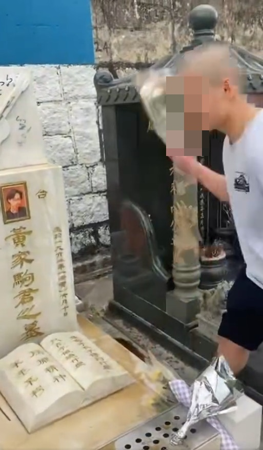
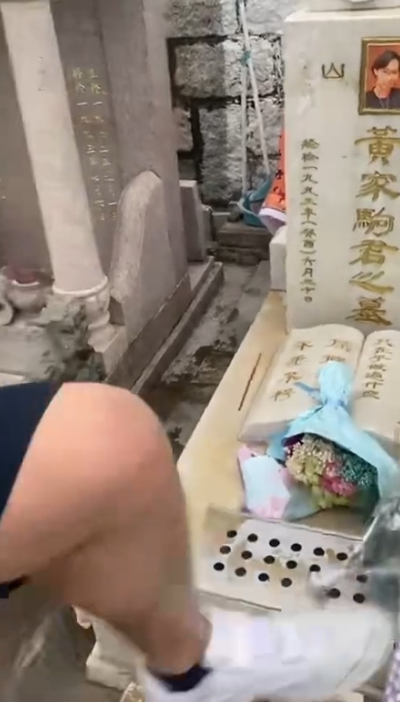
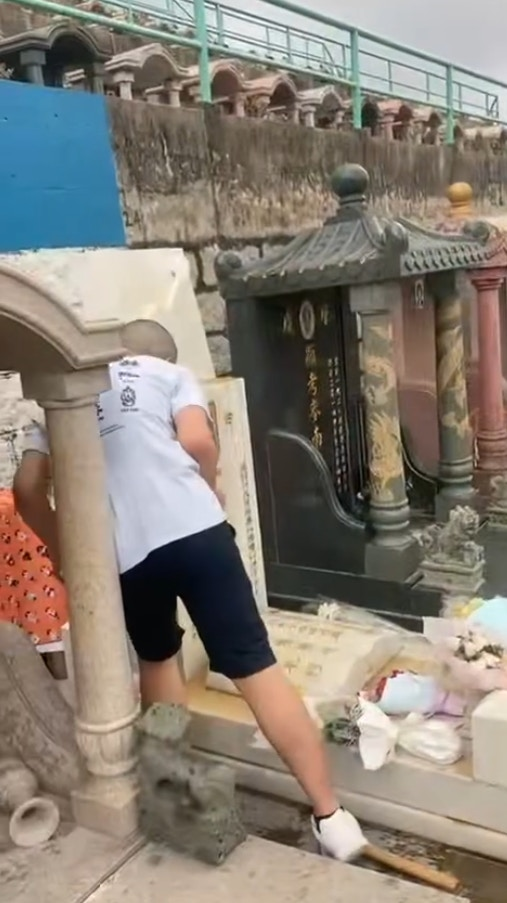
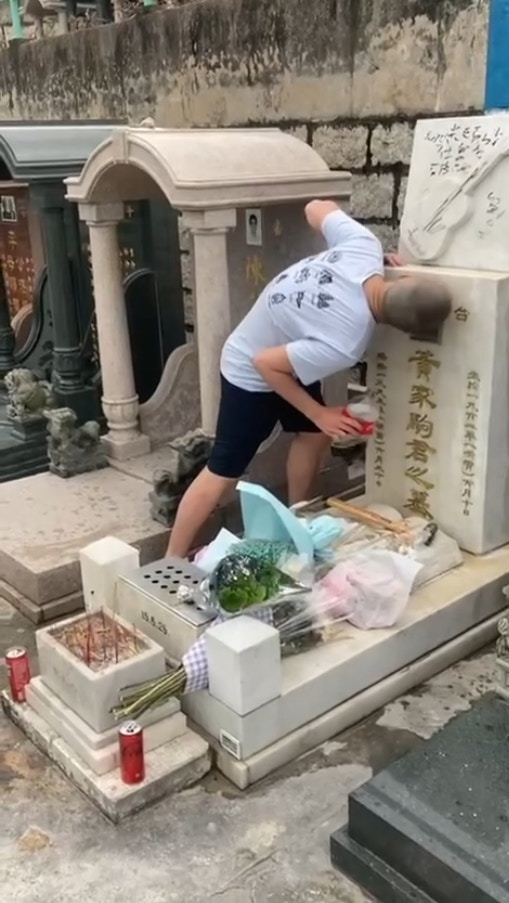
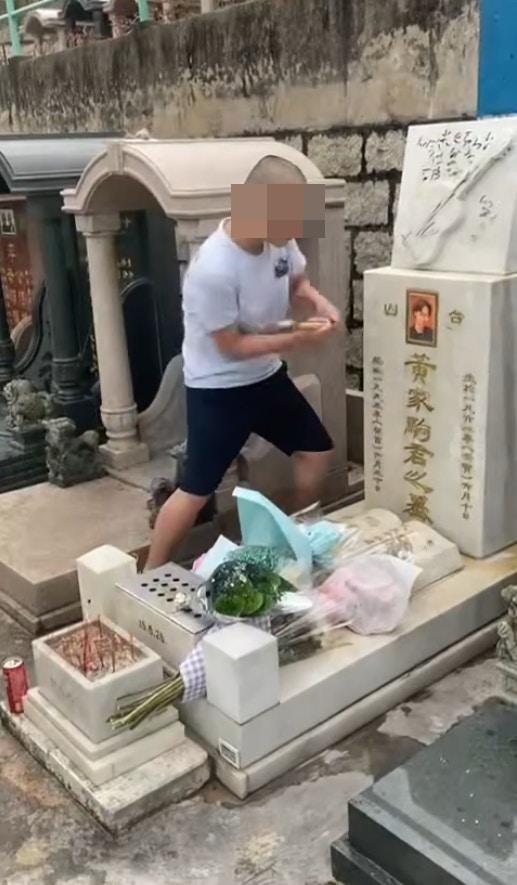

兩名被告：15歲男學生，及葉子滔(23歲，冷氣技工)，他們承認於2024年5月19日，在油塘高超道將軍澳華人永遠墳場，無合法辯解而損壞黃家駒的墓碑(屬於黃家偉的財產），意圖損壞該財產或罔顧該財產是否會被損壞。

樂隊Beyond已故主音黃家駒位於將軍澳華人永遠墳場的墳墓，被人用淋潑汽水及用鐵錘破壞，黃家駒墓碑被白布圍封。（翁鈺輝攝）

涉案兩人毀壞黃家駒墳墓後，當場就擒。（網上影片截圖）

一名光頭男子自稱「社會破壞者」，粗言辱罵黃家駒，向墓碑淋潑汽水後上前舔走，用腳踩歌迷獻上的鮮花祭品。（網上片段）

一名光頭男子自稱「社會破壞者」，粗言辱罵黃家駒，向墓碑淋潑汽水後上前舔走，用腳踩歌迷獻上的鮮花祭品。（網上片段）

刑毀片段被上載到網絡，一名光頭男子自稱「社會破壞者」，粗言辱罵黃家駒，向墓碑淋潑汽水後上前舔走。（網上片段）

刑毀片段被上載到網絡，一名光頭男子自稱「社會破壞者」，粗言辱罵黃家駒，向墓碑淋潑汽水後上前舔走。（網上片段）

一名光頭男子自稱「社會破壞者」，粗言辱罵黃家駒，向墓碑淋潑汽水後上前舔走，用腳踩歌迷獻上的鮮花祭品之餘，更用鎚扑遺照，導致遺照毀爛。警方經調查後拘捕一名15歲少年及一名23歲男子，涉嫌刑事毀壞。（網上片段）

刑毀片段被上載到網絡，一名光頭男子自稱「社會破壞者」，粗言辱罵黃家駒，向墓碑淋潑汽水後上前舔走。（網上片段）

## 15歲被告警誡下稱想出名才犯案

案情指，將軍澳華人永遠墳場職員在今年5月19日早上11時許，發現已故歌手黃家駒的墳墓被人破壞，並截獲2名被告後報案。警員發現網上多段視頻，顯示15歲被告向黃家駒的墳墓淋可樂，咬墳墓的花，以錘仔扑毀家駒遺照等。15歲被告警誡下稱，他為想出名才犯案。另一被告則承認負責拍片。相關片段顯示，15歲的被告曾用箱頭筆在墳墓上寫：「光頭Bob」、「社會破壞者」、「劉馬車接班人」等字眼。

## 15歲被告患過度活躍症及強迫症等

辯方求情指，15歲被告患過度活躍症、自閉症和強迫症，在學校不受歡迎，他並沒有憎恨黃家駒，但在約兩年前在，他在網上認識劉馬車等「KOL」，開始學習拍片，看網民反應，以為自己很受歡迎，為博取掌聲和滿足網民，結果愈做愈激。至於另一被告葉子滔，他並非案中主導者，但蘇官認為葉沒有阻止另一被告亦無退出，認為兩人罪責相若。

案件編號：KTCC984/2024
