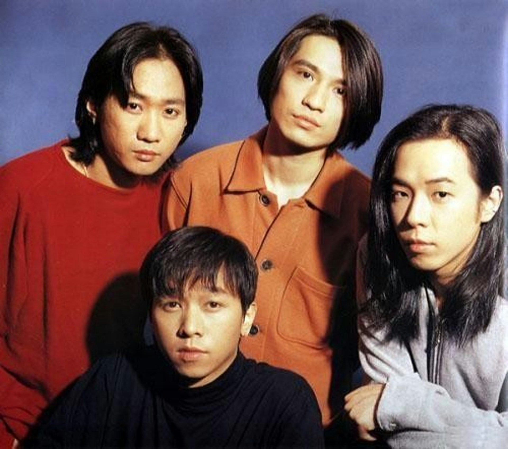
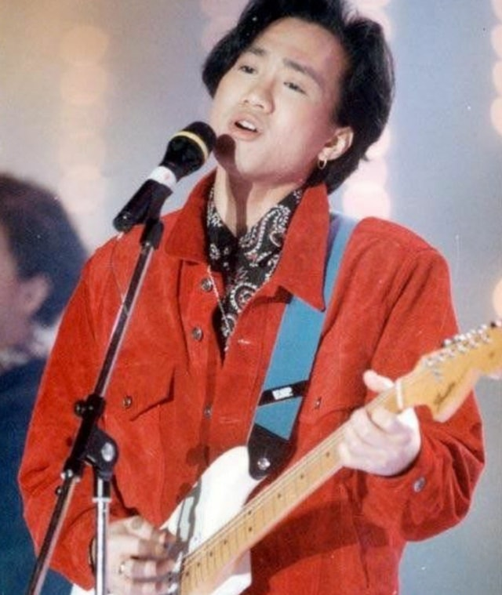
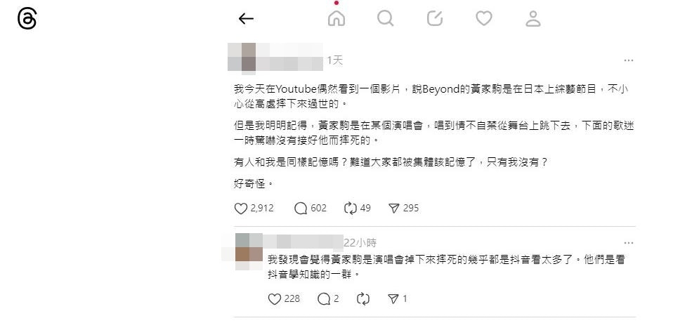
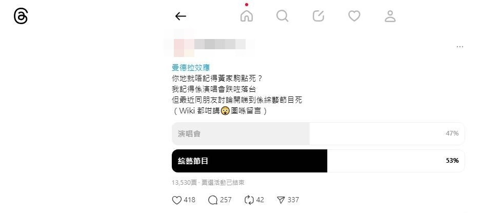
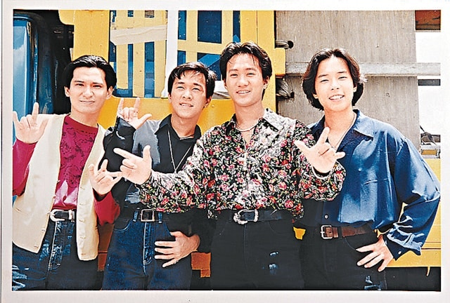
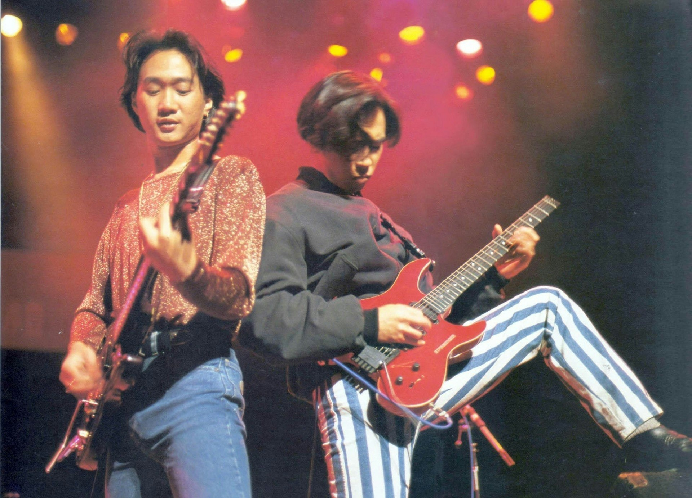

殿堂級樂隊Beyond的歌首首經典，陪伴了不少香港人成長，可惜Beyond靈魂人物黃家駒於1993年離世。近日有網民在討論區及Threads上提到黃家駒的死因，帖文亦被網絡瘋傳，隨即引起大批網民熱議及爭論。

隊Beyond的歌首首經典，陪伴了不少香港人成長。（網絡圖片）

日前有網民在Threads上表示在YouTube偶然看到一段影片，片中提到黃家駒是在日本上綜藝節目，不小心從高台墮下而死。不過該網民就表示奇怪，更指：「但是我明明記得，黃家駒是在某個演唱會，唱到情不自禁從舞台上跳下去，下面的歌迷一時驚嚇沒有接好他而摔死的。」帖文隨即被瘋傳，有網民就留言表示家駒是在拍攝日本綜藝節目上從高台墮下而死，但亦有網民則指聽回來的版本是家駒在日本演唱會期間跌死，引發曼德拉效應。

黃家駒的死因引起曼德拉效應。（網上圖片）

另外，亦有另一網民在Threads表示：「曼德拉效應 你地就唔記得黃家駒點死？我記得係演唱會跌咗落台 但最近同朋友討論開睇到係綜藝節目死（Wiki 都咁講😲圖喺留言）」，並開設投票。最後有13530位網民參與投票，當中指黃家駒在綜藝節目中從高台墮下而死的有53%，認為在演唱會墮下而死的就有47%，雙方非常接近。

有網民表示一直都以為黃家駒是在日本演唱會發生意外而離世。（Threads）

黃家駒的死引起網民熱烈討論。（Threads）

事實上，1993年6月24日Beyond為宣傳即將發行的日語唱片，應邀到日本富士電視台位於河田町的4號錄影室，拍攝遊戲節目《小內小南的 想做什麼 就做什麼》。遊戲進行了15分鐘便發生意外，黃家駒在狹窄並沾滿水漬的台上奔跑時不慎滑倒，強大衝力使身旁三塊佈景板的固定裝置脫落，佈景板鬆開，黃家駒與身旁的主持人內村光良一同墜落3米高的台下。黃家駒頭部朝下摔落，後腦首先着地，隨即昏迷，而內村光良則胸部着地，僅受輕傷。

1993年6月24日Beyond為宣傳即將發行的日語唱片，應邀到日本富士電視台位於河田町的4號錄影室，拍攝遊戲節目《小內小南的 想做什麼 就做什麼》。（網上圖片）

遊戲進行了15分鐘後，黃家駒便發生意外。（網上圖片）

黃家駒最終在留醫6天後，於日本時間1993年6月30日下午4時15分在東京女子醫科大學醫院逝世，終年31歲。院方公布死因為急性腦膜下血腫、頭蓋骨骨折、腦挫傷及急性腦腫脹。而綜藝節目《小內小南的想做什麼就做什麼》亦因黃家駒逝世，當日宣告永久停播。
