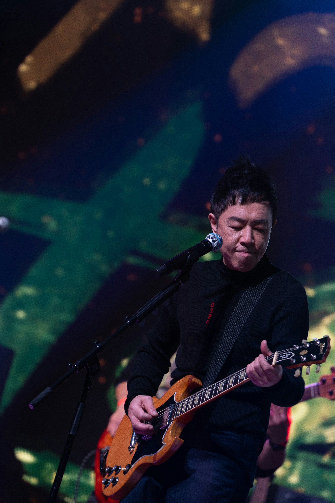
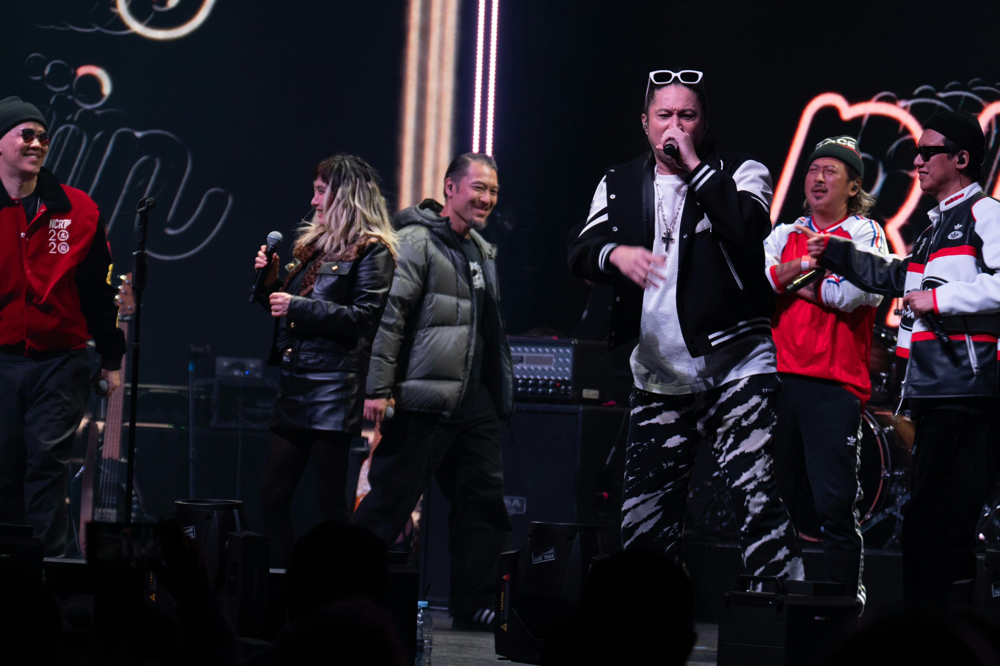
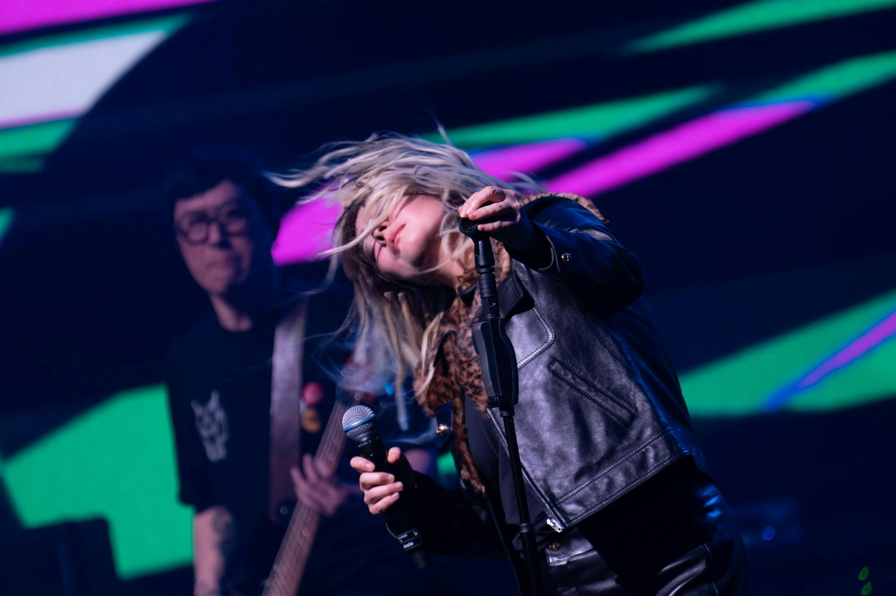
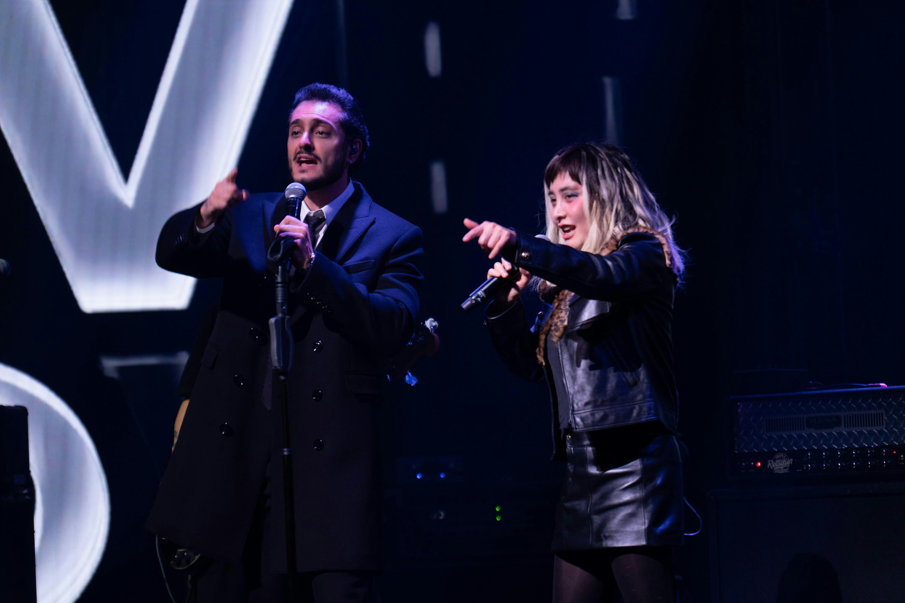

何超夥拍黃貫中、LMF、廿四味，於上星期在倫敦indigo at O2舉行的《Dragon Rock》演唱會，澎湃激情，更獲英國傳媒肯定，形容為震撼倫敦，把香港音樂帶到國際的一次盛事。

全個演唱會超過三個小時，35首歌曲非常緊湊，全無冷場。打頭陣的廿四味，甫出場便令歌迷哄動，而陳子聰更是完成所有手術後，全面康復後的首次亮相，期間24味不但又唱又跳，更即場向台下觀眾拋下樂隊紀念品，炒熱現場氣氛， 至唱出經典舞曲《Wonderland》時，全場起舞，迅即把觀眾情緒推高。

黃貫中以香港背景音樂作 Intro，再配上連場爆炸性電子結他演奏，氣勢磅礡。（大會提供）

隨後到黃貫中 (Paul Wong) 接著登場，以香港背景音樂作 Intro，再配上連場爆炸性電子結他演奏，氣勢磅礡。當他見到台下滿場熟悉面孔，感觸地說：「見到好多熟悉嘅面孔。頭先我哋喺後台都喺度講話好似返咗高山 (劇場) 咁。」隨後獻唱了經典歌曲《無得比》及《天與地》，引來全場大合唱。

今次更是陳子聰完成所有手術後，全面康復後的首次亮相。（大會提供）

其後，何超 (Josie Ho) 以一頭金髪及一身型格皮褸配皮短裙，美艶亮麗，震撼登場，與Paul合唱《阿博二世》，令觀眾喜出望外，立時引來熱烈歡呼，連隨黃貫中便把舞台交給何超與她的樂隊Josie and the Uni Boys，何超狀態大勇，帶來驚喜處處，她特別選唱了一連串炸肺高能量的爆炸作品，難得她全程又唱又跳，應付自如，更不斷以中、英文跟台下觀眾打招呼開玩笑，每首歌之間不乏即興發揮她的幽默本色，狂向台下樂迷致謝，有女樂迷向她大叫：「you are our Queen。」隨即引來在場觀眾尖叫。

何超獻唱由好友大S為她填詞的《章魚黑洞》，她特別以英文表示把此曲獻給大S，令現場觀眾十分動容。（大會提供）

何超除了感謝到來觀看的Wyman黃偉文為她的《何飄移》填詞外，也獻唱由好友大S為她填詞的《章魚黑洞》，她特別以英文表示把此曲獻給大S，令現場觀眾十分動容。唱到歌曲《Johnny Depp》時，何超更說此曲是為偶像Johnny Depp而作，更大讚Johnny靚仔又才華洋溢，她毫不扭怩地表達她對Johnny Depp的傾慕之情，她更大爆當年因怕Johnny Depp告她侵權，曾親自寫信及把音樂製成品寄給Johnny，希望得到他的認同，結果Johnny真的以書面回覆了何超兩個字︰「 Good Band。」

何超力捧的新人Iman出場，更問全場觀眾Iman是不是很靚仔，有女觀眾大叫︰「好靚仔！」而Iman似懂非懂的聽着只好傻笑。（大會提供）

最後，傳奇樂隊 LMF 上台，在場觀眾又再情緒高漲。當唱到經典金曲《WTF》時，台上台下情緒沸騰，觀眾瘋狂高呼「WTF」，全場爆喊釋放壓抑已久的情緒。《X家拎》時，他們更鼓勵觀眾盡情發洩：「呢隻歌，我希望你哋將所有嘅不滿、憤怒、抱怨一次過發洩哂出嚟。」隨後，LMF 與黃貫中合作演奏《大懶堂》，Paul的結他乃「原裝正版、原汁原味」，瞬間秒殺全場回憶，燃爆舞台。
