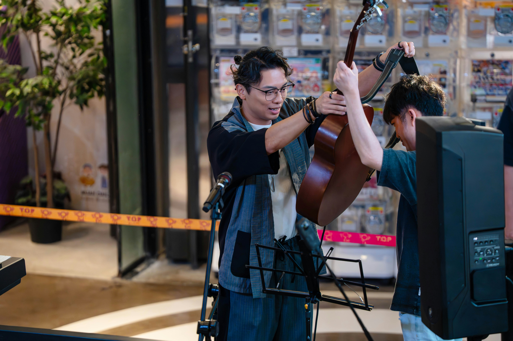
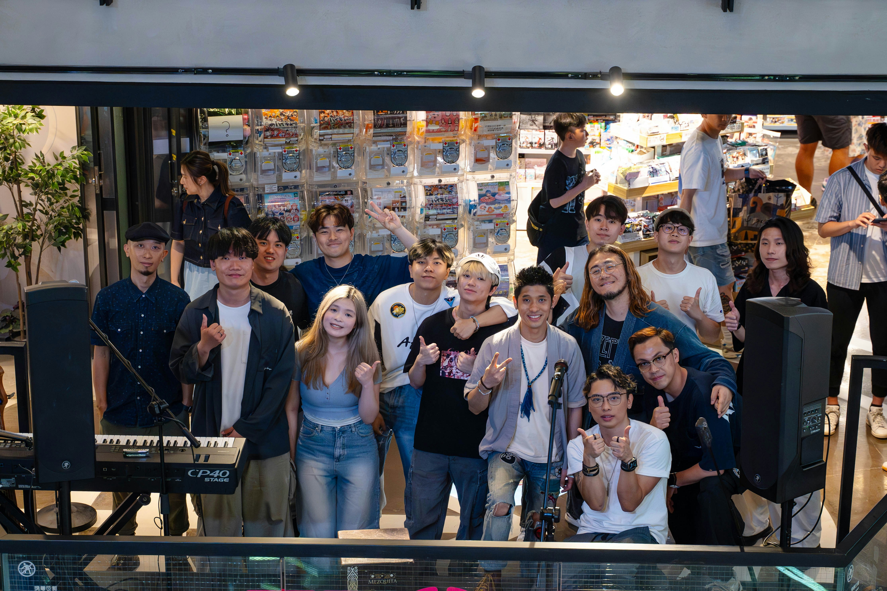
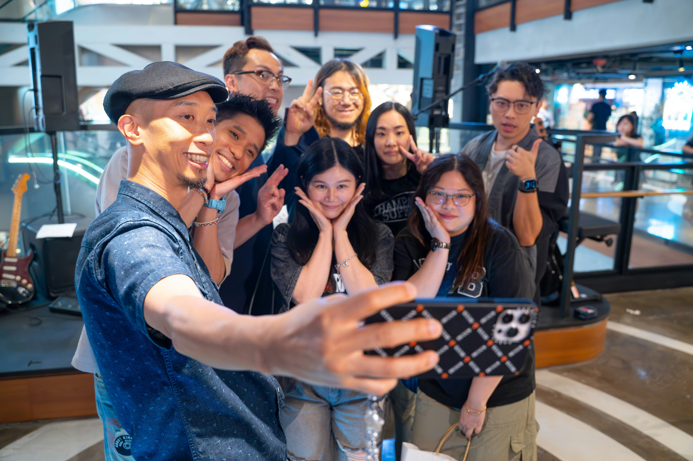
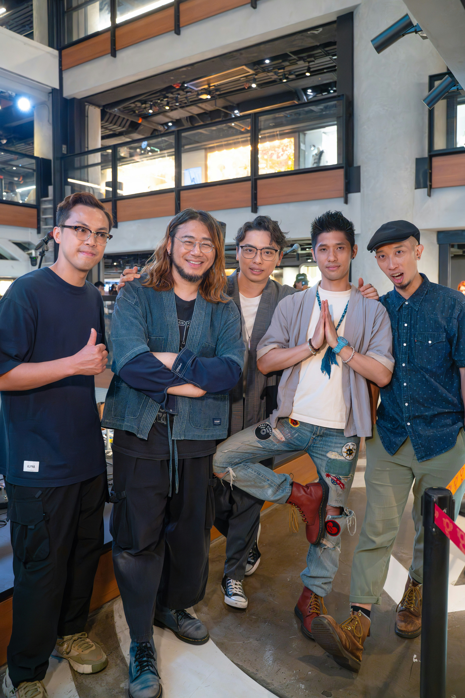
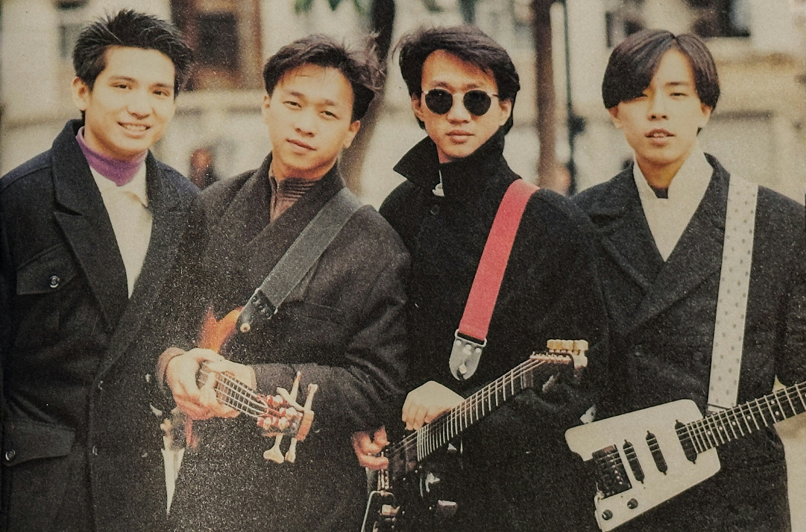
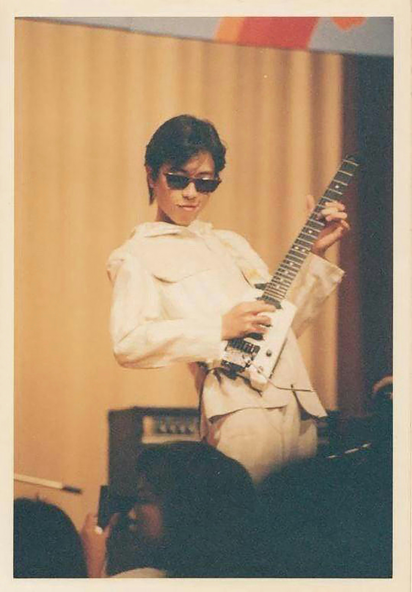
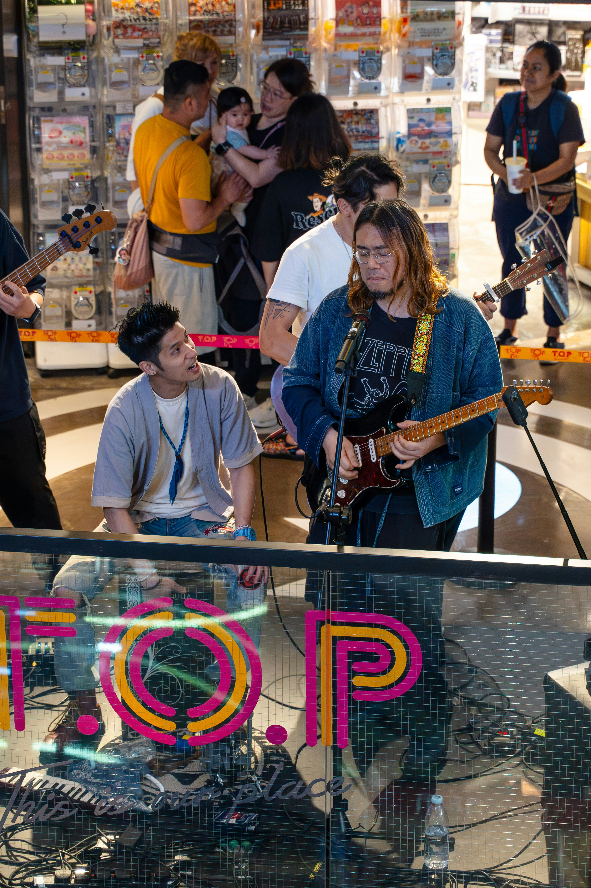
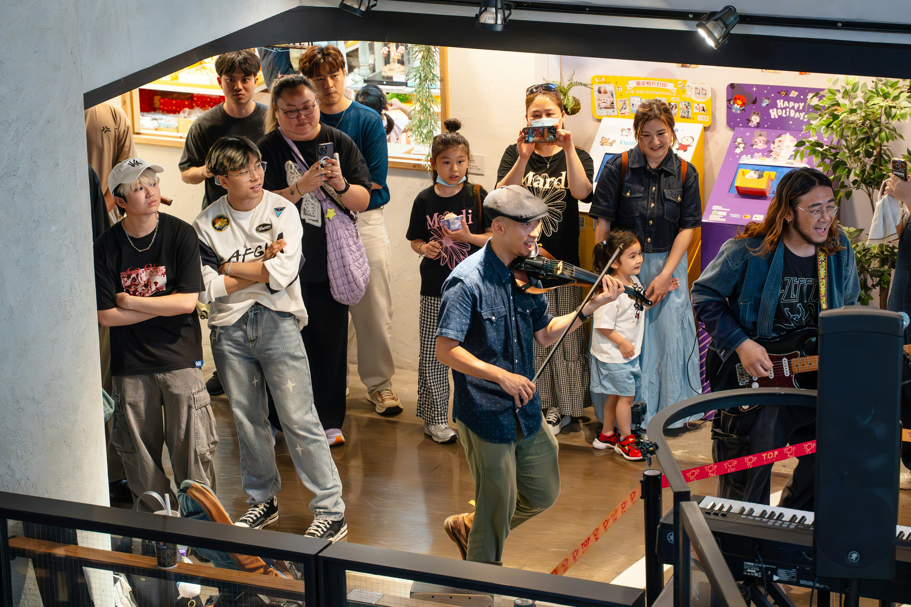

復活節假期最後一日（四月二十一），樂隊Nowhere Boys五子到旺角一商場舉行Mini Live，為新歌《給失敗者的一封信》進行宣傳。雖說是Mini Live，但Nowhere Boys一共準備了九首歌與在場樂迷分享，更邀請了兩隊年輕的Busker擔任嘉賓，與他們一起分享舞台。

樂隊Nowhere Boys五子到旺角一商場舉行Mini Live，為新歌《給失敗者的一封信》進行宣傳。（公關提供）

主音阿Van說：「今日搵咗兩隊busker上台表演，其中一隊1AMJAM，仲唱咗我哋嘅新歌《給失敗者的一封信》，佢哋仲重新編曲，我冇諗過首歌可以咁chill，最終我哋都忍唔住，逐個走埋去同佢哋一齊jam，尤其開場前我幫其中一位成員孭起支結他嘅時候，突然有一種傳承嘅感覺。」

主音阿Van。（公關提供）

到Nowhere Boys正式出場，他們連串唱出多首經典作品，包括《我們的航海時代》、《放飛之旅》、《票房毒藥》、《地心吸力》以及《地球候機室》，替在場樂迷熱身，接著唱出輕快作品《掹藤》，全場一起歡呼跟著唱，將現場氣氛推上高峰，阿Van續說：「今日最大感受最好玩嘅歌係《掹藤》，開場一連幾首慢歌，當一唱《掹藤》，現場嘅energy好大，我feel到成個商場都震，有一種去咗紅館開show嘅感覺，所以好開心。」

到Nowhere Boys正式出場，他們連串唱出多首經典作品，包括《我們的航海時代》、《放飛之旅》、《票房毒藥》、《地心吸力》以及《地球候機室》。（公關提供）

接著唱出《我們的移動城堡》、新歌《給失敗者的一封信》以及壓軸的《天外飛仙》，樂迷興奮得不斷揈毛巾，就連Nowhere Boys底音結他手Hansun的4歲囡囡Eunice，也跟着音樂起舞。場內氣氛高漲，樂迷跟本唔捨得走，不斷嗌encore，最後Nowhere Boys額外送上《無處遊人》，為Mini Live劃上完美句號。

最後Nowhere Boys額外送上《無處遊人》，為Mini Live劃上完美句號。（公關提供）

最後Nowhere Boys額外送上《無處遊人》，為Mini Live劃上完美句號。（公關提供）

「今日算係acoustic嘅演出，但我哋首新歌《給失敗者的一封信》太重型，當要用木結他去演繹，需要重新編曲，保持番佢原有嘅energy同時，又不失acoustic嘅感覺，其他歌都係，今日最後玩咗十首歌，但呢個都係我哋最擅長，喺冇電腦、冇program底下，用大家手上嘅樂器、用人聲造出聲效，用最真嘅聲音去演繹。」

Nowhere Boys旺角開Mini Live，同年輕Busker分享舞台傳承音樂。（公關提供）

Nowhere Boys旺角開Mini Live，同年輕Busker分享舞台傳承音樂。（公關提供）

提到近日Beyond成員黃貫中在社交網站發文，感謝Nowhere Boys結他手阿Ken，幫他尋回並維修已失去超過三十年的結他，阿Ken解釋在他發現、維修、物歸原主這個長達一年半的過程，彷彿一切都是冥冥之中。

提到近日Beyond成員黃貫中在社交網站發文，感謝Nowhere Boys結他手阿Ken，幫他尋回並維修已失去超過三十年的結他。（公關提供）

「支結他係我一個同我夾開band嘅村民俾我，但送到我手嘅時候已經好多零件壞晒，連螺絲都甩埋，即使我學過整結他，但呢支估計喺1987年出產嘅Steinberger結他，裡面嘅零件我當年冇學過，最後好好彩搵到間廠肯同我重新生產，但啲零件寄到嚟，我都唔識整，要再花好長時間上網搵呢支結他嘅設計圖，再搵師傅整咗四個月。」

提到近日Beyond成員黃貫中在社交網站發文，感謝Nowhere Boys結他手阿Ken，幫他尋回並維修已失去超過三十年的結他。（公關提供）

雖然重新更換了零件，但結他的音色還未達標，阿Ken坦言心裡很著急，他希望Nowhere Boys可以與阿Paul的結他做一個紀錄，即使音色未盡完美，阿Ken最後還是將這支結他，帶到五子去年十月在西九舉行《US》演唱會的尾場，阿Ken攞起阿Paul的結他上台彈奏《推石頭的人》以及《逃出阿卡拉》，而身為Beyond歌迷的他，更唱出Beyond作品《海闊天空》。

雖然重新更換了零件，但結他的音色還未達標，阿Ken坦言心裡很著急，他希望Nowhere Boys可以與阿Paul的結他做一個紀錄。（公關提供）

阿Ken說：「我當日學結他都因為Beyond，好清楚一支結他對結他手有幾咁重要，所以我花咗好長時間再幫支結他調音，希望可以喺阿Paul三月三十一日生日之前，將支結他交番俾佢，因為好多Beyond嘅經典作品，都係用呢支結他彈出嚟，所以能夠完成呢件事，我覺得好感動。」

阿Ken說：「我當日學結他都因為Beyond，好清楚一支結他對結他手有幾咁重要，所以我花咗好長時間再幫支結他調音，希望可以喺阿Paul三月三十一日生日之前，將支結他交番俾佢。」（公關提供）
