苟偉數日前才開直播唱歌，談及張杰邀請他參加演唱會，不料，6日傳出他離世消息，其好友杉籽伽發聲：「我的好朋友茍偉先生於今日下午離世，願你一路走好，這是他送給我的唯一一首歌，下輩子你多寫點歌送我啊。」歌手袁成杰也痛悼：

> 「那個總是抱著結他唱著〈海闊天空〉的你，那個自嘲是靈活大胖子的你，我會永遠記得你，茍偉老大。」

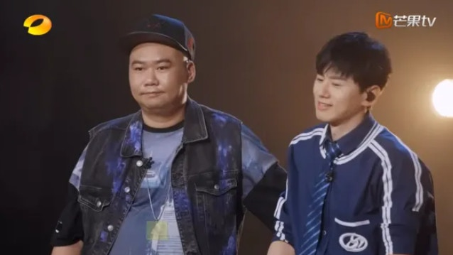
苟偉與張杰共同創作歌曲〈北斗星的愛〉打開知名度。（微博圖片）

**【圖輯】點圖放大看更多苟偉生前照👇👇👇**

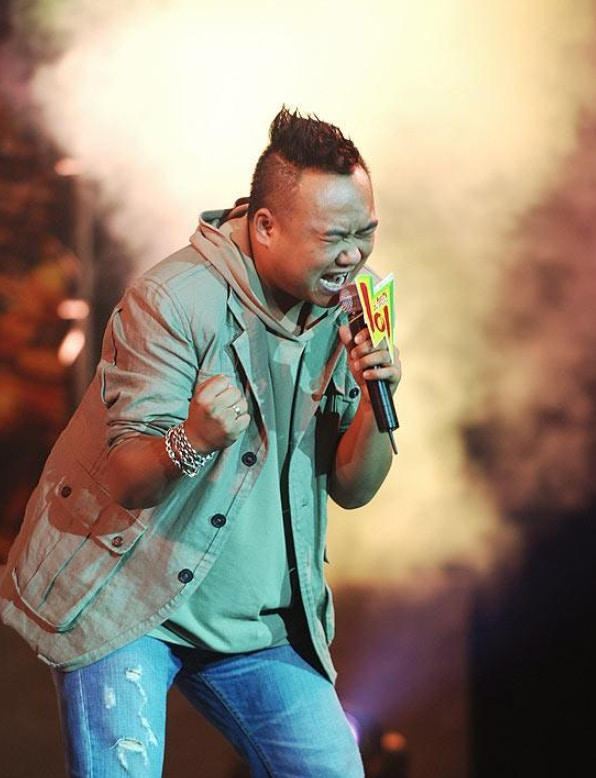
苟偉（微博圖片）

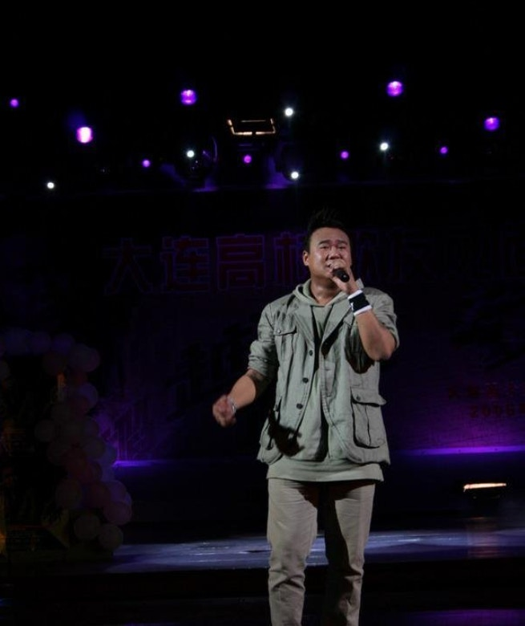
苟偉（微博圖片）

苟偉（微博圖片）

苟偉（微博圖片）

苟偉（微博圖片）

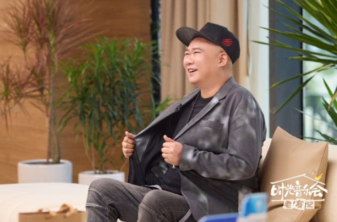
苟偉（微博圖片）

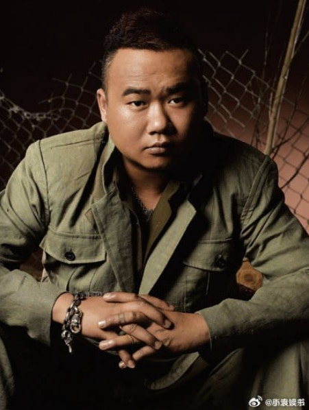
苟偉（微博圖片）

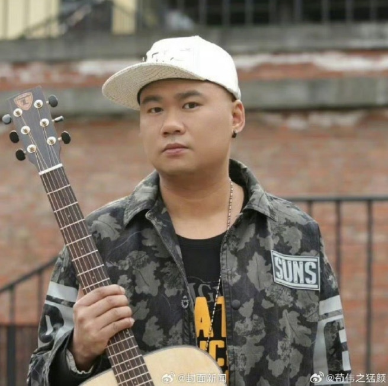
苟偉（微博圖片）

苟偉（微博圖片）

苟偉（微博圖片）

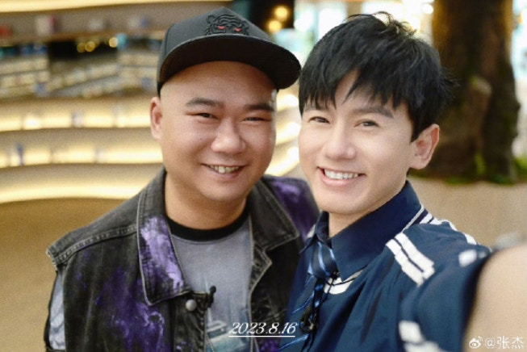
苟偉（微博圖片）

苟偉（微博圖片）

苟偉（微博圖片）

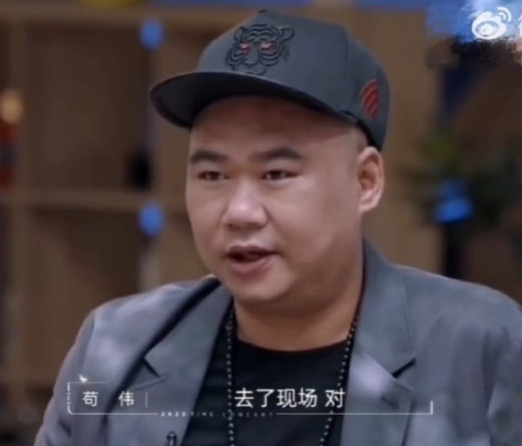
苟偉（微博圖片）

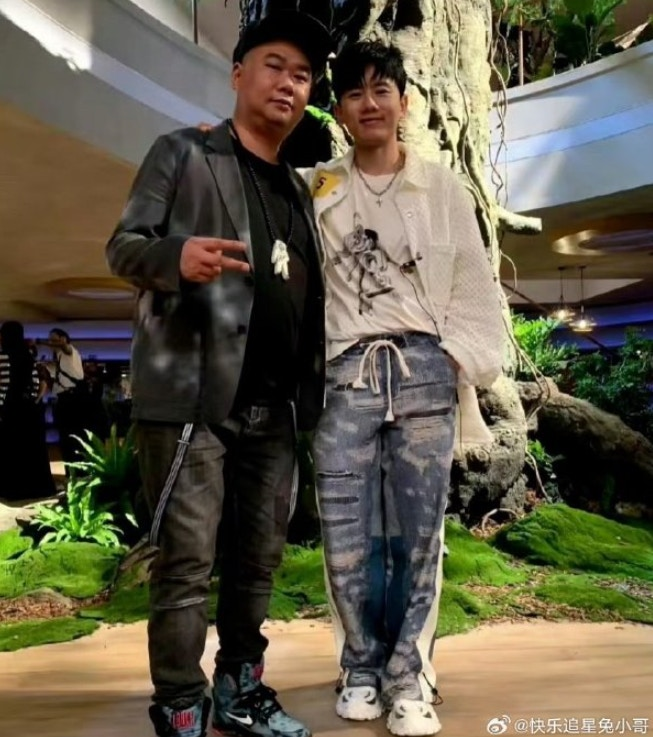
苟偉（微博圖片）

張杰、袁成杰、朱杰與苟偉去年曾在音樂節目合體演出，引起許多粉絲回憶殺，如今驟然離世，許多網友湧入過往影片留言悼念：「感覺才剛看到你唱歌，怎麼突然走了」、「謝謝你用音樂陪我們這麼久，一路走好」，目前家屬尚未公開死因，粉絲希望外界給予空間悼念他最後的溫柔。

事實上，苟偉出身《我型我SHOW》選秀節目，他與張杰共同創作〈北斗星的愛〉打開知名度，也為汶川地震創作公益歌曲〈四川依然美麗〉，深具代表性，他2004年獲節目亞軍後進入樂壇，曾拜BEYOND的黃家強為師，擅長詞曲創作，作品多元溫暖。

**【相關圖輯】**方大同大S去世 逾10位名人2025年兩個月內離世 最年輕是「她」**（點圖放大瀏覽👇👇👇）**

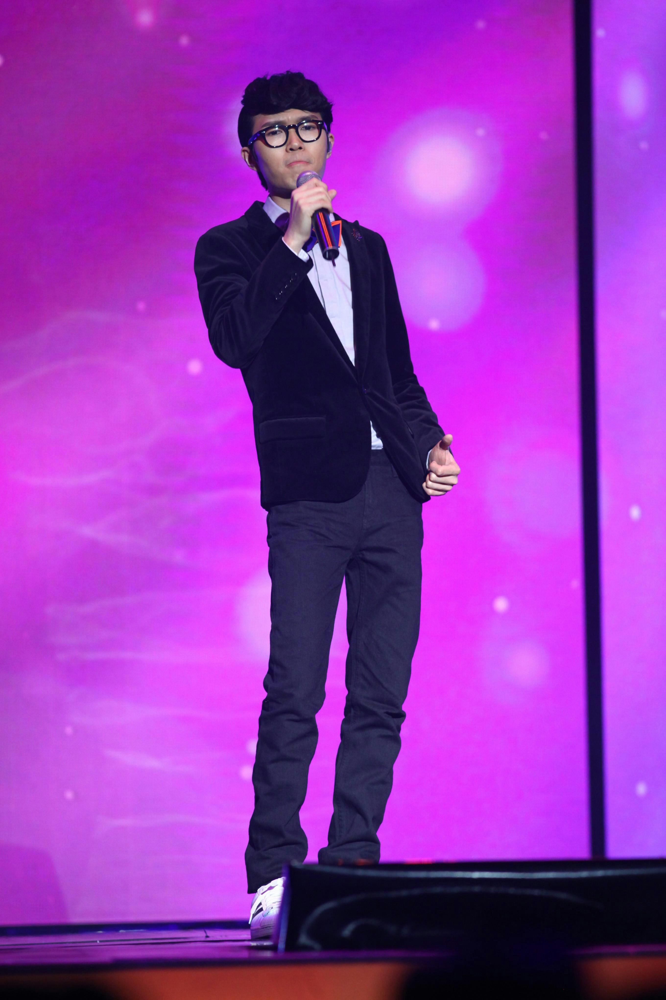
方大同（視覺中國）

大S（視覺中國）

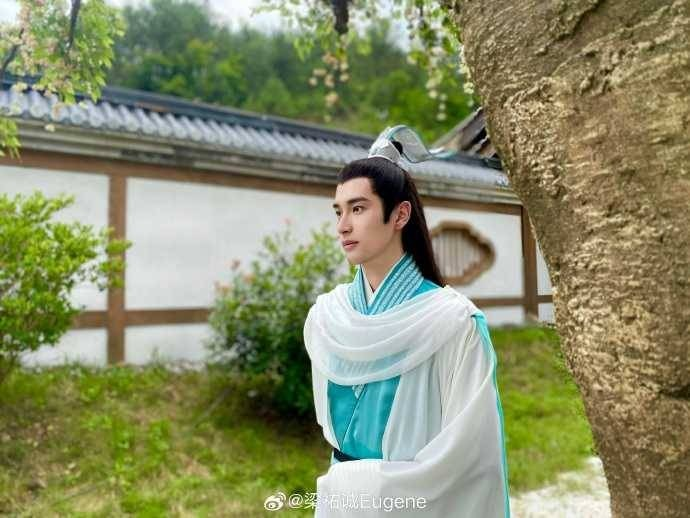
梁祐誠（微博圖片）

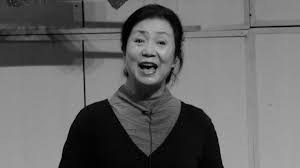
李瑞芳（澎湃新聞）

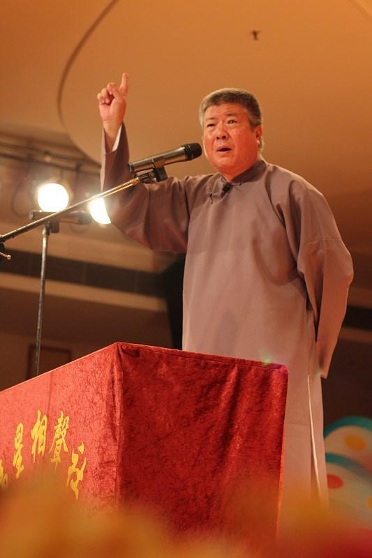
相聲演員武福星（抖音）

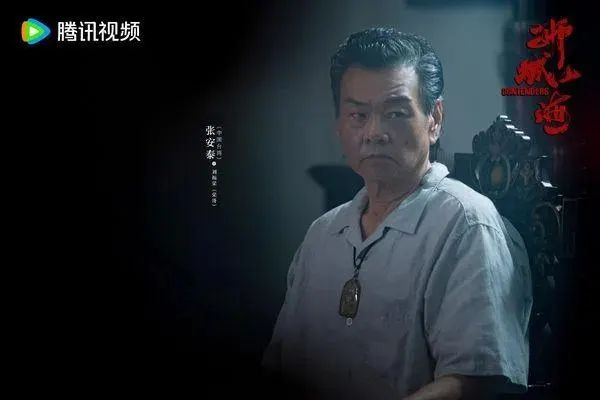
張立威（《獅城山海》劇照）

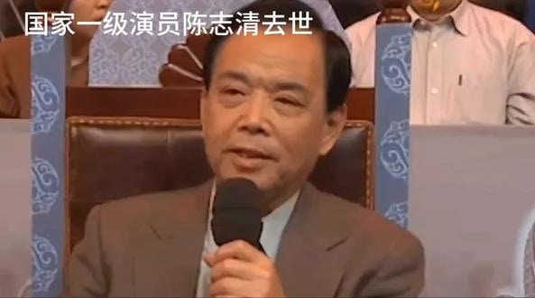
京劇名家陳志清（抖音）

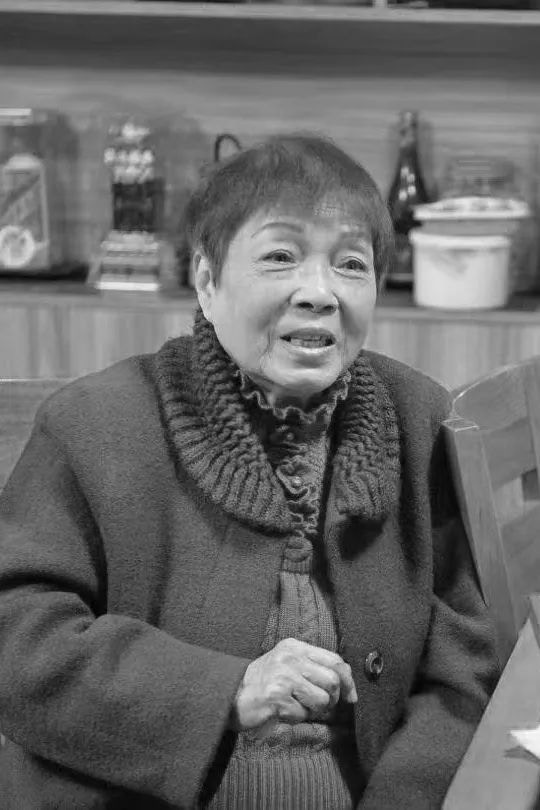
林淑英（熱點新聞）

韓國女星金賽綸（IG@ron_sae）

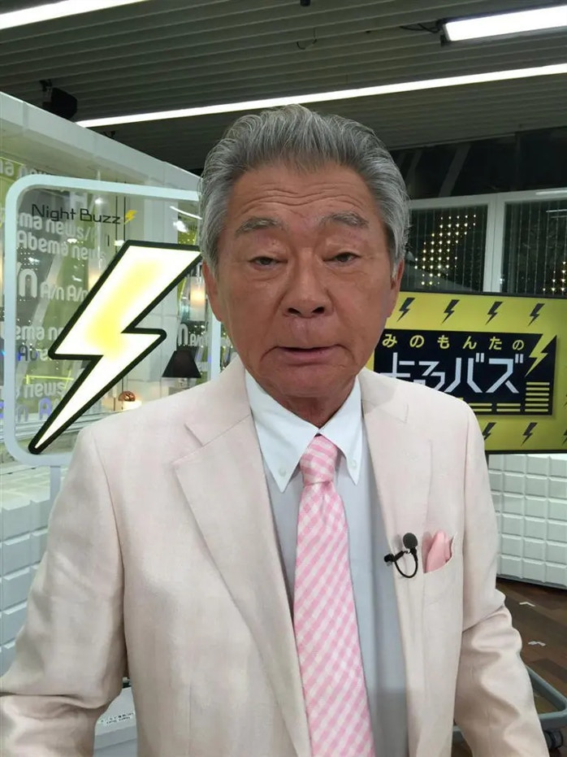
三野文太（X圖片）

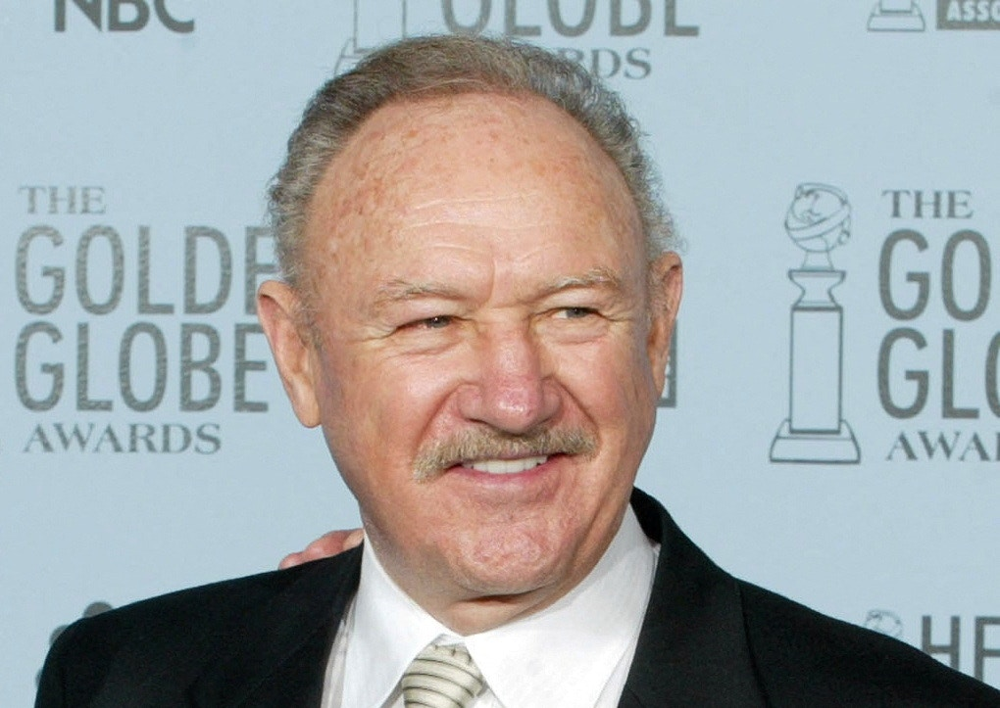
真赫曼（Gene Hackman）2003年1月在美國加州出席金球獎頒獎禮（Reuters）

Michelle Trachtenberg（《EuroTrip》劇照）
