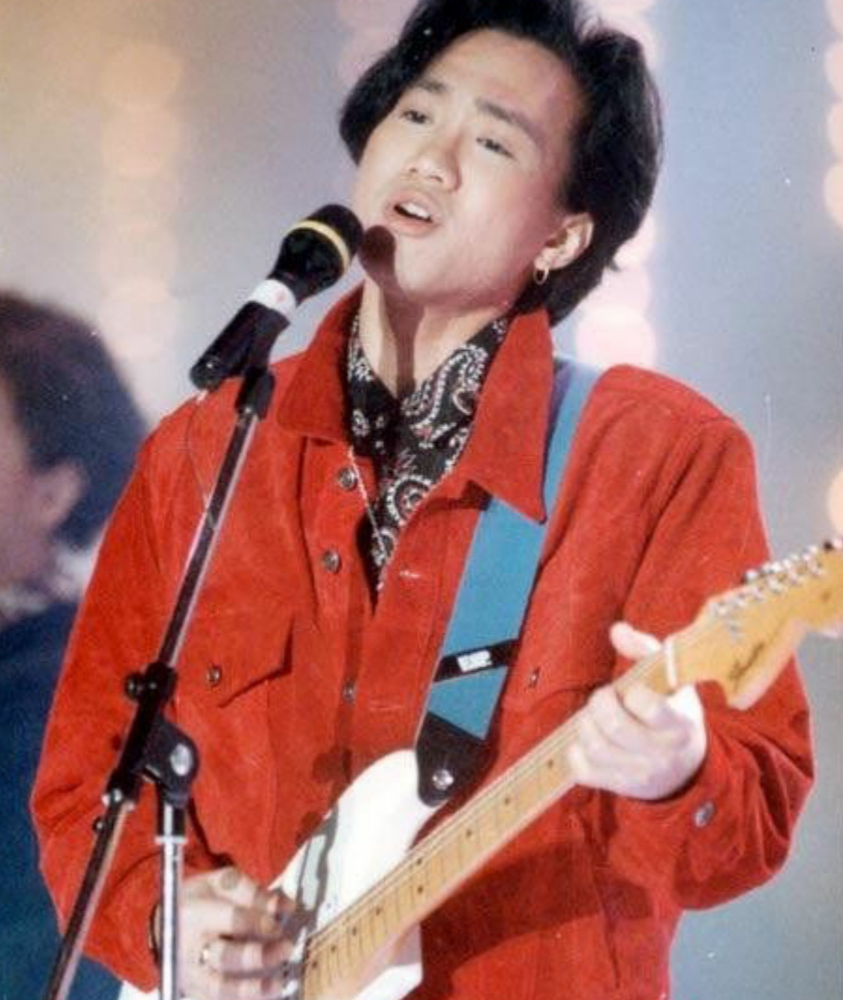
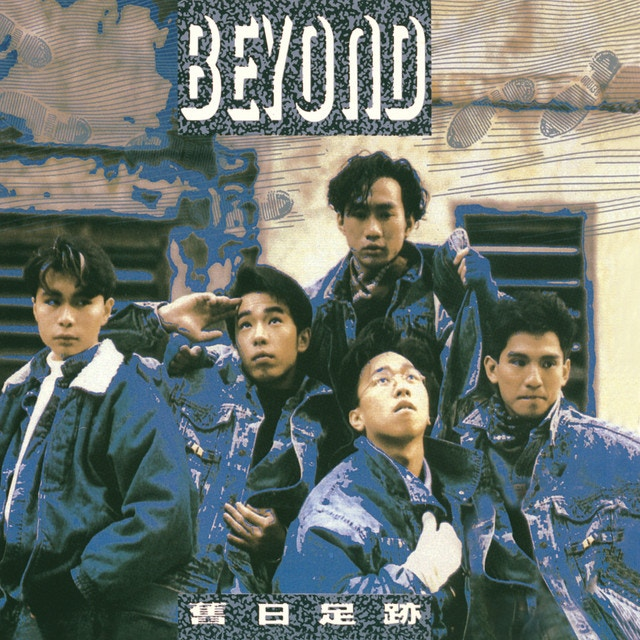
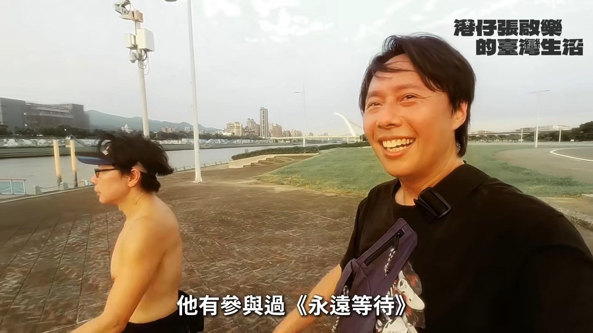
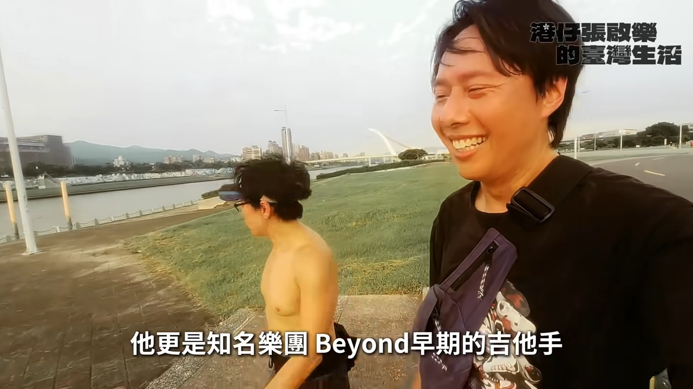
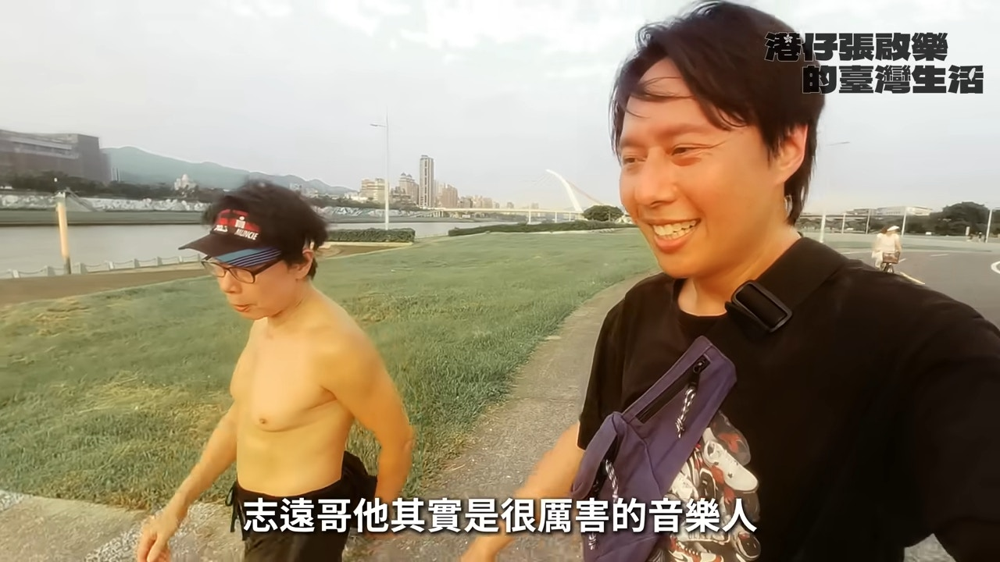
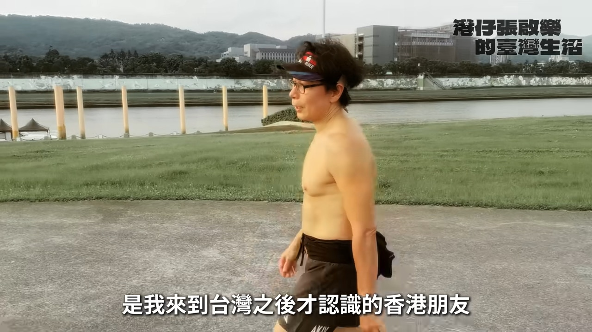
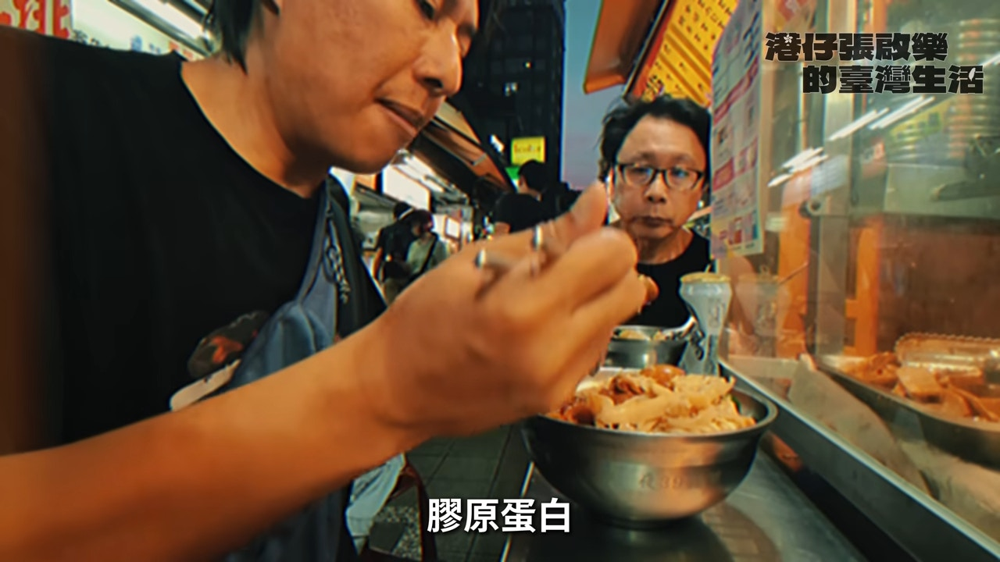
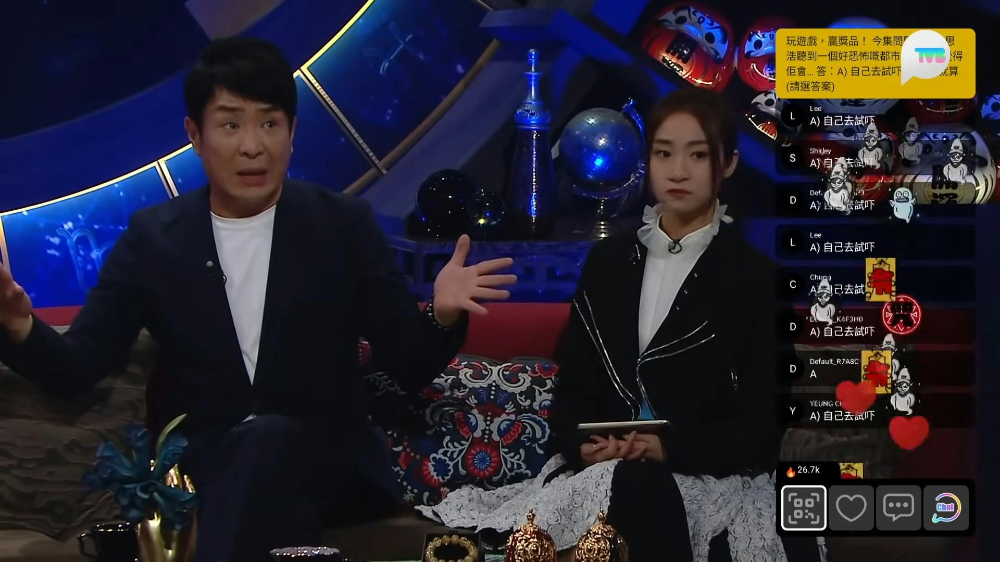

殿堂級樂隊Beyond的歌曲首首經典，陪伴了不少香港人成長，可惜隨着Beyond靈魂人物黃家駒於1993年意外離世後，各成員自此作單飛發展。Beyond原本有5名成員，前結他手劉志遠是樂隊最年輕成員，但於1988年離隊，並轉型幕後。直至後來Beyond經理人陳健添（Leslie）才爆出當年劉志遠離隊，是因為與黃家強不和。離開幕前多年，劉志遠近日罕有現身張啟樂的YouTube片，而年近60歲的他身體依然壯健。

Beyond的音樂至今仍對樂壇有著舉足輕重的影響，亦記載了一個年代的青春記憶。（網上圖片）

Beyond原本有5名成員，前結他手劉志遠（左）是樂隊最年輕成員，但於1988年離隊。（網上圖片）

劉志遠退居幕後成為巨星御用編曲人，早年最常合作的歌手包括林憶蓮、陳奕迅、蕭亞軒、何超儀、許志安、張惠妹、楊千嬅等，現已移居台灣10年，過着半退休生活。日前他在張啟樂的YouTube片段罕有現身，兩人更相約跑步，更半裸出鏡，可見體能依然Fit爆。而張啟樂亦在片中透露，到台灣定居後，透過一位台灣音樂人朋友介紹而認識劉志遠，兩人成為運動伙伴。

日前劉志遠在張啟樂的YouTube片段罕有現身。（YouTube截圖）

兩人相約跑步。（YouTube截圖）

劉志遠雖然已56歲，但體能及身材依然Fit爆。（YouTube截圖）

劉志遠移居台灣10年。（YouTube截圖）

兩人跑完步去醫肚。（YouTube截圖）

Beyond早年曾傳出成員不和的消息，有指因各成員都非常尊重黃家駒才沒有反面。劉志遠未成年時已是樂隊浮世繪的成員，因自學結他被封「結他神童」，後來樂隊解散，Beyond向他招手，成為Beyond的結他手，同時亦有參與製作。最後於1988年決意離開Beyond，轉型成為幕後音樂人。當年已有傳劉志遠與成員意見不合而離隊，直至2008年劉志遠曾透露離隊是因為黃家強，但沒有透露太多詳情。至2013年，經理人Leslie因黃貫中與黃家強不和而發表公開信，並公開劉志遠退出真相：「遠仔（劉志遠）離開Beyond是因為你（黃家強）。」

經理人Leslie於2013年因黃貫中與黃家強不和而發表公開信，並公開劉志遠退出真相是因為與黃家強不和。（網上圖片）

另外，梁思浩去年曾在節目《直播靈接觸》透露劉志遠是1996年嘉利大廈五級大火的生還者，發生火災時，劉志遠正在嘉利大廈內的錄音室工作，因聽不到外面的聲音，而遲遲未有離開錄音室。當時劉志遠更遇上靈異事件，他聽到一把小朋友聲音叫他逃生，最終成功活逃脫。

梁思浩去年曾在節目《直播靈接觸》透露劉志遠是1996年嘉利大廈五級大火的生還者。（節目畫面）
