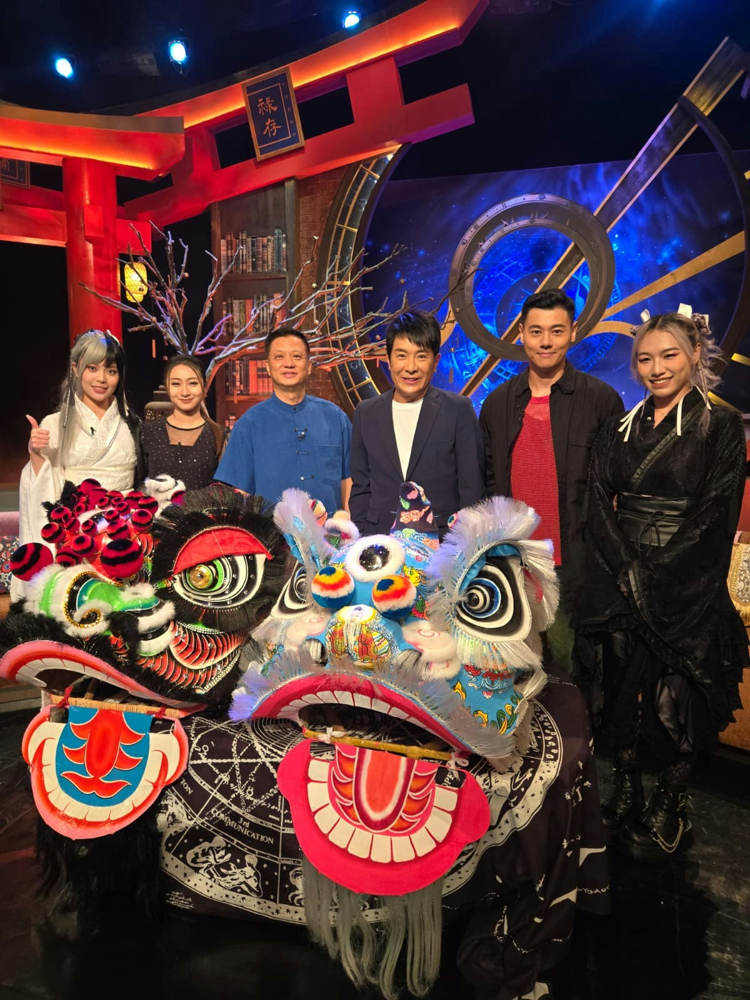
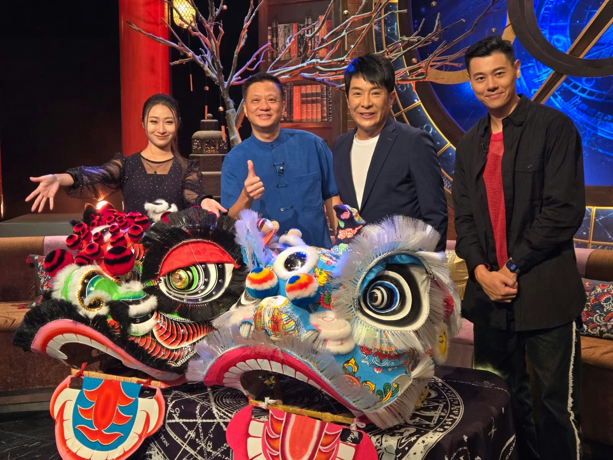
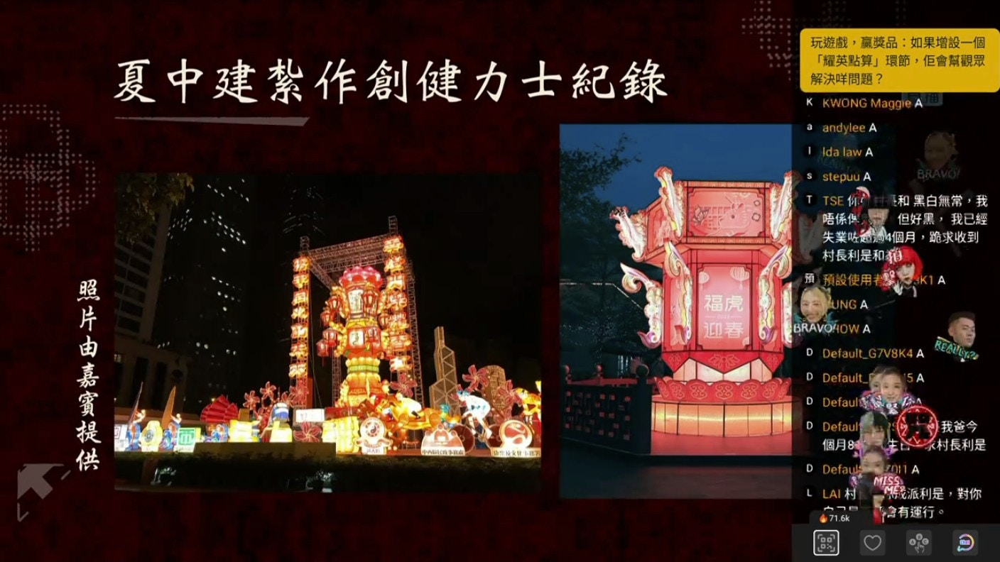
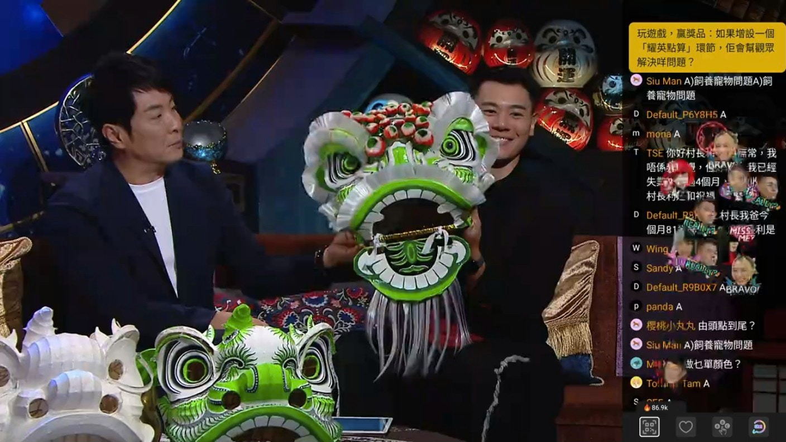
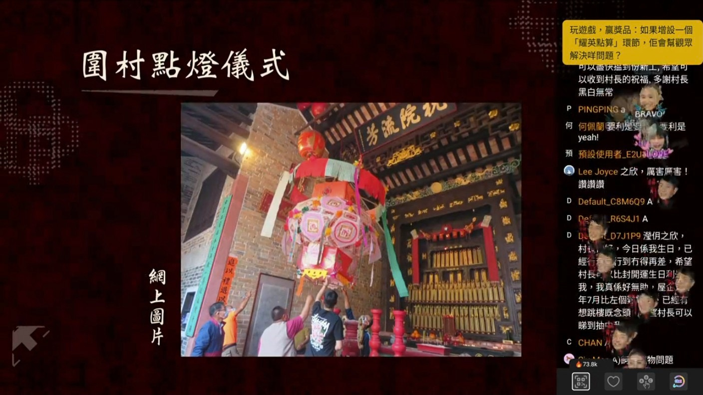

10月13日嘉賓「香港紙紮大王」夏中建師傅。（官方提供）

10月13日主題為「紮作紅白事」，請來「香港紙紮大王」夏中建師傅。（官方提供）

10月13日主題為「紮作紅白事」，請來「香港紙紮大王」夏中建師傅，夏師傅三代均為宗師，爺爺為「柔功門掌門人」夏漢雄、父親夏國璋有「獅王」的稱號。夏中建師傅贏過不少獎項，目前共保持三項健力士世界紀錄。

夏中建師傅贏過不少獎項，目前共保持三項健力士世界紀錄。（官方提供）

夏師傅透露白事較多用到紙紮祭品，他曾為已故張國榮紮過一座紅館。講到最傷心一單工作，要數到為Beyond主音黃家駒紮一座鋼琴，他說︰「一路做一路傷心（喊）。點搞呢，內心又唔開心，嗰時後生都係鍾意Beyond。」夏師傅提到家屬要每粒琴鍵都可以按下，最後他要到教堂求救，用真鋼琴度位照做。至於紅事如元宵節、圍村添丁、太平清醮等都會用到紙紮，而舞獅用的獅頭，紮作工序更多，主要分為：紮、撲、寫、裝，他解釋說︰「紮完之後獅頭仲要開光，首先買一舊老薑，然後挖一個窿，倒啲燒酒、朱砂落去溝勻。跟住用碌柚葉、黃皮葉喺獅頭灑淨，接住朱砂點睛，順序係左眼、右眼到耳口鼻，再到額頭位塊鏡、然後條脷、再由頭點至尾、手、腳等部分。咁先係正常開工儀式。」他笑言平時舞獅由主禮人點睛動作，只是用來拍照留念。

紮獅頭共有4個工序，分別為紮、撲、寫、裝。（官方提供）

紮完獅頭之後獅頭要開光、用朱砂點睛。（官方提供）

接住思浩講到每次舞獅，藝人有一件事一定會做，他說︰「肥姐沈殿霞同我講，我哋去剪綵啲人攞咗我哋啲好運，所以我哋都要攞返啲彩走，唔係啲運就留低喺間舖頭。所以每次剪綵條紅帶，佢會剪番少少袋走，攞返啲紅。」思浩繼續爆料表示醒獅採完青的生菜，亦會拿一塊寓意「生財」。至於袋走的生菜如何處置，思浩補充說︰「特別肥姐咁鍾意打牌，一定會攞走，而家新一代無人搶。塊生菜拎返屋企洗乾淨，放落湯一齊飲就可以。」
