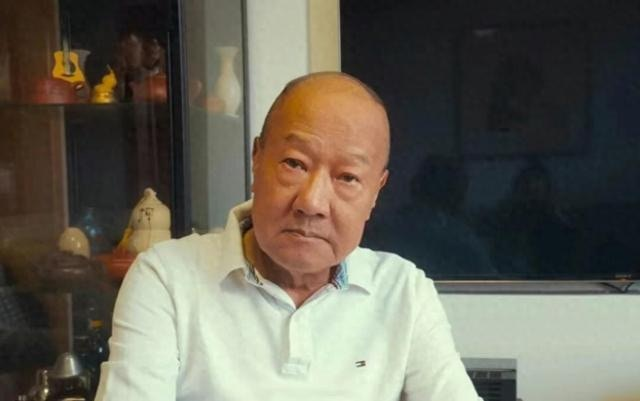
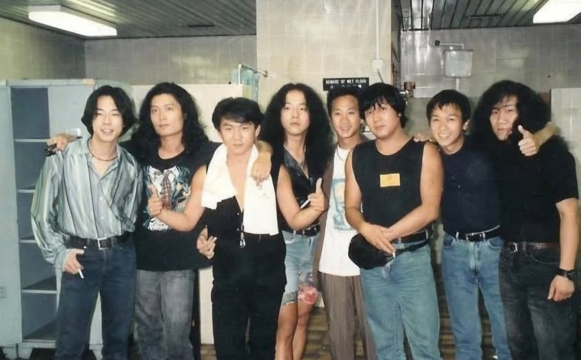
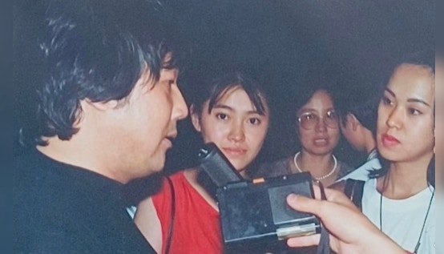
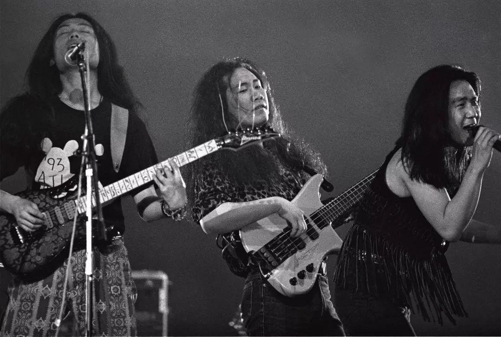

黑豹樂隊結他手郭傳林去世。（互聯網圖片）

1991年，黑豹樂隊在香港演出時，與Beyond同台演出。郭傳林（右三）旁邊就是黃家駒（右四）。（網易新聞）

黑豹樂隊成立於1987年，90年代初紅遍華語樂壇，音樂風格融合了搖滾、流行等多種元素，深受當時年輕人的喜愛，可以說是上個世紀內地搖滾的代名詞。其中最有名氣的樂隊成員莫過於王菲前夫竇唯。

1991年，黑豹樂隊在香港演出時，還與Beyond搖滾樂隊同台演出。照片顯示，郭傳林旁邊就是黃家駒和黃家強。

1992年12月，黑豹樂隊在內地發佈專輯《黑豹》，在盜版橫行的情況下，仍創下了150萬盒的發行紀錄。隨後，他們席捲整個亞洲，是第一支在日本舉行專場演唱會的內地樂隊。

擔任樂隊結他手的郭傳林（左一）當時接受媒體采訪。（互聯網圖片）

近年黑豹樂隊演出，但1995年郭傳林已經退出樂隊。（視覺中國）

據説是郭傳林在一次演出時發現「天生搖滾嗓」竇唯，於是邀請其擔任黑豹樂隊的主唱，才令樂隊慢慢有後面的成績。1995年，郭傳林離開黑豹樂隊獨立發展，成為黑豹樂隊及其他音樂團體的經紀人。

《極目新聞》報道，郭傳林因腎衰竭在青島去世，他的家人遵從遺囑喪事從簡，不舉辦任何追悼儀式，後續黑豹樂隊會發佈訃告。
