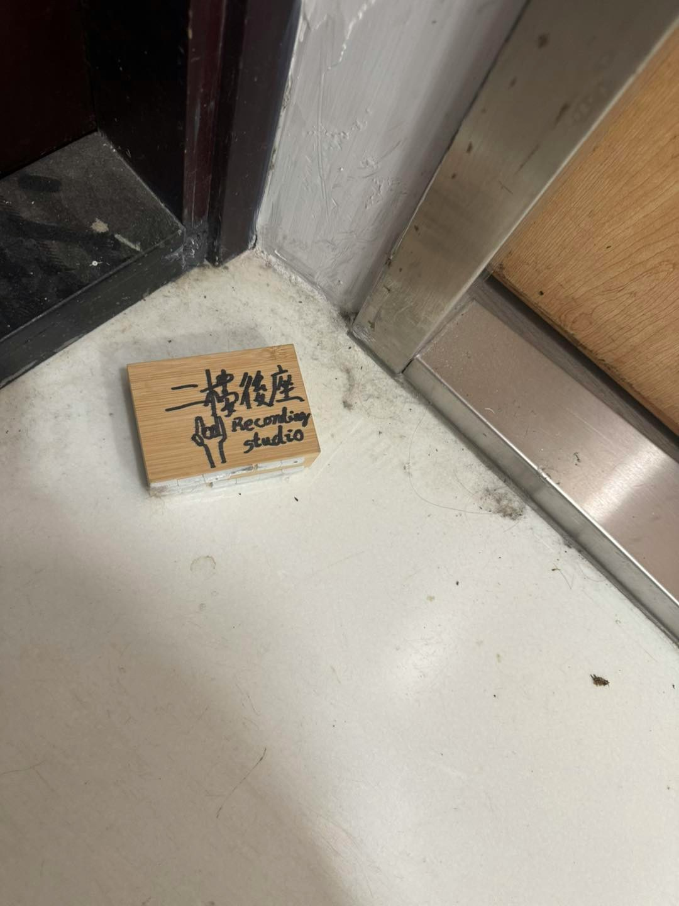
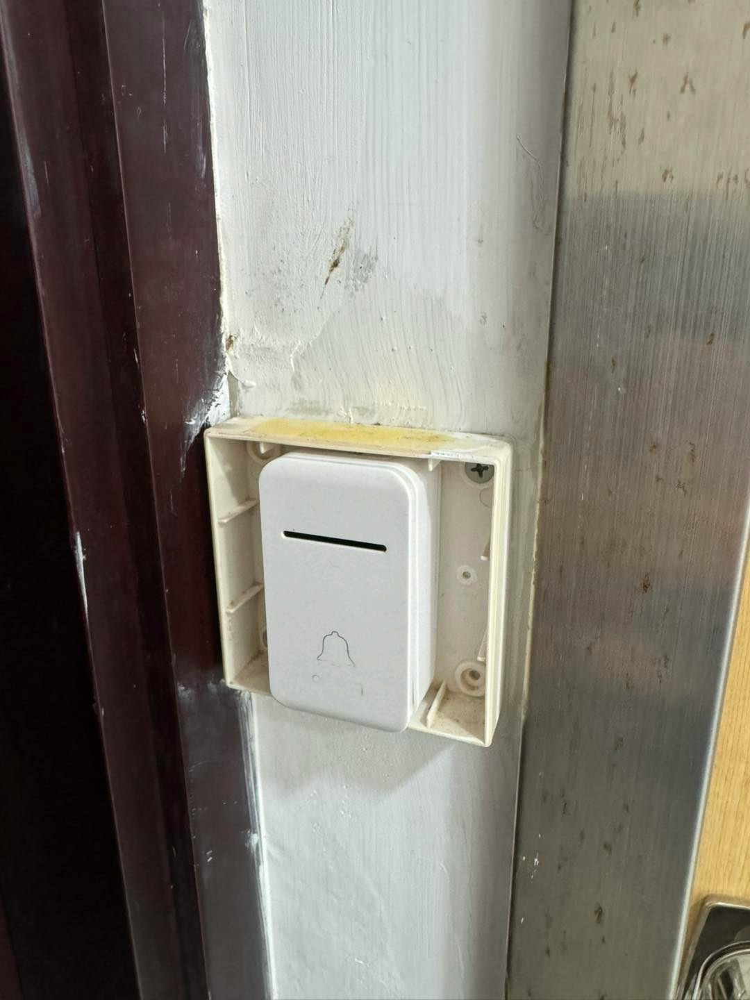
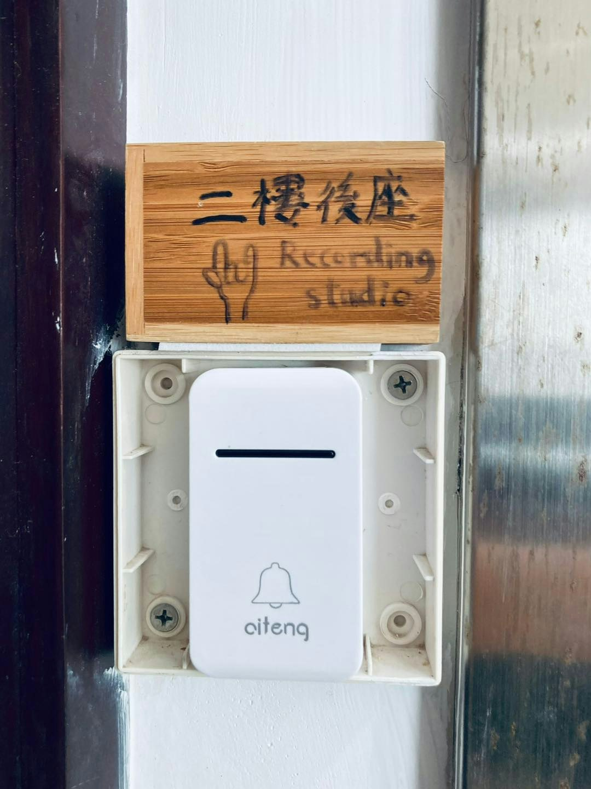
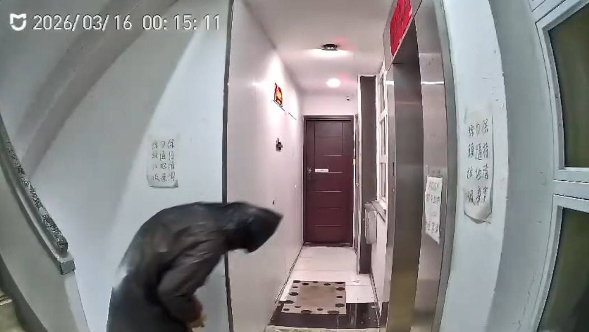
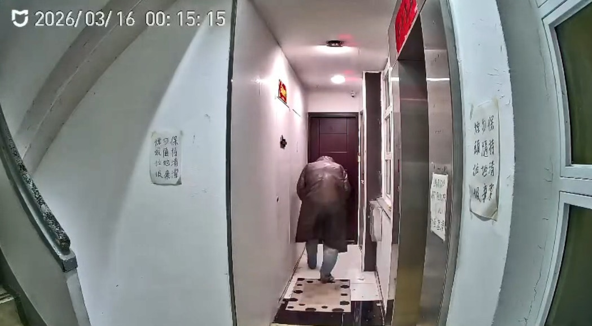
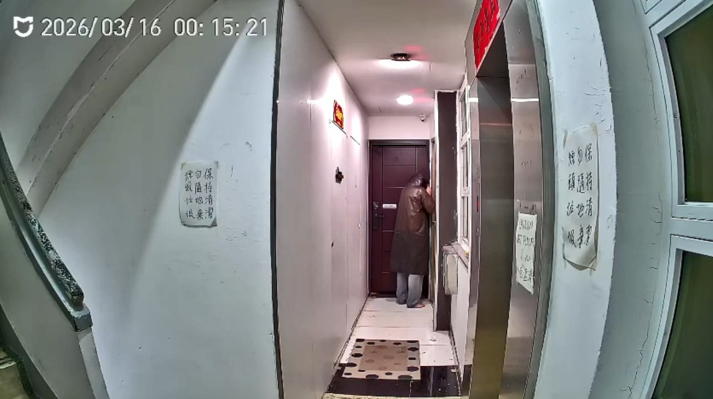
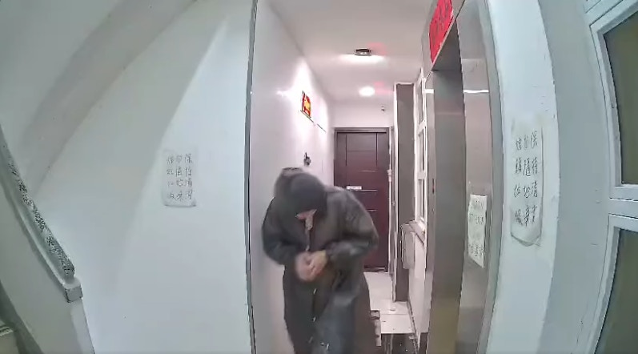
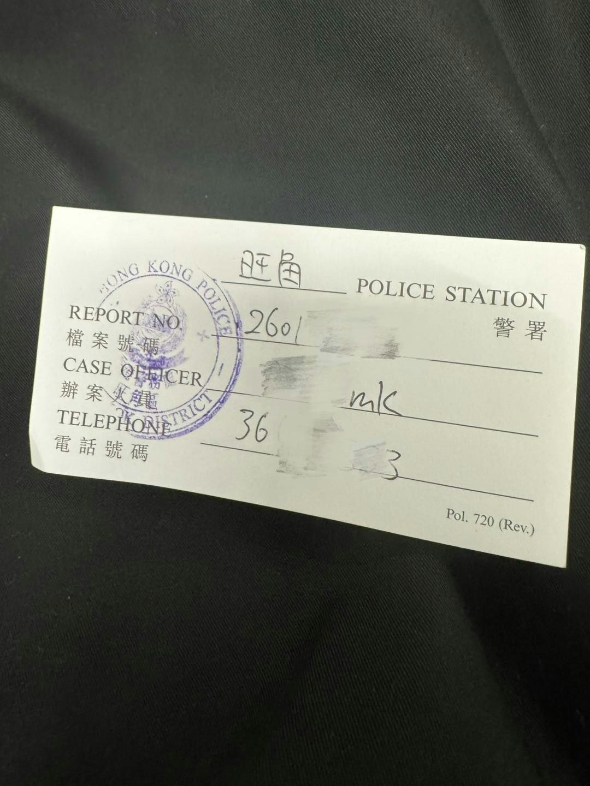
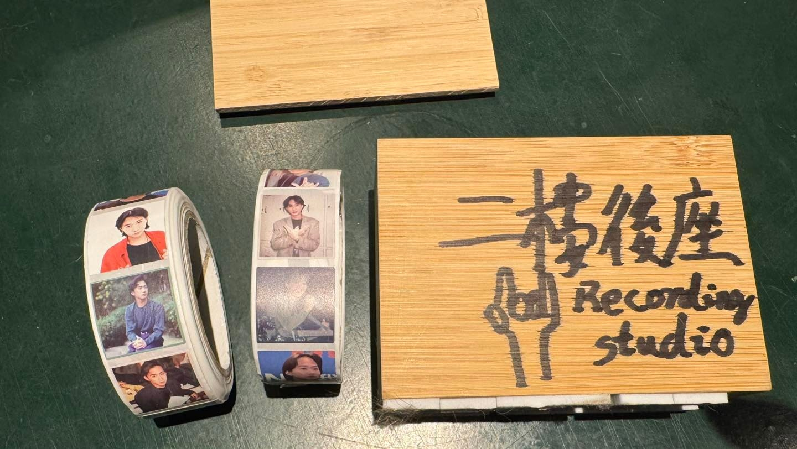

一名身穿雨褸的赤腳男子，深夜到「二樓後座」門前，疑拆去門牌，掛上山寨門牌。（Facebook:Re:spect Music Magazine 紙談音樂影片截圖）

「Re:spect Music Magazine 紙談音樂」專頁昨日（16日）在社交平台發文，指職員回到「二樓後座」時發現寫上「二樓後座」的門牌丟在地上，但仔細一看發現並非原有的門牌，懷疑有人偽造，偷龍轉鳳掛上此山寨版門牌；惟假門牌疑尺寸不合適而掉落地上。

「Re:spect Music Magazine 紙談音樂」專頁昨日在社交平台發文，指職員回到「二樓後座」時發現地上有個寫上「二樓後座」的木盒。（Facebook:Re:spect Music Magazine 紙談音樂圖片）

「Re:spect Music Magazine 紙談音樂」專頁昨日在社交平台發文，指職員回到「二樓後座」時發現地上有個寫上「二樓後座」的木盒。（Facebook:Re:spect Music Magazine 紙談音樂圖片）

真正的門牌被賊人盜去。（Facebook:Re:spect Music Magazine 紙談音樂圖片）

從專頁上載一條片長20秒的閉路電視可見，顯示時間是昨日深夜12時15分，一名男子身穿黑色雨褸、赤腳、低頭避開閉路電視鏡頭走到「二樓後座」門前，進行疑似拆門牌的動作。然後低頭疑捧著門牌走落樓梯離開。

事件曝光後，有網民及歌迷留言，懷疑賊人偷走門牌後，或會放到網上拍賣。

顯示時間是昨日深夜12時15分，一名男子身穿黑色雨褸、赤腳、低頭避開閉路電視鏡頭走到「二樓後座」門前。（Facebook:Re:spect Music Magazine 紙談音樂影片截圖）

顯示時間是昨日深夜12時15分，一名男子身穿黑色雨褸、赤腳、低頭避開閉路電視鏡頭走到「二樓後座」門前。（Facebook:Re:spect Music Magazine 紙談音樂影片截圖）

男子進行疑似拆門牌的動作。（Facebook:Re:spect Music Magazine 紙談音樂影片截圖）

男子雙手捧著門牌離開。（Facebook:Re:spect Music Magazine 紙談音樂影片截圖）

專頁表示就上述事件已到旺角警署報案，並把木盒和閉路電視片段交給警方跟進。《香港01》正向警方查詢。

警方表示，昨日（16日）接獲報案，指旺角洗衣街215號一錄音室的門牌懷疑被人盜去。經初步調查，案件列盜竊，交由旺角警區刑事調查隊第四隊跟進，暫未有人被捕。

專頁已就事件向警方報案。（Facebook:Re:spect Music Magazine 紙談音樂圖片）

賊人製作的門牌尺寸並不合適，故此從上面掉落地上。（Facebook:Re:spect Music Magazine 紙談音樂圖片）

「二樓後座」位於洗衣街215號，是香港殿堂級樂隊Beyond排練及創作的地方。該單位原是Beyond成員葉世榮祖母的住所，曾分租予4個住戶，而葉的祖母過世後，葉世榮將祖母的房間改造成簡單的band房，再添置音樂器材，成為了Beyond創作與排練的地方，而《海闊天空》、《光輝歲月》、《長城》、《情人》等膾灸人口的歌曲，據知亦是在這裏孕育出來，Beyond歌曲《原諒我今天》及《醒你》MV亦在單位取景。

翻查資料，2024年市建局宣布要啟動旺角洗衣街與花墟道重建計劃，而「二樓後座」所屬的大廈亦被納入清拆範圍。去年葉世榮首度開放單位給公眾參觀，並曾舉辦導賞團讓公眾了解Beyond音樂歷程。
