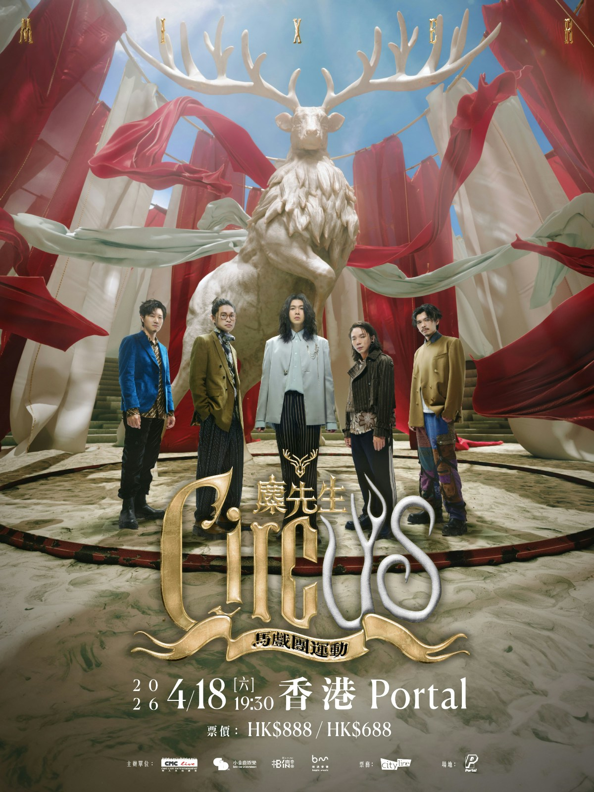
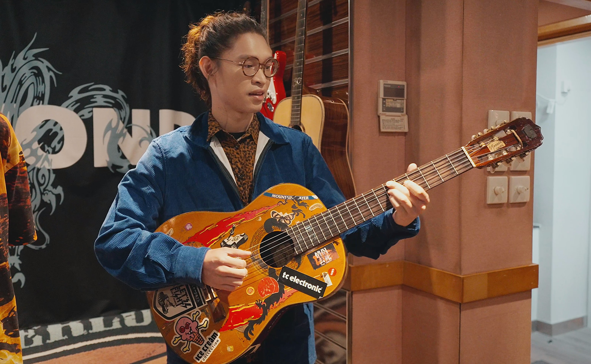
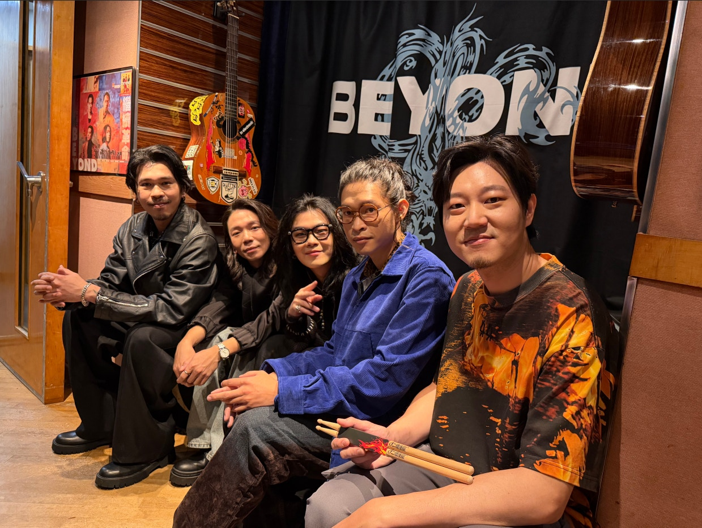

香港4月18日麋先生馬戲團運動海報。（官方提供圖片）

## 麋先生來港朝聖即將清拆的「二樓後座」

第一次踏足Beyond的二樓後座，主唱聖皓表示：「Beyond在我們心目中是一個非常經典的樂團，都有聽過他們的歌啊，這一次親身走到他們的錄音室工作室，是非常感動跟震撼。因為那裡是他們誕生的地方，踏進去就像走進他們的故事裡面，真實感受到那些曾經在耳機裡面的音樂。」

麋先生來港朝聖即將清拆的「二樓後座」。（官方提供圖片）

## 手逸凡獲葉世榮贈送鼓棍

結他手於二樓後座，拿起Beyond家駒的古董結他試彈，得知結他是1987年的，眾人高呼「嘩！比我們年紀還大！」結他上貼有價錢是90幾萬港幣，也嚇了他們一跳，最後才知道，那個價錢貼是黃貫中搞笑寫上去的。鼓手卢逸凡更在錄音室獲得了一份極具意義的禮物——Beyond鼓手葉世榮送贈的鼓棍，逸凡透露將會在四月來港開演唱會時使用這份珍貴的紀念品。鼓手逸凡被問到會否效法Beyond鼓手葉世榮當年演唱會solo 20分鐘，他笑言：「如果大家真的這麼想看，我是絕對奉陪的。」其他成員隨即起哄：「一個半小時、兩個小時也可以啊！」十分搞笑。

鼓手卢逸凡獲葉世榮贈送鼓棍

二樓後座是Beyond樂隊於80年代末至90年代的重要創作基地，樂隊多首經典作品皆在此誕生，對本地樂迷乃至亞洲搖滾樂壇都具有深遠意義。參觀期間，麋先生得知二樓後座面臨清拆，4月9號後會被香港政府回修舊區重建，整棟大廈清拆，永遠消失在世上，眾人均表示非常可惜，感嘆：「這樣珍貴的一個代表著香港搖滾歷史的地方，為什麼不保留？這樣就從此消失，真的好可惜。幸好我們趕得上這最後一波參觀。」

麋先生留言：心裡的海闊天空，永遠的光輝歲月。（官方提供圖片）

## 啖家駒生前最愛的「豬扒餐」

朝聖錄音室後，麋先生更跟著 Beyond舊日的足迹，光顧Beyond當年最常光顧的餐廳，Beyond世榮電話中推介了附近一家老店，並透露黃家駒最愛吃「煎豬扒、羅宋湯及一個餐包」，而世榮自己則有時會吃牛扒。麋先生隨即按圖索驥前往該餐廳，品嚐Beyond同款美食，他們形容這趟既是「朝聖之旅」，也是「美食之旅」。
