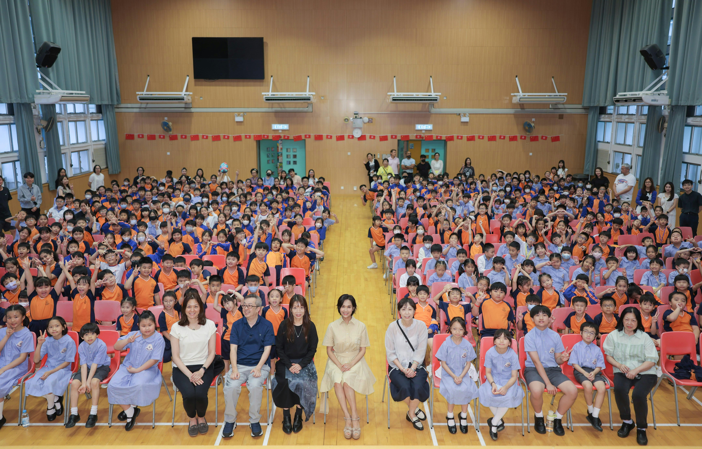
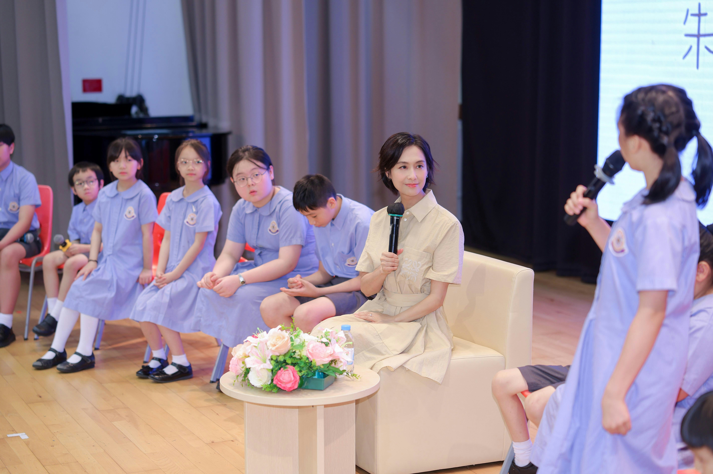
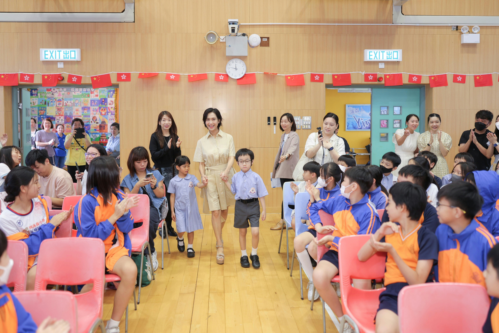
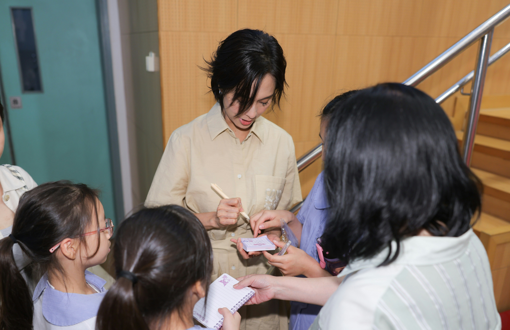

朱茵日前受邀出席校園活動，到訪東華三院周演森小學，接受一班由學生化身的「小記者」訪問，分享不少演藝心得、經歷及與家人相處關係，大受師生們歡迎；對於同學的提問，朱茵表現親切，逐一細心回答，她更大讚多位「小記者」表現精靈、思路清晰，笑言絕不能睇少現今的小朋友。

朱茵受邀出席校園活動。（官方提供圖片）

茵茵接受一班由學生化身的「小記者」訪問。（官方提供圖片）

難得走訪小學校園，朱茵看到小朋友的笑臉同活力，立刻被融化，所有憂愁都忘記了，她坦言此行使她勾起女兒小學生活點滴：「重返小學校園，勾起嘅最大回憶係以前去學校睇阿囡表演，當小學家長好幸福，可以參與到阿囡校園生活，中學就已經冇咁多機會進入校園了，所以每當有機會踏進小學，內心充滿溫馨同開心嘅感覺。」

走訪小學校園，令朱茵勾起不少女兒小學生活點滴。（官方提供圖片）

朱茵大受師生們歡迎。（官方提供圖片）

## 聆聽包容不擺款

提起愛女黃鶯，朱茵透露對方已進入反叛青春期，跟女兒的相處方式亦要改變：「而家要做佢嘅朋友，聆聽佢嘅內心世界，信任她，提自己唔好擺媽媽款，希望用啲溫和方式令佢容易接受，慢慢成長。」

朱茵透露愛女黃鶯已進入反叛青春期，跟女兒的相處方式亦要改變。（官方提供圖片）

朱茵向「小記者」分享不少演藝心得、經歷及與家人相處關係。（官方提供圖片）

朱茵續說，她與Paul黃貫中都不是怪獸家長，雖然二人偶有不同想法，但他們都是基於為女兒好，朱茵表示：「有啲嘢唔使咁硬嘅，邊個鬧完（個囡）另一個就做和事老，我哋盡可能畀空間同自由度個囡決定，引導女兒選擇正確道路，教佢辨別是非，當佢明白之後，自己去改變，咁先可以令家庭和諧。」朱茵認為成長路上，必須帶給小朋友家庭溫暖，父母永遠都係小朋友最大後盾，會支持佢每個決定，無論是錯是對，都會全家面對，這是現在她們一家正努力學習同實踐，朱茵相信「愛」能將問題迎刃而解。

朱茵大讚多位「小記者」表現精靈、思路清晰。（官方提供圖片）
