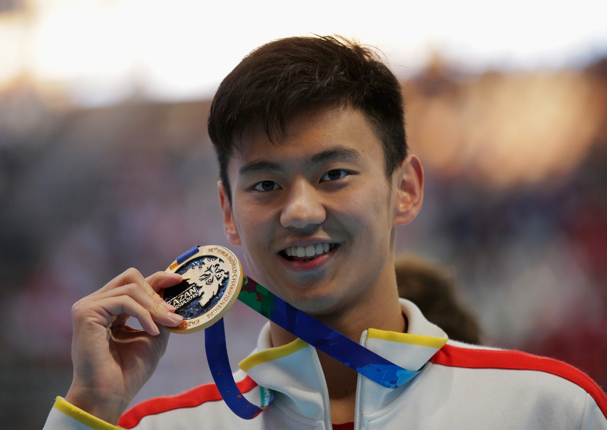

*寧澤濤是首位奪得百米自由泳世界冠軍的亞洲男運動員。（資料圖片）*

若問中國當今體壇最炙手可熱的潛力巨星是誰，相信非寧澤濤莫屬。這位剛於今年8月世界游泳錦賽，勇奪100米自由泳金牌的中國泳壇「一哥」，原來最喜歡聽Beyond和米高積遜的歌曲，認真有品味。

年僅22歲寧澤濤，被視為今屆奧運游泳項目衝金希望，平日經常在微博和擁躉互動。他表示運動員生活單一，微博是其主要和大眾互動的平台，坦言：「除此之外，我還很喜歡聽歌，不過我的喜好受父輩影響，所以喜歡聽MJ和Beyond的歌。這都是些經典歌曲，有些歌曲的原唱歌手都去世了。」他更透露第一首懂得彈奏的歌曲是Beyond的《真的愛你》。
