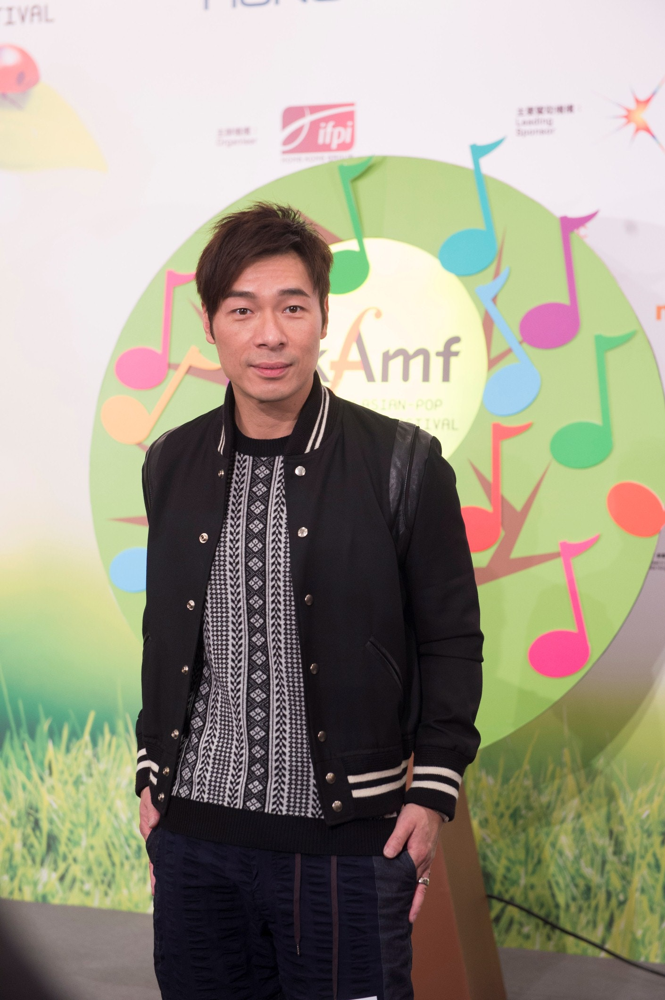

許志安對方力申和鄧麗欣分手感到非常可惜，但覺得感情事外人不便插嘴。（符祥定攝）

歌手許志安(安仔)今午出席《香港亞洲流行音樂節2016》的記者會，作為表演嘉賓，安仔明天將會代表香港上台，他透露自己特別為今次大會揀選了不少歌曲：「因為表演時不止唱一首歌，我會跟着大會的環保主題去挑選歌曲，有翻唱別人的也有自己的歌，其中會有一首經典的英文歌，還有一首代表香港的歌。而今次會聯同自己熟悉的樂隊表演，還會有鋼琴伴奏的環節。」另外，他還表示其中一首歌會是前幾個月前練習的Beyond名曲。

另外，談到今日宣布分手的方力申和鄧麗欣，安仔和他們二人認識多年，大表可惜：「我也是今天才知道這件事，印象中他們私底下挺好的，真是很可惜。但我覺得感情是兩個人的事，他們是最了解和最清楚自己，外人不便討論太多。兩個人在一起講的都是緣分，所以是否會再復合實在很難說。」
