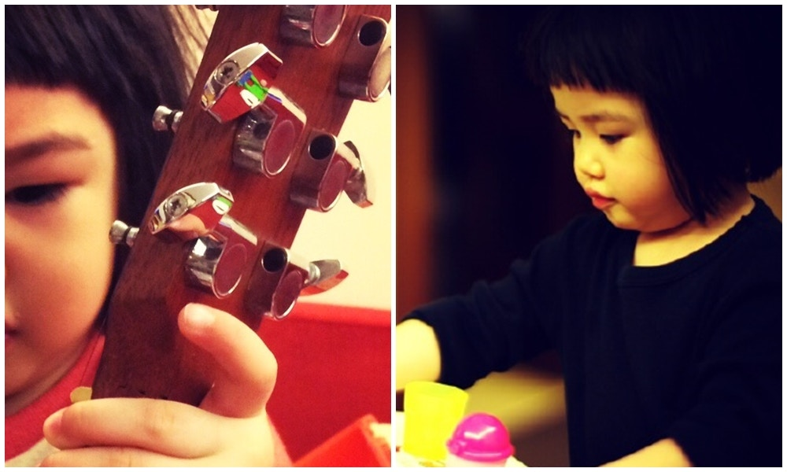
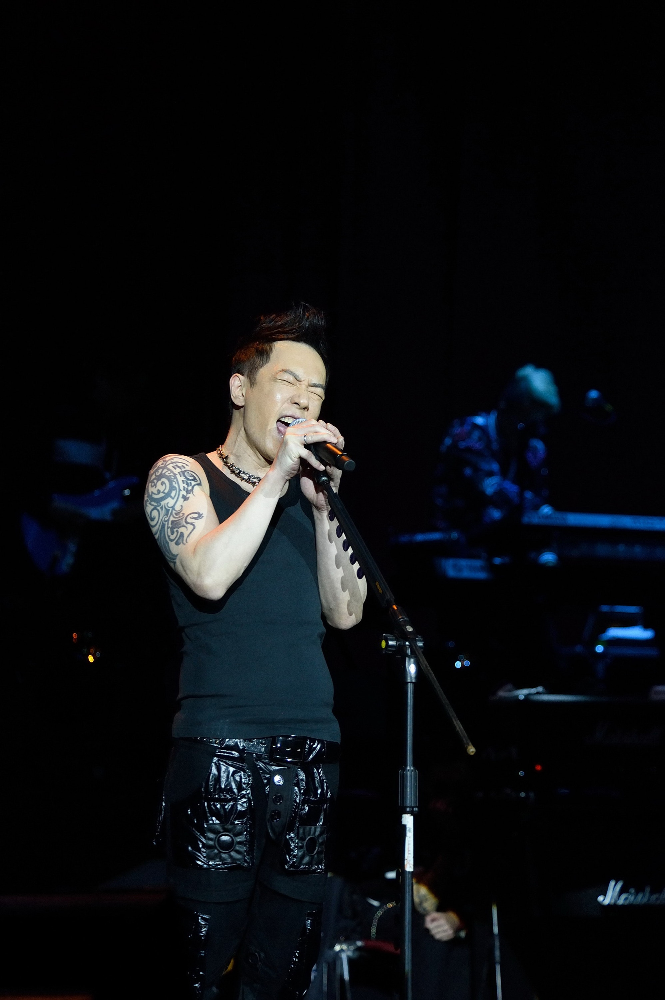

黃貫中透露囡囡也愛音樂，更曾寫歌送他。（微博圖片）

黃貫中相隔4年再到台北開唱，不同的是這次有囡囡捧場。(中央社)

黃貫中昨晚在台北舉行「英雄有分數」演唱會，獲老婆朱茵及囡囡黃鶯到場支持，黃貫中提起囡囡不自覺收起火爆樣子，變身慈父，表示囡囡是首次搭飛機，只為看他的演唱會，又爆囡囡愛呷醋一面，「她看完演唱會後跟我說：你不要彈結他給他們聽！她便是上天派來收我的。」

囡囡現身捧場，黃貫中亦有表示，以一首《孩子》送給黃鶯，「這首歌她還未出生前已經寫好了，希望有一天她能得懂。」而3歲的黃鶯也遺傳了爸爸愛音樂的基因，不但昨晚在台下聽完場，原來更曾創作歌曲送給爸爸，「我想來想再為她寫歌，但她竟然比我快，寫了首《Strawberry》給我。」言語中透露為人父的驕傲。
