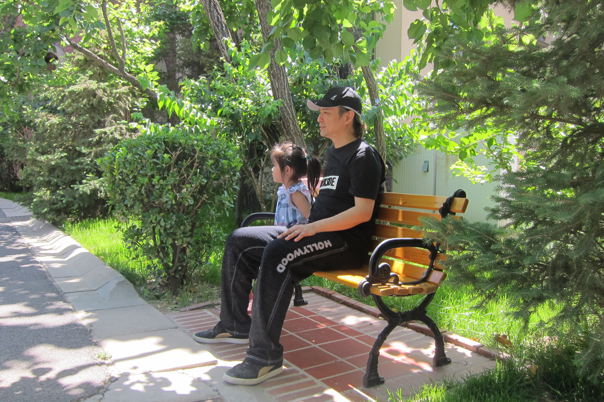
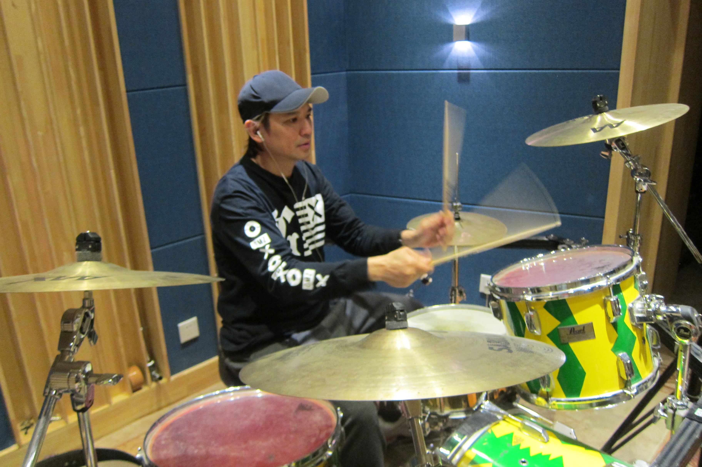

由葉世榮發起的「家駒...愛心延續慈善演唱會2016」，下星期五（6月10日）在灣仔會展舉行，而最近身在北京的世榮，趁着演唱會未開始之前爭取時間和妻女相聚，還和女兒一起共享天倫之樂。世榮表示會好好珍惜這段時間，享受和女兒相處的日子，「我在北京這段時間都有積極練鼓練唱歌，留在北京可以多些時間見女兒，帶她在家附近周圍散步，走下聊下天。」

*葉世榮趁演唱會未開始之前，留在北京，陪陪女兒，享受天倫樂。*

*為了演唱會能給大家一個好的演出，身在北京的世榮非常落力練習。*

世榮日內會回港進行演唱會綵排，今次除了他和黃貫中（Paul）會演出外，其他落實的演出的單位超過20個，包括鄧紫棋、梁詠琪、側田、盧巧音、林曉培等，而樂隊則有太極、RubberBand、Dear Jane、及KOLOR等；當中還有Jam歌的部分，世榮會和Beyond五人時期的成員劉志遠（遠仔）及監製歐陽燊（Gordon ）演出。

能有如此強大的陣容，世榮相當感激，「遠仔今次特意從台灣飛來香港，我最後一次和遠仔合作都差不多10年前，反而我和Paul平時都一起做活動。本來我有想過找83年成立時期的第一代結他手鄧偉謙（ William）參與，但是他這段時間不在香港，真的有點可惜。」

演唱會當天就是家駒54歲的生忌，這一天世榮和Paul除了在舞台上延續他的愛心外，世榮還希望能帶頭做一件事，「就是希望全場朋友一起和家駒說聲：生日快樂。」
