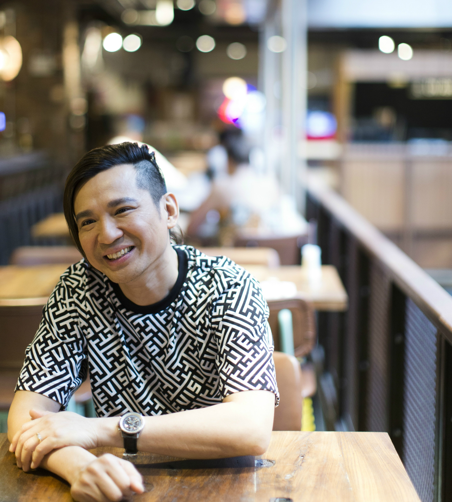
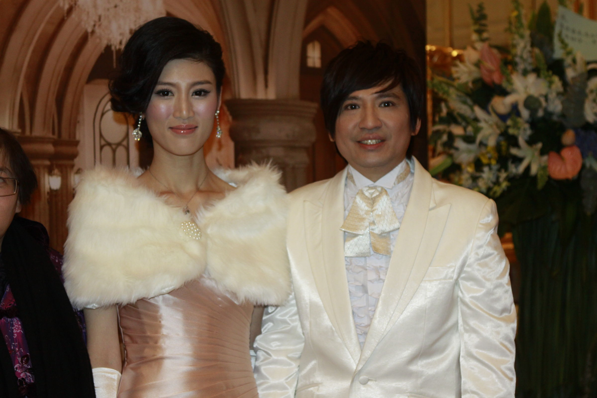
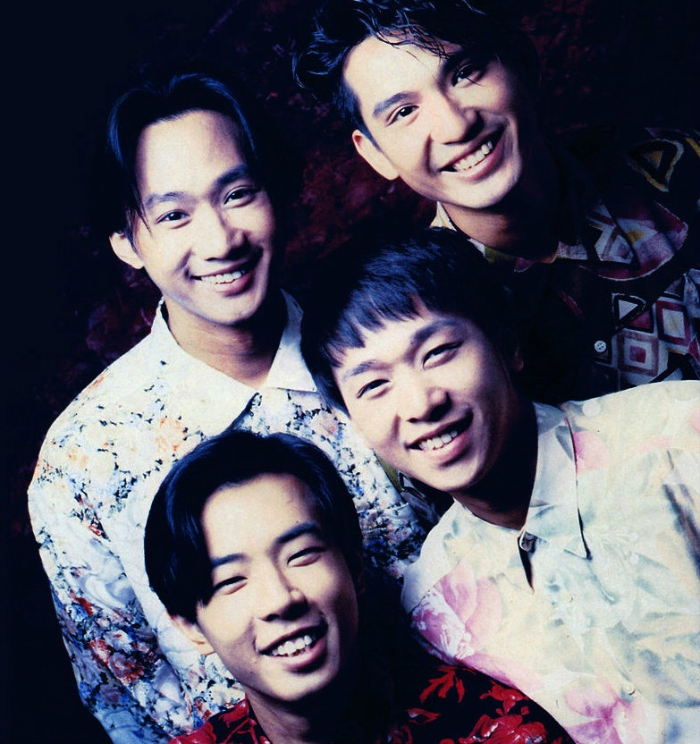
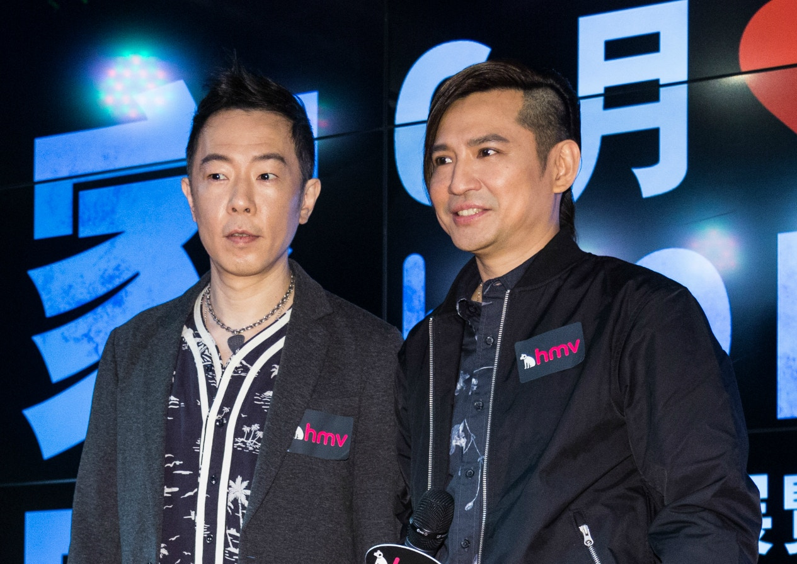

葉世榮有舉辦紀念黃家駒演唱會的念頭，全因去年看到名叫《家駒紀念音樂會》的海報，「上面有家駒的相片，有家駒的名字，我想起多年來有很多人以家駒的名義舉辦過大大小小的紀念騷，打着籌款的旗號，卻從未公布過籌得多少錢，又捐了去哪裏。」世榮坦言有點不忿，為什麼每年都有人「消費」家駒？所以他決定認認真真籌備一個好的音樂會，「過去我們都只會回憶、懷念家駒，但忽略了最重要的東西。家駒有那麼多好的作品教我們大愛、關懷世界、關心社會、體諒別人，我們要把他這個愛心精神延續下去。」世榮希望做個完美示範供大家參考，要做到歷來籌款最多、陣容最強大、最成功、最精彩的家駒紀念騷。

1980年代香港樂壇進入全盛時期，不少樂隊像雨後春筍般紛紛冒出頭來，正正是那個百花齊放的年代孕育了Beyond，而世榮在籌備這個音樂會時，第一時間便想起當年的戰友太極樂隊，他們亦一口答應演出，成員Gary （唐奕聰）更出任音樂總監，情義相挺，令世榮想起不少年少往事，「當年可謂一起長大，那時候經常跟太極在TVB做騷，但不只是唱歌那麼簡單，要扮鬼扮馬，有次我們雙雙穿古裝，唱大戲似的，頭頂有兩條很長的不知道什麼東西『揈吓揈吓』，好搞笑！誰會想到夾band居然要著古裝表演？」

識於微時 音樂情誼

成立Beyond前，葉世榮跟黃家駒本不相識，也各有自己的樂隊。首次在琴行相會，家駒對音樂的熱誠教世榮印象異常深刻，「初識家駒時我便覺得他很喜歡音樂，他一口氣講出很多喜歡的樂隊和歌手，包括David Bowie、Pink Floyd、Led Zeppelin、Deep Purple、Iggy Pop、Genesis等滔滔不絕，主要是比較前衛的英國樂隊。當時我還帶了我樂隊的結他手跟他見面，家駒也是個結他癡，他們兩個一見如故，不停講結他經。我當時就想，這個人對音樂很有熱誠，真的很喜歡結他。」在音樂牽線下，世榮跟家駒成為好友，但二人只是得閒飲茶、睇戲，見吓面、傾吓音樂的朋友，「直至有日家駒打電話給我：『世榮你打鼓㗎喎，不如過嚟頂吓。』」原來家駒所屬樂隊的鼓手不玩了，於是世榮加入了他的樂隊，「最初家駒不是主唱，他是樂隊的第二結他手，專玩節奏。他那樂隊的主音歌手兼顧主音結他，好霸道，經常說家駒的結他擴音器太大聲，會叫他：『喂！家駒！細聲啲！』家駒就會調細聲點，專心投入自己的音樂世界。但有日那個主音決定移民，樂隊無人唱歌，家駒就試吓唱，平時不開聲，一開聲原來他的聲音非常特別。當時我們還在翻唱外國英文歌，他扮得非常似，聲音有點沙啞，很有個性，比先前那個主音更好。」所謂無心插柳柳成蔭，家駒就這樣成了主音，後來樂隊陣容又變了幾次，一次他們以「Beyond」的名字參加比賽，贏得最佳樂隊的獎項，便從此展開那段「光輝歲月」。

> 有次做騷，我打鼓，前面兩個唱歌，主辦單位放了支咪在中間，於是觀眾都哭了，那次演唱會很成功，但他們忽略了台上樂手的感受，一晚如是兩晚如是，我再也受不了，愈是這樣紀念，家駒的空缺愈發明顯。

音樂路上 全賴有你

英式搖滾令世榮跟家駒走在一起，但Beyond四子喜歡的音樂各有風格，世榮笑說這便是使Beyond獨具一格的原因，「Beyond風格來自4個人的不同元素，並不是單一的風格，這樣內容才豐富。當年也沒有那麼專業，什麼都想試吓，剛剛開始技術一定較差，仍在摸索學習的階段，試吓你的風格，又試吓我的風格，但氣氛仍很平和，個個都無錢，賺來的錢全都投資在樂器上了，年輕人吵吵鬧鬧都只是開玩笑而已。」

隊內相處融洽，外面的世界卻沒有那麼簡單，幾個愛音樂的小伙子聚在一起，想着為理想奮鬥，但現實偏偏要他們低頭。處於血氣方剛的年紀，難免處事不夠圓滑，而那個時候幸好還有家駒，「家駒是很聰明的人，很照顧自己的兄弟，對解決問題有一手，他能擺平樂隊對外的摩擦，無論是唱片公司、經理人公司或所有外面的人亦然。」

天才領袖 大愛靈魂

在世榮眼中，家駒是音樂天才，他聰明、無私、有智慧、有義氣，任何問題只要交到他手中便可以迎刃而解，「所以他是大佬，Beyond的靈魂人物。」但23年前，一宗意外帶走了這位出色的領袖，作品《海闊天空》就像是家駒的延伸，一直蔓延至今。前年一場社會運動，每夜這首歌響遍街道，有人說《海闊天空》是香港的區歌，世榮說，這是「駒歌」，「這首歌表達了一個人為理想可以犧牲很多，每個人也有他的理想，不止香港，只要在群眾聚集時，大家有共同目標，這首歌就有它的意義。無論是學校畢業典禮、運動會、公司鼓勵士氣，還是社會群眾運動，這首歌很自然能凝聚大家。」

「以前一直打鼓，第一次自己在香港做新歌宣傳，攞起結他走到台前唱歌，真的緊張到震。」樂隊失去主音後，葉世榮選擇走出「鼓佬」的角色，變身歌手從零開始，然而身分不同了，過去玩樂隊的經驗亦要歸零。2001年世榮發表第一張個人唱片《美麗的時光機器》，打鼓以外，也唱自己寫的歌，「我認真一聽只覺真的太難聽，發覺有很多不足的地方，如果想進步就需要更多經驗和鍛煉，但香港做音樂的空間太小，可以取經驗的地方不多。我突然想起，香港旁邊的深圳應該會有更多機會給我表演，結果有段時間上了廣州，不論大小騷，條件亦不計較，只想着唱歌。」初初到內地發展，沒有預先計劃，只有順水推舟，間中亦有趣事。

*葉世榮2011年跟太太張偉鈴結婚，隔年誕下囡囡葉凱淇，但世榮非常保護家人，鮮有公開照片。*

拋開憂傷 加添力量

「十幾年前到內地發展不久，有次到貧窮山區做騷，現場有2萬名觀眾，但音響只得一對喇叭，我一唱台下就一起合唱，結果台下唱得比我更大聲。」幸而後來歌迷相當支持，得到鼓勵，世榮放膽到不同地方表演，累積更多經驗。直至2009年跟北京唱片公司簽約，世榮便定居當地，認識了現任太太，又生了囡囡，「這條路一開始我根本沒有想過會走得那麼遠，冥冥之中自有安排。」

樂隊解散後，黃家強跟黃貫中的關係有點劍拔弩張，而Beyond三子最後一次同台，是2008年的家駒15載紀念活動，此後鮮有再同場出現。世榮坦言只要3個人在一起，便感覺到三缺一的悲傷，難以撫平，所以對重組實在有些抗拒，「有次做騷，我打鼓，前面兩個唱歌，主辦單位放了支咪在中間，於是觀眾都哭了。那次演唱會很成功，但他們忽略了台上樂手的感受，一晚如是兩晚如是，我再也受不了，愈是這樣紀念，家駒的空缺愈發明顯。」

但日子一天一天的過，世榮自言漸漸想通，於是去年提出要辦紀念騷，希望舊時同伴能再聚頭，「如果以後經常有類似的活動，這股傷痛或會慢慢減低，好像家駒回來了，跟我們一起合作去做有意義的事。籌款也好，做善事也好，而透過這些活動，他們兩個的關係或能改善，不要說重組，先試試重聚吧。」事隔多年，葉世榮跟黃貫中將會再次在紀念騷中合作，但家強並未答應出席，世榮坦言仍在極力爭取，又透露家強態度已見軟化，「他第一次跟第二次的表達方式已明顯有大不同，希望終有一日能再一起為家駒做點事。」

從樂隊到獨立發展，關關難過關關過，葉世榮走到今天實屬不易。對於後輩，他有四字真言：「做好先講」，「想出頭從不是易事，做藝人有做藝人的難處，做樂隊有做樂隊的難處，做歌手也有做歌手的難處。不要管那麼多，玩好隊樂隊再說。」

世榮補充相比以往，現今的樂隊幸福多了，音樂造詣上的成長更快，「因為資訊發達，上網便有很多學習音樂的教材，甚至我唱歌都是上網學的，又可以互相分享經驗，想法和技巧都跟我們那個年代不同。以前只能靠有經驗的朋友口耳相傳，或者自行到琴行找書，時代不同了。」

*家駒1993年意外逝世後，他的位置難以填補，Beyond終在2005年解散，世榮如今只想三人能再重聚。*

未發表的家駒作品

> Beyond的作品歷久不衰，當中大部分都是出自家駒手筆，世榮說每張唱片家駒都會寫很多歌，因此還有不少未發表的原始作品，但沒有重新發表的打算，「我們試過延續他的作品，2003的《抗戰20年》前面部分就用了家駒的demo，他自己「啦啦啦」的哼唱，後面就由我們去完成，別具意義，但家駒寫的歌他自己演繹得更好。」

*葉世榮將在演唱會中再執鼓棒，昔日隊友黃貫中亦已答應參與，惟黃家強一直未點頭。*

黃貫中說不完的爸爸經

> 事隔多年再跟黃貫中合作，世榮笑指對方有小朋友後明顯「收火」，昔日的火爆浪子走入家庭，一碰面不再只談音樂，還有說不完的「爸爸經」，「我們的囡囡年紀相若，所以特別有共鳴，見到他現在這麼開心，我都好開心。」提到囡囡，世榮自豪地表示她絕對有音樂天分，「小朋友很喜歡亂敲，她會聽着歌敲，拍子配合到歌曲，證明她節奏感很不錯，而且她唱歌很大聲，不會害羞。她想發展任何東西我都會盡量支持，我有試過教她彈琴，但她沒有心機學，可能為人父母教自己的孩子音樂會較難，她只是不停拍打電子琴，以為彈琴只是單純按按鈕。」

你想看更多精彩的深度文章嗎？請購買今期《香港01》周報，或點擊此處：成為我們的訂戶。
