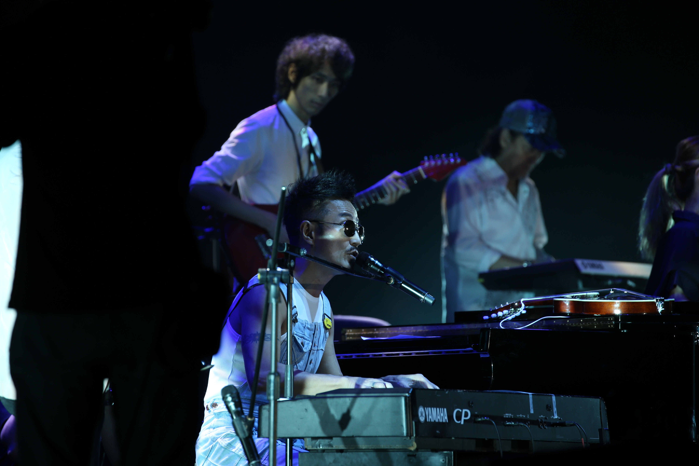
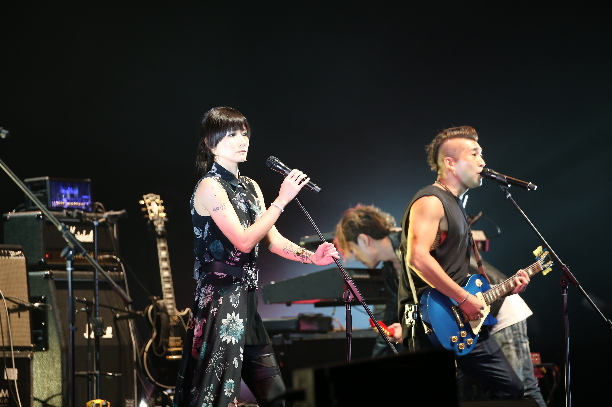
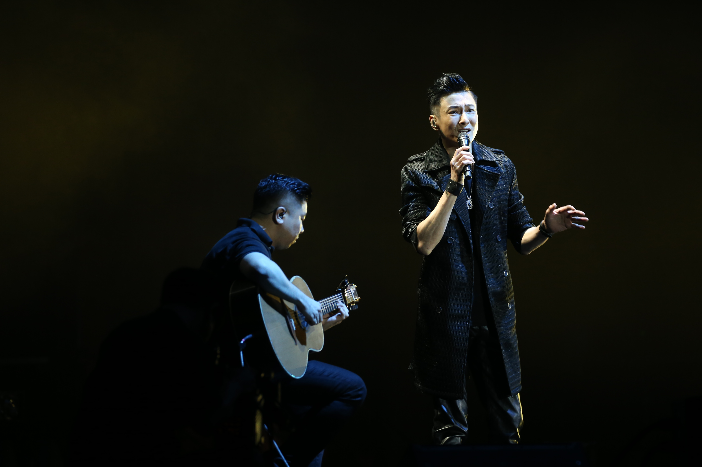
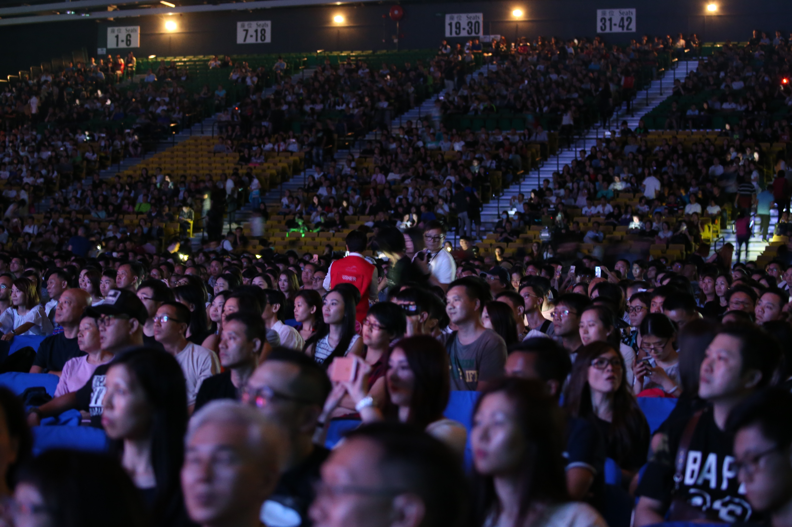

周啟生唱出重新編曲的《歲月無聲》，卻被樂迷錯認作鄭中基。（黃國立攝）

6月10日是Beyond靈魂人物家駒的生忌，由葉世榮發起的《家駒愛心延續演唱會》在灣仔會展舉行， 黃貫中、太極、鄧紫棋及梁詠琪等一眾歌手，用音樂記念家駒，吸引大批來自世界各地的歌迷參與，開場前更有歌迷大叫：「家駒，好掛住你呀！」

演唱會開首以曾志偉的錄影片段開始，志偉指：「今天...這幾句歌詞唱到今時今日，我地就將他的愛和正能量，延續到每一個香港人。」

演唱會打早陣出場的表演嘉賓周啟生，唱出重新編曲的《歲月無聲》等作品，但在場有歌迷把他錯認鄭中基。其後由胡渭康唱出《願我能》，盧巧音則和Kolor大唱三首作品《係要聽rock n' roll》、《無盡空虛》及《無淚的遺憾》。

盧巧音和Kolor大唱三首作品，包括《係要聽rock n' roll》、《無盡空虛》及《無淚的遺憾》。（黃國立攝）

胡渭康唱出《願我能》，讓樂迷聽出耳油。（黃國立攝）

大批Beyond粉絲到場，懷緬在另一世界的偶像家駒。（黃國立攝）
