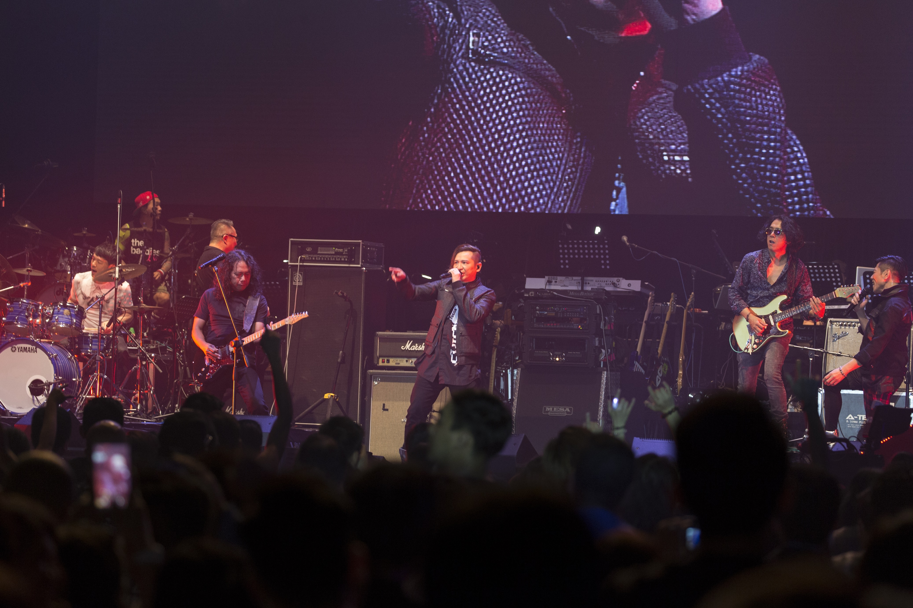
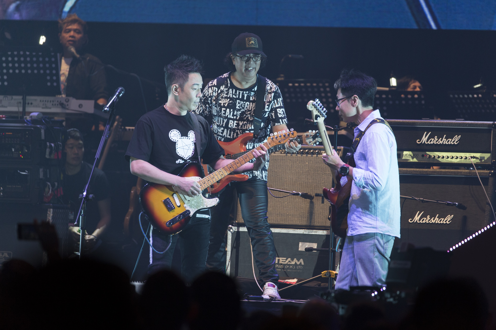
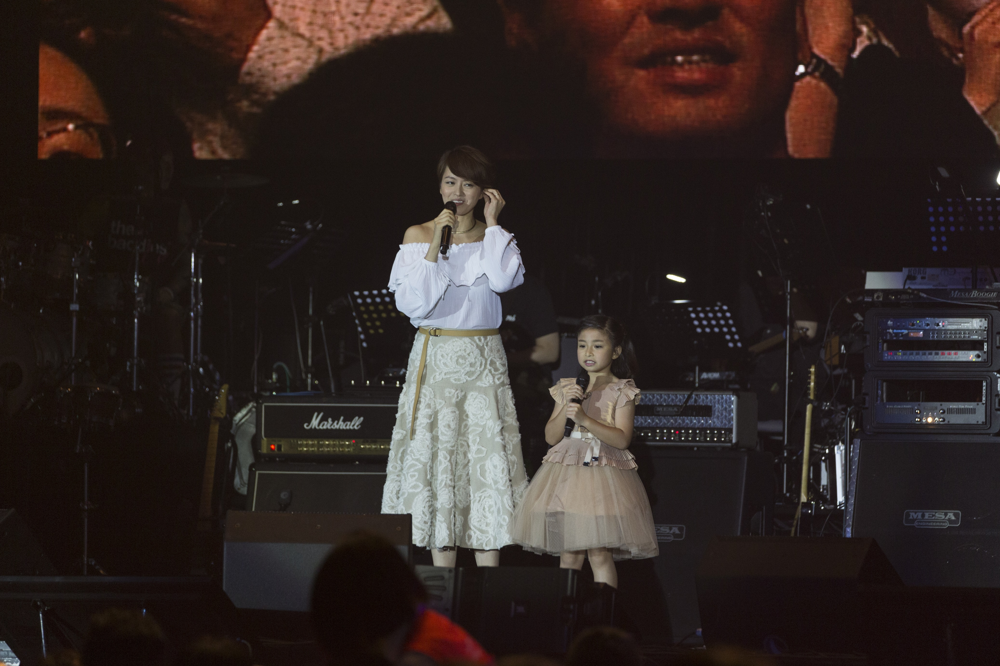
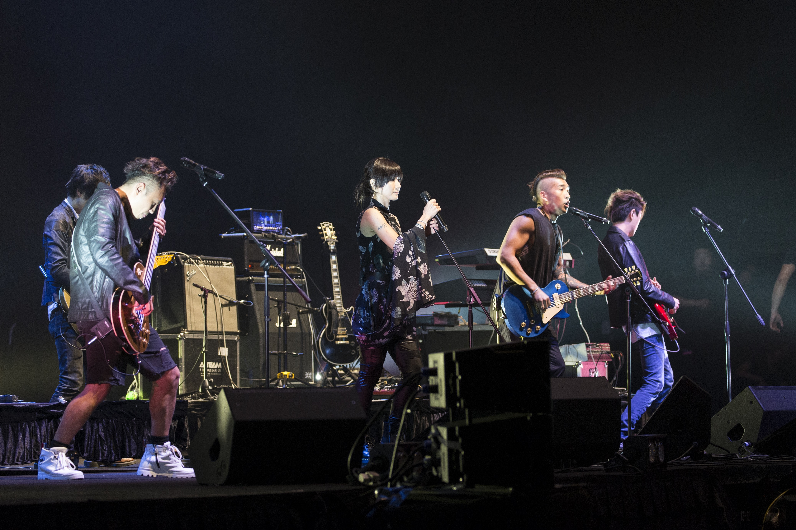

*太極登場時現場High爆，與世榮齊高歌。（黃國立攝）*

由葉世榮發起的《家駒....愛心延續慈善演唱會》昨日在灣仔會展舉行， 演出歌手包括黃貫中（Paul）、草蜢、太極、鄧紫棋（G.E.M）及梁詠琪等，其中太極在台上演唱《大地》和《Amani》，令全場氣溫急升，觀眾High爆站立大合唱。

緊接世榮和Paul登場唱出《我是憤怒》、《金屬狂人》、《再見理想》、《光輝歲月》和《海闊天空》，其後大會顯示出黑白的家駒照片，世榮發動全場講：「家駒，生日快樂！」並播放《延續》MV圓滿結束。

*舊隊友劉志遠（右）都有助陣！（黃國立攝）*

世榮：好多畫面飄過好刺激

完場後世榮、黃貫中及舊隊友劉志遠在後台接受訪問，世榮指在台上相當感觸，並謂：「有好多畫面飄過，仲好刺激同興奮。」被記者問及夠唔夠喉，世榮話：「唔夠喉，真係唔夠。」當提到另一成員家強沒有參與時，世榮指「希望出年他可以參與。」Paul則表示：「世榮一打比我，我有期就即刻做，因為是好事，可以籌到款。」兩人更表示一直都有合作，只是沒有向傳媒透露。

*梁詠琪和Celine 妹妹唱《真的愛你》。（黃國立攝）*

Gigi讀書夾Band唱Beyond

梁詠琪（Gigi）是晚唱出《冷雨夜》，並和Celine妹妹演唱《真的愛你》,GiGi 認為Beyond的精神至今仍有很多人追隨，非常難得，並指：「家駒聲音很特別，因為讀書時都有夾Band，Beyond的歌曲都好正面，我們夾Band都成日揀。 」被問及與Celine合作有何感受時，Gigi笑稱：「可能做了阿媽，同小妹妹唱歌時都想特別照顧她。」

*鄧紫棋唱出《情人》和《喜歡你》。 （黃國立攝）*

鄧紫棋：初戀用《情人》說分手

鄧紫棋在演唱會分別唱出《情人》和《喜歡你》，她在訪問時表示這兩首歌曲對她人生和音樂道路影響較大。「《情人》這首歌是初戀男朋友用來和我分手的歌曲，所以特別深刻；而《喜歡你》就是在我是歌手中翻唱，後來在世界各地的朋友，每次我演出都會全場大合唱。」今年暑假即將25歲的鄧紫棋，透露將會推出寫真集，是對其青春的記錄，並謂：「是有音樂的寫真集。」

*草蜢勁歌熱舞會粉絲。（黃國立攝）*

*Kolor與盧巧音都有份獻唱。（黃國立攝）*

*完場前世榮率觀眾大叫：家駒，生日快樂！（黃國立攝）*

*已故家駒的愛同精神希望大家可以延續落去。（黃國立攝）*
