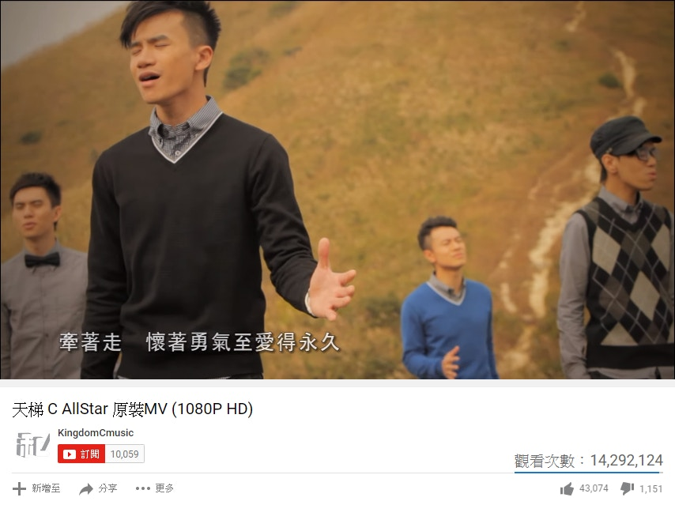
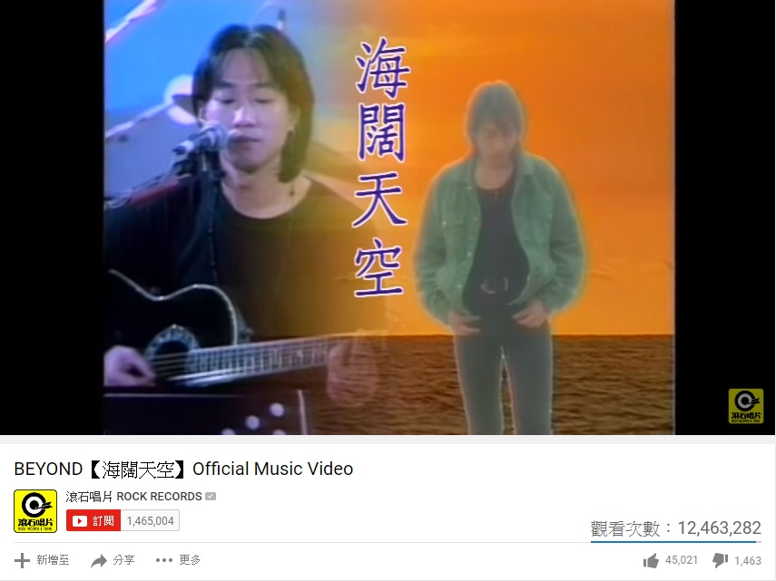
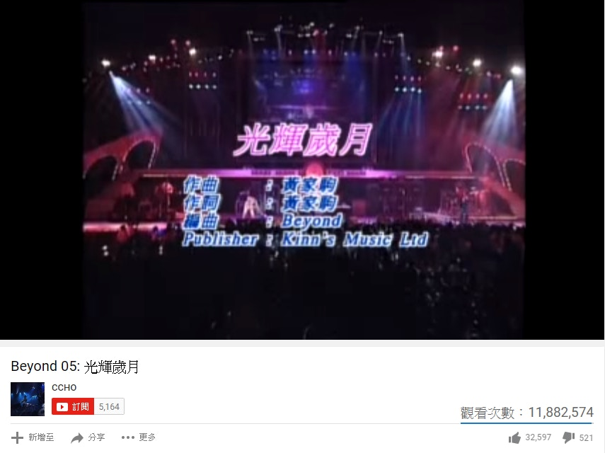
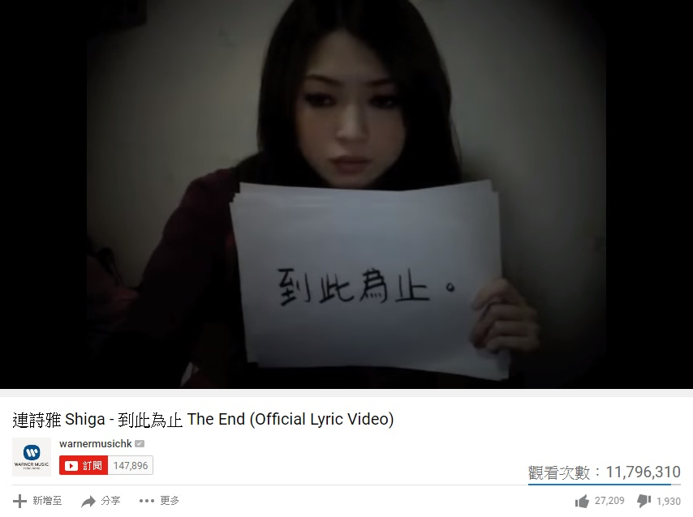
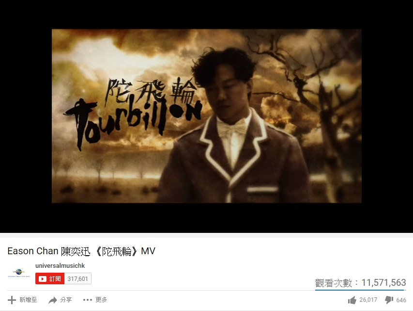

import YouTube from '@/components/patterns/YouTube.astro';

雖然有說廣東歌的襟聽指數已大不如前，但其實仍有不少樂迷忠於本土，對廣東歌不離不棄。你睇林海峰在其Talk Show是但唱廣東歌都氹得觀眾拍爛手掌，就知道廣東歌未死！所以《香港01》特別為大家精選出YouTube十大最受歡迎廣東歌排行榜，睇下當中你又聽過幾多首？（點撃率截至7月11日16:00）

第一位：鄧紫棋《喜歡你》

*第一位：鄧紫棋《喜歡你》（YouTube截圖）*

1988年推出的《喜歡你》是Beyond代表作之一，由樂隊靈魂人物黃家駒作曲及填詞。《喜歡你》在26年後經由歌手鄧紫棋（G.E.M.）發揚光大，幾乎每次北上參賽都必唱此歌。多得G.E.M.的全新演繹，令內地樂迷翻牆都要聽這首改編版，成功以逾2,800萬點撃率大比數拋離並雄霸榜首。

第二位：C AllStar《天梯》

*第二位：C AllStar《天梯》（YouTube截圖）*

《天梯》取材自重慶一對夫婦的愛情故事，劉國江與徐朝清是典型「相愛不能愛」的例子，為避開閒言閒語，二人私奔至高山深居簡出。而劉國江為方便太太出入，花了50多年時間親手鑿出6,000級的「愛情天梯」。《天梯》背後的故事令人反思現今的即食愛情，而歌曲MV亦表達出不同性取向的愛情，因此以1,400萬點撃高據第二位。

<YouTube id="eBvarz3DY00" />

第三位：Dear Jane《不許你注定一人》

*第三位：Dear Jane《不許你注定一人》（YouTube截圖）*

由Dear Jane包辦曲詞的《不許你注定一人》，歌詞講述希望與愛人一生一世的承諾，成為港男港女的示愛首選。旋律易記加上感人的MV內容，輕易成為第三位。

<YouTube id="UppBiK8xpeg" />

第四位：Beyond《海闊天空》

*第四位：Beyond《海闊天空》（YouTube截圖）*

殿堂級樂隊Beyond的經典歌曲《海闊天空》在1993年由黃家駒創作，兼任作曲、填詞及主唱的家駒，在完成此曲後不足2個月便意外身亡，令此曲成為其絕響。即使是23年後的今天，《海闊天空》依然在香港人心目中佔一重要席位。

<YouTube id="qu_FSptjRic" />

第五位：Beyond《光輝歲月》

*第五位：Beyond《光輝歲月》（YouTube截圖）*

Beyond的歌曲大多具有深層意義，在1991年推出的《光輝歲月》就為紀念前南非總統曼德拉（Mandela）而作，曼德拉早年致力推動反種族隔離運動，歌曲表達對他的敬意。

<YouTube id="PwSQQoWqeBs" />

第六位：連詩雅《到此為止》

*第六位：連詩雅《到此為止》（YouTube截圖）*

一封連詩雅（Shiga）寫給前男友的信，配上師兄周柏豪的曲、林若寧的詞，便創作成這首唱到街知巷聞的《到此為止》。Shiga雖然不諳中文，卻堅持自己撰寫MV中的每句歌詞，即使要花上3小時亦在所不計，因為她希望親手寫出自己的故事。在MV中逐張展示歌詞的Shiga，在拍攝時想起舊情更一度眼濕濕。

<YouTube id="TmpFlFN-EOA" />

第七位：陳奕迅《陀飛輪》

*第七位：陳奕迅《陀飛輪》（YouTube截圖）*

由填詞人黃偉文（Wyman）為陳奕迅（Eason）度身訂造的《陀飛輪》是「男人四部曲」之一，前作有《人車誌》、《葡萄成熟時》及《沙龍》。繼美酒、跑車、相機後，Wyman從名錶角度出發，表達金錢買不到珍貴回憶的感慨，引發網民的共鳴。

<YouTube id="URUIcYDq3_I" />

第八位：林奕匡《高山低谷》

*第八位：林奕匡《高山低谷》（YouTube截圖）*

新上榜的《高山低谷》是林奕匡（Phil）的現實寫照，入行7年一直浮浮沉沉的Phil，終憑自己作曲、陳詠謙填詞的《高山低谷》登上事業高峰。

【林奕匡《高山低谷》MV破千萬點擊 加推國語版攻台灣】

<YouTube id="R2BUiErBRnY" />

有力破千萬點擊的黑馬之選

雖然暫時只有8首廣東歌在YouTube平台衝破一千萬page view，但已有不少歌曲排住隊爭奪第9位及第10位。其中以音樂鼓勵樂迷捉緊夢想、由Supper Moment唱作的《無盡》只差少於20萬點撃；而《到此為止》續集、講述Shiga如何克服情傷的《好好過》則尚欠約49萬，兩者應該有望今個月內衝擊千萬。

*《無盡》、《好好過》、《原來她不夠愛我》及《矛盾一生》即將錄得超過一千萬點撃率。（YouTube截圖）*

而不容忽視的黑馬有JW（王灝兒）的《矛盾一生》，《矛》在推出短短9個月已賺得超過830萬點撃，至於去年5月推出、吳業坤（坤哥）的《原來她不夠愛我》亦有逾870萬點撃。同樣在下月舉行首個演唱會的JW及坤哥，相信今年內就會擁有首支破千萬的個人作品，更分分鐘超越林奕匡成為史上最快突破千萬的廣東歌MV。
