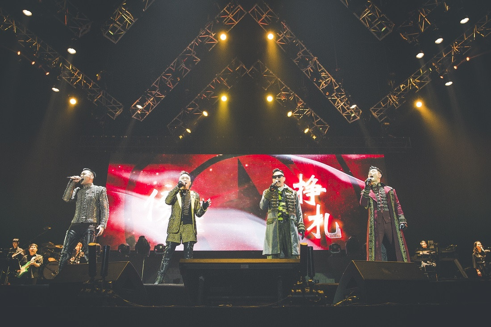
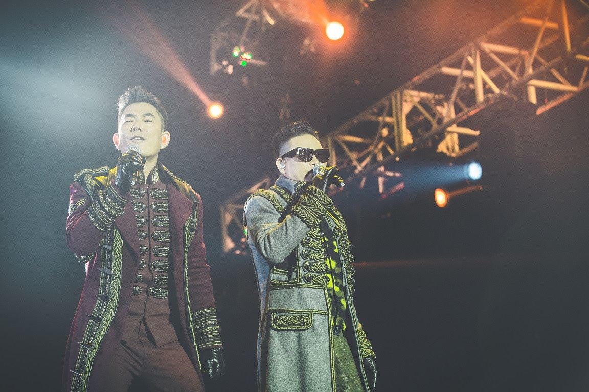
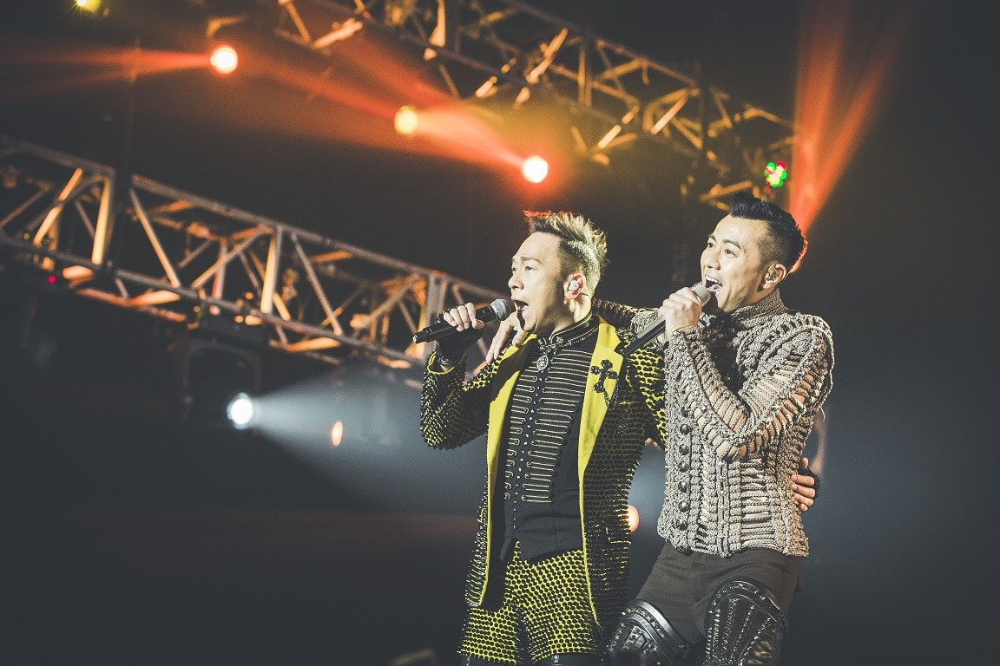

「男人幫」昨晚在澳門威尼斯人金光綜藝館開騷，4人大展歌喉。

由任賢齊、黃家強、蘇永康及梁漢文組成的「男人幫」昨晚在澳門威尼斯人金光綜藝館舉行《男人幫演唱會2016澳門站》，4人展現活力演出，並為觀眾帶來一系列新舊熱門歌曲。

完騷後，小齊透露︰「下站我們會到拉斯維加斯演唱，但大家都有各自的工作，希望可以於年尾夾到時間。」早前梁漢文幫「癌症基金會粉紅革命」拍攝了一輯宣傳相，梁漢文仲着住粉紅色芭蕾舞裙影相，小齊說：「我知梁漢文好想着粉紅色芭蕾舞裙上台演唱，可惜今次做不切條裙，(可打算下次4人演出一齊着？)是呀！依家訂造緊。」蘇永康就話：「如果用這種方式宣揚可以為婦女出一分力，非常好。不如叫家強着芭蕾裙彈Bass，可能宣傳效果仲好。」家強則話不介意。但梁漢文就話叫埋陳奕迅一齊着啦﹗蘇永康即話要問下陳奕迅答不答應。而講到陳奕迅(Eason)世界巡演唱了百幾場，賺了2億港元，成為吸金力強的歌手。問到4人可否羨慕？4人齊聲回應︰「不羨慕。」

小齊透露︰「下站我們會到拉斯維加斯演唱，但大家都有各自的工作，希望可以於年尾夾到時間。」

這四位歌手均已踏足樂壇超過20年，他們對彼此的熟識程度，令演唱會經常展現出不同火花。他們表示四人在與組合有關的決策上有同等的決定權，同時亦有着各自的分工：任賢齊負責音樂製作及整體統籌；黃家強負責作曲；蘇永康負責設計及品牌管理；而梁漢文則負責舞蹈編排。最後，「男人幫」更透露他們將一直繼續為大家帶來好的音樂作品。

梁漢文為「癌症基金會粉紅革命」出力，黃家強則話做善事不介意着裙演出。
