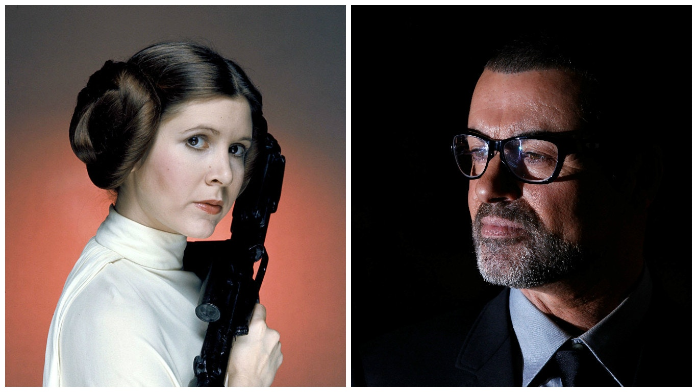
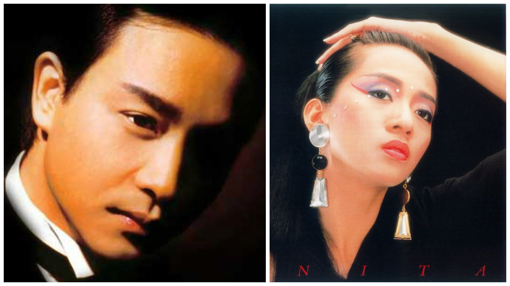

> 說到底，很多人心底裏所緬懷的，與其說是個別明星，不如說是他們代表着的那個逝去的世界，一個大眾媒體影響力處於高峰的世界。
李立峯

聖誕期間，兩位外國明星George Michael和Carrie Fisher接連逝世，在全球引發的反響雖然遠不及7年前過身的Michael Jackson，但也足以令互聯網世界在假期中添加了一點哀悼氣氛。

也許是近十幾年來同類型事件越見普及，不少研究普及文化的學者都有分析明星的逝世如何成為媒體事件，以及明星的死亡對粉絲以至大眾有甚麼意義和影響。只要在Google Scholar打上「celebrity death」，就會出現一大堆研究文章。

透過大眾媒體 與明星「做朋友」

研究這個題目的角度有很多，其中較傳統的一個視角，出發點在於我們絕大部份人都並不真正認識一眾明星，但又往往感到跟某些明星很接近，甚至心裏覺得對方是自己的朋友。傳播學者60年前就給予這個現象一個名字，叫擬社會關係（parasocial relationship）。這種擬社會關係，是由擬社會互動（parasocial interaction）產生的。早期研究電視文化的學者認為，電視節目裏明星的行為和說話方式，往往模擬着跟觀眾互動，安坐家中的觀眾會覺得明星跟自己直接說話，再加上「經常見面」，久而久之感到對方是自己認識的朋友。既然心裏感到跟對方像認識的朋友，一個明星過身，也可能像一位朋友過身一樣，觸發相關的情緒反應。有學者並指出，當一個人因為自己的偶像過身而感到傷心時，身邊的家人和朋友不一定理解，這會造成額外的困擾。

不過，強烈的情緒反應通常只會在依附（attachment）程度高的忠實支持者之間出現。張國榮和梅艷芳過身時，兩人的粉絲可能真的會感到很大的傷痛。但對大部份香港人來說，George Michael和Carrie Fisher的重要性沒有那麼大吧。所以他們逝世的新聞造成的反應，應該要從另外一些角度了解，例如社會記憶。

名人逝世 令人懷緬過去的美好

除了像當年Beyond黃家駒等少數例子外，大部份明星過身時，距離他們最當紅的時候都已經有一段很長的日子。George Michael算是早逝，但距離Wham!拆夥都已經30年。所以，很多時候被明星逝世勾起的記憶，都是一些年代久遠的個人記憶。例如George Michael讓我想起的，是初中時期開始對歐美流行文化有點初步概念的自己。當年我沒有特別喜愛的流行歌手或電影明星，但班上有位同學很喜歡Wham!，而Wham!、Air Supply和Phil Collins，大概就是我最早認識的歐美樂壇巨星。中學時跟同學唱K，也真的有人會點《Last Christmas》。

這些個人回憶也是社會記憶，因為同年代的人多多少少有共同經歷，而且個人記憶背後其實有着社會框架。說到底，很多人心底裡所緬懷的，與其說是個別明星，不如說是他們代表着的那個逝去的世界，一個大眾媒體影響力處於高峰的世界。大家靠着電視接觸香港以至全世界的流行文化資訊。在沒有互聯網的時代，又不可能常常進電影院，多少經典的和當代的西片，很多香港人都是通過「明珠930」看的。聽外國流行曲，主要也是看周末電視音樂節目裏的MV。電視製造了人們心目中「真正的巨星」，因為世代偏見也好，因為媒體環境轉變也好，大家覺得後來的都不成氣候。

黃金時代過去 明星逝世陸續有來

有說這種明星逝世的事件將陸續有來，這有一定道理。就像一個人的生命中，會有十年八載經常出席朋友的婚宴，後來又會有十年八載開始要出席上一輩親人的白事。對香港以至全世界來說，70年代尾至90年代初，既是電視的黃金時代，也應該是歐美普及文化全球化的黃金時代，而那個年代出現的天皇巨星，現在也紛紛步入晚年。

我以前在學術會議中發表過一篇論文，說我們身處的是個「後大眾傳播」時代。一方面，大眾傳播機構的影響力大不如前。另一方面，大眾傳播的黃金時代給社會製造的共同文化資源，仍然有一定的影響力，就像今天的網絡惡搞，不少仍然以周星馳電影的對白為基礎。但「後大眾傳播」時代也會過去，巨星們的相繼殞落，也象徵著這個過程。
