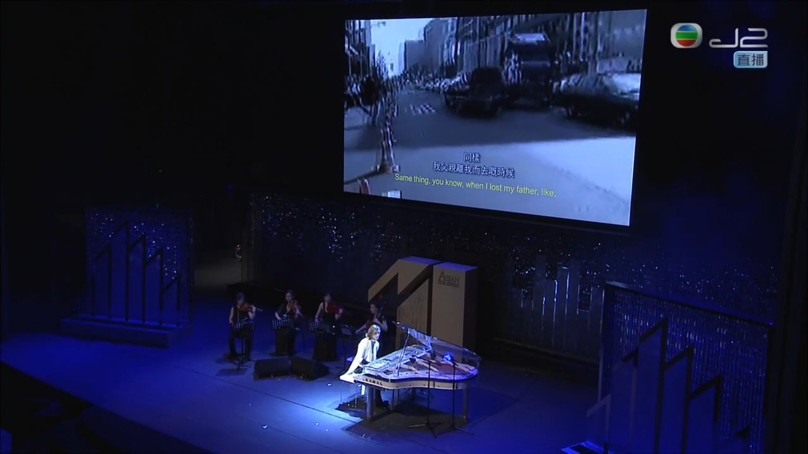
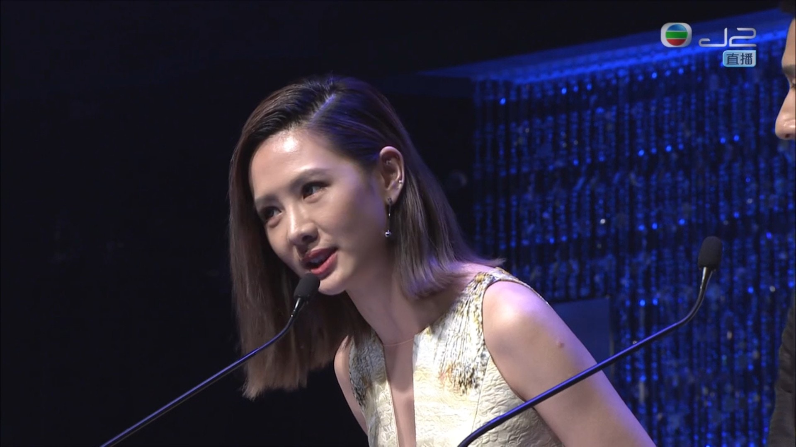
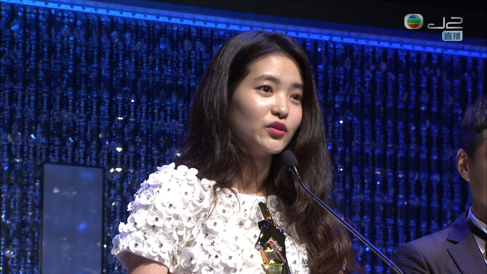

今年重回香港舉行的「亞洲電影大獎」於尖沙嘴文化中心展開，由日本組合X JAPAN隊長YOSHIKI打響頭炮作為開幕表演嘉賓，而且他頗有創意，一上台第一首彈奏的歌曲竟是Beyond的《海闊天空》。

X JAPAN隊長YOSHIKI開場彈奏一曲《海闊天空》。（電視截圖）

安心亞說找她做主持人很X，但說了後才驚覺這是香港粗口，但已在電視直播了出街。（電視截圖）

而第一個獎項「最佳新演員」獲獎者是《下女誘罪》的韓國女星金泰璃，她得獎時表示：「有很多人不認識我，因為我還是新人，不過得獎不是我一個人的功勞，感謝導演及團隊支持令我有機會得到這個獎，也多謝編劇寫了這麼好的劇本，我會繼續努力。」雖然今次已經是她第八次憑電影獲獎，但在台上拿獎時心情仍然「騰騰震」。她在後台表示可以在各個頒獎禮上出場已好滿足，她笑言，「可以獲獎可能是大家俾面朴贊郁導演，我只是叨光。」而她回到韓國後將接拍兩部電影，「現在還是努力準備中，以更好的面孔去見大家。」

《下女誘罪》韓國新女星金泰璃擊敗胡子彤等贏得最佳新演員。（電視截圖）
