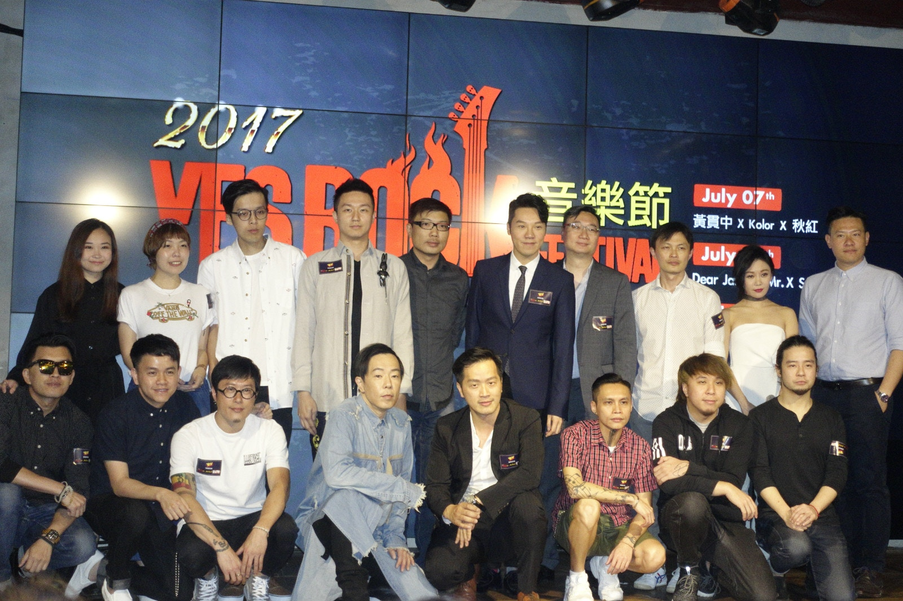
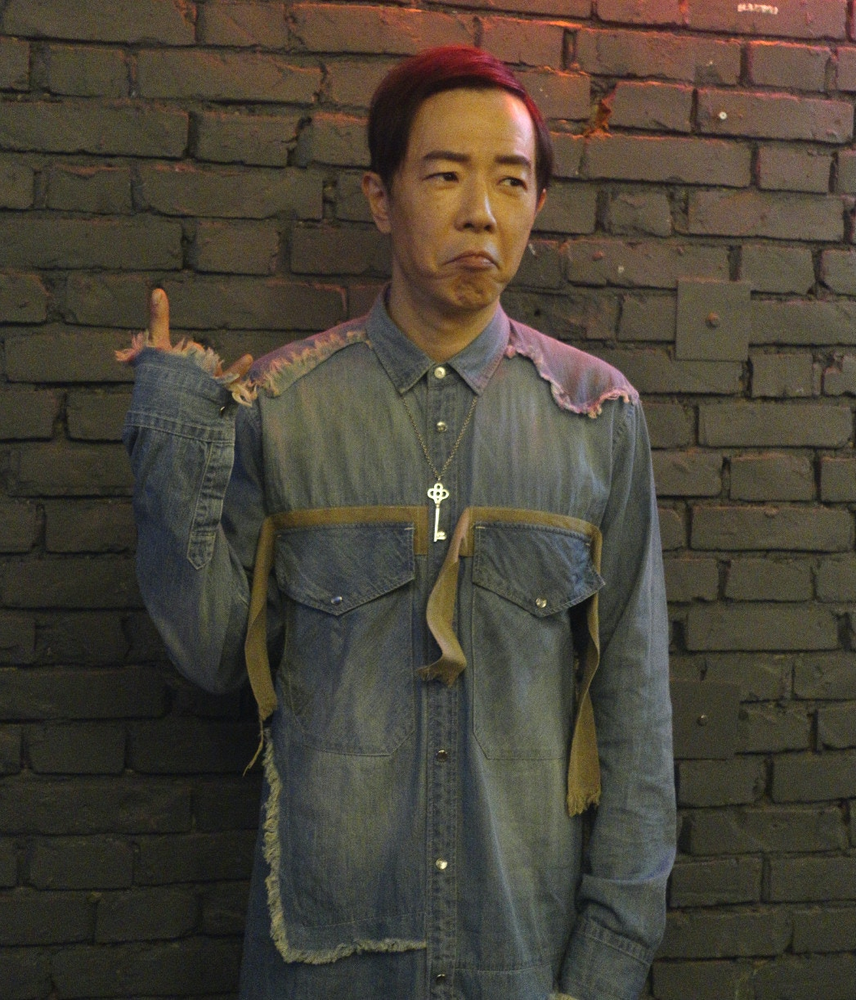

黃貫中（Paul）、胡琳以及獨立樂隊秋紅今晚於銅鑼灣出席《2017 Yes Rock 音樂節》發佈會，Paul宣佈七月將聯同Kolor、Dear Jane、Supper Moment及Mr.於九展大玩搖滾Crossover音樂會，Paul表示仍未計畫帶甚麼驚喜給樂迷。

*黃貫中、胡琳以及獨立樂隊秋紅今日出席將於7月份《2017 Yes Rock音樂節》發佈會。(溫菁莉攝)*

*問到黃貫中會否希望女兒做歌手，他表示做父母無話期望她將來做甚麼職業，只求女兒開心成長。(溫菁莉攝)*

提到黃貫中去年曾於同一個場地舉行音樂會，他指希望到時可以將當時的熱情帶回來給大家。至於在音樂會上會否獻唱Beyond的歌曲時，Paul笑言到時睇大家嘅表現，「我相信如果唔唱，大家都唔會放過我，其實之前都有好多歌手翻唱過，如果今次可以與其他音樂單位合作一齊玩，效果應該都好好。」其後提到女兒黃鶯有無遺傳自己的音樂天賦時，Paul則大爆今日早上的趣事，「佢早上叫我起身的時候都好rock，因為佢用聖經黎拍我的頭，我之後有同佢講其實可以輕力少少，但拍我個下真係幾rock。」

*胡琳透露接下來推出的專輯講翻唱Beyond的歌曲《冷雨夜》。(溫菁莉攝)*

而同場的胡琳亦是今次音樂會的唯一女歌手，她坦言自己一向的音樂風格都與搖滾都無太大關係，「其實今次參加這個音樂會對我還是樂迷來說算不算是一個驚喜，我以往的音樂風格偏向流行爵士音樂，雖然以前都試過玩pop rock，但未算徹底。睇返今次的演出單位好hardcore，所以我到時一定會去到最盡，講心中個團火拎出黎。」
