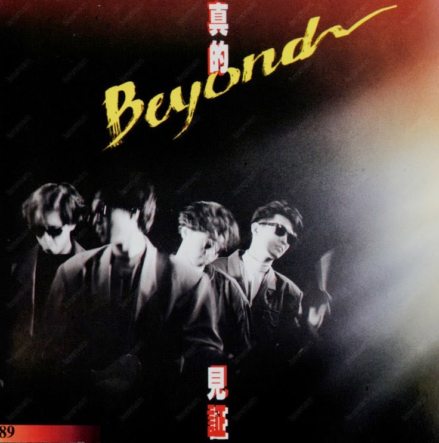
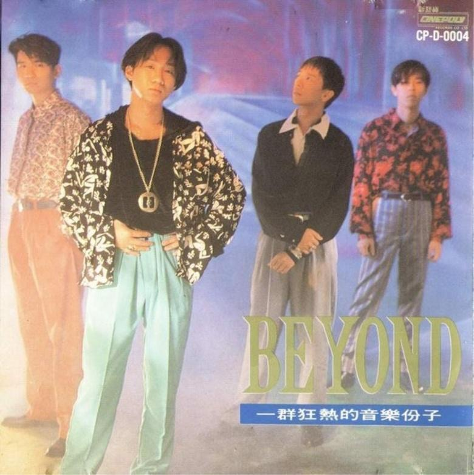
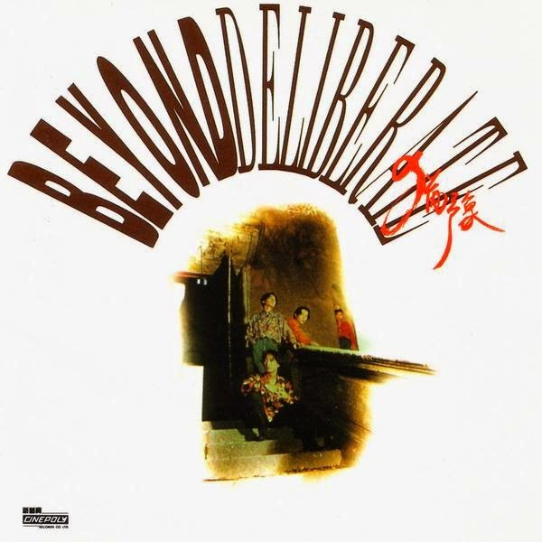
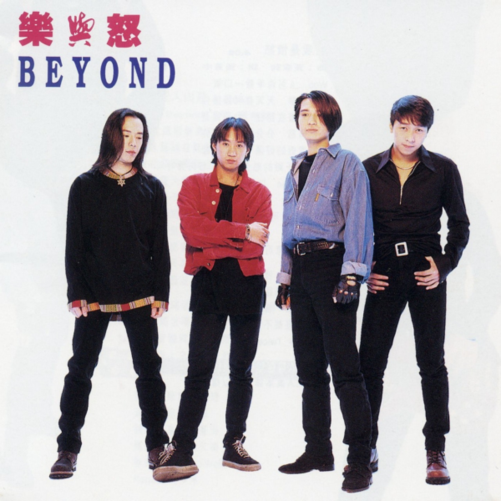
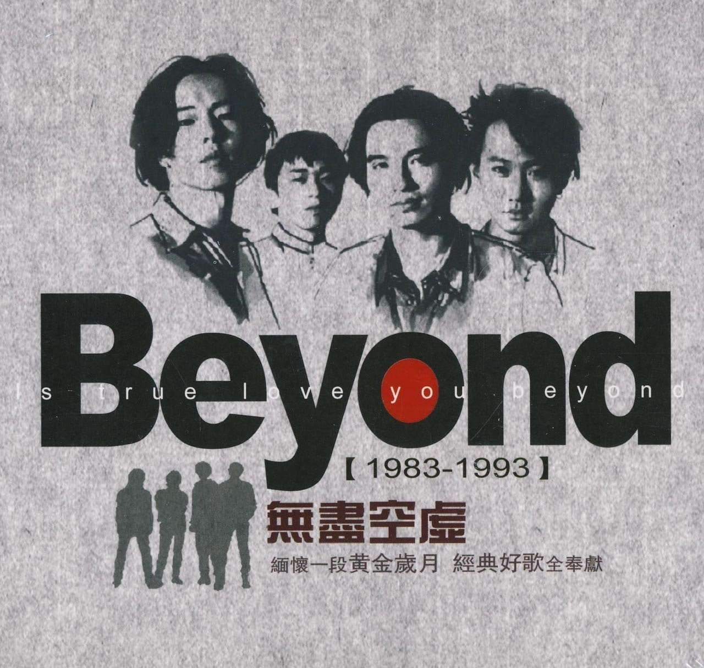

*《真的愛你》收錄於1989年推出的《BeyondIV》中。*

年長的朋友或樂迷當然對Beyond的故事有深厚認識，但對於一般80後和90後來說，Beyond明明就是搖滾隊伍，又為何會推出像《真的愛你》的溫馨小品？原來都是被商業市場所迫的，主要原因是Beyond要將樂隊大眾化，而歌曲與The Beatles的名作《Let it be》有關。

網上不難發現，網民對《真的愛你》和《Let it be》的相似度而辯論過的痕跡，有人認為確實相似，又有人認為不應太敏感。與其說抄襲，倒不與說是受《Let it be》啟發，《香港01》就事件向時任新藝寶總經理陳少寶求證過，據少寶所言，《真的愛你》是繼《秘密警察》專輯大賣後，Beyond乘勝追擊而創作的作品。他憶述，Beyond明白到要樂隊流行發揮影響力，便要將歌曲商業化，適逢母親節將至，於是想到以母親為題，創作《真的愛你》。

少寶補充，當時家駒親自致電，表示自己參考了The Beatles受歡迎的原因，深明要大眾化就要譜上簡單易記的旋律，有見《Let it be》如此成功，他又深愛這首歌曲，於是照辦煮碗，依據《Let it be》某幾個Chord(和弦)而衍生出《真的愛你》。少寶又指歌頌母愛的概念不是公司提出，反是家駒自行想起。不過少寶承認，要「食」母親節主題，要求家駒將作品趕工創作準時推出。至於歌曲為何不是家駒自行填詞，而改給小美負責，陳少寶則表示「已記不起了」。

> 歌曲在專輯印上的名字原是《真的愛妳》，但網絡泛寫成《真的愛你》，不論是「妳」或是「你」，都可以找到歌曲。

《真的愛你》較為特別的地方，除了是Beyond少有的歌頌母愛作品外，就是四位成員都有份唱。結果《真的愛你》非常入屋，成為Beyond 首支三台冠軍歌，奪得十大勁歌金曲和十大中文金曲等獎項，更令他們成為偶像樂隊，甚至被杜琪峯邀請他們參與電影《吉星拱照》演出。

當然，歌曲的起源有第二個版本，香港電台節目《不死傳奇》曾找來家駒姐姐黃小瓊訪問，她表示曾與家駒討論過《真的愛你》：「我有話過他一次，『你又話你的歌很另類的？這首歌琅琅上口的。』，他解釋因為母親節將至，是唱片公司要求的。」

不論是唱片公司要求，或是家駒顧及市場而自行創作，唯一肯定的是《真的愛你》並非四子熱愛的作品。Beyond曾經表示，最不喜歡的作品就是《真的愛你》，畢竟是因應市場而創作的商業歌，與他們風格截而不同。

*Beyond加盟新藝寶後的首張專輯《秘密警察》(1988年)。*

*Beyond在新藝寶的第二張專輯，屬有唱片公司以來第四張碟《Beyond IV》(1989)。*

*Beyond第五張專輯《真的見證》(1989)。*

*Beyond首張國語專輯《大地》(1990)。*

*Beyond於新藝寶最後一張專輯《猶豫》(1991)。*

*轉投華納的專輯《樂與怒》(1993年)。*

