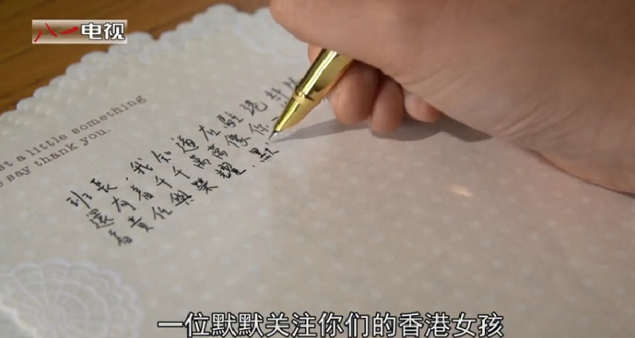
黃逸晴在片中稱今年6月向駐港解放軍撰「情書」。（短片截圖）

短片長近6分鐘，頭尾以Beyond情歌、女唱版《喜歡你》作背景音樂，由中大畢業生黃逸晴分享大學生「軍事生活體驗營」的經驗。短片開端及結尾，她以廣東話朗讀出今年6月，向駐港部隊撰寫的一封「情書」。

> 如果不是你們，我也許還像個什麼都不會，什麼都不知道的小孩一樣，不懂得什麼是堅守，什麼是軍人風範。
黃逸晴

> 你們教會我們堅毅，不放棄、不低頭，我知道駐港部隊還有着千千萬萬秉承着責任與榮耀，默默守護住香港的中國軍人。
我寫這封信是想跟你們說一句：你們辛苦了，我愛你們！
黃逸晴

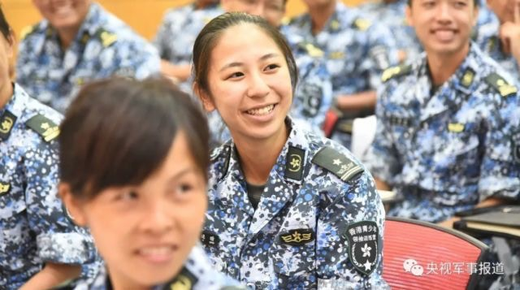
黃逸晴曾參加青少年軍活動。（短片截圖）

片中市民雨天撐傘為解放軍遮雨

她形容自己是「一位默默關注你們的香港女孩」，又感謝他們令她見識何為「堅守」與「軍人風範」，否則她只會仍是一個「什麼都不知道的小孩一樣」。她又告白道：「他們辛苦了，我愛你們。」

鏡頭一轉，就來到位於九龍灣的香港青少年軍總會會址，她以普通話介紹場地，又分享自己參與體驗營的難忘經歷。片中亦有不少解放軍親民一面，如探訪老人家，有市民不忍解放軍在下雨天站崗而為他們撐傘等等。

「把這面國旗帶著你自己的感情」

她在片中對解放軍的情感溢於言表，多番在片中強調感到愛的感覺，又稱對作為升旗手感驕傲及自豪，「把這面國旗帶著你自己的感情。」她表示，希望通過青少年軍總會，令更多人認識祖國，明白內地同胞與駐港部隊一樣，「其實也是很愛護我們」，不會感覺陌生，「就像一個家」，沒有距離感。

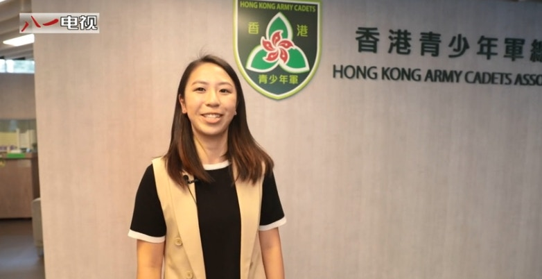
黃逸晴自稱為青少年軍總會的「小教官」。（短片截圖）

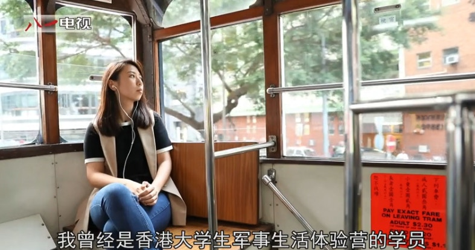
黃逸晴在片中坐電車，以廣東詰讀出向駐港解放軍的情書。（短片截圖）

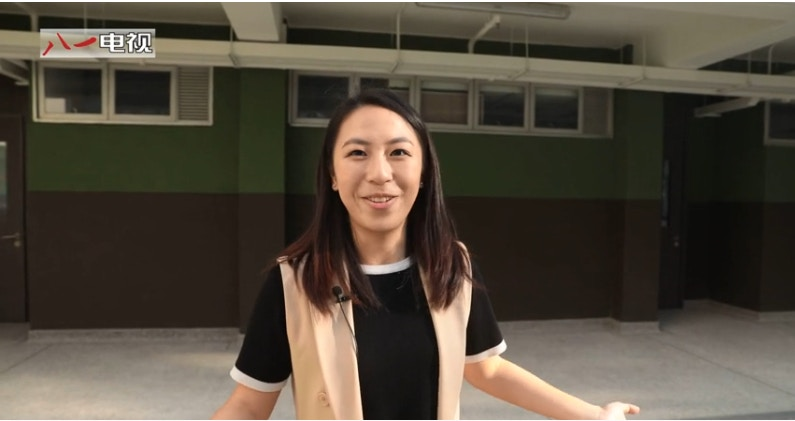
黃逸晴以香港青少年軍總會的教官身份，介紹總會場地。（短片截圖）

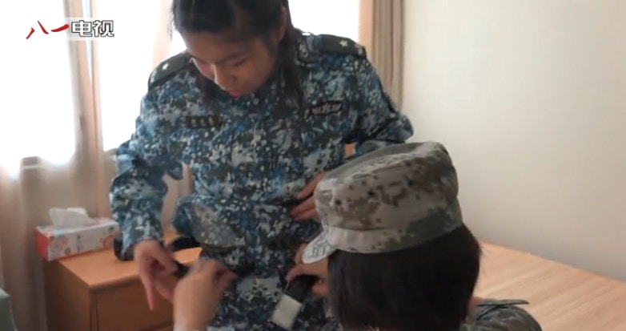
片中不乏解放軍親切一面，有耐性地為參與體驗營的學員整理服裝。（短片截圖）

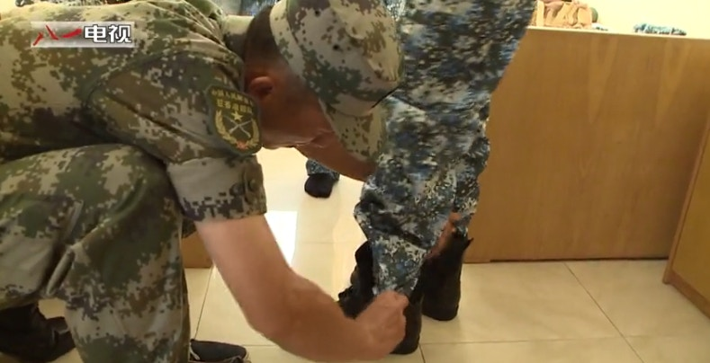
片中不乏解放軍親切一面，有耐性地為參與體驗營的學員整理服裝。（短片截圖）

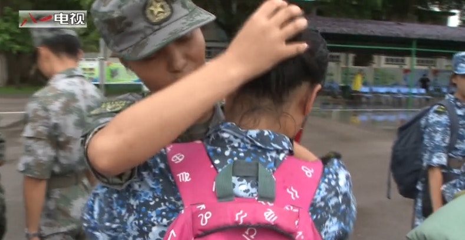
當體驗營完結後，解放軍與學員都表現得依依不捨。（短片截圖）

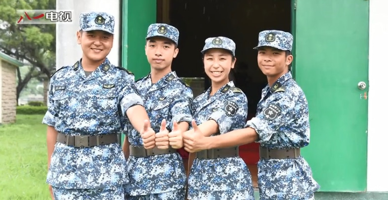
黃逸晴（右二）與一班解放軍的合照。（短片截圖）

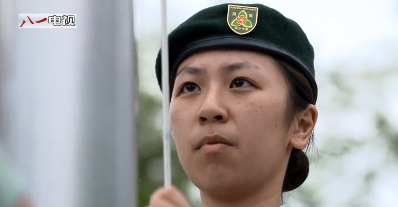
升旗是解放軍其中一項工作。（短片截圖）

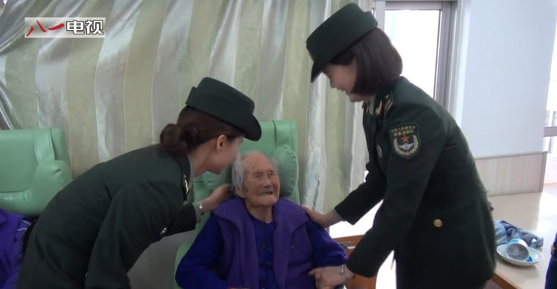
短片大力推銷解放軍親民一面，如探訪老人家。（短片截圖）

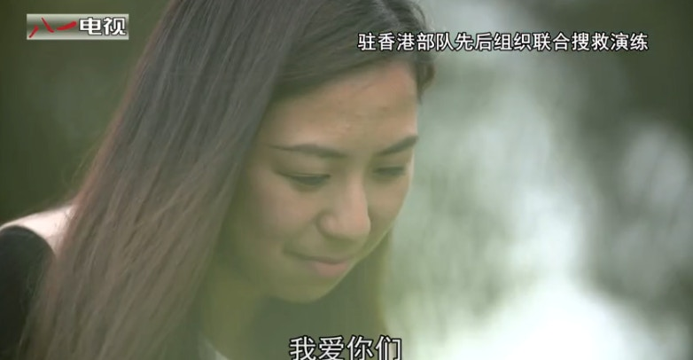
黃逸晴對解放軍的情感溢於言表，稱「我愛你們。」（短片截圖）
