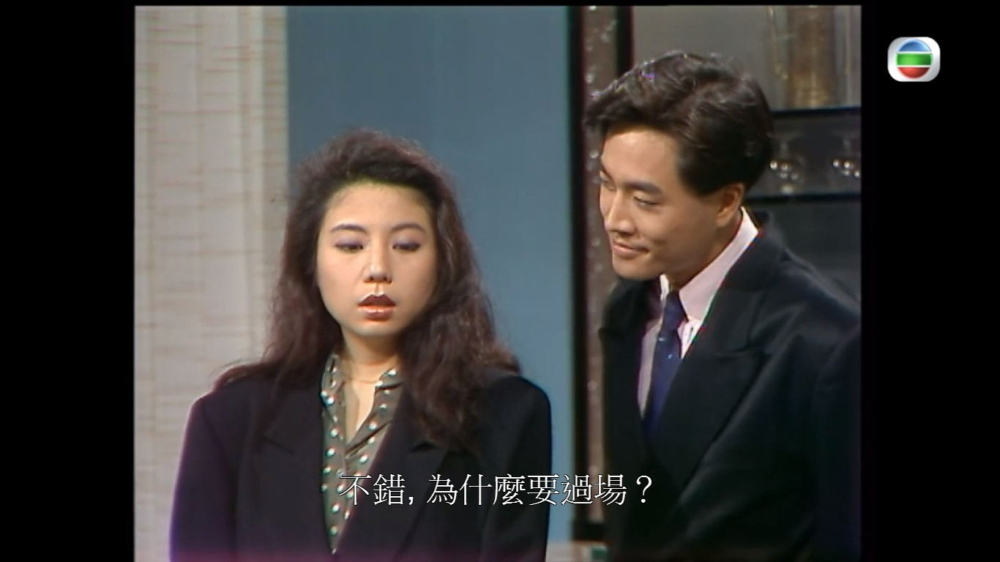
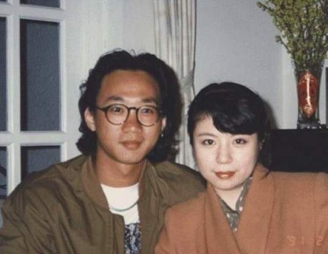
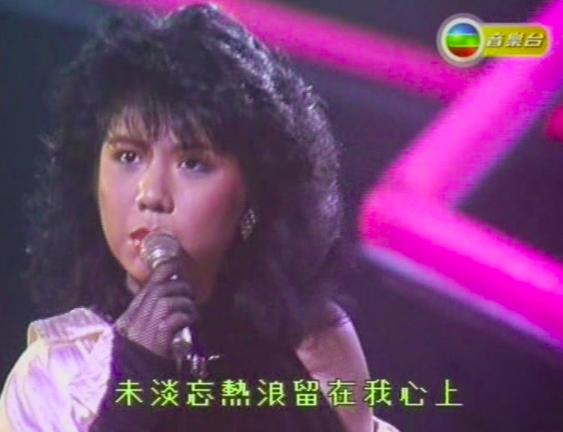
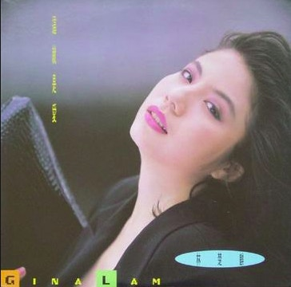

*無綫深宵重播《我本善良》，林楚麒飾演陳庭威未來女友。（網上截圖）*

林楚麒在1985年參加華星第4屆新季大賽奪得季軍出道，被譽為「翻版鍾楚紅」，曾推出唱片《這就是愛》，但在樂壇發展卻不如意。在無綫拍劇亦只得兩齣劇集，分別在處境劇《城市故事》飾演Ivy及《我本善良》中飾演蘇敏。她亦曾拍攝電影《驚魂今晚夜》、《血裸祭》及《大男人小傳》。

*林楚麒曾被指借跟家駒過去式的關係抽水。（網上圖片）*

相關文章：

【我本善良】蘇敏除衫誘惑家榮 林楚麒TVB最後一劇

【我本善良】定邦蘇靜無好結果 羅樂林陳寶儀現實曾經係夫妻

*林楚麒參加第4屆華星新秀大賽贏得季軍出道。（網上截圖）*

不過林楚麒雖然在圈中人氣一般，卻因為跟已故Beyond主音黃家駒曾經拍拖，在93年家駒意外身亡時，她突然自稱未亡人出席喪禮，被家強及Beyond粉絲斥責抽水，但之後人間蒸發。至2010年復出，再次重提跟家駒的舊事，掀起了一輪罵戰，想不到現時在《我本善良》中，竟然會見到她的演出。

*林楚麒在華星時期出過唱片《這就是愛》，但發展不如理想。（網上圖片）*
