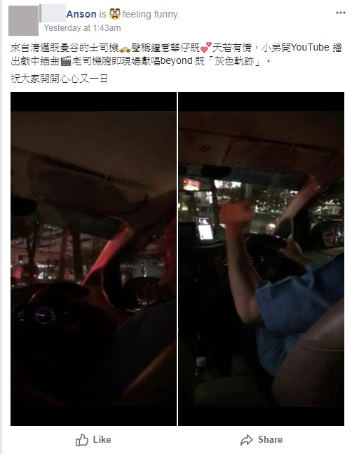
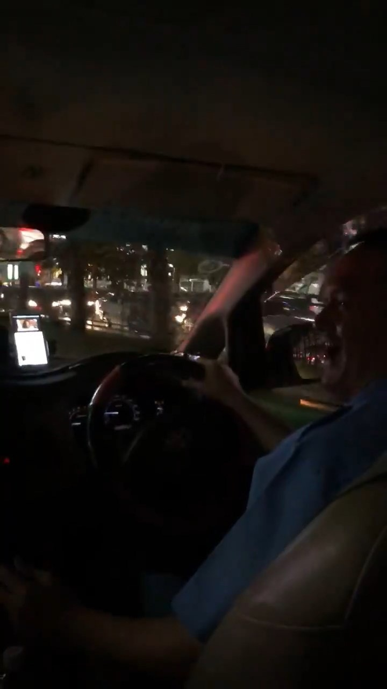
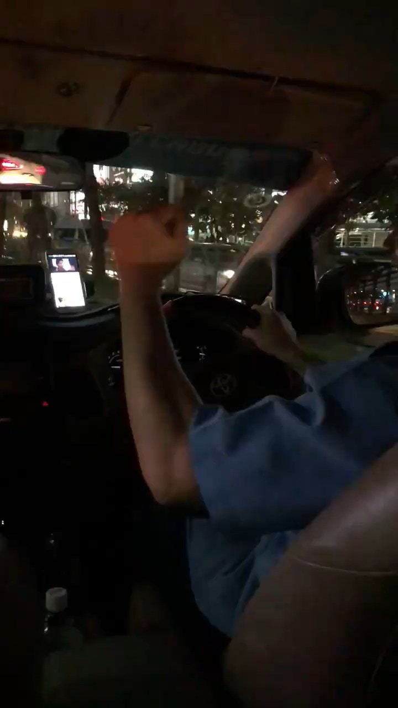
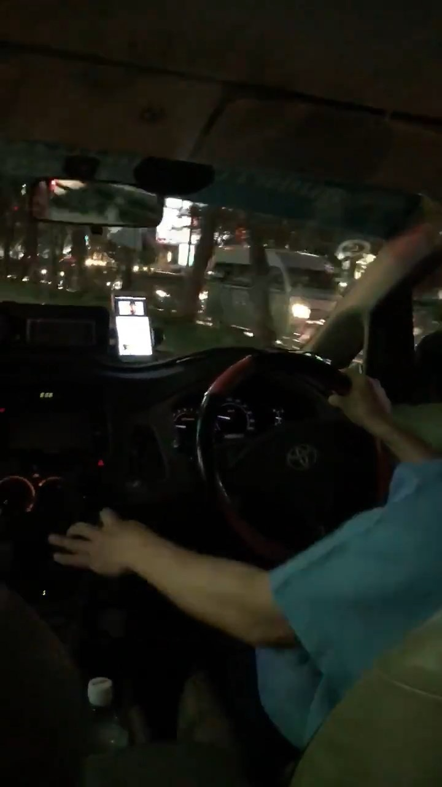
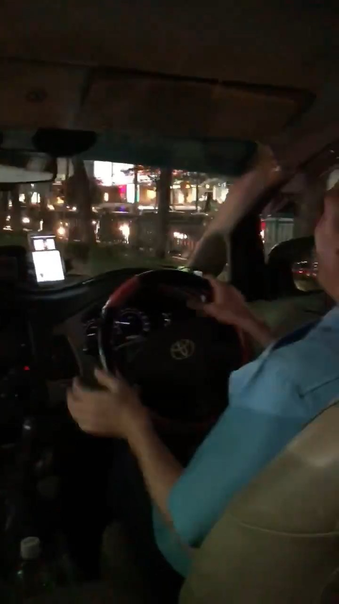
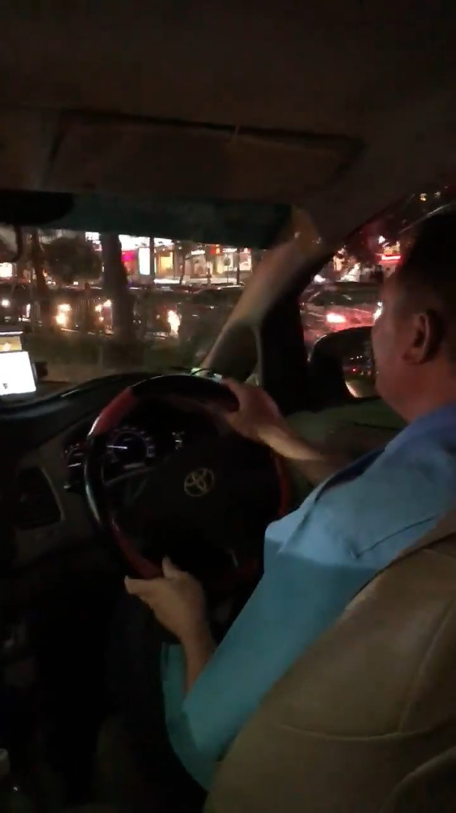
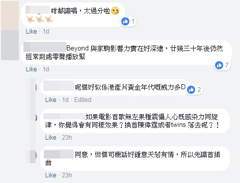
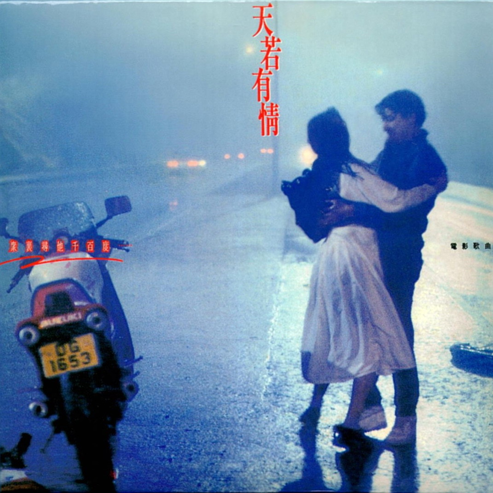
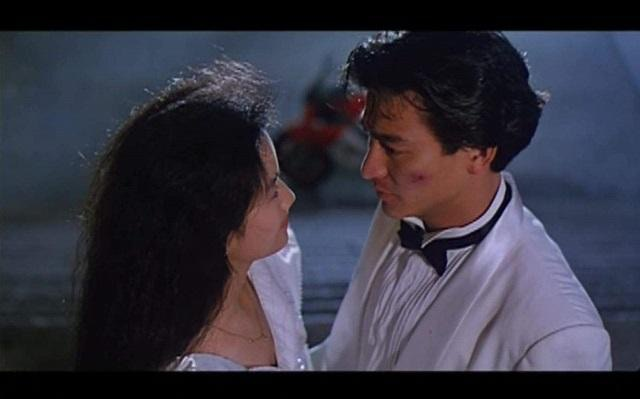

泰國曼谷的士司機唱出《天若有情》中的《灰色軌跡》。（巴打絲打Facebook Club fb截圖）

曼谷老司機在的士車廂內即場獻唱Beyond的《灰色軌跡》。（「巴打絲打Facebook Club」影片截圖）

曼谷老司機在的士車廂內即場獻唱Beyond的《灰色軌跡》。（「巴打絲打Facebook Club」影片截圖）

曼谷老司機在的士車廂內即場獻唱Beyond的《灰色軌跡》。（「巴打絲打Facebook Club」影片截圖）

曼谷老司機在的士車廂內即場獻唱Beyond的《灰色軌跡》。（「巴打絲打Facebook Club」影片截圖）

曼谷老司機在的士車廂內即場獻唱Beyond的《灰色軌跡》。（「巴打絲打Facebook Club」影片截圖）

短片引起網民熱議，指廣東歌、港產片在外國仍有感染力。（「巴打絲打Facebook Club」影片截圖）

短片引起網民熱議，指廣東歌、港產片在外國仍有感染力。（「巴打絲打Facebook Club」影片截圖）

短片引起網民熱議，指廣東歌、港產片在外國仍有感染力。（「巴打絲打Facebook Club」影片截圖）

短片引起網民熱議，指廣東歌、港產片在外國仍有感染力。（「巴打絲打Facebook Club」影片截圖）

全國政協委員、武打影星成龍早前指再無中國電影和香港電影之分，「只有一種電影叫做中國電影了」，又認為部分香港電影人的作品只是拍給港人看，未能走向國際；另一邊廂，一名曼谷的士司機卻跟香港遊客大談到對港產電影的熱愛。

網民Anson昨日（9日）在「巴打絲打Facebook Club」表示，在泰國曼谷遇上一名來自清邁的曼谷的士司機，他稱愛看由劉德華主演的《天若有情》，當Anson在YouTube播出電影插曲，那名老司機二話不說即場獻唱Beyond的《灰色軌跡》，一首廣東歌隨即拉近了兩人的距離。

該名曼谷司機稱很喜歡劉德華與吳倩蓮主演的《天若有情》。（《天若有情》劇照）

1990年上映的《天若有情》由劉德華、吳倩蓮主演，多個經典場面深入觀眾心。（《天若有情》劇照）

1990年上映的《天若有情》由劉德華、吳倩蓮主演，多個經典場面深入觀眾心。（《天若有情》劇照）

1990年上映的《天若有情》由劉德華、吳倩蓮主演，多個經典場面深入觀眾心。（《天若有情》劇照）

帖文引起網民熱議，有人羨慕Anson的經歷，「好正！旅行遇到呢啲司機真係成個開心晒」，又指Beyond的歌很多外國人都識唱，影響深遠，「佢哋咬字唔正！但真係好有feel。」，亦指「証（證）明香港歌曲糸（係）出名的！」。另有網民稱，「呢個好似係港產片黃金年代嘅威力多啲」，因司機喜歡天若有情，所以才認識這首插曲。
