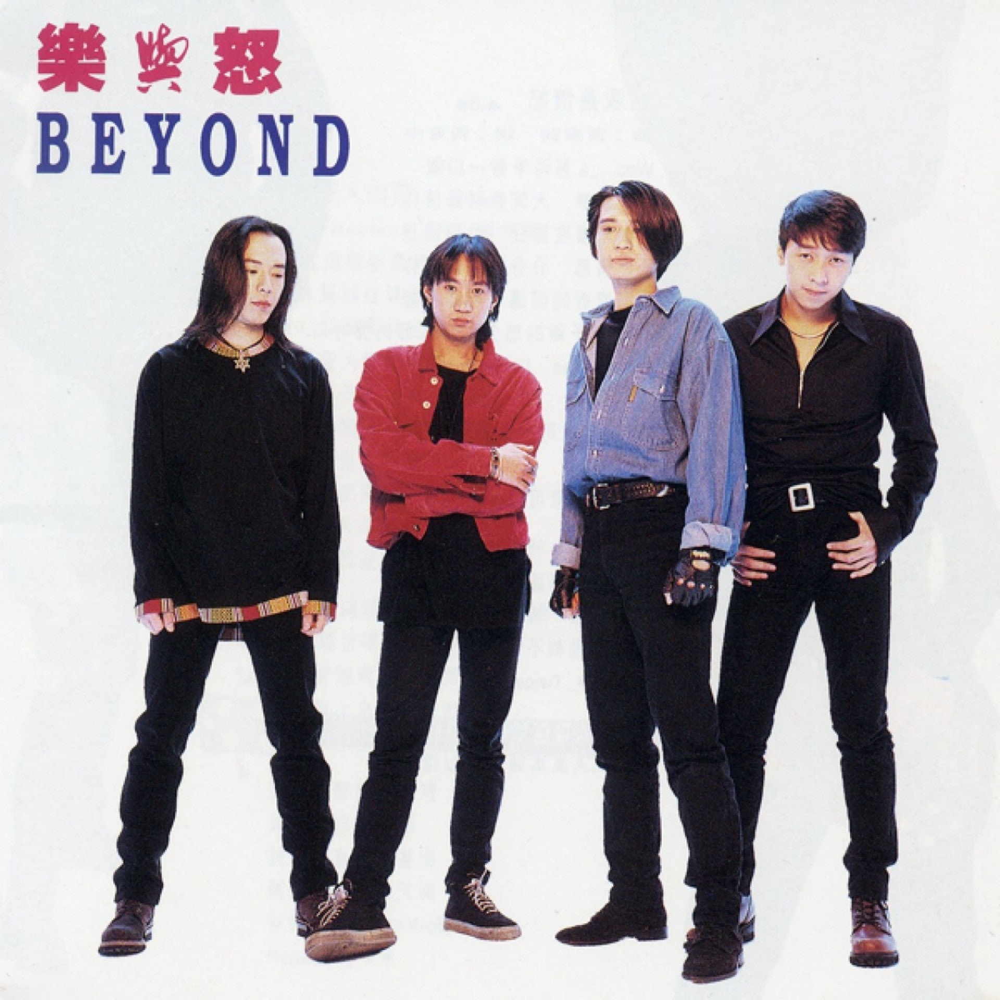
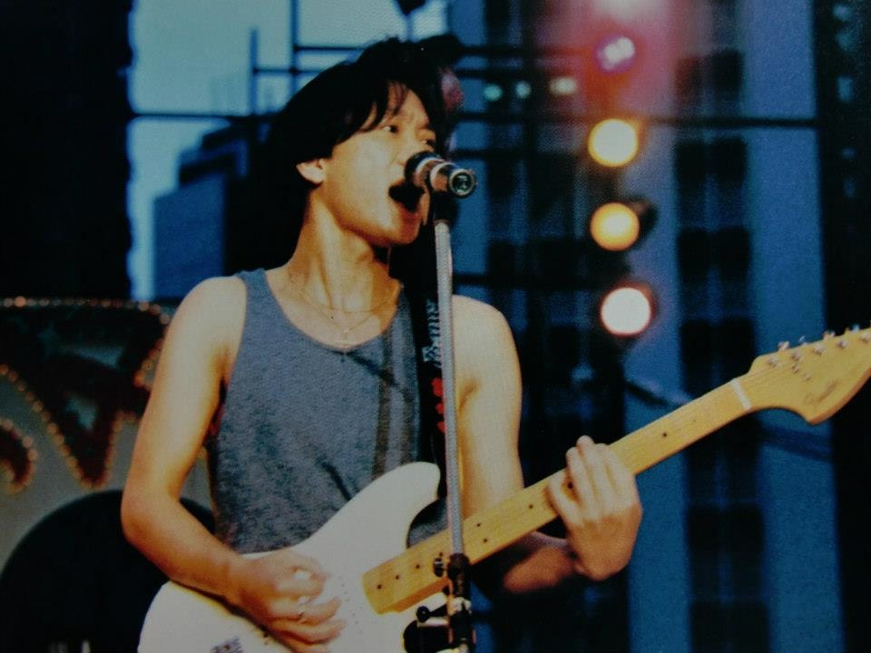

import YouTube from '@/components/patterns/YouTube.astro';

> 「我唔想做開路先鋒，我只是將心聲、感覺大聲唱出來。」 - 黃家駒

嘉駒多年前接受訪問時，坦言認為自己不是一個先驅者。 (影片截圖)

樂隊Beyond自1988年走紅，一直被視作「粵語搖滾先鋒」，在Beyond出現前，香港的搖滾樂壇還是以英文歌創作為主，而Beyond由1984年創作《永遠等待》開始，漸漸轉型並堅持以廣東話創作搖滾歌曲。音樂人梁翹柏早年接受港台訪問時憶述：「最初樂隊喺香港被認定為無前途，後來有啲日本樂隊開始喺香港受歡迎，香港唱片公司覺得樂隊有發展空間，就開始去搵一啲樂隊，當時好多製作人，例如劉以達就同我哋夾Band嘅人講要做中文歌，因為咁樣先有前途。最諷刺嘅係，當年Beyond喺香港樂壇得到最多獎項嘅時候，有人話香港樂壇一潭死水，青黃不接，連Beyond都可以獲獎。但而家全國最多人唱嘅廣東歌係咩？係Beyond。」

Beyond早年的發展時期，是以英語歌及純音樂為創作基礎，及後再轉型為廣東話創作。 (網絡圖片)

的確，家駒遺作之一《海闊天空》，佔了整個廣東歌歷史上一個重要的光輝位置。即使是不懂廣東話的國內同胞、甚至遠至日本的樂迷，也會懂得唱出「今天我…」。去年網絡上瘋傳一條影片，日本東京街頭一名男子，以日文自彈自唱《海闊天空》，中途一名女途人以廣東話伴唱，然後表演者即以廣東話繼續唱下去，女途人感動淚奔。這段影片的點擊率在網上以億計，感動不少網民，大家也有一種他鄉遇故知的感覺。但很多人也未必知道，其實《海闊天空》最初並不受落。

> 提起《海闊天空》，種種場合也能振奮人心。社運期間有人視之為一種精神；廣州恆大足球隊贏取冠軍時，歌迷唱起此曲；去年一名男子在日本街頭唱起這首歌，同樣感動萬千網民。

<YouTube id="uo3pN3gcA8s" />

《海闊天空》最初並不受歡迎

翻查資料，《海闊天空》推出的1993年，在電台的排行榜成績只屬平平，分別在香港電台得到第三位，以及在叱咤903只得到第七位。而雜誌對其收錄專輯《樂與怒》也只得三星半的評分，主流媒體幾乎沒有留意到這首「神曲」。前香港商業電台主持陳海琪接受《BBC》訪問時表示：「聽眾只覺得《海闊天空》是一首普通屬於Beyond的歌。」當時香港樂壇仍流行三分鐘左右的作品，當時《海闊天空》作為一首5分24秒的歌，可說是前衛，但也對香港聽眾來說難以消化，即使電台剪輯成四分鐘版本，也很快被張學友、黎明、劉德華的歌曲推走。

《海闊天空》收錄於1993年Beyond專輯《樂與怒》，推出三星期後已跌出銷量榜十大。 (網絡圖片)

《海闊天空》原名係…

還有一些關於《海闊天空》的瑣碎，其實此曲的原名為《Piano Song》。大眾可能會覺得奇怪，好端端一首樂隊作品，為何又會叫《Piano Song》？如果有細心留意，其實歌曲罕有地使用了鋼琴作為intro部份，而這首歌正是Beyond在日本發展時完成。日本流行曲有項特質，便是很常使用弦樂放在各式的作品當中，包括小提琴、鋼琴等等。而這首同時推出日文版《遙遠的夢~Far Away~》的《海闊天空》，便是一個好例子。

<YouTube id="qu_FSptjRic" />

「也會怕有一天會跌倒 Oh No」

《海闊天空》的一句歌詞「原諒我這一生不羈放縱愛自由 也會怕有一天會跌倒」，除了膾灸人口外，也引發了樂迷多年來的迷思：「家駒好像一語成讖，預言了自己的死亡。」黃家強多年前接受港台訪問時表示：「我唔知係咪佢自己嘅預感，每次聽到呢句歌詞都好唔舒服。未出事之前，佢原本係唱『也會怕有一天會跌倒 Oh Yeah！』後來我哋覺得意思好似唔係太啱，跌倒點會Oh Yeah呢？梗係Oh No啦。最後我哋就喺錄音室改咗呢句歌詞，但估唔到最後佢真係跌倒出事。」

「也會怕有一天會跌倒」曾引發不少迷思，萬萬想不到，原來最初後面的歌詞是「Oh Yeah」。 (網絡圖片)
