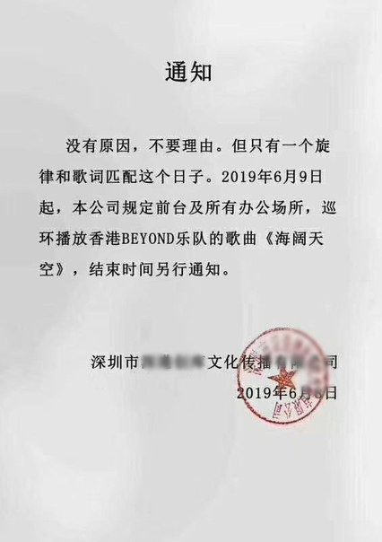

被廣傳的通告來自深圳一間文化傳播公司，通告指由今日(6月9日)起，公司前台及所有辦公場所將循環播放樂隊Beyond的《海闊天空》，直至另行通知。通告並未就有關決定作詳細解釋，只寫道「沒有原因，不要理由，但只有一個旋律和歌詞匹配這個日子」，令不少港人認為，有關安排是對反對修訂《逃犯條例》的聲援。

通告指只有《海闊天空》的旋律和歌詞跟匹配這個日子，令不少港人認為，有關安排是對反對修訂《逃犯條例》的聲援。(網上圖片)

記者曾致電有關公司查詢，負責人證通告屬實，但不敢說太多背後原因，只道「祝福香港」。而問到有關安排何時會完結，他則指視乎香港的情況而定。
