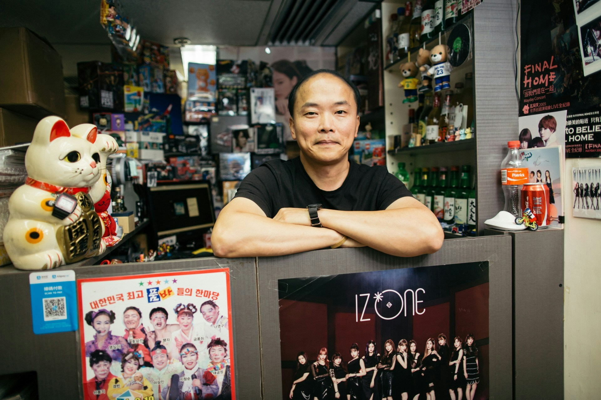
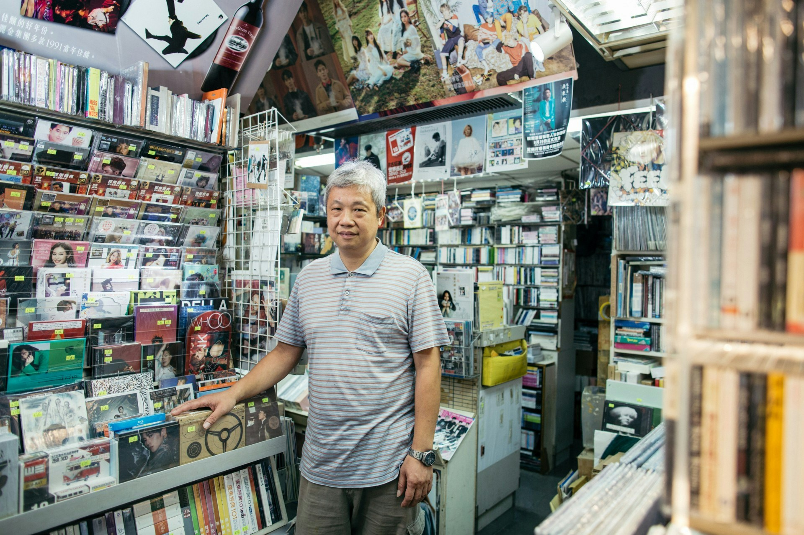
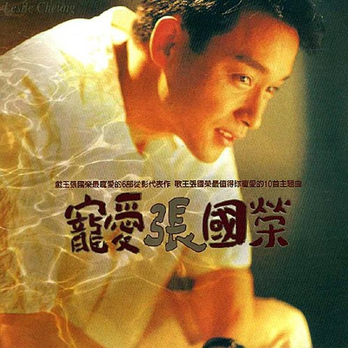
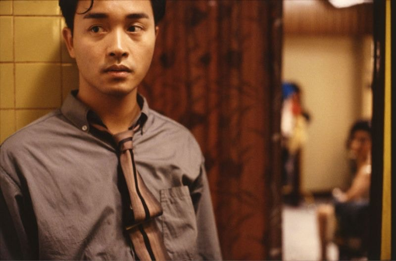
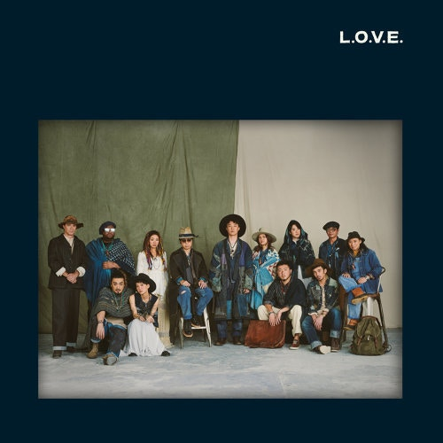
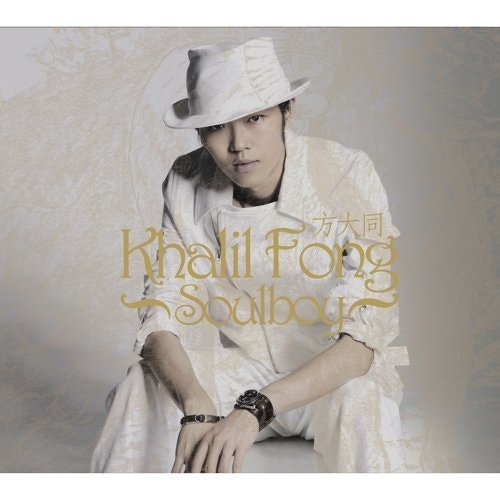
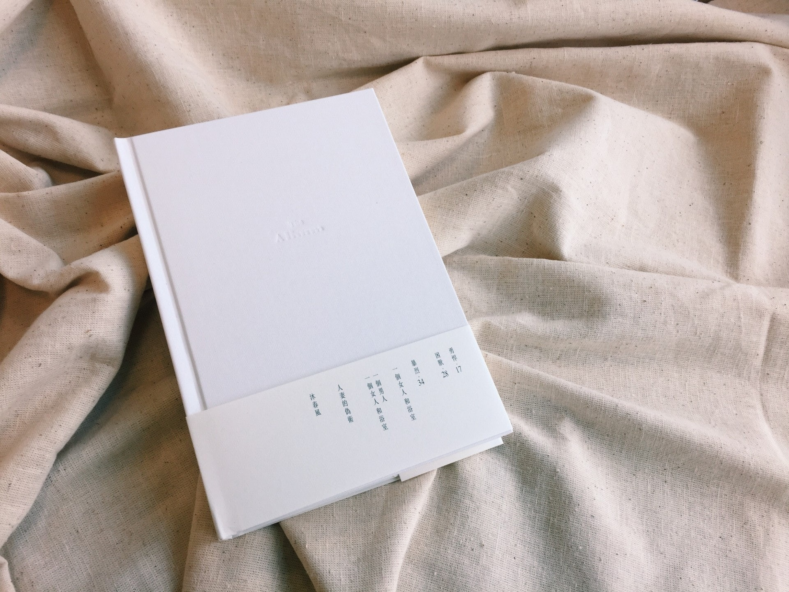
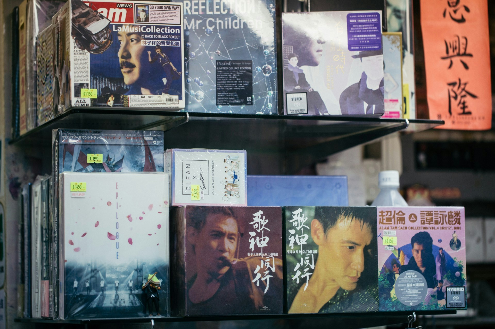
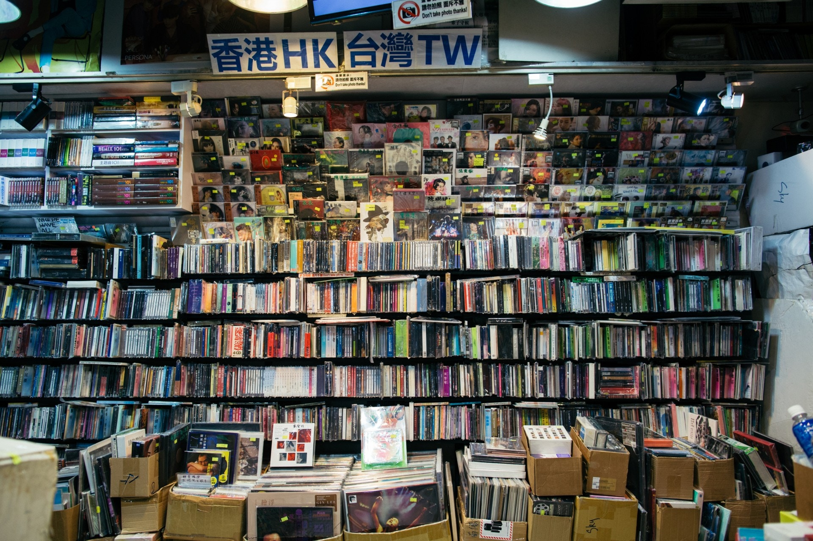
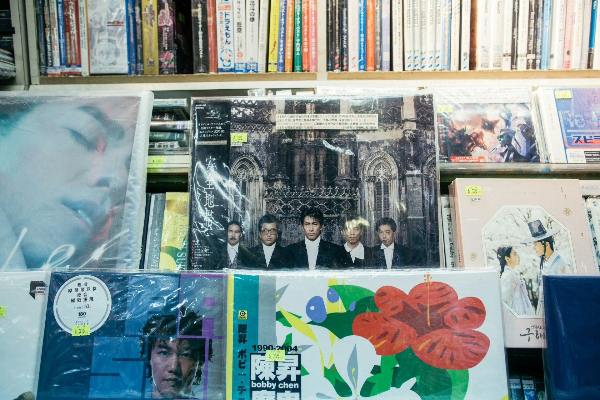

本着對音樂的熱情 投放全數青春於唱片

阿威在華納唱片認識了幾個志同道同的好朋友，覺得廣東歌做得過，便夾份在信和開了「Sky Music」。（歐家樂攝）

「Sky Music」老闆阿威及「Echo CD Centre」老闆David在1990年前後開業，阿威在畢業後進入華納唱片工作，負責做初模的他認識了幾個志同道合的同事，從此開始了經營唱片行生涯。聽後筆者感嘆能與知己一起做喜歡的事是幾生修到，阿威笑指：「都唔知鬧過幾多次交，拍過幾多次檯！」但仍語帶珍惜說：「不過已經熟到好真性情，好似家人咁。」

而David初出矛廬的工作與音樂則是八竿子打不着：「一出嚟做嘢做手飾，儲咗本金再出嚟做。」入行時由「o靚仔」做起，同時原偏好外國音樂的David，亦為了開舖多聽廣東歌。二人衝着對音樂的熱情，又有感廣東歌「有得做」，自此便投放了所有青春經營這個小小的音樂天地。

David回憶小時候甚少休閒娛樂，聽收音機聽歌便是他一大嗜好！（歐家樂攝）

全盛時期張國榮《寵愛》小店都賣六千隻 唱片公司仲要「配給」CD？

入行於九十年代初，正正是香港樂壇最高峰的時期，如果是八、九十後的你，能想像有一張專輯能賣到斷貨、大排長龍、沒有歌迷為歌手做數仍能賣到「三白金」的成績嗎？根據「國際唱片業協會（香港會）」（IFPIHK）當年的指標，多白金唱片需賣出白金唱片銷量的倍數，白金唱片的銷量為5萬張，三百金即賣出15萬隻專輯。「Beyond隻《二樓後座》真係意料之外，我哋都落咗幾千，但估唔到幾日就消化晒，我哋仲要周圍撲貨！」David記憶猶新的說，既然不愁沒有客人，為何不一次過「入爆佢」？David彷如回到昔日被買CD的客人而擠滿舖頭的時光，興奮的分享仍要「配給」的光景：「order你落幾多都得，但唱片公司未必畀到，嗰陣香港得3至4間唱片廠，好多嘢都做唔切，佢都要分期出貨！」而《二樓後座》得金唱片成績，總銷售達2.5萬張唱片。

而令阿威印象最深刻的反而是張國榮復出大作《寵愛》：「嗰陣一出碟，完全係焦點商品，啲人一入嚟就有目標，買完就走，（首周）賣咗成五、六千隻碟！」筆者聽到這些數字後猶如「未見過大蛇痾尿」，阿威便繼續細說當年：「九十年代當紅歌手每隻碟壽命有成個幾兩個月，第一次返貨可以4、5千，之後每次keep住補50至100隻碟，越補越少咁。」那麼，今天的當紅歌手的銷售額又怎樣呢？

> 老闆們提到你唱片你買過幾多張？(按圖放大)(資料圖片)

張國榮1995年專輯《寵愛》推出時一星期賣出五、六千張。(資料圖片)

當時哥哥的專輯補貨量是每次50至100張。（《阿飛正傳》劇照）

哥哥張國榮的地位至今仍沒有人能取代。(《阿飛正傳》劇照)

香港神檯歌手陳奕迅，去年12月推出的《L.O.V.E》至今賣出503隻，以今日的銷量來說已是相當不錯的成績。(資料圖片)

(視覺中國圖片)

原來方大同初出道時的第一張專輯《Soulboy》在唱片架上乏人問津。(資料圖片)

Juno初時也被輕視，亦是一直堅持自己的音樂風格，近年才被樂迷另眼相看。(資料圖片)

90年代出碟輕鬆賣數十萬隻都不是夢，現在能賣過萬隻碟就是夢！（歐家樂攝）

本地市場萎縮Eason《L.O.V.E》賣503隻 其實新人輩出樂壇絕不單一化

廣東歌的高峰期，唱片舖的收入大約為7成廣東碟，其餘3成為日本、台灣、韓國及歐美的唱片。時而勢易，今天韓國音樂文化成大勢，同時本地音樂市場萎縮，韓國唱片及周邊商品成支撐商店的主要收入來源，佔阿威唱片舖逾半成收入，及David的1/3收入，而廣東碟則只佔另外半成之一及其他1/3收入。「依家同一款碟，一日賣到100隻已經好犀利！」David慨嘆道，即使是香港神檯歌手陳奕迅，去年12月推出的《L.O.V.E》至今賣出503隻，已是相當不錯的成績：「好新嘅artist試過1隻都未賣過，仲試過退返上去唱片公司。」更有唱片公司與唱片舖以寄賣形式合作，只為了讓數字不要太難看。

3Sky Music裏有一面牆賣港台唱片，又有兩面牆賣韓國唱片及周邊商品。（歐家樂攝）

或許有人認為市道不景，才是導致唱片難賣的主因，以近年影響民生經濟最嚴重的沙士及「反修例」引致的社會運動為例，兩位老闆的答案可能會癲覆你的想像：「沙士嘅時候，我哋呢行生意好咗！」當年互聯網尚未普及，人們的休閒娛樂離不開聽歌睇戲，為了避免接觸人群增加染病機會，反而讓更多人到唱片舖買碟回家聽歌避世。那麼最近的社會運動呢？David坦言生意額大跌30%：「今個月（10月）冇開7日工，基本上每個禮拜日都開唔到工。」繼續解釋因約2成客人都是遊客：「韓星嚟開演唱會，好多東南亞、大陸啲嚟睇會買返舊嘢，但宜家好多演唱會都取消咗。」筆者追問歌手表態對銷售會否有影響：「譚詠麟高峰期已經過咗，基本上冇再出啲深入民心嘅歌，所以買開都係嗰班fans；而My Little Airport都係keep住個數，冇話特別爆。」終究影響生意的還是外國市場，若單靠廣東碟唱片舖能生存下去嗎？

「單靠賣廣東碟就bye bye咗，一定係已經bye bye咗，保證！」阿威十分堅定的說：「有段時間出得太多偶像，當然有班學生哥好鍾意，但有班鍾意聽歌嘅真係想有啲質素。」真如家駒所說，香港真的沒有樂壇嗎？「以前歌手就係歌手，依家係藝人嚟㗎嘛，電視、電影、唱歌乜嘢都要做！」阿威坦言，其實樂壇並不如樂迷想像般狹隘，新人輩出，如Dusty Bottle、符致逸及AGA等，音樂類型眾多，絕不單一。

廣東歌手出歌不出碟 欠缺播放平台本地音樂難入屋

「都要讚一讚環球唱片，呢間公司真係好難得，幾肯揼錢落去做新人，或者做一啲比較少喺香港發行嘅音樂。雖然就咁望落去應該就係蝕錢嘅，但係佢都肯做，再搵第二間都冇！」阿威指Dusty Bottle雖然走得好前，能夠緊貼世界音樂潮流，但仍被本地樂迷忽略：「除非真係好得好得，佢哋先唔會藐，香港啲人可能會覺得你未夠班，就會聽出面唔聽你！」唱片舖依靠賣碟維生，無奈一張唱片的製作費用太高，即使本地樂壇不景氣，錄音室、樂手的費用從未跌價，平均做一首歌都要價廿萬，所以唱片公司先為歌手發行數位單曲試水溫，避免大蝕，然而亦讓阿威大歎：「以前一個歌手一年都有兩隻廣東、兩隻國語，依家一年都未必有一隻廣東碟。」平均每隻碟能賺10%至20%，以現時廣東歌手的出碟量的確難以讓唱片舖賴以維生。

資訊變得更流通，卻更欠缺平台讓不同類型的音樂入屋，菊梓喬在唱片熱賣歌手亦榜上有名，David指她贏在播放平台：「歌就係要你肯播，聽得多自自然然就會受。大家都估唔到菊梓喬賣到算幾多，因為佢歌迷可以去到老中青，後生都有嚟買。」音樂入屋程度幾乎等於造成經典的主因，當年譚詠麟、張學友、陳百強及王傑都是唱電視劇歌出身。同時，兩位老闆都認為歌手有實力，都要「夠捱得」！方大同初出道時的第一張專輯《Soulboy》在唱片架上乏人問津，後來被發現音樂才華時便被「追」回來；Juno初時也被輕視，亦是一直堅持自己的音樂風格，近年才被樂迷另眼相看。

欠缺平台讓廣東歌入屋，亦是造成唱片難賣的一大原因。（歐家樂攝）

「廣東碟真係越嚟越難做，承傳唔到，斷層又太大。」David直言每月經營支出超過六位數字，但買實體碟的人越來越少，將來亦只會變得更少，加上年輕人並不熱衷於本地樂壇：「新人點努力都好難出到嚟，你有冇聽過獨立歌手出一隻碟賣一層樓嘅故事？出多隻就賣多層。」在本地樂壇不景氣，出一隻碟蝕一隻的市場內，唱片舖又怎樣另覓出路呢？請繼續留意下一篇信和唱片舖專題！
