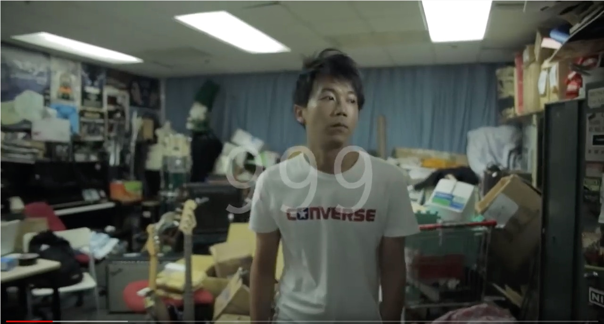

import YouTube from '@/components/patterns/YouTube.astro';

> 設計學院畢業的搖滾祖師 黃貫中

<YouTube id="E7MDdnXVmaI" />

小時候喜歡畫畫，想做畫家的黃貫中，畢業於當時還是設計學院的香港理工學院。讀設計期間，認識了鼓手葉世榮，他介紹阿Paul給黃家駒認識，形成了最經典的 Beyond 四子。曾於廣告公司任職設計師，黃貫中除了彈結他之外，也會不時擔任樂隊美術工作，例如《再見理想》盒帶封套設計、1991年Beyond《生命接觸演唱會》服裝設計。

> 從Poly Muso房起步的 Tonick

*Poly Muso的「So房」，Tonick 一班人就在這裡出發。*

由Poly Muso 房幾個觀眾，到幾千的大場地，一班熱血有band夾，梗要過有飯開，到被主流樂壇也接納，養得起自己養得起身邊人。Poly Muso 到旁邊的紅館，只有1000步的距離。筆者曾經與 Tonick 一起製作這段 Poly 回憶短片，希望他們可以夢想成真。

<YouTube id="VmB9dDgZq-Y" />

> 又是理工設計系柴娃娃的 野仔

<YouTube id="ghswNt1kYCE" />

校園青春是野仔的標志，以少爺占為主導，在Poly設計學系聚埋一班朋友，1997年時本想成立一個名為「Wildchild」時裝品牌，但遇上經濟低迷而未能如願，所以最後用了這個名稱，組成了樂隊。少爺占成為了香港最著名的DJ之一，無論以搞笑藝人、設計師、DJ，他亦為時代留下一個標記。樂隊結他手小胡，在理工大學設計系畢業後，亦投身設計行業工作。

<YouTube id="Vy92NoWF3ZI" />

> 永遠的Poly學生哥 新青年理髮廳

<YouTube id="dFNCLvON5t4" />

在Poly宿舍，你可以成日見到歐陽彈結他，發仔的加入，成為了樂隊「發仔與歐陽」，到負責視覺創作的 Showroom 加入，成為了現在二人上台，一人當幕後的「新青年理髮廳」。Poly 學生一直是他們的忠粉，由學園的族群出發，往往都會為樂隊，打了一支強心針，更堅定去做自己的創作。

> Poly Muso演出的常客 鬥牛梗

<YouTube id="CvJip9DO4jc" />

鬥牛梗 以 spoken word 加上另類搖滾，絕望、憤怒、emo 的混沌釋放，鼓手Roland另一身份更是出位的音樂人 怒人。聽鬥牛梗的音樂是一種向世界發出的救援，一種自我的救贖，emo到世界盡頭。

> 憤怒之神 怒人

<YouTube id="R78AzI0SfAA" />

怒人是 Poly Muso 的要員。歇斯底里的演出、充滿粗口的歌詞、集結高超技巧樂手的團隊，令怒人成為indie界的一時佳話，但後來與樂手不和及不投票事件，令他受盡指責。沉寂後的怒人，仍然有推出新作，極度豐富及炸裂的音樂風格，仍然是香港indie一個難得的奇葩。
