黃明志上星期突然在網上拍片，邊吃麵邊唱Beyond的《海闊天空》，更預告將會推出Rap版的《海闊天空》，令不少樂迷感到期待。本來以為他只是單純在《海闊天空》當中加入Rap的部份，又或是將歌詞變成以說唱方式演釋。怎料黃明志昨晚(12/4)推出作品，卻發現這首改編作《我們的海闊天空》比想像中用心得多，更可說是一首全新的音樂作品。

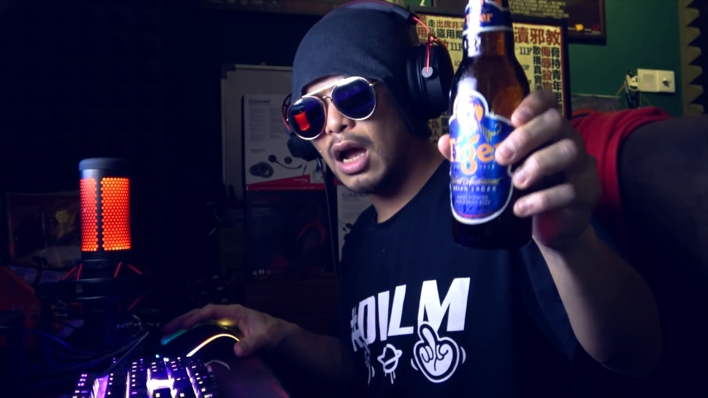
黃明志近日因疫情而留守家中，即席翻唱《海闊天空》，將這首歌送給香港的Fans。 (影片擷圖)

> 再次重溫黃明志上星期如何在家苦中作樂兼翻唱《海闊天空》

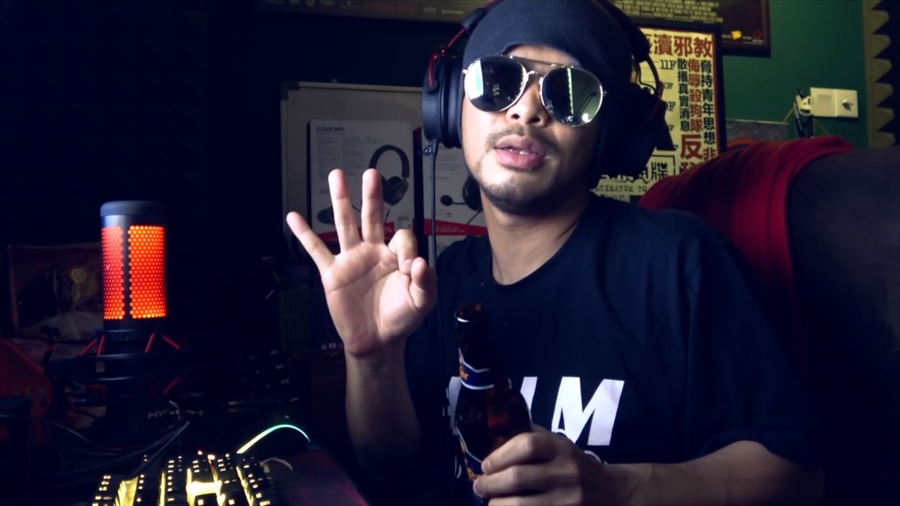
馬拉封國已經超過3星期，黃明志覺得日子過得好無聊，這三星期真的不簡單。（影片截圖）

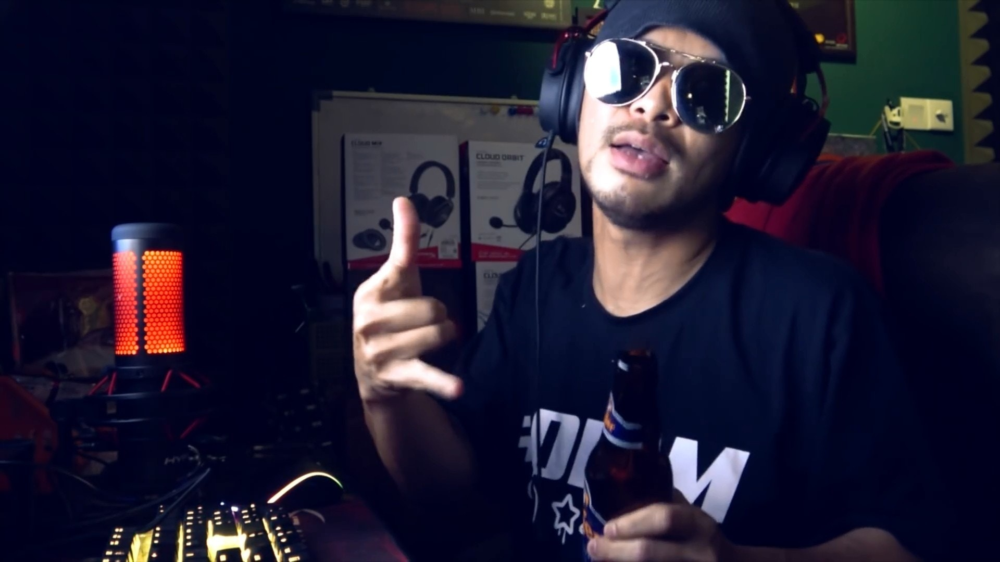
黃明志在影片中曾透露，他會推出Rap版海闊天空。（影片截圖）

為了營造Live的氣氛，黃明志有時會擺出一起唱的姿勢。（影片截圖）

雖然自稱廣東話不標準，但黃明志唱起來有幾分黃家駒的味道。（影片截圖）

雖然並非直播影片，但黃明志仍透過一連串動作與觀眾「互動」。（影片截圖）

向偶像致敬之餘，亦要將此歌送給全世界華人和香港朋友，黃明志自然唱得更落力。（影片截圖）

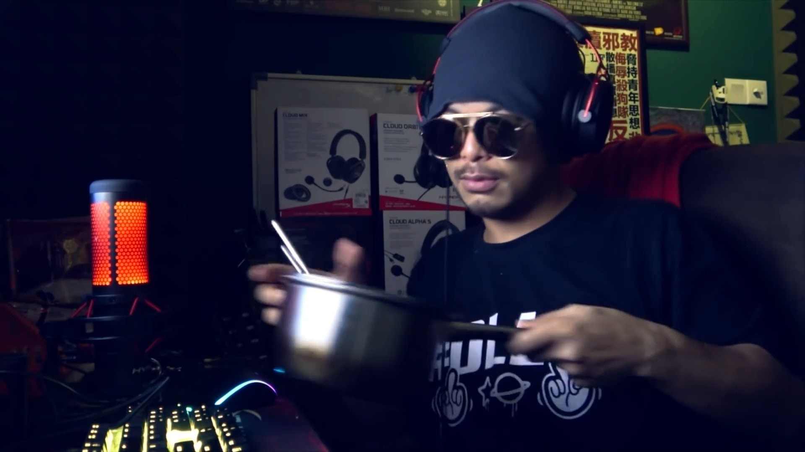
等等，為甚麼拿起餐具？（影片截圖）

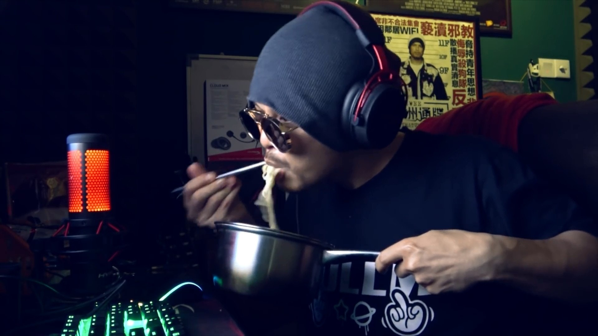
黃明志居然在翻唱期間吃起麵來！（影片截圖）

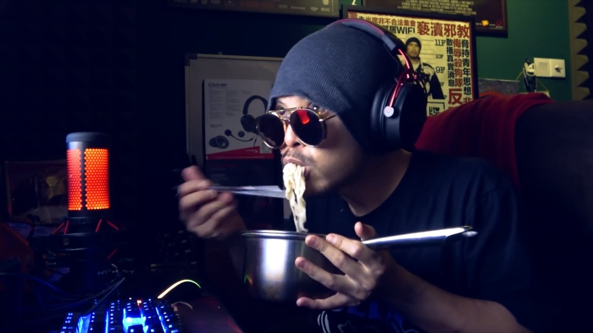
網民覺得當刻氣氛頓時變得搞笑，這是效果嗎？（影片截圖）

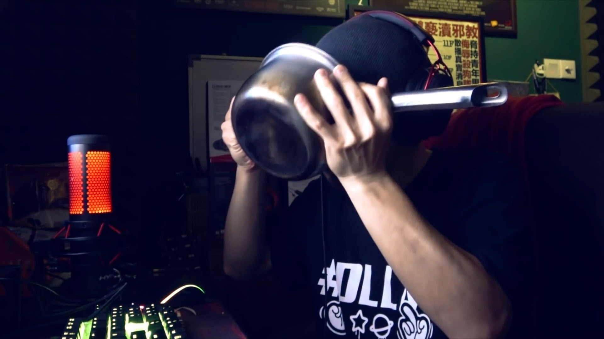
既然要吃麵，當然要把湯都喝完。（影片截圖）

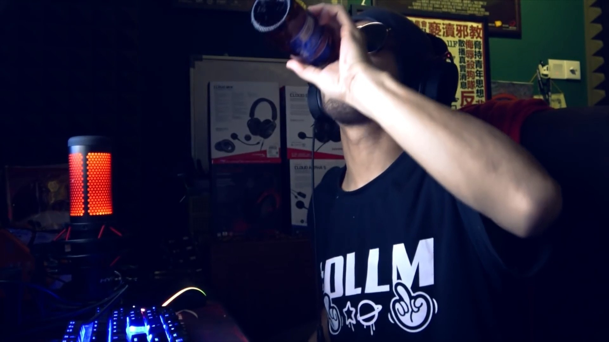
最後這個搞笑的畫面以喝啤酒作結，黃明志繼續翻唱。（影片截圖）

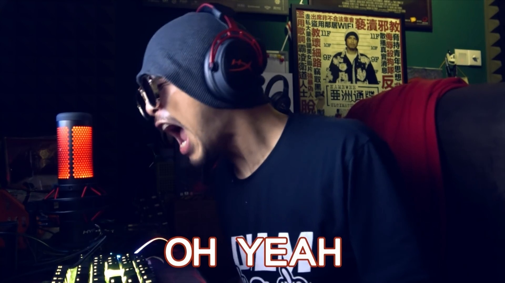
Oh Yeah！（影片截圖）

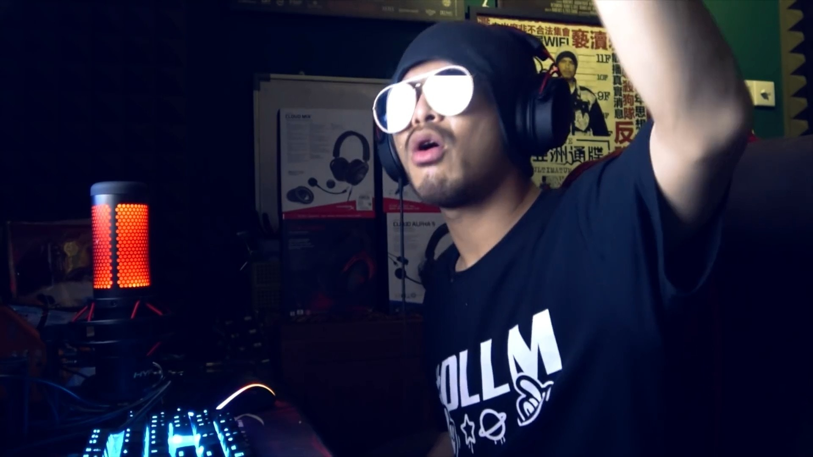
唱起偶像歌曲，黃明志表現得很投入。（影片截圖）

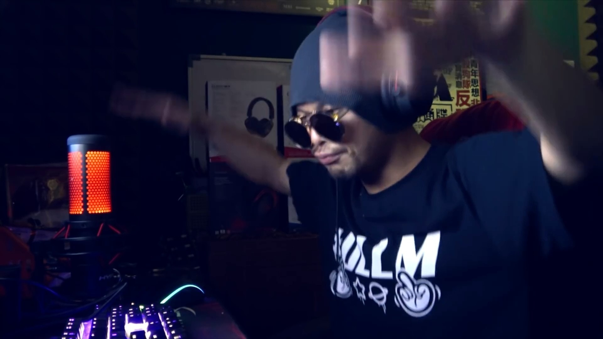
唱起偶像歌曲，黃明志表現得很投入。（影片截圖）

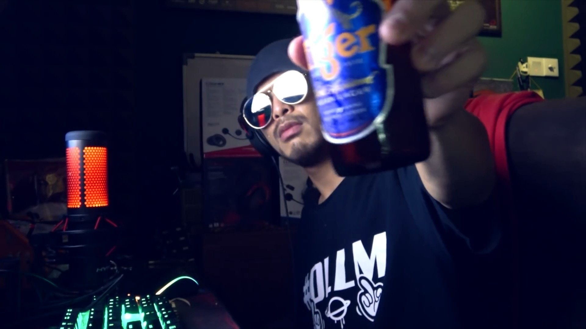
最後黃明志更向觀眾大叫「飲勝」。（影片截圖）

最後他亦再次宣傳新作——《我們的海闊天空》。（影片截圖）

《我們的海闊天空》採用了Beyond《海闊天空》的原曲作基調，但在旋律上也有不少改變，包括副歌在內也改寫了部份旋律，但又不失原版風味，而正歌則全數以Rap詞代替。歌曲由黃明志親自作曲作詞，Rap部份帶有點點《漂向北方》的「黃明志風格」，不過歌詞仍保留了「原諒我」、「寒夜」、「跌倒」、「自由」、「不羈」等原曲最為人熟悉的詞語。

不少樂迷聽過這首作品後，也驚嘆副歌部份的聲線演繹得跟黃家駒相當神似，不論是唱腔還是咬字，也模仿出家駒神髓，可說是一個超越時代的合作。而黃明志也在表示今次的新作當中找來一位歌手合作，如無意外就是這位聲音神似黃家駒的歌手，至於這位歌手的真正身份到底是誰，黃明志表示先賣一個關子。

今次《我們的海闊天空》，是黃明志對Beyond的致敬之作。 (影片擷圖)

其實這首《我們的海闊天空》的創作過程也絲毫不容易，黃明志分享：「香港的Beyond樂隊不只代表了一個時代，他也代表了一種自由的精神思想。近年來因為唱片宣傳和演唱會到了香港幾次，看到現在的香港心中有些感慨，所以把這首Beyond的經典代表作《海闊天空》改編成了RAP版。之前有想過把它寫成粵語，所以特地飛到了香港找了黃貫中（Paul哥）幫忙，因為他除了是吉他手之外也是填詞高手，加上這首歌是Beyond的歌，他應該會更得心應手。其實Paul哥在相當久以前就聽過我的作品了，我們也一直都是微信裡的朋友，偶爾會聊天但從未見過面。我們聊了很多音樂的東西，也談了現在香港的局勢和他這幾年所面對的問題。在那裏待了兩三個小時。我讓他聽了這首我改編的［我們的海闊天空］。他聽的時候露出了微笑，他說他喜歡這樣的改編因為融合了新的元素，歌詞也表達了新的視角，尤其讚我Bridge那裡的曲調寫得最好。」

黃明志又透露自己去年親自將這首歌帶到香港，讓黃貫中聽一聽Demo給予意見。 (網絡圖片)

他又解釋為何這首作品沒有加入粵語的部份：「他聽完了告訴我，這首歌已經很好了，不需要寫成粵語版。有兩個原因，第一《海闊天空》本身已經是粵語版，而且已經深入民心太經典了，寫成粵語一定會被拿來比較，模糊了焦點。第二，華語版能夠讓更多不同籍貫的華人甚至非華人聽懂看懂裡面要表達的東西。所以現在大家聽到的這個版本就跟當初我給Paul哥聽到的是一模一樣的。」最後黃明志也表示這首歌其實去年已經做好：「這首歌我本來想在去年八九月份推出，但由於時機敏感，被很多人阻止了。不然一定會被針對或被有心人士利用，一定會有人罵我在藉機炒作。為了讓這首歌保持初衷，於是我們忍到了現在才決定將它推出。」
