*早前，有網民在網上討論區發布貼文大呻居住在公共屋邨的苦況，更說公共屋邨是龍蛇混雜的地方，住在公屋的女生，也許曾被稱為「屋邨妹」，若整個童年或成長地方都是居住在公共屋邨的話，已經注定不可能擁有一個幸福美滿的人生，也是注定一輩子向上層流動的機會也備受限制。*

*其實，很多娛樂巨星或國際級導演也在公共屋邨長大，但他們卻沒有甘於現況，而是捉緊自己的夢想和任何一個機遇，成就屬於自己發光發亮的人生。以下筆者為大家盤點從小在公共屋邨長大的藝人，如今成了觀眾眼中的男神女神，他們努力向上又不忘本的態度都值得女生們學習。(wongtsuiyu@IG／andylauox@IG／yungchoyee@IG)*

*【公屋名人】郭富城 ：「四大天王」之一*
 (aaronkwokxx@IG)

*【公屋名人】年少時的郭富城於房協明華大廈長大，位於筲箕灣的明華大廈更是房協早期興建的公屋之一，郭富城曾經接受訪問也說他曾在明華大廈居住18年有多，他當時居住在四樓，因為沒有升降機的關係，每天都需要走樓梯回家，但郭富城卻說生於這地的他卻很享受這個社區的聯繫和人情味。 (aaronkwokxx@IG)*

*【公屋名人】早前，54歲的郭富城舉辦網上直播慈善演唱會《郭富城鼓舞．動起來Online Concert 2020》為一眾電影行業和舞者籌款，皆因郭富城也是舞者出身發跡，即使現在他名成利就，也沒有忘記曾經的辛酸，幫助同行，值得欣賞。 (aaronkwokxx@IG)*

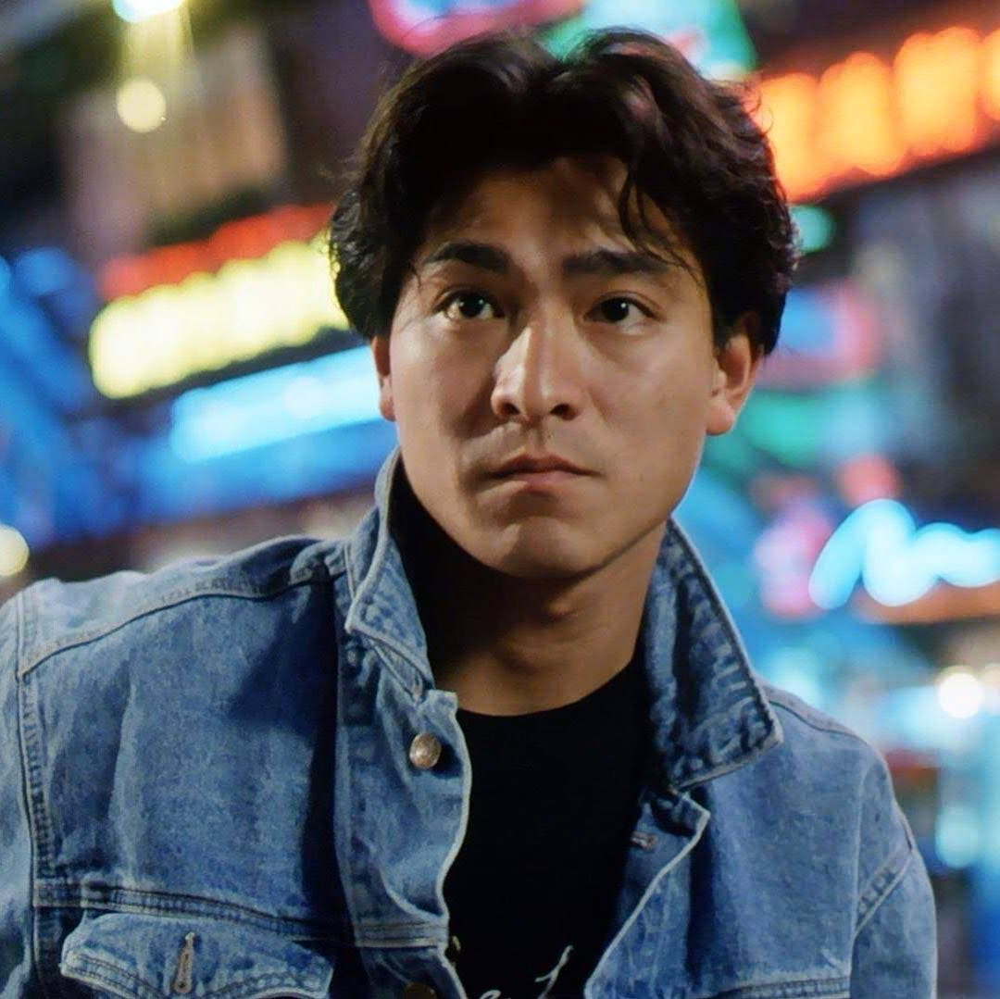
*【公屋名人】劉德華：「四大天王」之一 (andylauox@IG)*

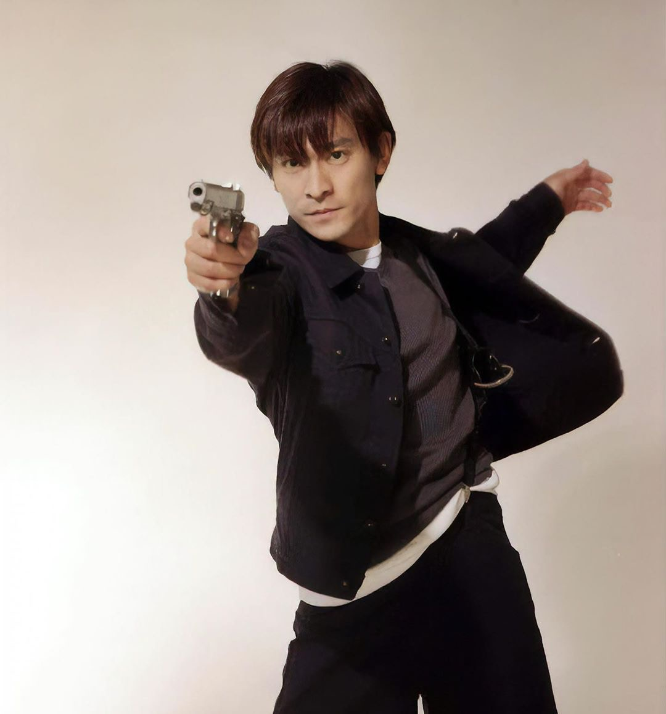
*【公屋名人】現年58歲的劉德華便從小在藍田邨第15座14樓長大，劉德華曾說他是成長一個近乎貧窮的家庭，不過這個家庭卻十分的溫暖，當時年紀輕輕的他便需要幫助父母打雜貨店，當時他們居住地方很接近當時的堅城片場，劉德華也因為當時常常看見明星而萌生當演員的夢想。 (andylauox@IG)*

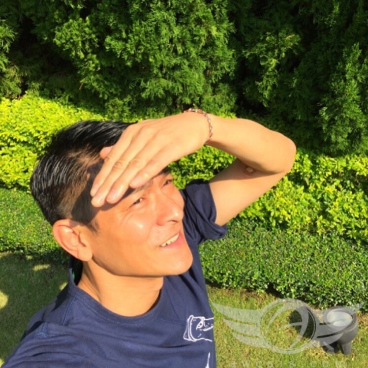
*【公屋名人】因此曾經為生活而勞逸的劉德華明白辛苦的日子，所以初時進入娛樂圈的他沒有一刻的放棄，堅持訓練自己的演技和不放棄每一個可以出演的機會，便成就今日的劉德華，而2017年已名成利就的劉德華也回到為藍田邨親自為他成長的地方題字。 (andylauox@IG)*

*【公屋名人】鄭伊健：憑《古惑仔》電影系列成名，也許屋邨成長的經歷有助他演活同樣屋邨生活的陳浩南一角。90年代被稱為是「四大天王」之後的「第五天王」*
(ekin_cheng_official@IG)

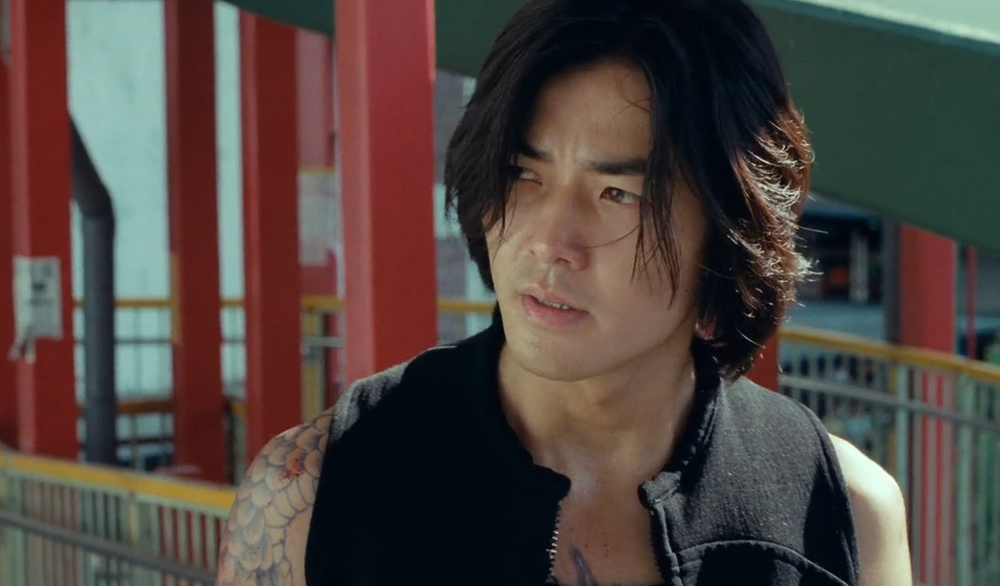
*【公屋名人】鄭伊健的童年成長於土瓜灣的樂民新邨，初時鄭伊健也與普通成長在屋邨的小朋友別無分別，也常與鄰居小朋友在屋邨中的籃球場打籃球，鄭伊健在訪問中又曾說自己要經常要擔任家中瑣務，更需要常常到菜市場購置食品，更需要守在籃球場「曬棉被」。 (《古惑仔之人在江湖》劇照)*

*現時的鄭伊健從配角晉升為一線小生再一躍到大銀幕，也搬到較好的居住環境，但有傳他的雙親仍然留戀着土瓜灣的樂民新邨。*
(《古惑仔之人在江湖》劇照)

*【公屋名人】李佳芯(aliaime@IG)*

*【公屋名人】初時的李佳芯（Ali）是居住在柴灣興民邨，本身沒有想過當演員的她其實先是在有線電視中擔任體育主持，其後才加入電視圈拍劇，但其實還沒有成名的她曾與朋友合夥開設髮型屋來賺取更多金錢。(aliaime@IG)*

*【公屋名人】容祖兒（Joey）：現今樂壇天后，獲獎無數，曾辦世界巡迴演唱會，更成立「容祖兒慈善基金有限公司」關顧弱勢，早前容祖兒更親身與團隊到屋邨上門派口罩。她兒時在馬鞍山的恆安邨成長。(yungchoyee@IG)*

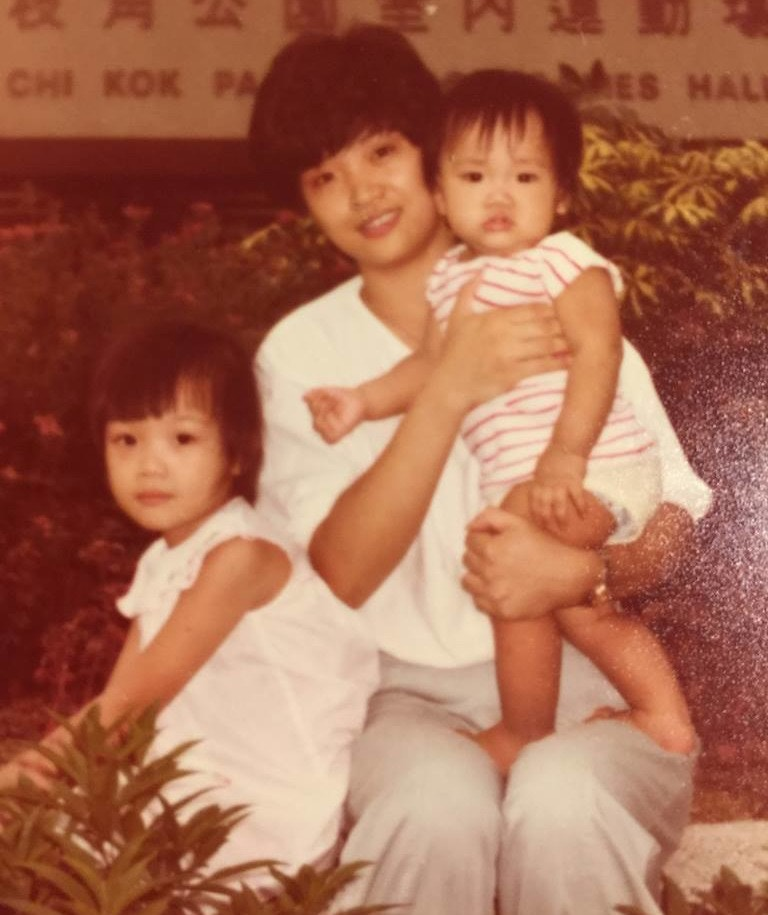
*【公屋名人】容祖兒（Joey）曾在訪問中分享自己的成長經歷，她還沒有搬入公居的時候是居住在蝴蝶谷的木屋區，那時她需要自己去倒痰罐、需要打水才可以洗澡和需要常常面對很多的蛇蟲鼠蟻，後期搬進恆安邨的她也與一般的小朋友一樣，會與朋友相約到公園玩耍。(容祖兒（Joey）@FACEBOOK)*

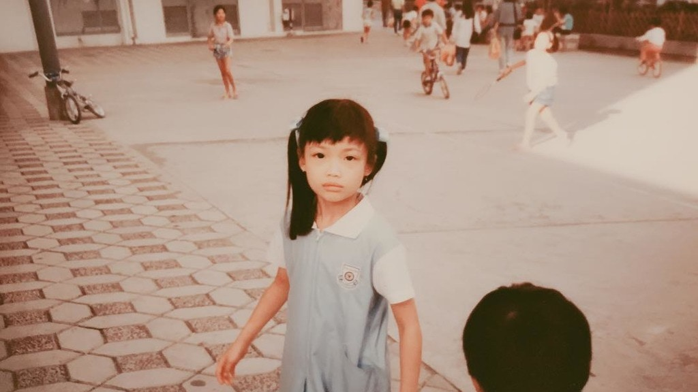
*【公屋名人】在公居長大的容祖兒（Joey）並沒有限制自己的可能性，而是發掘自己唱歌的天份，並加以發展，令到她今時今日在中港台也獲得很高的名氣，從而改善年少時的生活環境。 (容祖兒（Joey）@FACEBOOK)*

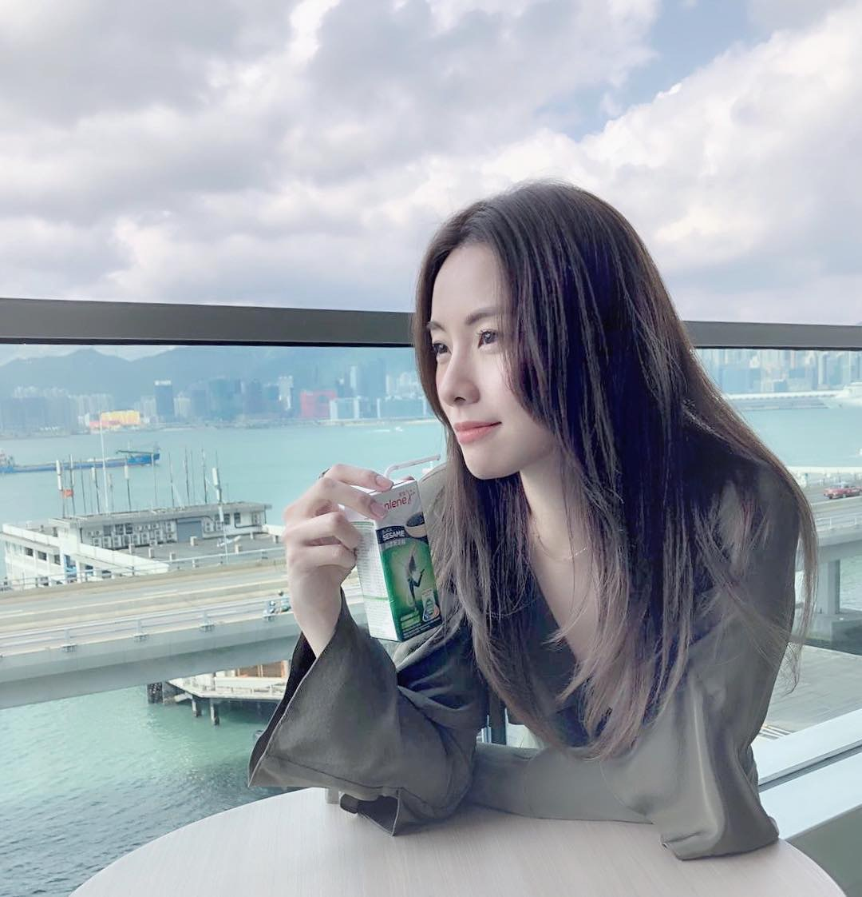
*【公屋名人】鄧麗欣：憑組合Cookies 成名，後來獨立發展，出書更拍電影，兩度提名金像獎最佳女主角，亦自組排球隊Loey參加公開比賽。現時與台灣藝人邱勝翊（王子）戀愛。年少時居住在屯門大興邨 (stboo@IG)*

*【公屋名人】年輕時的鄧麗欣居住在屯門的大興邨，而她初時也是參與雜誌YES舉辦的「全港校花校草選舉」而入行，其後更與以組合Cookies成員的身份出道，成為一名女歌手，雖然組合最後解散，但鄧麗欣卻沒有止步於始，仍是投入影視圈中發展。(stboo@IG)*

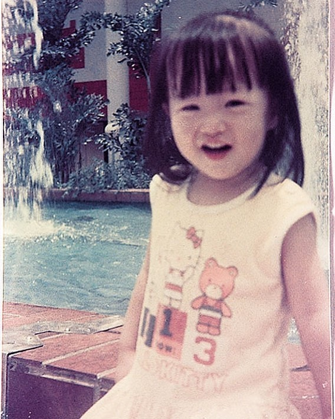
*【公屋名人】年輕時的鄧麗欣雖然居住在公屋，只要一直忠於自己發展所想，也創出自己的一片天！(stboo@IG)*

*【公屋名人】文詠珊（Janice Man）：14歲模特兒出道，被封為「𡃁界女神」，後在電影圈發展，去年與金融才俊男友結婚。(janice_man@IG)*

*【公屋名人】年輕時的文詠珊（Janice Man）因家人在1997年香港金融風暴而獲資失利，於是文詠珊後來與家人一同搬進梨木樹邨居住，當時的文詠珊便發奮圖強想變回過往的生活，於是透過擔任模特兒入行。(janice_man@IG)*

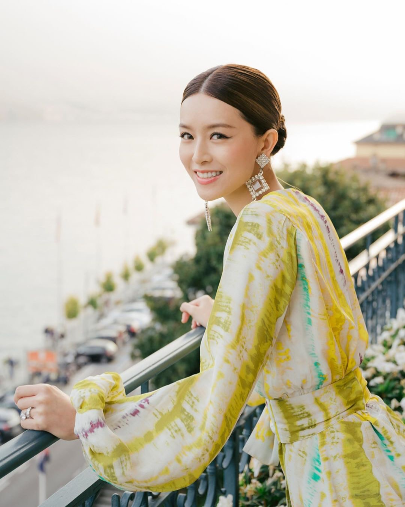
*【公屋名人】透過模特兒事業向娛樂圈進發的文詠珊（Janice Man）更結識了富三代男友，並與他結婚，早前文詠珊更在網上分享家居運動時，不經意透露出她所居住的豪宅。(janice_man@IG)*

*【公屋名人】童年時的文詠珊雖然生於小康之家，但後來因為家中投資失利而搬進公屋居住 (文詠珊@微博)*

*【公屋名人】已故Beyond樂隊主音歌手黃家駒及其弟黃家強也曾在蘇屋邨長大的知名兄弟班樂隊。(kwkpbeyond@IG)*

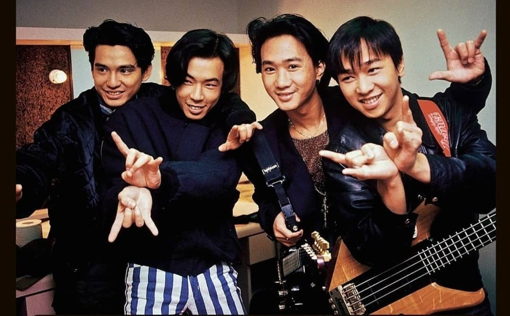
*【公屋名人】當時的Beyond樂隊為香港的樂壇帶來不一樣的音樂方向，更為香港的樂壇帶來別具一格的音樂風格，所以可以說：「其實居住在公共屋邨，只要有夢想，努力堅持也可以夢想成真的。(kwkpbeyond@IG)*

*【公屋名人】許冠傑（Sam）：被封「歌神」，或許蘇屋邨是養育歌手的地方？許冠傑曾在蘇屋邨長大。(samhui_fanpage@IG)*

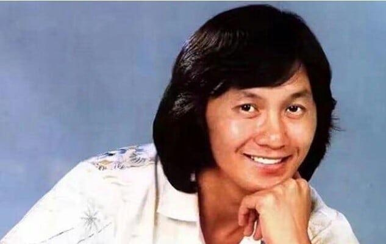
*【公屋名人】「歌神」許冠傑（Sam）初時還沒有「上樓」的時候，更是住在鑽石山木屋區，不過日後獲分配公屋的時候，他便與家人居住在蘇屋邨，許冠傑（Sam）也曾自己常常在後樓梯鍛練結他，所以他創作的歌曲，例如：《半斤八兩》、《賣身契》和《制水歌》都能真實地反映當時居民的苦況。(samhui_fanpage@IG)*

*【公屋名人】黃翠如：有線主播出身，轉投TVB發展暢順，拍過多部劇集當女主角。現時婚姻生活十分幸福。曾有網民也笑說馬鞍山的恆安邨是不是風水特別好？因為馬鞍山的恆安邨還有以上數名的女藝人是成長於此地。*
(wongtsuiyu@IG)

*【公屋名人】曾有傳媒報道黃翠如曾經與父母居住在藍田木屋區，並後才搬上馬鞍山的恆安邨入住，她曾說自己的家庭從小不算是富有，父親只是賣魚小販，自己更需要不時在魚檔上幫忙打點，不過機緣巧合的情況下，父親在早幾年晉升為上市公司主席，她也因自己用功讀書而獲得做電視主持的機會，才進投娛樂圈。(wongtsuiyu@IG)*

*【公屋名人】同時，黃翠如的姐姐黃翠紅原來與容祖兒（Joey）是同班同學，在小學的時候，容祖兒（Joey）常常與黃翠如姐姐玩耍而忽視她，有一次更相約容祖兒（Joey）到小學的操場議論呢！(wongtsuiyu@IG)*

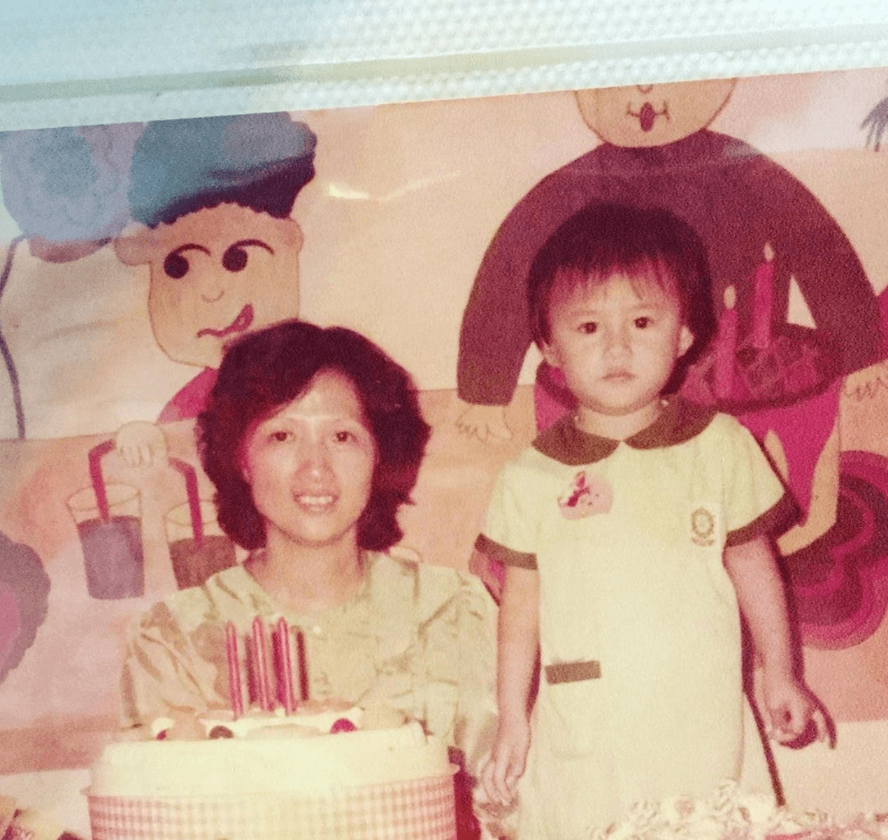
*【公屋名人】你有沒有想過原來黃翠如也曾居住過公屋？(wongtsuiyu@IG)*

*【公屋名人】楊思琦：2001年香港小姐冠軍*
(szekikk@IG)

*【公屋名人】年輕時曾在大坑西邨居住的楊思琦，透過參選香港小姐入行，當時獲得冠軍的楊思琦便隨即加入影視圈發展。*
(szekikk@IG)

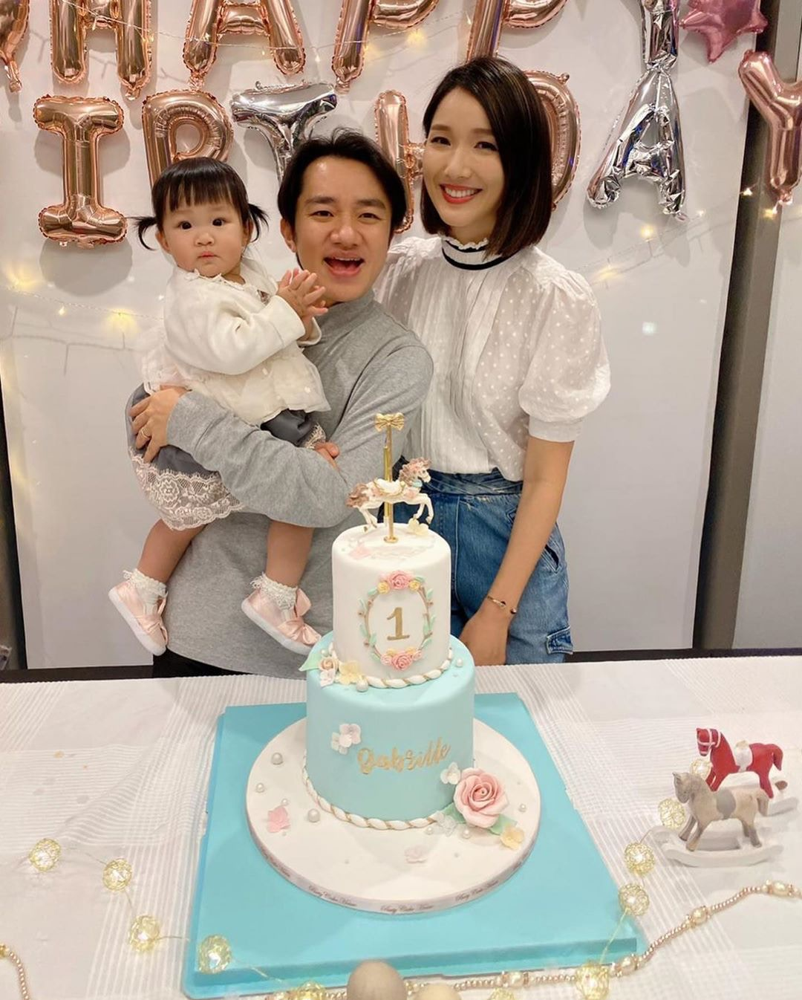
*【公屋名人】王祖藍：演員出身，更當上中國人民政治協商會議廣西壯族自治區委員會香港委員。曾居住在馬鞍山的恆安邨 (wong_cho_lam@IG)*

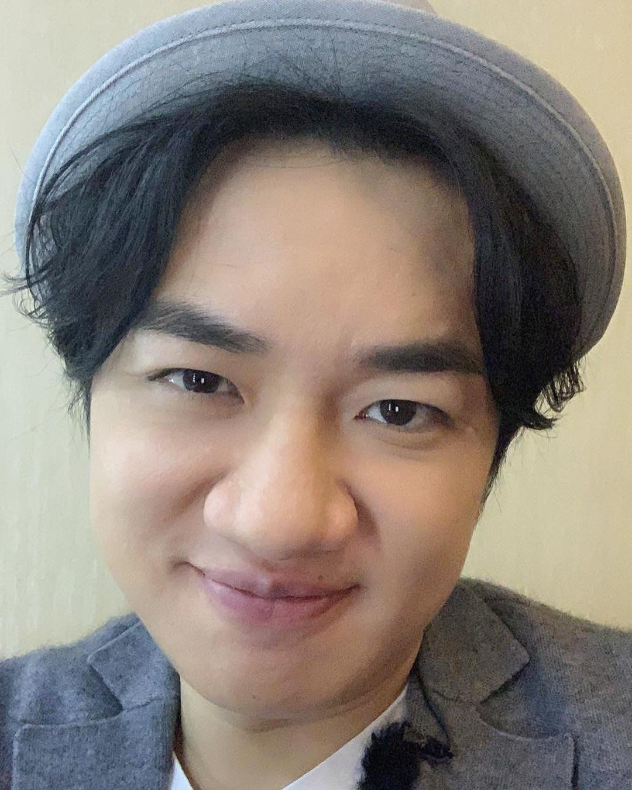
*【公屋名人】現時主力在內地發展的王祖藍，原來與容祖兒（Joey）是小學同學，因為他們從小也是在恆安邨長大，早前他們也相約小學老師和小學的朋友一同聚會談談往事。(wong_cho_lam@IG)*

*【公屋名人】楊怡：曾奪TVB視后，雖然與王祖藍和容祖兒（Joey）不是小學同學，但楊怡與其姐姐楊卓娜也是居住在馬鞍山的恆安邨。(tavia_yeung@IG)*

*【公屋名人】現年40歲的楊怡自與藝人羅仲謙於2016年結婚後，便慢慢淡出幕前，近日更迎來二人的女兒，但其實婚前的楊怡很珍惜每一個拍劇的機會，不介意每一個角色，只要有發揮的機會便會緊緊的把握，多年來堅韌的磨練讓她最後也獲得影后的獎項。(tavia_yeung@IG)*

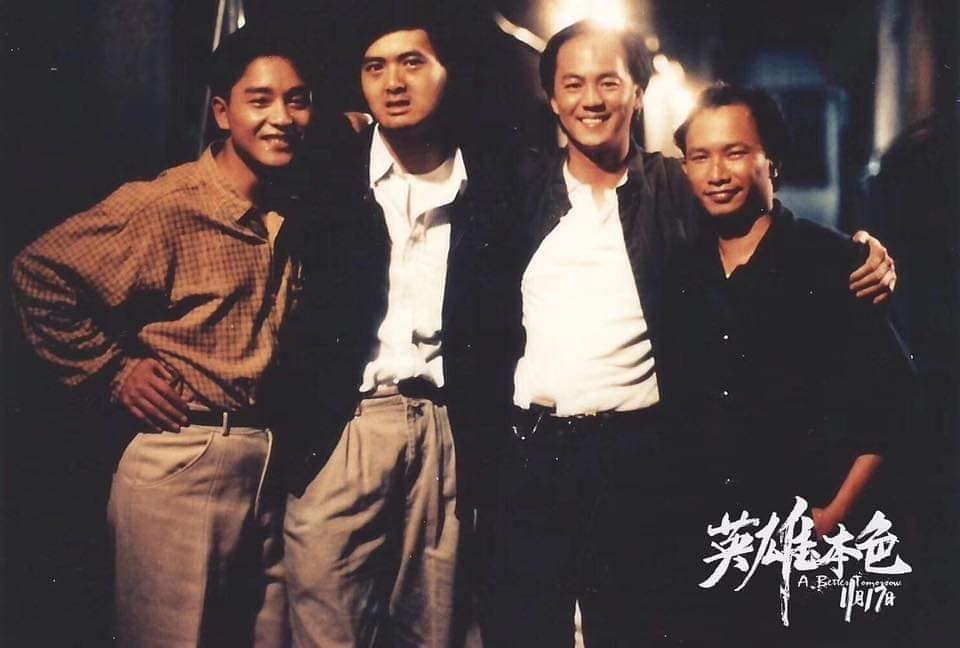
*【公屋名人】吳宇森(圖中的右一)：國際名導演(mov3@fb page)*

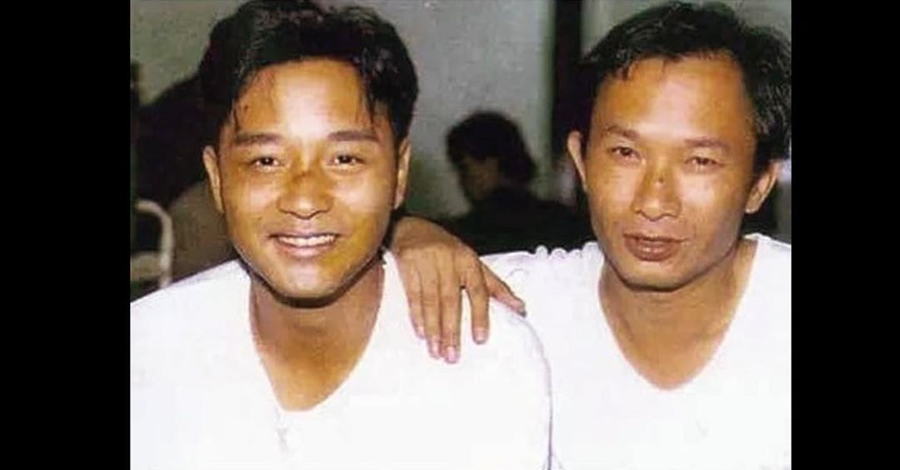
*【公屋名人】吳宇森成長於石硤尾邨，但並沒有限制他的發展與成功，凡是他拍攝的電影作品也受到了許多觀眾的喜愛，例如《辣手神探》、《英雄本色》與《喋血雙雄》也因為他的獨立拍攝風格而成為國際電影圈討論的焦點，讓他在國際的電影圈中打響名號。(lesliecheung4ever@IG)*

*【公屋名人】與曾國祥結婚的「女神」王敏奕(wongmanyik@IG)*

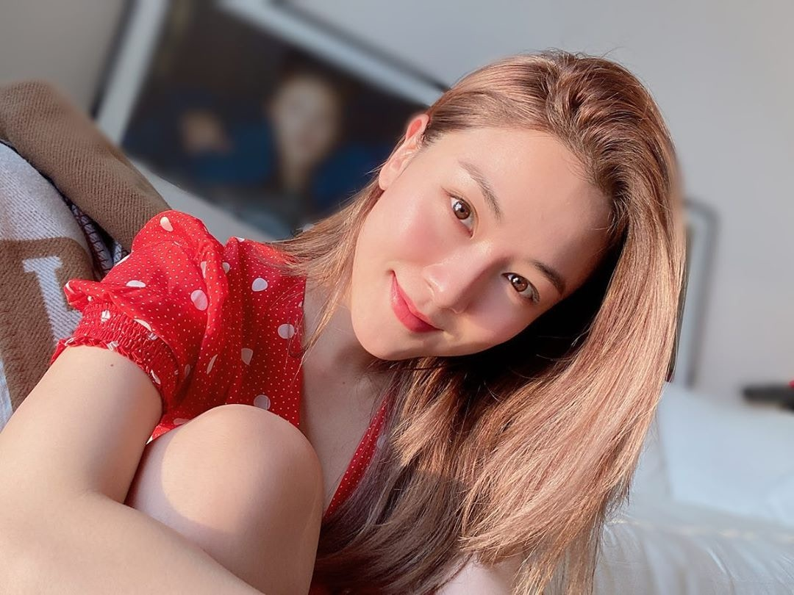
*【公屋名人】「女神」王敏奕童年時是居住在漁灣邨，但並沒有限制她想當藝人的夢想，反而努力讀書獲取好成績，讓一家人生活變得更好。(wongmanyik@IG)*
