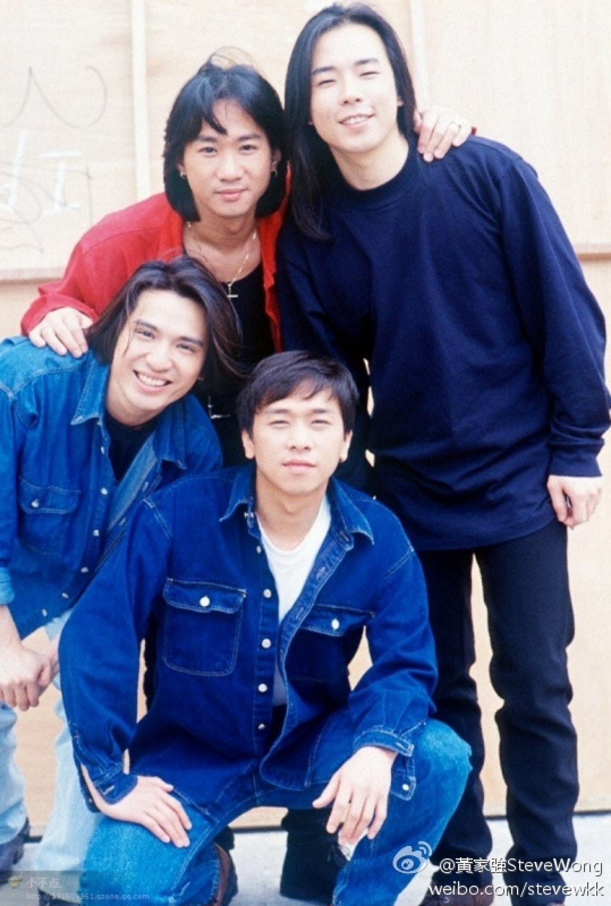

眨下眼Beyond主音黃家駒已經離開咗27年，6月30日係家駒死忌，圈中好友都有發文悼念。曾經於電影中同家駒飾演兄妹嘅唐寧，呢日喺IG上載二人合照。

唐寧1991年參演電影《Beyond日記之莫欺少年窮》，與黃家駒飾演兄妹。（電影劇照）

童星出身嘅唐寧1991年即係10歲嘅時候，參演電影《Beyond日記之莫欺少年窮》，與黃家駒飾演兄妹，唐寧上載一張二人合照，寫上「二哥」，悼念呢位大哥哥。唐寧曾經喺接受訪問時，憶述當年合作家駒相當照顧自己，拍戲最後一日感到不捨忍唔住喊。後來睇新聞得知惡耗，一路返學一路喊，最終無去到佢喪禮，但寫咗封信偷偷燒俾家駒。多年過去亦一直覺得家駒好似無離開長駐心中一樣。

唐寧上載合照悼念黃家駒。（IG：leilakong1205）

唐寧1991年參演電影《Beyond日記之莫欺少年窮》，與黃家駒飾演兄妹。（電影劇照）

唐寧1991年參演電影《Beyond日記之莫欺少年窮》，與黃家駒飾演兄妹。（電影劇照）

唐寧1991年參演電影《Beyond日記之莫欺少年窮》，與黃家駒飾演兄妹。（電影劇照）

已故Beyond樂隊主音歌手黃家駒及其弟黃家強也曾在蘇屋邨長大的知名兄弟班樂隊。(kwkpbeyond@IG)

黃家駒在日本錄影節目時從高處跌下後腦着地，留醫六天後於日本時間1993年6月30日逝世，終年31歲。（網上圖片）

黃家駒已經離開大家27年。（黃家強微博）
