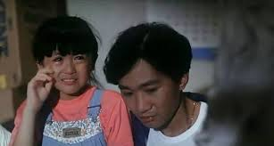
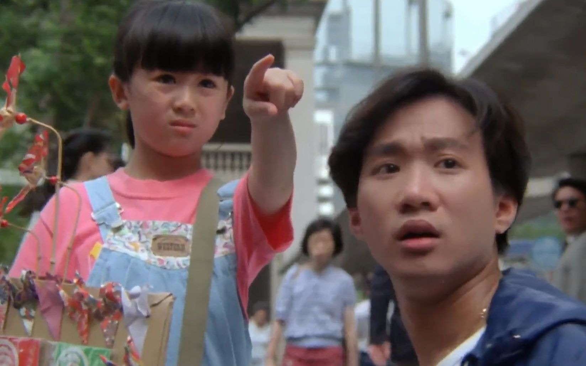
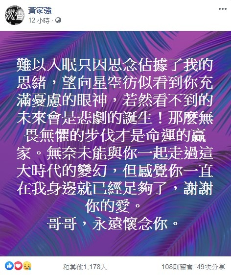

27年前的今日，Beyond主音兼靈魂人物黃家駒在日本拍攝節目時因意外離世，終年31歲。除演員唐寧上載兒時與家駒的合照外，胞弟黃家強及鼓手葉世榮都在社交網站貼文悼念，但結他手黃貫中卻未有任何動態。

唐寧上載合照悼念黃家駒。（IG：leilakong1205）

唐寧1991年參演電影《Beyond日記之莫欺少年窮》，與黃家駒飾演兄妹。（電影劇照）

唐寧1991年參演電影《Beyond日記之莫欺少年窮》，與黃家駒飾演兄妹。（電影劇照）

唐寧1991年參演電影《Beyond日記之莫欺少年窮》，與黃家駒飾演兄妹。（電影劇照）

唐寧1991年參演電影《Beyond日記之莫欺少年窮》，與黃家駒飾演兄妹。（電影劇照）

與早前紀念家駒生忌一樣，葉世榮準時在今日0時0分於微博發文，留下「我們懷念你」五字。而黃家強則在深夜近4時更新Facebook，表達對哥哥的思念，他表示：「難以入眠只因思念佔據了我的思緒，望向星空彷似看到你充滿憂慮的眼神，若然看不到的未來會是悲劇的誕生！那麼無畏無懼的步伐才是命運的贏家。無奈未能與你一起走過這大時代的變幻，但感覺你一直在我身邊就已經足夠了，謝謝你的愛。哥哥，永遠懷念你。」唯獨黃貫中的社交網站，至今仍未見有任何更新。

踏正0時0分，葉世榮在微博貼文悼念家駒。（葉世榮微博擷圖）

黃家強深夜在Facebook貼文悼念哥哥。（黃家強Facebook擷圖）

過往有支持者在Beyond演唱會現場表達對家駒的思念。（視覺中國）

過往有支持者在Beyond演唱會現場表達對家駒的思念。（視覺中國）

家駒離世後，Beyond改以3人樂隊發展。（視覺中國）

家駒離世後，Beyond改以3人樂隊發展。（視覺中國）

家駒離世後，Beyond改以3人樂隊發展。（視覺中國）

Beyond三子每年都會在社交平台紀念家駒生忌。（視覺中國）

家駒離世後，Beyond改以3人樂隊發展。（視覺中國）

Beyond在「The Story Live 2005」世界告別巡迴演唱會後正式解散。（視覺中國）

Beyond在「The Story Live 2005」世界告別巡迴演唱會後正式解散。（視覺中國）

Beyond在「The Story Live 2005」世界告別巡迴演唱會後正式解散。（視覺中國）

Beyond在「The Story Live 2005」世界告別巡迴演唱會後正式解散。（視覺中國）

Beyond在「The Story Live 2005」世界告別巡迴演唱會後正式解散。（視覺中國）

樂迷希望他日Beyond能夠重組，但家強認為機會微乎其微。（視覺中國）
