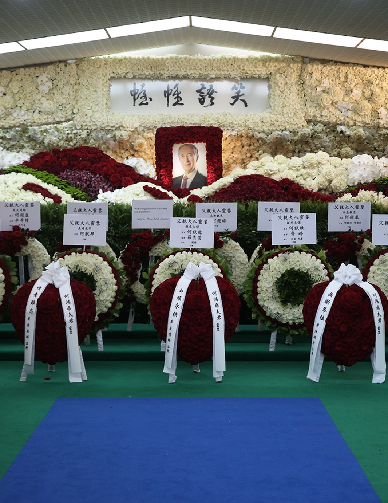
賭王何鴻燊於5月26日離世，享年98歲，結束傳奇一生。何鴻燊家族由7月8日起一連三日，包下整幢香港殯儀館為何鴻燊致喪。一般喪禮為期2日，3日並不常見，而且他們更包下全幢香港殯儀館，有指需要約七位數費用。

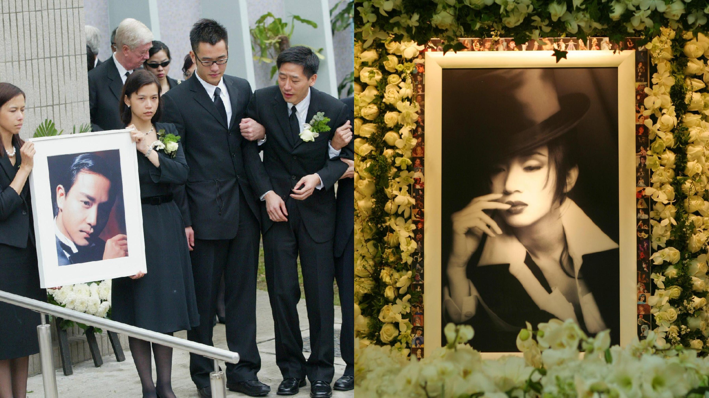
不少知名人士離世後，家人都希望現在為他們風光大葬，以顯示其身分，同時也讓各方好友可以憑弔逝者。《香港01》為大家盤點一下九個世紀葬禮。（視覺中國）

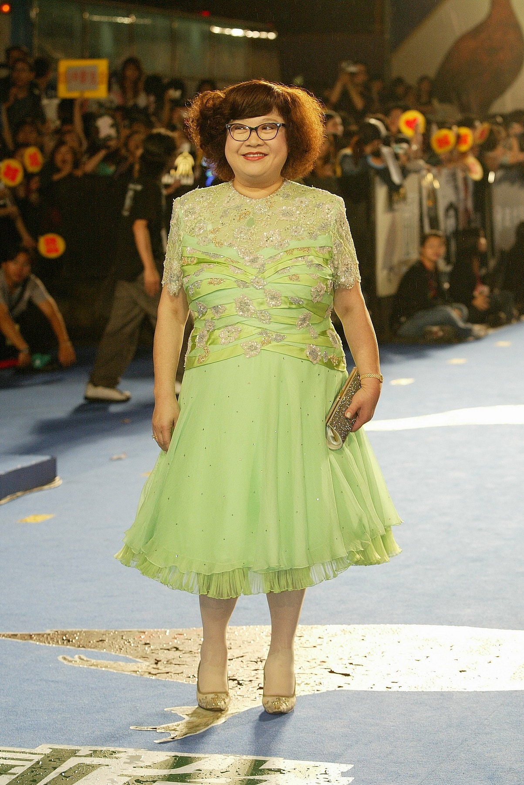
沈殿霞（視覺中國）

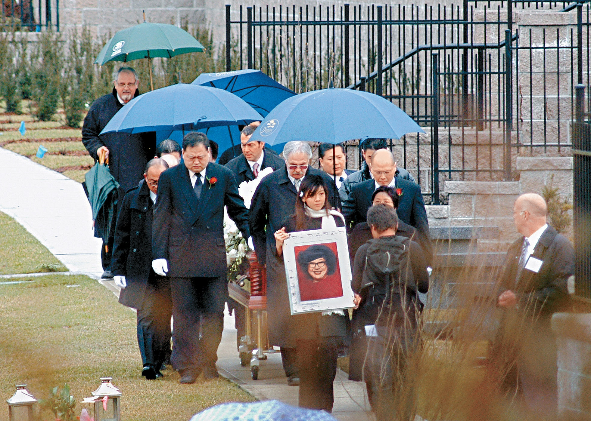
「開心果」形象深入民心的沈殿霞於2008年病離世，遺體由女兒鄭欣宜等親友陪同飛往加拿大溫哥華，並安葬在本那比市的科士蘭（Forest Lawn）墓園，卑詩省議會也有默哀悼念她。無綫為她舉辦追思會，她的契哥鄧光榮在發表演說時怒指她的前夫鄭少秋沒有盡父親的責任，更要求他上台解釋，結果由鄭欣宜打圓場。（視覺中國）

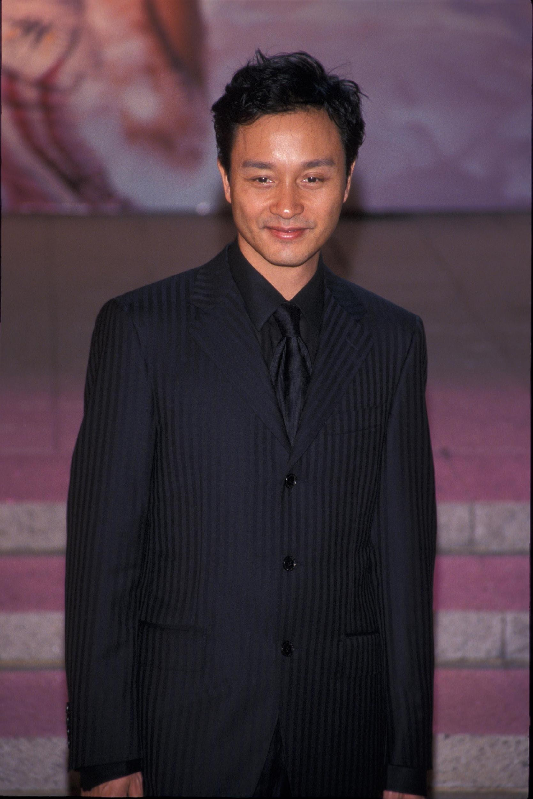
張國榮（視覺中國）

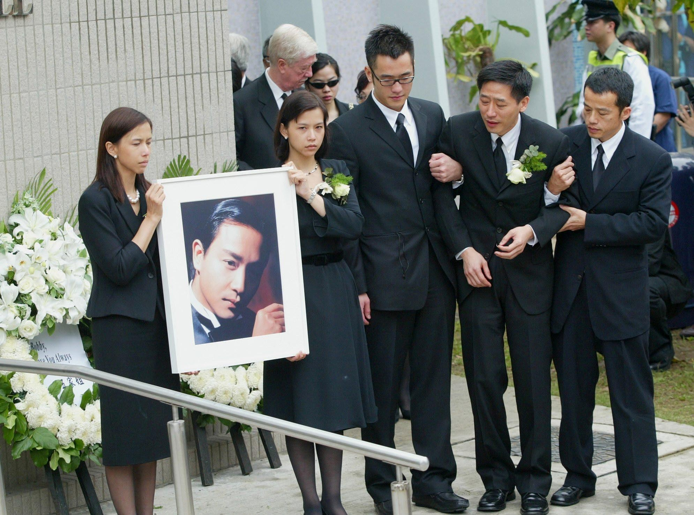
張國榮在演藝行業有重大成就，是不少人的偶像，可是在2003年，他在香港文華東方酒店墜下身亡，消息震撼圈內外。他的葬禮於香港殯儀館舉行，由唐鶴德以至親的身分與親友打點身後事。大批歌迷聚集於殯儀館外，到場的明星眾多，如他生前的好友梅艷芳，也悲痛至泣不成聲，多家電視台均現場直播報導葬禮實況。（視覺中國）

梅艷芳（視覺中國）

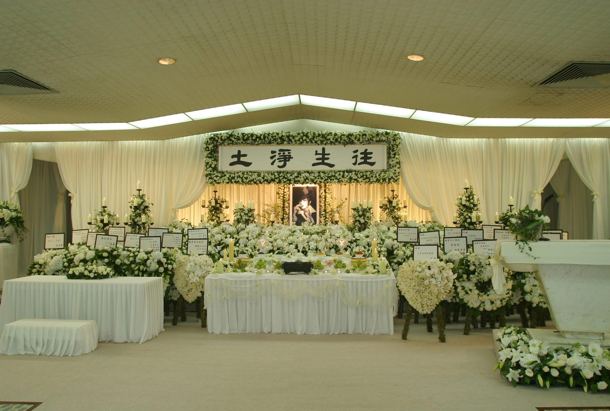
梅艷芳在2003年12月30日於養和醫院逝世，享年40歲，這個消息非常震撼。她在香港殯儀館出殯，治喪委員會以《別矣，香港的女兒！》為題刊登訃聞，有上萬市民參與送別，單是參與的香港藝人就有600人，另外也有內地藝人和政府官員等。數萬名影迷歌迷淚灑當場，送她的最後一程。（視覺中國）

Beyond主音黃家駒在日本拍攝節目時因意外離世，享年31歲。遺體運回香港後，於北角香港殯儀館設靈。同日晚上香港商業電台舉行「永遠懷念家駒」悼念音樂會，全場坐滿2600人外，大部分參與者情緒激動。翌日，靈車駛出殯儀館時，行人路上數千名樂迷衝出馬路圍着靈車，情況一度混亂。（影片截圖）

黃家駒（網上圖片）

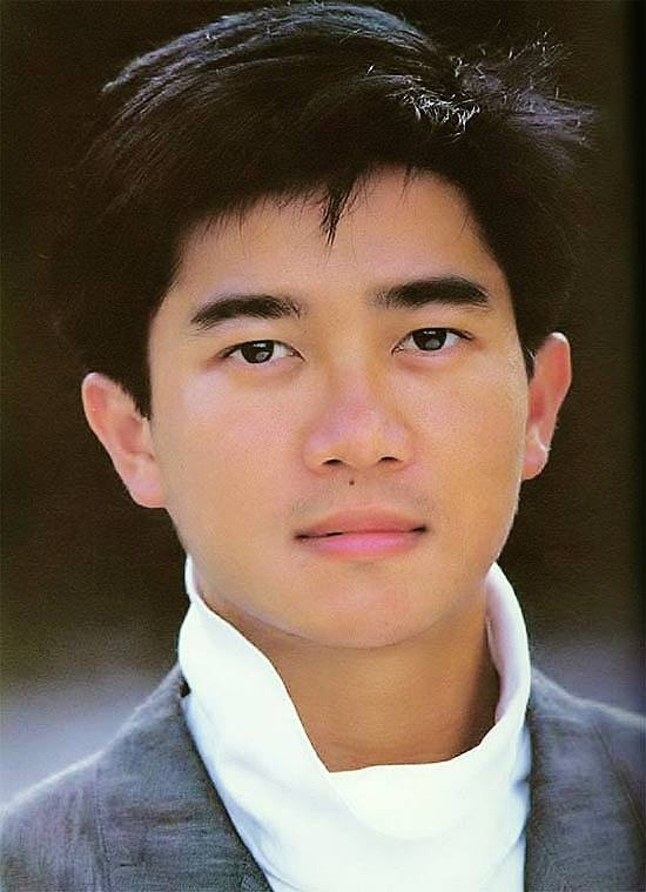
陳百強（網上圖片）

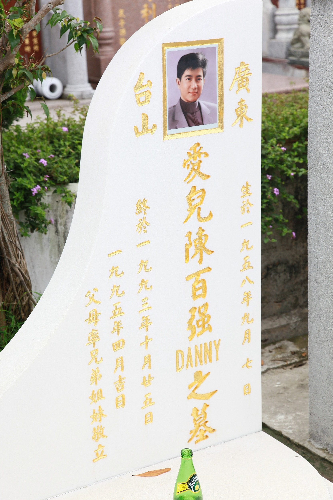
陳百強以白馬王子的形象迷倒萬千少女心中，可惜在1992年5月18日被發現在其寓所內倒臥昏迷，昏迷留院17個月後，於1993年，他因昏迷引發的逐漸性腦衰竭離世。眾多明星，還有數百名他的忠實歌迷席他的喪禮，他的葬禮現場，更播放着他生前唱過的歌，親友跟歌迷們非常哀傷，令人感悲慟。（視覺中國）

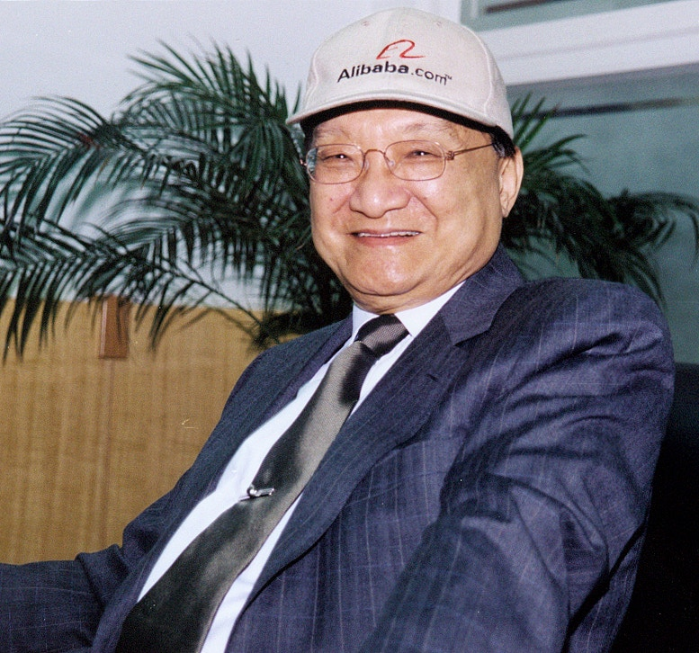
金庸（查良鏞）（視覺中國）

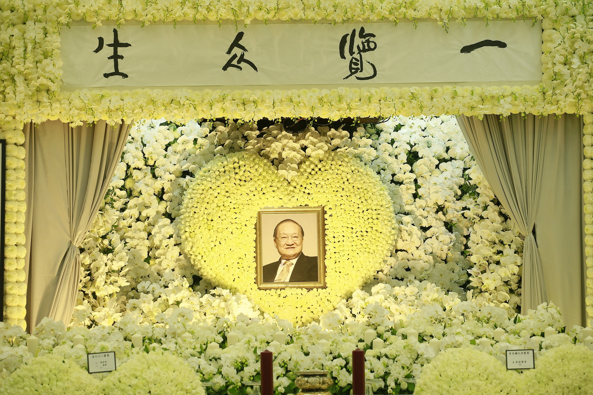
著名作家金庸（查良鏞）於2018年10月30日，在家人陪伴下於養和醫院與世長辭，享年 94歲。他在文學方面貢獻良多。他的喪禮以私人形式舉行，生前好友，包括作家蔡瀾、陶傑、李純恩、張紀中、黃曉明、前特首兼全國政協副主席董建華、前阿里巴巴集團主席馬雲等亦有到場送別，而華人世界多處均有悼念他的活動。（視覺中國）

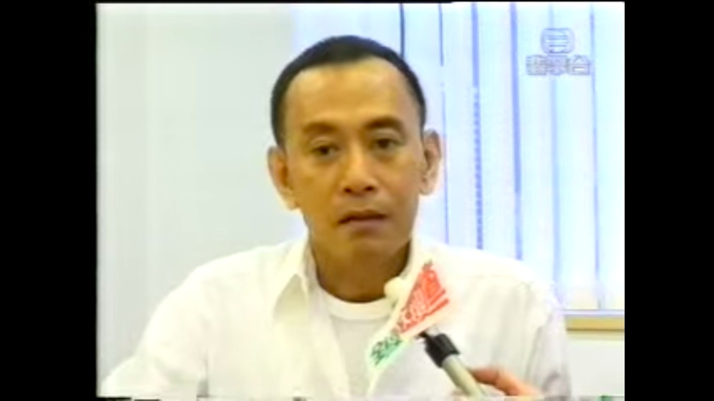
羅文（影片截圖）

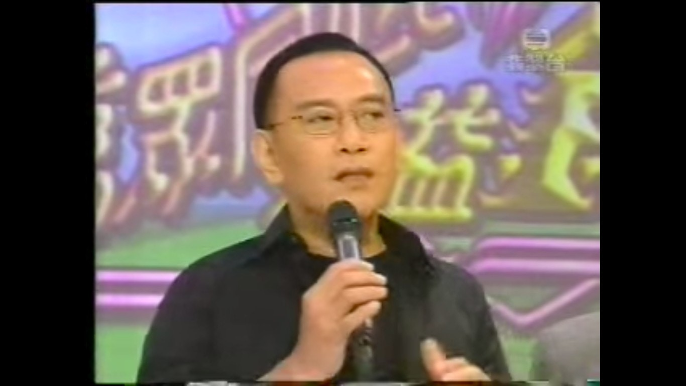
著名歌手羅文於2002年因肝癌於香港瑪麗醫院逝世，享年57歲。他的葬禮在香港殯儀館舉行，更有著名作家金庸親自爲他題「歌在人心」的橫匾。扶靈人也是位位名人，包括黃霑、楊受成、張學友、何麗全和鄭伊健等。（影片截圖）

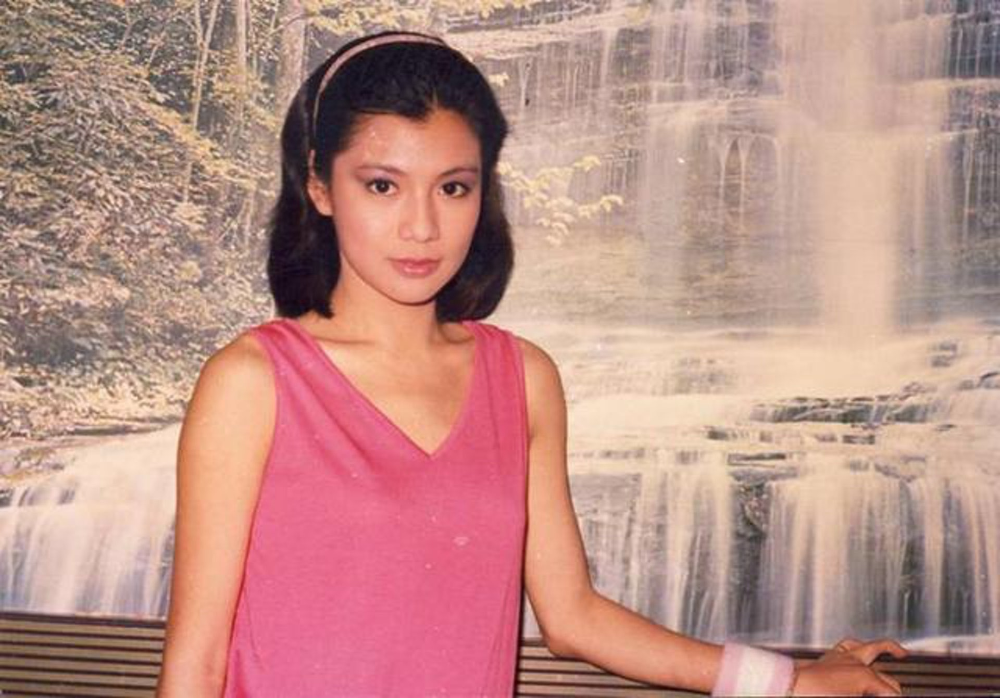
翁美玲（網上圖片）

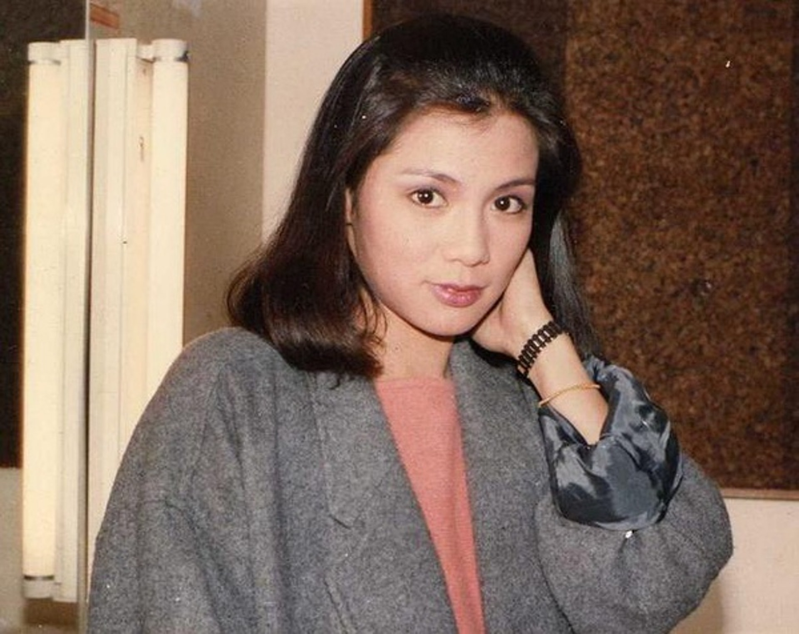
紅極一時的女星翁美玲，在1985年當紅時突然自殺身亡，終年26歲。葬禮在九龍世界殯儀館舉行，當時男友湯鎮業在友人的攙扶下，神色黯然地將一朵玫瑰花輕輕別在翁美玲的髮髻，將拿著的一把梳子一分為二，髮前一段隨著翁美玲的芳魂下葬，另一端保留，此為中年喪妻的祭奠風俗。靈柩由好友劉德華、梁朝偉等人扶靈。（網上圖片）

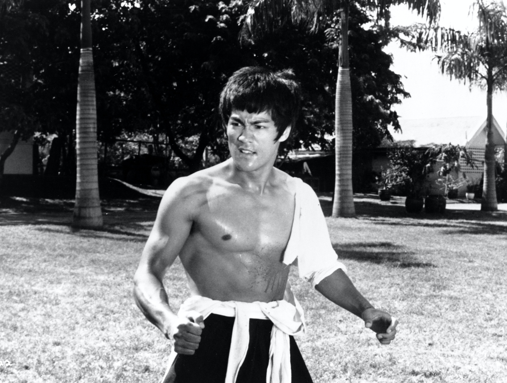
李小龍

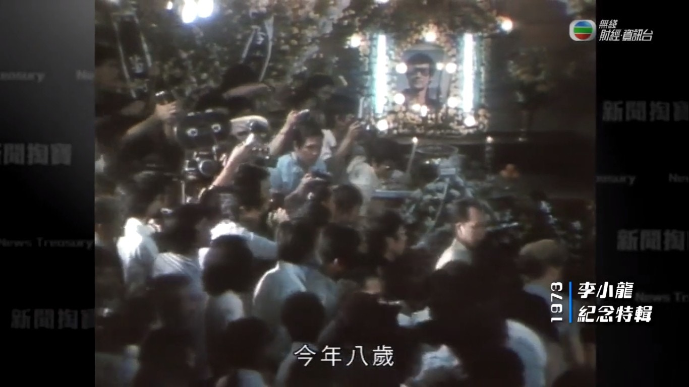
一代武打巨星李小龍於1973年逝世，他的影響深遠，也是不少人崇拜的對象。他在大角咀九龍殯儀館通宵設靈，靈堂主橫匾為「藝海星沉」、左右兩旁的副橫匾則寫有「哲人其萎」及「典型尚在」。除了有大量巨星去致祭外，附近街道更擠滿近3萬名市民，送別巨星。有人甚至冒險爬上大廈外牆的招牌，人群中有12人暈倒。（影片截圖）
