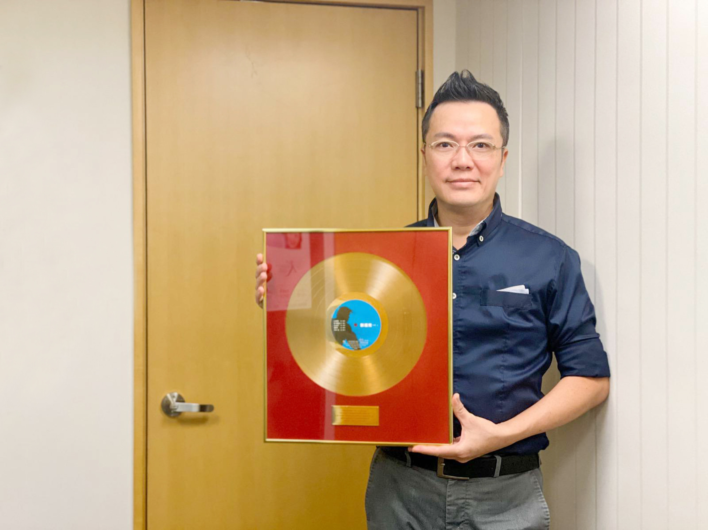
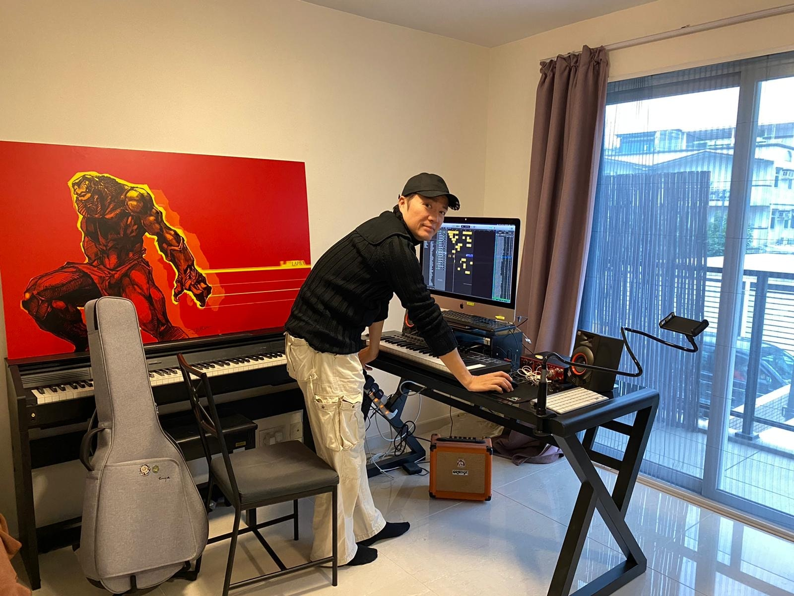

於90年代出道，憑歌曲《喜歡我》人氣急升，推出的首張同名唱片更獲得金唱片（唱片銷量達2.5萬張）的劉祖兒（Joi），曾經被視為潛力新星，可惜與唱片公司意見不合，只在樂壇閃現兩年便銷聲匿跡，現在則經營美容生意。

**「**01最賞睇娛樂大獎**」即日起至12月23日接受投票喇，答埋簡單問題，隨時贏最新5G手機12 Pro！**

相隔30年，近日劉祖兒有意「復出」圓夢，希望將當年黃家駒為他創作的一首歌面世，劉祖兒說：「之前佢作咗一首歌畀我，我覺得好好聽，可惜好多因素唔能夠出，咁多年都覺得好可惜，係一個遺憾所以即使我轉行打理美容生意，一直都有將這首歌收藏起來。」此外，他還趁疫情期間創作了不少歌曲，笑言自己「重操故業」。

劉祖兒曾獲得金唱片，非常犀利。

原本劉祖兒以為要完成這個心願遙遙無期，但卻在機緣巧合下遇到一位有心人，在對方協助下將這首歌重新編曲，他興奮表示︰「呢個心願放咗喺心30年，一直都覺得冇咩可能可以圓夢，但重新聽到呢首歌時真係好感動！」

劉祖兒直言將黃家駒創作的歌曲「重見天日」，只是對對方的一份尊重，無意「消費」對方，他說︰「重新錄製《望》這首歌，是因為想將過去未完成的事完整，而且感覺上，也是對家駒的一份尊重。」久未獻聲他為以最佳狀態去演繹這首作品，現在密密練歌，他笑說︰「已經好耐冇入錄音室，所以都有啲緊張，現在喺屋企密密咁練，又會搵女兒陪我一齊唱，成家人都變晒我的粉絲咁。」

劉祖兒希望將當年黃家駒為他創作的一首歌面世。

劉祖兒希望將當年黃家駒為他創作的一首歌面世。

劉祖兒希望將當年黃家駒為他創作的一首歌面世。

劉祖兒有心人協助下將這首歌重新編曲。
