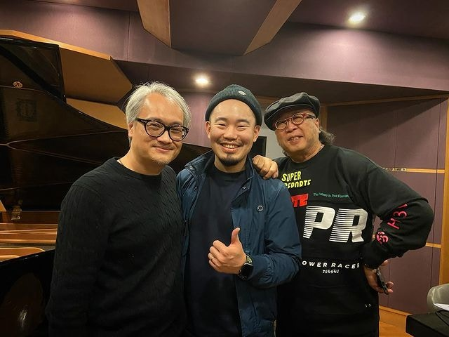
前八三夭鼓手Fish（中）與金牌製作人鮑比達（右）合作錄製爵士樂專輯，其中三首歌屬「音樂永續」計劃下的作品。（黃子瑜Instagram圖片）

林家謙盧巧音等獲IFPI邀重新演繹金曲 「音樂永續」創逾800職位

音樂永續︱享樂團重唱王菲經典《流非飛》 旨呈：錄主音挑戰最大

三首作品中，又以改編《海闊天空》最為吸引，4te!不但將這首耳熟能詳的搖滾作品以爵士樂方式呈現，更決定以純音樂方式呈現，相當具新鮮感。即使過往改編經驗豐富，在隊中擔任鍵琴手的鮑比特仍覺得是一大挑戰：「因為觀眾對舊版本太熟悉，我的任務是將舊歌180度轉變，但保留原曲的旋律和情懷。」

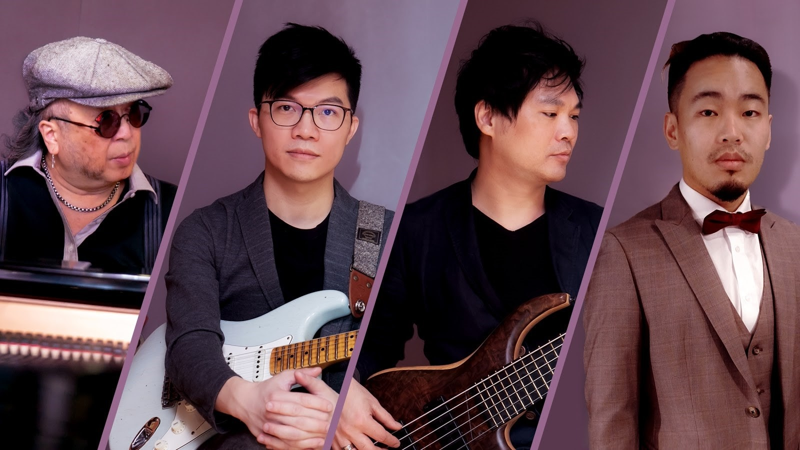
爵士樂隊4te!包括（左起）鍵琴手鮑比特、結他手關嘉傑、低音結他手曾德康及鼓手黃子瑜。

樂隊成員亦甚有來頭，包括前八三夭成員，現任新晉樂隊R.O.O.T.鼓手黃子瑜（Fish），曾在2020年台灣第31屆金曲獎入圍演奏類最佳專輯獎、演奏類最佳專輯製作人獎及演奏類最佳作曲人獎的關家傑（Alan），及曾為 Connie Talbot 演唱會、古巨基婚禮的擔任音樂總監，的低音結他手曾德康。

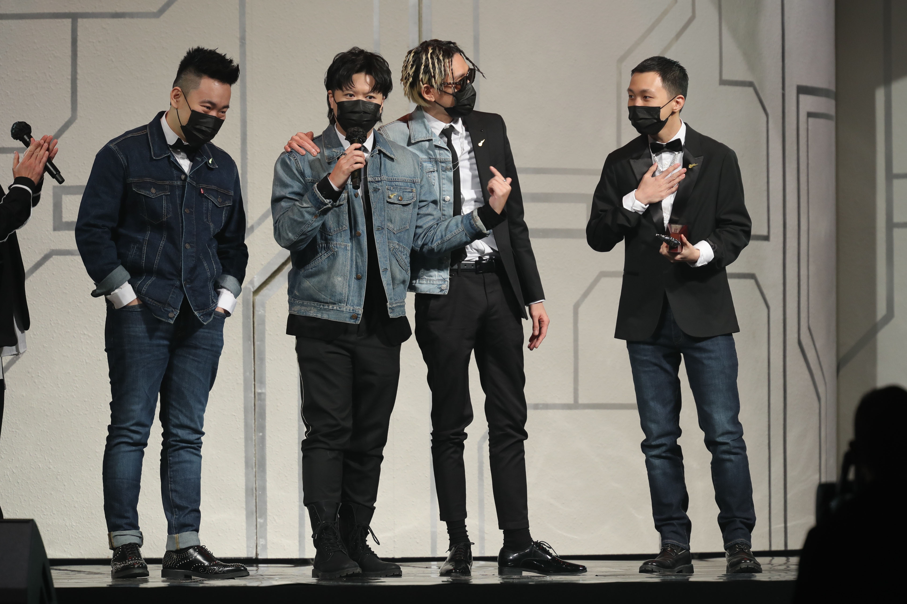
Fish現任新晉樂隊R.O.O.T.鼓手，上年奪得「叱咤樂壇生力軍」銀獎。（資料圖片）

與此同時，4te!亦邀請兩位發燒女聲天后Susan Wong（黃翠珊）和Chlara（卡兒）合作，分別翻唱《蔓珠沙華》和《愛情陷阱》。當中經常演繹英文歌的Susan再次挑戰廣東歌，認為作品經改編後「保留原曲的悲哀，但以爵士把傷感減輕，帶出big bang的感覺，是比較摩登的演法。」

Susan Wong負責翻唱《蔓珠沙華》。

而Chlara其實是位英國出生的菲裔女歌手，成品在咬字上仍有進步空間。其實她在答應邀請後用約一個月練習廣東話，而鮑比達在錄音過程中十分嚴謹，單單第一句已經要重唱半小時。Chlara希望透過作品為大家打氣：「很想念在香港的大家，可惜因疫情關係，三個月前發行專輯時沒有機會與來香港與大家見面。特意製作這首廣東歌答謝廣大樂迷支持，希望以輕快的旋律為大家加油打氣！」

Chlara今次挑戰唱廣東歌，翻唱《愛情陷阱》。

**點擊下列圖輯，了解不同歌手在「音樂永續2020」重新演繹的歌曲：**

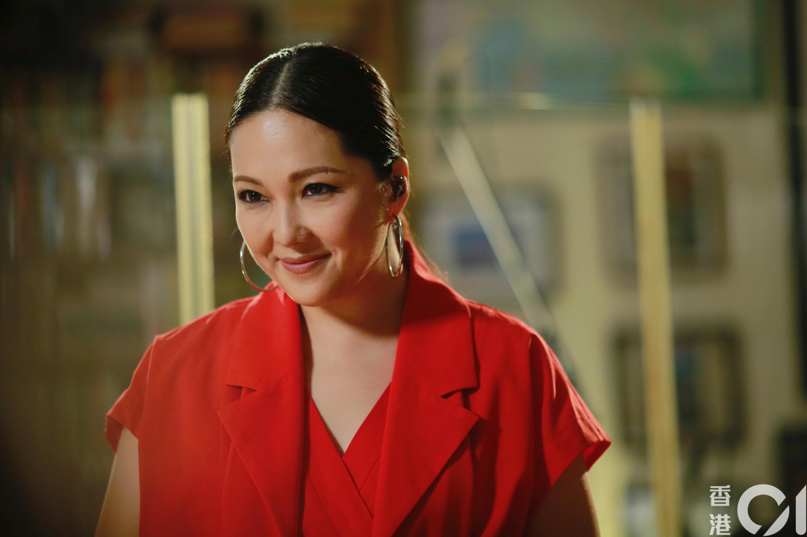
衛蘭《漣漪》（資料圖片）

譚杏藍《月球上的人》（資料圖片）

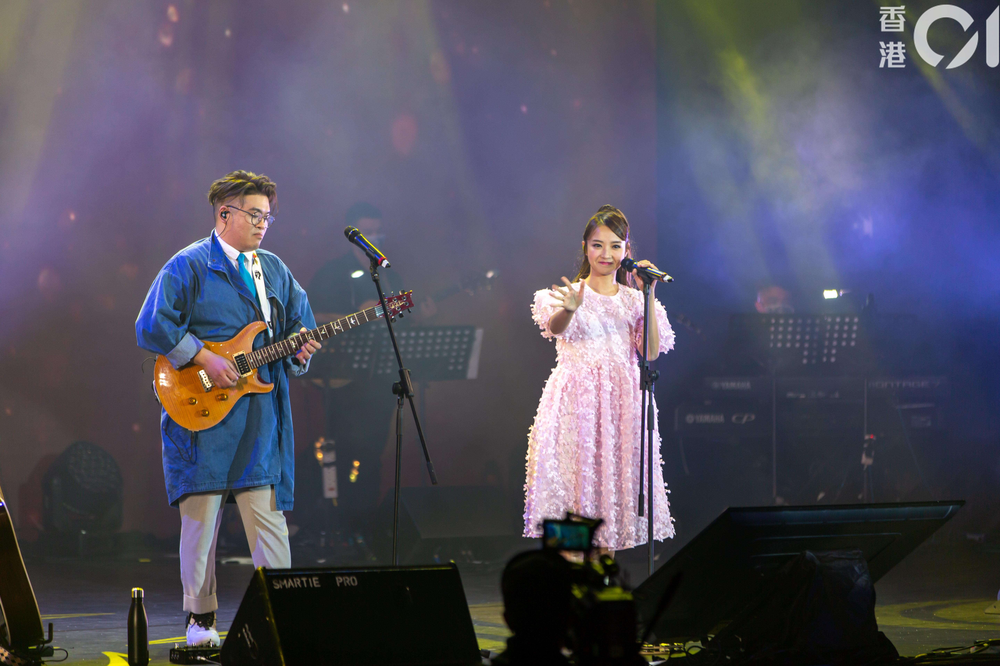
糖兄妹《怎麼捨得你》、《愛我還是他》（資料圖片）

泳兒《天黑黑》（資料圖片）

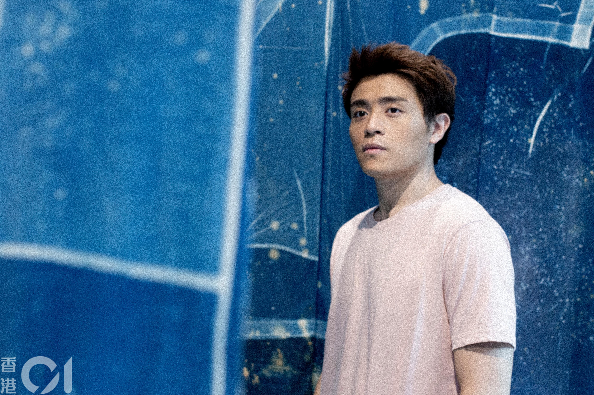
安俊豪《士多啤梨蘋果橙》（資料圖片）

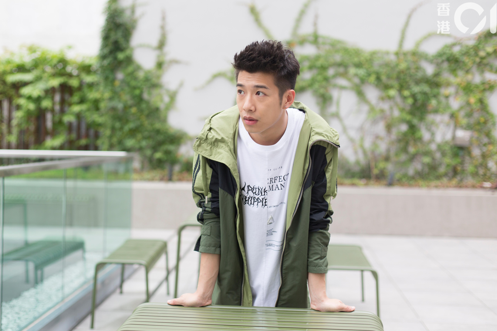
洪嘉豪《幾分鐘的約會》（資料圖片）

天堂鳥《今生不再》（資料圖片）

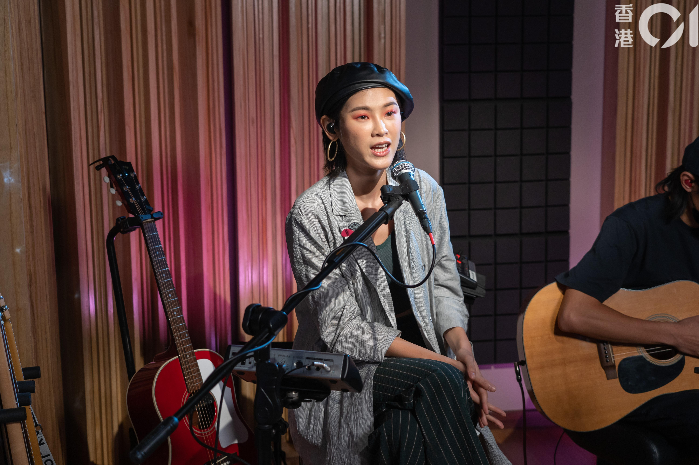
陳蕾《純真傳說》（資料圖片）

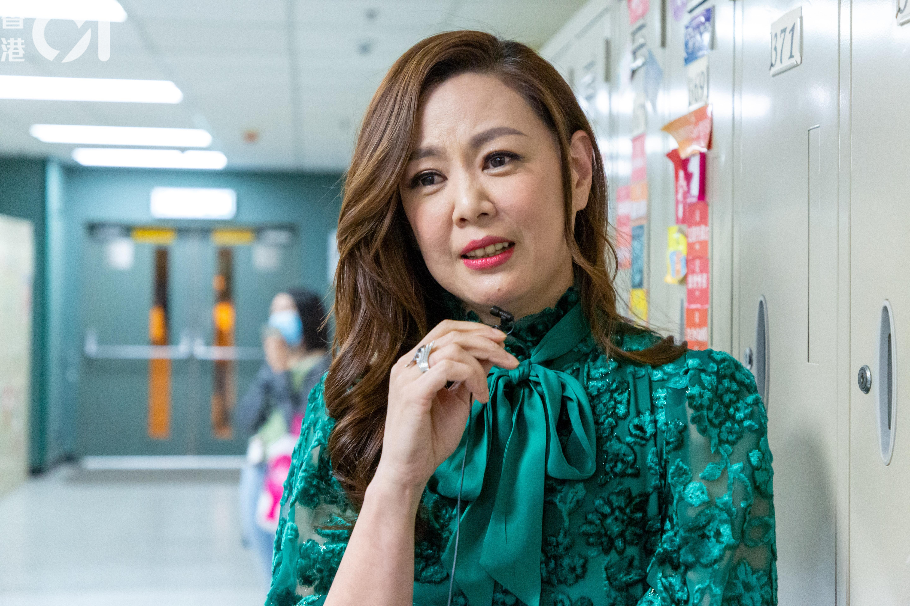
王馨平《無奈那天》、《怪你過份美麗》（資料圖片）

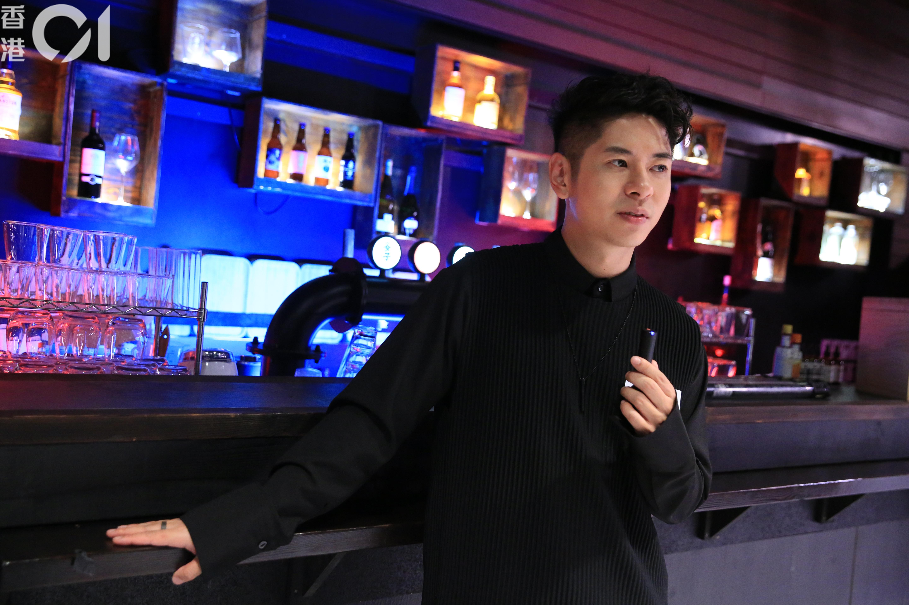
許廷鏗《追憶》（資料圖片）

曾樂彤《不一樣的我》（資料圖片）

林欣彤《深愛著你》（資料圖片）

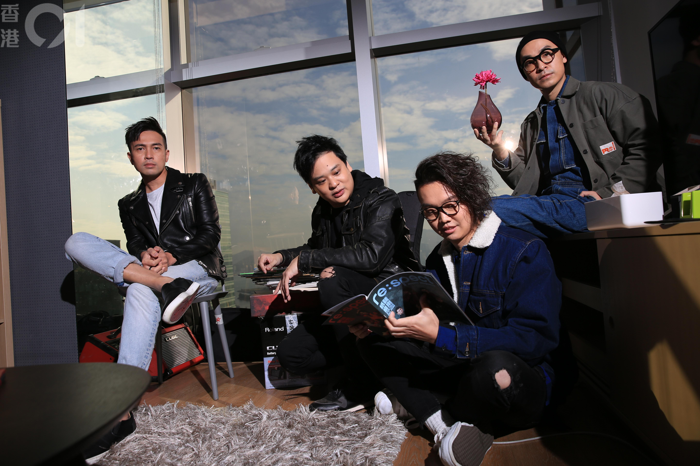
Dear Jane《愛的呼喚》（資料圖片）

李端嫻《淺草妖姬》（資料圖片）
