流行曲一直是我生命中的重要一環。我曾以樂壇人士、學者及樂迷的身份和流行曲邂逅，並發展出名為「AcadeMediArTradExperiencEducation」的一套想法和實踐方向，提出從學術、媒介、藝術、商業、體驗和教育等不同角度切入音樂，了解及發現當中更多可能性和多義性。

> 文：黃志淙 ｜ 原題：我與四首廣東歌的故事：黃志淙回應朱力行的《廣東雞尾歌》

跨界、互動、多元、混雜，是流行音樂的特性。很多人會把流行音樂視作娛樂和消遣，但亦有不少人視之為文化藝術。因此流行曲不只經常在媒體出現，也是學術研究、論文和論壇的常客。對於流行曲，每個人都因着自身經歷而有不同理解，繼而得到不一樣卻又共通的體驗。換言之，同一首歌，它既可以是大熱「K歌」，也可以盛載重要而深遠的文化及社會意義。

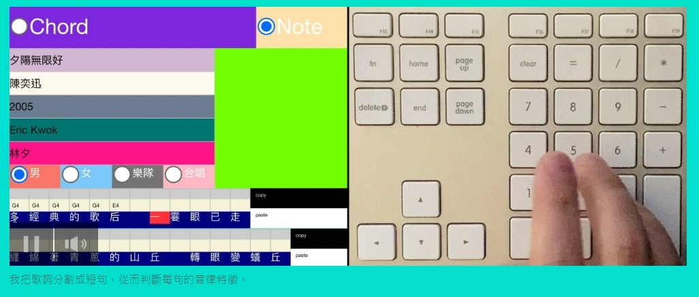
*朱力行的廣東雞尾歌是M+數碼委約項目， 於「M+ 故事」的互動展館展出。這系列項目希望在視覺文化與科技交會之處，探索別具創意的網上實踐。https://cantococktail.com/zh/about  截圖*

這次，朱力行（Henry Chu） 的數碼項目《廣東雞尾歌》解構了香港流行音樂。此項目具有非線性、切割、重組、混雜的特質，也是挺後現代的。只要你用少許時間，試試唱他特別調製的卡拉OK雞尾歌，就會發現這跟你唱過的卡拉OK完全不一樣。當中旋律和文字的奇異組合可能令你重新想像：到底流行曲的工業運作是否一定程式化？易上口的「K歌」是不是必定好賣？音樂人又有哪些掣肘？

我從他的歌單選擇了四首廣東歌，分享我對它們的理解，以及我與歌曲或歌手交會的故事。它們不一定能夠代表四季或四維，但都包含一些既大眾又個人的跨界故事。雖然它們皆屬於七十至九十年代的作品，但由於它們具備超越時空、歷久不衰的特質，相信你也能從中找到自己的體驗、蹤影、想像或脈絡。

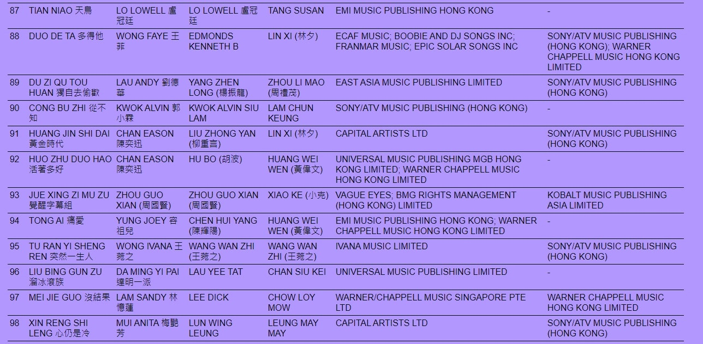
*《廣東雞尾歌》詳列選曲背景。下圖為部份選曲——https://cantococktail.com/zh/about 截圖*

## 許冠傑《半斤八両》

許冠傑（Sam Hui）是將廣東歌普及化的重要功臣。由六十年代擔任蓮花樂隊的主唱，演唱英文歌曲，到七十年代的《鐵塔凌雲》、《鬼馬雙星》、《半斤八両》等，他成功在歌曲中結合西方音樂曲風和香港生活的題材，將書面語及地道廣東話夾雜在歌詞中。自那時起，廣東歌慢慢超越國語歌和英文歌在市民心中的地位，成為主流大眾的聲音；香港人的母語亦成為流行文化的一部份，帶動身份認同的尋找。

Sam Hui是我的中學和大學的師兄。近年，母校港大和英華書院分別在百周年和二百周年推出慶祝主題曲《明我以德》和《天地人》找來Sam Hui譜曲，以及一眾校友來製作和演唱。能與Sam一起錄音和拍攝音樂錄像，實在榮幸至極，夢幻有如置身蓬萊。

2011年，我找林夕為港大百周年主題曲填詞時，大家談到怎樣在變幻的世界和世代中，依然能夠站穩立場、堅守信念面對挑戰。他巧妙地將港大校訓「明德格物」融入歌詞，填上「明我以德」。然後，在周博賢的編曲及監製下，我們與謝安琪、許廷鏗等一群同學演唱了這首感人的勵志歌。無論是否校友，在十年後的今日，人們仍能從中找到共鳴。

無論是浪子、學生哥或尖沙咀Susie的心聲，阿Sam的港人港歌，必不可少。

## 達明一派《石頭記》

有如一貫進念的出品，劇中並沒有直接描述《石頭記》中的人物和劇情。然而，出自邁克之手的歌詞則有較為明顯的指涉，是聽眾理解劇目的切入點。雙雙對對的疊詞易記好唱，亦令達明一派更「入屋」。

*達明一派 (資料圖片)*

*達明一派 (資料圖片)*

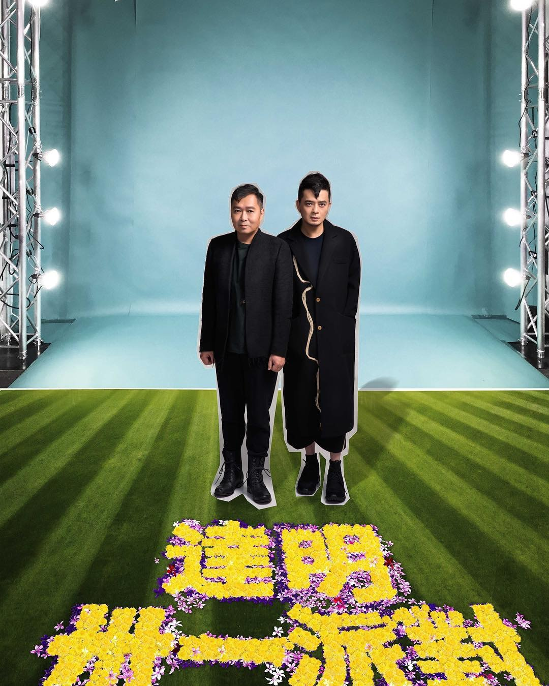
*達明一派 (資料圖片)*

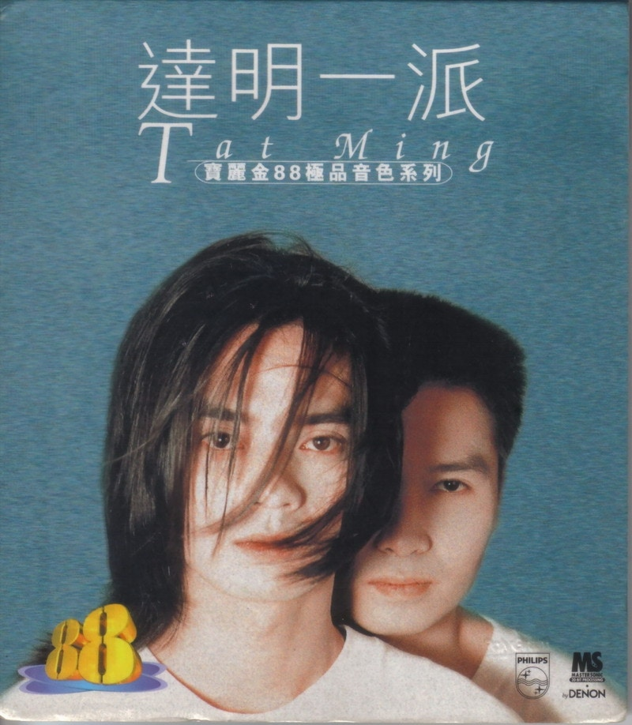
*達明一派 (資料圖片)*

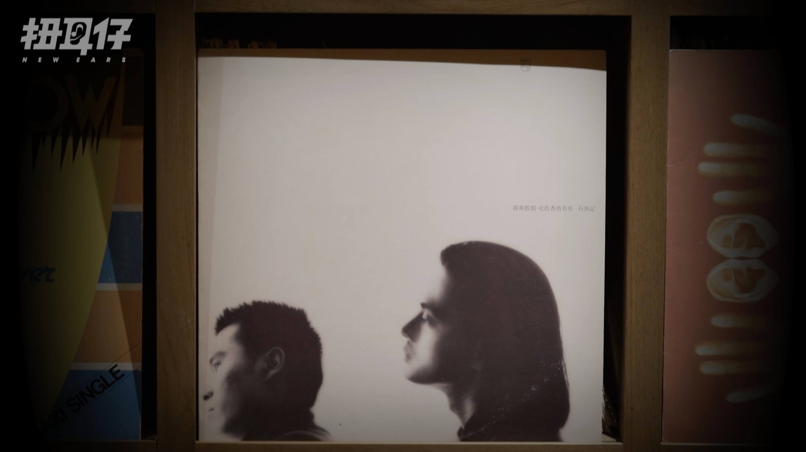
*達明一派 (資料圖片)*

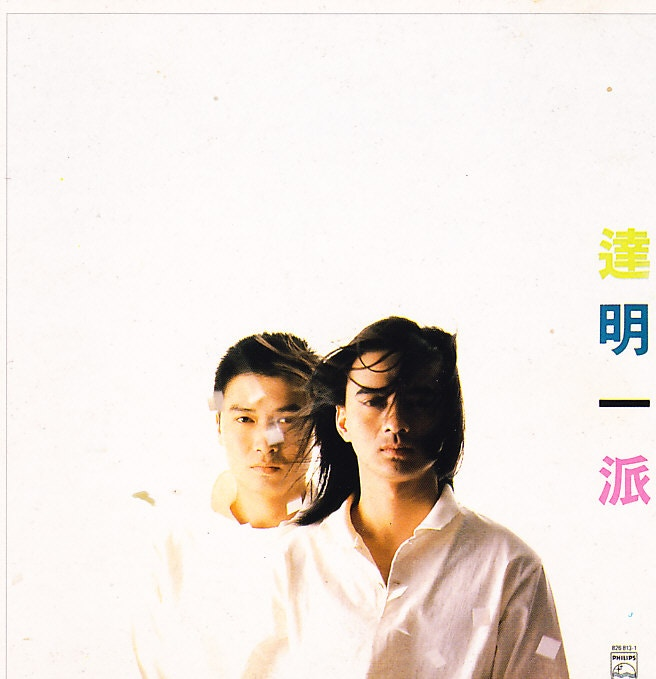
*達明一派 (資料圖片)*

*達明一派 (資料圖片)*

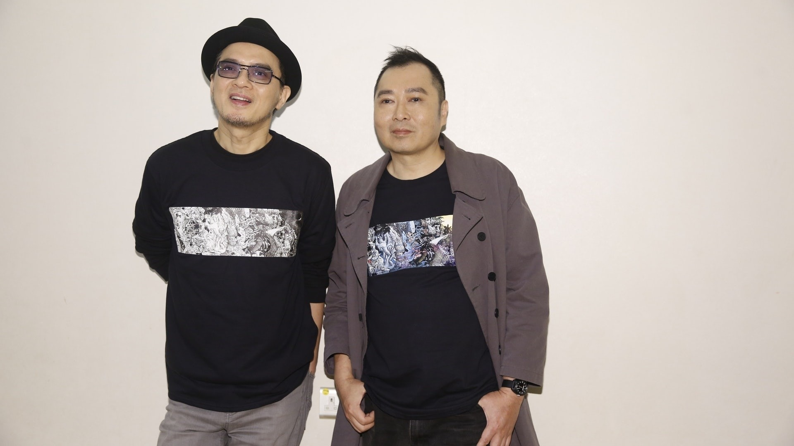
*達明一派 (資料圖片)*

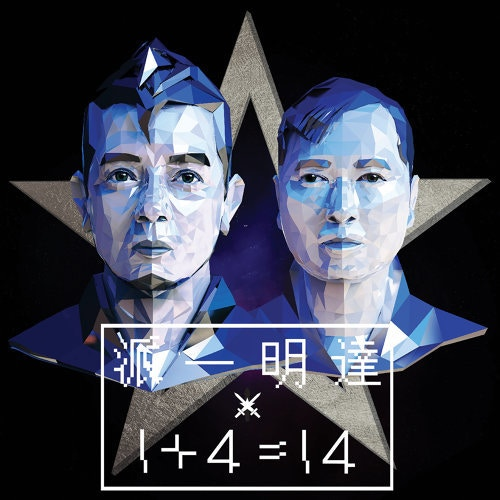
*達明一派 (資料圖片)*

*達明一派 (資料圖片)*

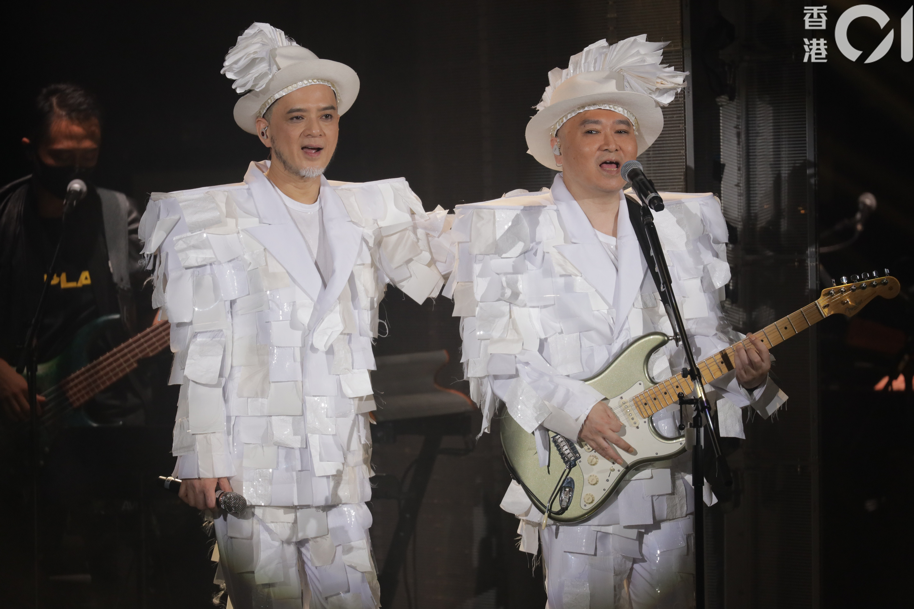
*達明一派 (資料圖片)*

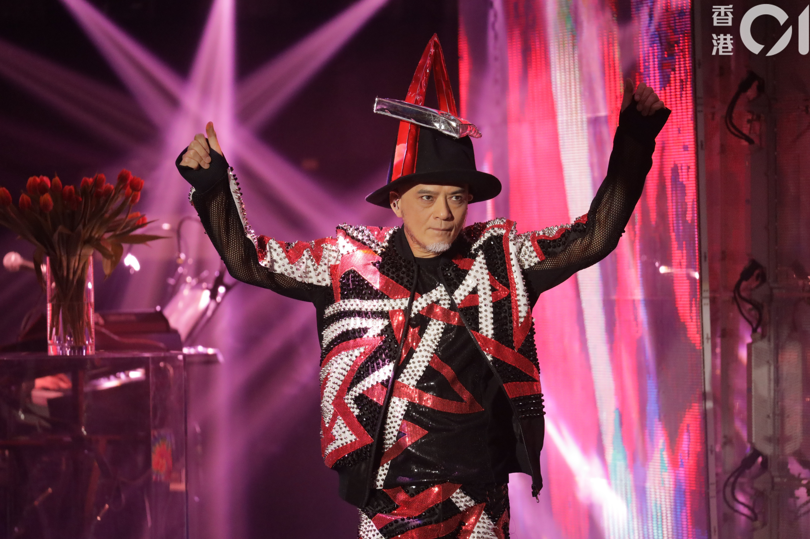
*達明一派 (資料圖片)*

*達明一派 (資料圖片)*

*達明一派 (資料圖片)*

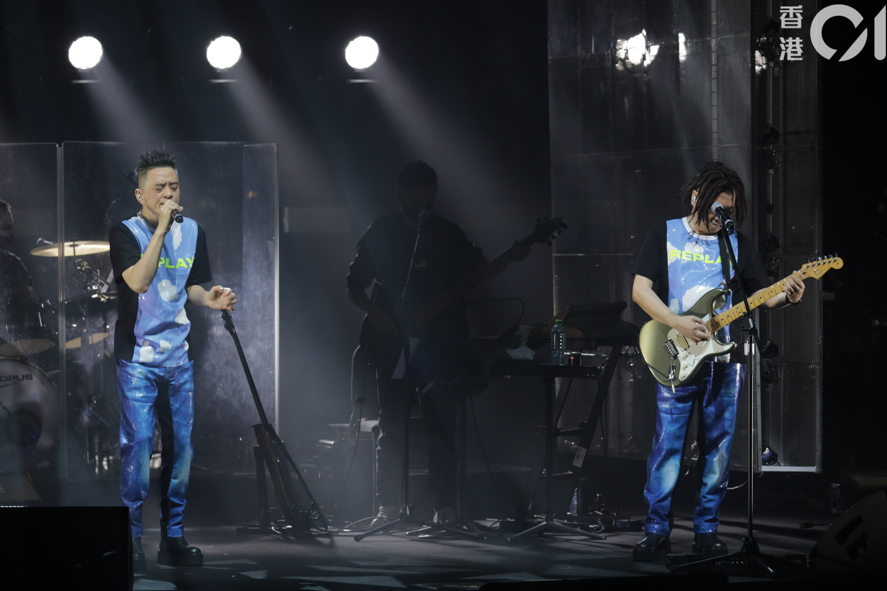
*達明一派 (資料圖片)*

由曹雪芹的《紅樓夢》（1791年），到1987年實驗藝術團體進念二十面體的舞台製作，再到達明一派第二張大碟的主題歌曲，《石頭記》本身就跨越了文學藝術和流行文化的界限。《石頭記》是為配合舞台劇而出的，黃耀明也是初次跨界在劇場中演出。拍檔劉以達用西方電子音樂碰撞東方／中樂風格，令大家耳目一新，恍如Andy Warhol式Pop Art的化學作用。

大家高唱「絲絲點點計算，偏偏相差太遠，兜兜轉轉……」之時，這首歌本身的文本和生命，當中反映的社會現象亦可作為學術研究及教育的典範例子。大碟《石頭記》內的歌曲也借用了其他著名文學和電影的名字：《馬路天使》、《一個人在途上》、《傷逝》、《後窗》等。箇中的中西合璧的個人體驗、借古喻今的思考，皆是充滿撞撃碰撞的有趣歷程。

《中英聯合聲明》在1984年簽署後，大眾對「五十年不變」的承諾一直有不同的詮釋，對香港前途的想像有樂觀也有悲觀的。進念和達明當年的合作和實驗，正是嘗試在文化上、文本上，作出多義性的探索。

80年代中期，我一邊唸傳理，一邊在電台工作。當時剛好在商台節目《突破時刻》見證達明的誕生，也開始大播特播他們的處男作品《繼續追尋》。所以，兩年之後能夠看到《石頭記》為他們成功攀上高峰及廣為人知，實在感到欣喜。隨後他們的作品，在曲風、形象上，既走在時代尖端，又緊貼香港人的城市脈搏，伴隨我們經歷了一浪又一浪的大時代和許多風起雲湧。到了2020年冬季，他們在灣仔伊利沙伯體育館開音樂會，我們大合唱了一整晚。放下了理性分析，感慨又激動。

## Beyond 《海闊天空》

每次聽到《海闊天空》，就會想到家駒在1993年離世的悲劇！此後，在舞台上唱出這首歌的是其他Beyond成員。再之後，人們在香港或任何地方，在K房、在街上、在心中，高唱我歌的意義和想像，遠遠超越了作者最初的構想。

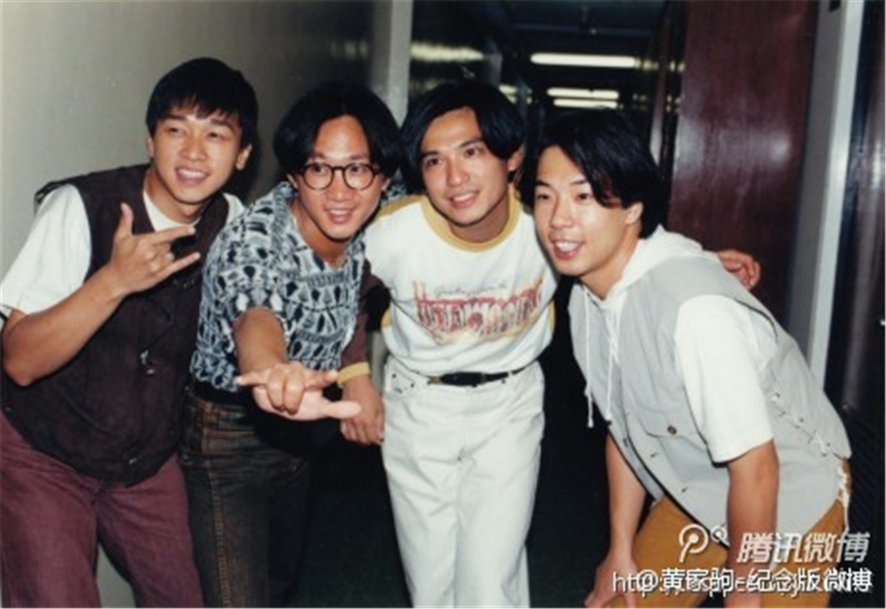
*Beyond樂隊 (資料圖片)*

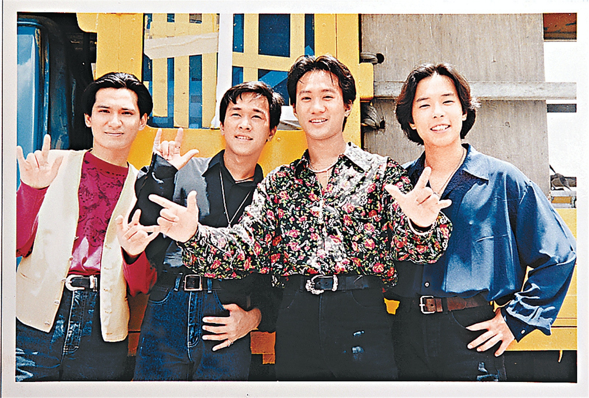
*Beyond樂隊 (資料圖片)*

*Beyond樂隊 (資料圖片)*

*Beyond樂隊 (資料圖片)*

*Beyond樂隊 (資料圖片)*

*Beyond樂隊 (資料圖片)*

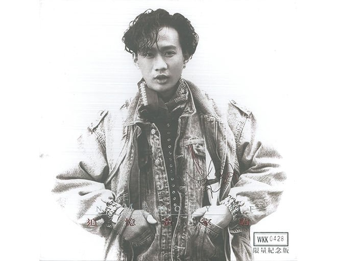
*Beyond樂隊 (資料圖片)*

*Beyond樂隊 (資料圖片)*

*Beyond樂隊 (資料圖片)*

*Beyond樂隊 (資料圖片)*

《海闊天空》除了是Beyond樂隊最廣為人知的作品之一外，曾經在香港也成為廣告歌，亦常在社運中出現。陳可辛的電影《中國合伙人》（2013年）中，戲中的內地人物於九十年代的奮鬥期也選唱過。另外，電影在台灣上映的名字就是叫《海闊天空》，可想而知這首歌在華人社會的廣泛影響。

此曲是關於理想與現實？還是自由與和平？就算把它切開和消音，我們都會認得它，因為它的生命已經深深扎根在大家的心坎和文化裏。

認識Beyond是始於他們的卡式錄音帶《再見理想》（1986）。當時從隨身聽傳到耳朵的，不單是家駒震撼心靈的嗓子，還有背後的搖滾精神。於是我便把主題曲從卡式帶複製到大型的開卷磁帶，然後在大空氣中播放。對於「前互聯網絡年代」，電台是音樂廣傳的主要渠道。當時電台主要是播放黑膠唱片，獨立自資的卡式帶能夠在電台節目中播放，是一件難能可貴的事情。

1992年6月，我有幸在電台為家駒慶祝他的三十歲生日，也拍了極珍貴的合照。翌年6月，他便不幸離世。這張照片記載了濃烈的感情和傷感！

## 梅艷芳《似水流年》

懷舊時、想念時、追憶時，電影主題歌曲都能夠超越時空，把零碎片段，交織出立體的畫面，動人的感覺。

嚴浩執導的《似水流年》是關於親情愛情及家國鄕情，也是其中一部最早在中國改革開放後在內地拍攝的香港出品，記錄了人們在當時的不同寄望和憧憬。同名主題曲難得地結合了喜多郎和黎小田的音樂及鄭國江的文字，散發豁達和浩瀚的力量，讓人緩緩地平靜下來，把思想放空，把視野放向遠方。當然，梅艷芳的演繹也是無可取替的，也是一去不返的。

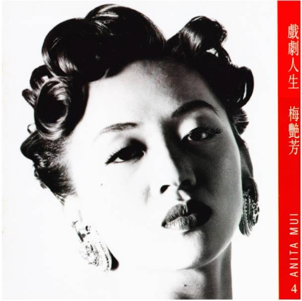
*梅艷芳 (資料圖片)*

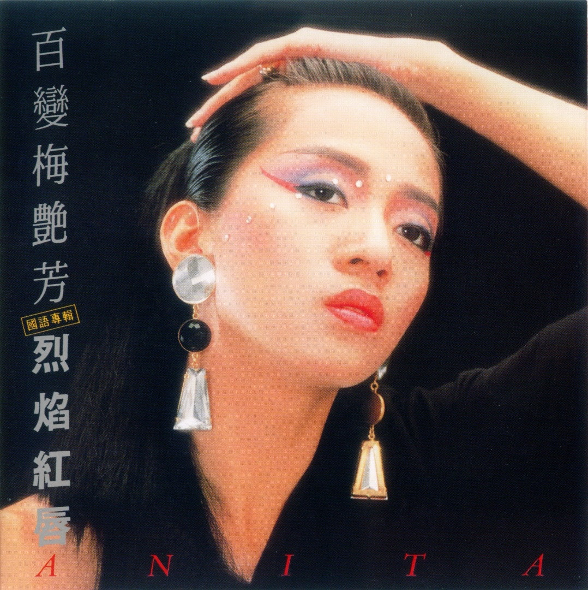
*梅艷芳 (資料圖片)*

*梅艷芳 (資料圖片)*

*梅艷芳 (資料圖片)*

*梅艷芳 (資料圖片)*

*梅艷芳 (資料圖片)*

*梅艷芳 (資料圖片)*

*梅艷芳 (資料圖片)*

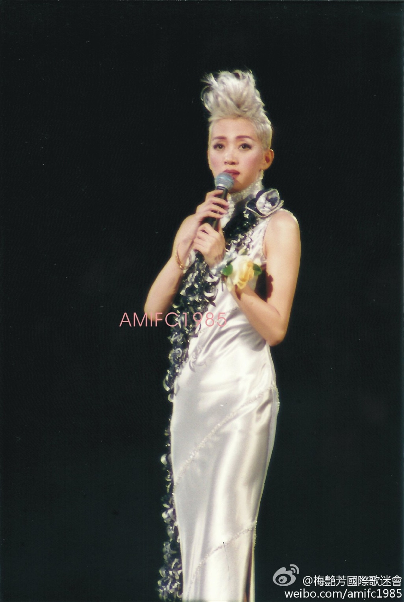
*梅艷芳 (資料圖片)*

*梅艷芳 (資料圖片)*

*梅艷芳 (資料圖片)*

*梅艷芳 (資料圖片)*

*梅艷芳 (資料圖片)*

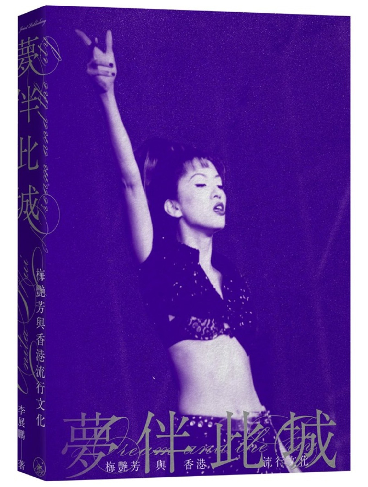
*梅艷芳 (資料圖片)*

*梅艷芳 (資料圖片)*

*梅艷芳 (資料圖片)*

*梅艷芳 (資料圖片)*

*梅艷芳 (資料圖片)*

*梅艷芳 (資料圖片)*

1990年，我在商台工作時，在會展策劃了名為「愛華音樂博覽」的大型展覽，留下豐富的美好回憶。因為這個展覽，我有幸拜訪梅姐的家，向她借了幾套舞台表演衣服。我嘗試設計了一個圓形旋轉台去展示這些衣服，得到樂迷相當不錯的反應，很多人駐足拍照留念。

照片中可見一個大型的室內展覽，中央有一個台，以假人展示了多套舞台服裝，兩旁各有一個展示櫃，從天花懸掛藍色和綠色的直幅。

當年我在歐洲背包旅行，瀏覽了不同博物館保存展示各方面文化藝術的方式。其中，倫敦的維多利亞與艾伯特博物館和設計博物館特別關注流行文化和音樂。受這趟旅程啟發，我先製作了有關樂壇歷史的電台節目《香港流行音樂創世記》，然後策劃了上述以音樂為題的展覽，再將這些經驗得着轉化成碩士及博士論文的材料。

這一切機緣都來自風格迥異卻同樣動人的音樂文化。

（本文獲 Ｍ+Stories 授權轉載，原題〈我與四首廣東歌的故事：黃志淙回應朱力行的《廣東雞尾歌》〉。原載不代表藝文格物立場）

> 黃志淙為香港大學通識教育總策劃 ，亦是資深電台DJ、樂評人和音樂策展人。多年來，他致力透過不同跨文化項目推廣本地和國際音樂文化，包括於大衛·寶兒的國語歌《剎那天地》（1997）、「八十日環遊世界音樂蜜月」（2000）、「後沙士」關愛歌曲《抱抱歌》（2004）、《黃霑書房》（2005）、《中國唱片百年展》（2006）、《香港流行演藝文化: 創意與動力展》（2007）、「別了家駒15載」 紀念活動（2008）、上海世界博覽會中的《唱作世代》音樂會（2010）、台北的「香港週2012」、坂本龍一的《async》大碟（2017）和文化博物館的廣東歌口述歷史（2021）。黃志淙目前擔任商業電台節目《Chi Chung’s Choice》主持。

> 朱力行的廣東雞尾歌是M+數碼委約項目， 於「M+ 故事」的互動展館展出。這系列項目希望在視覺文化與科技交會之處，探索別具創意的網上實踐。

*《廣東雞尾歌》截圖（https://cantococktail.com）*

> （圖片來源：《廣東雞尾歌》截圖。照片來源：M+）
