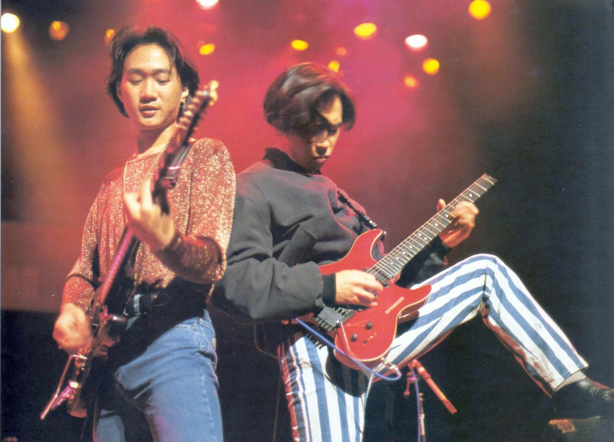
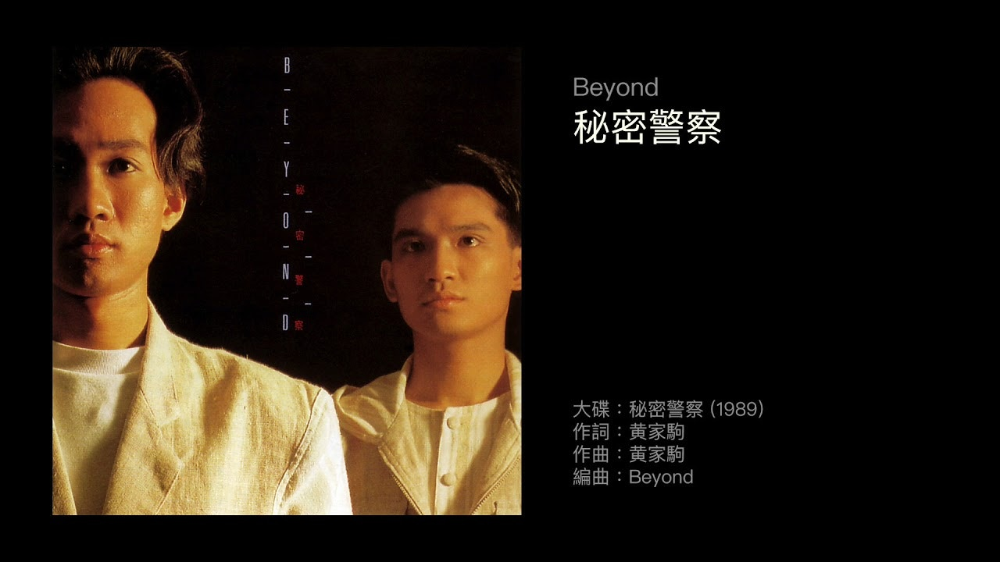

1993年6月30日，Beyond靈魂人物黃家駒從高台跌下，離開了我們。沒有家駒的日子已有28年，但Beyond的音樂仍對樂壇有著舉足輕重的影響，亦記載了一個年代的青春記憶。除了《海闊天空》、《誰伴我闖蕩》、《不再猶豫》等振奮人心的歌曲，還寫下了令人懷念的家駒式情歌《喜歡你》。

*Beyond的音樂至今仍對樂壇有著舉足輕重的影響，亦記載了一個年代的青春記憶。（網上圖片）*

相信樂迷喜歡Beyond的原因，是因為歌詞直接，旋律瀟灑，同時像說故事般向歌迷唱出創作時的心事和細膩情感。雖然家駒甚少創作情歌，但為數不多的情歌都能夠Hit足幾十年。談到情歌，大家一定記得《喜歡你》，時至今日都有不同歌手翻唱。對於這首經典作品，坊間都有少人猜測曲中的對象究竟是誰。

*《喜歡你》收錄在1989年9月6日發行的專輯《秘密警察》入面。（網上圖片）*

其實家強曾於區瑞強主持的節目《我們都是這樣唱大的II》中，透露《喜歡你》是哥哥家駒寫給初戀女友：「當然我都認識這女生，這個女生是他的一生中最愛。」並表示兩人拍拖久了，女方自然都會想結婚，不過結婚的話要放棄很多東西，但對家駒來說，音樂比一切都重要，加上當時在音樂上還未有成就，二人最後都分手收場：「我猜測女朋友可能要他放棄音樂，而歌詞裡的內容就是說女方希望他為了自己放棄音樂，但他最後還是選擇了音樂。」

*家強曾於區瑞強主持的節目《我們都是這樣唱大的II》中，透露《喜歡你》是哥哥家駒寫給初戀女友。（影片截圖）*

*家強曾於區瑞強主持的節目《我們都是這樣唱大的II》中，透露《喜歡你》是哥哥家駒寫給初戀女友。（影片截圖）*

*家強曾於區瑞強主持的節目《我們都是這樣唱大的II》中，透露《喜歡你》是哥哥家駒寫給初戀女友。（影片截圖）*

*家強曾於區瑞強主持的節目《我們都是這樣唱大的II》中，透露《喜歡你》是哥哥家駒寫給初戀女友。（影片截圖）*

翻查舊報道後，據知家駒初戀在16歲，大概1978年左右。初戀女友是家駒的校友，兩人愛得純樸，但隨著女方要搬家，戀情亦無疾而終。另外，亦有傳在正式以Beyond出道前，家駒分了兩支不同的樂隊「高速啤機」及「Unkown」，參加地下樂隊比賽，當時家駒跟Unkown主音潘先麗相戀。

*家駒私下原來都被Beyond成員們稱為「黃伯」，因為他年紀輕輕已經愛管事，更愛講人生道理，十足一位有經歷的老人。（網上圖片）*

*家駒私下原來都被Beyond成員們稱為「黃伯」，因為他年紀輕輕已經愛管事，更愛講人生道理，十足一位有經歷的老人。（網上圖片）*

*家駒私下原來都被Beyond成員們稱為「黃伯」，因為他年紀輕輕已經愛管事，更愛講人生道理，十足一位有經歷的老人。（網上圖片）*

*「香港沒有樂壇，只有娛樂圈」，其實這句常被媒體引用的家駒名句，並不完全合乎事實。1993年5月，Beyond在旺角的排練室接受採訪，曾經提到的原句應是「香港沒有樂壇，只有歌壇」不過媒體為了把標題放大亦稍作修改。 (網絡圖片)*

*黃家駒一共參與過九齣電影的演出及配樂，演出中往往離不開Beyond的影子，如《開心鬼救開心鬼》飾演Behind樂隊的阿文、《Beyond日記之莫欺少年窮》中的吳駒。《籠民》的毛仔則是他的最後演出，這部電影獲得第12屆金像獎最佳影片、導演、編劇和男配角（廖啟智）四個大獎。 (電影劇照)*

*「香港沒有樂壇，只有娛樂圈」，其實這句常被媒體引用的家駒名句，並不完全合乎事實。1993年5月，Beyond在旺角的排練室接受採訪，曾經提到的原句應是「香港沒有樂壇，只有歌壇」不過媒體為了把標題放大亦稍作修改。 (網絡圖片)*

*《樂與怒》(1993年)是Beyond轉投華納的專輯。（網上圖片）*

*1985年前後，黃家駒與Beyond經常在band房練習，更不時被鄰居投訴，但最後卻在那裡創作了很多成名曲。 (網絡圖片)*

*Beyond的作品中，不少也是跟「理想」有關，屈指一算，足足有32首作品也出現了「理想」一詞。當中包括：《海闊天空》、《真的愛你》、《喜歡你》、《大地》、《再見理想》、《誰伴我闖蕩》等等。 (網絡圖片)*

*Beyond的作品中，不少也是跟「理想」有關，屈指一算，足足有32首作品也出現了「理想」一詞。當中包括：《海闊天空》、《真的愛你》、《喜歡你》、《大地》、《再見理想》、《誰伴我闖蕩》等等。 (網絡圖片)*

可惜當Beyond正式跟唱片公司簽約後，工作愈來愈忙碌，兩人聚少離多而感情出現裂痕，最後家駒因不想耽誤女方，最終在感情和音樂事業之間二選其一而提出分手。其後家駒亦將對潘先麗的愧疚之情寫進《喜歡你》。不過無論歌曲的主角是誰，今時今日亦無須深究，但可以肯定是家駒及Beyond的歌曲永遠都會留在歌迷心中。
