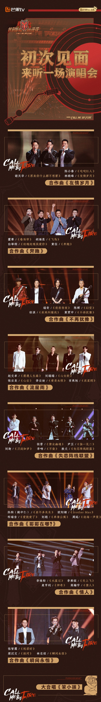
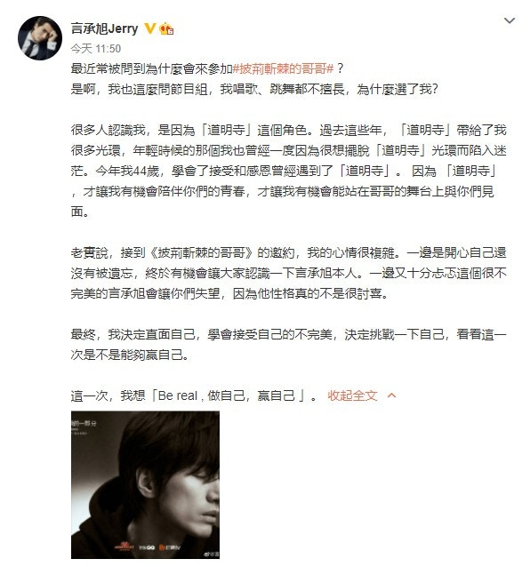
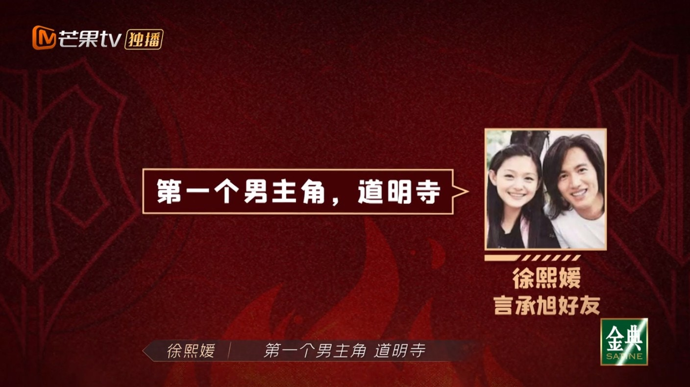
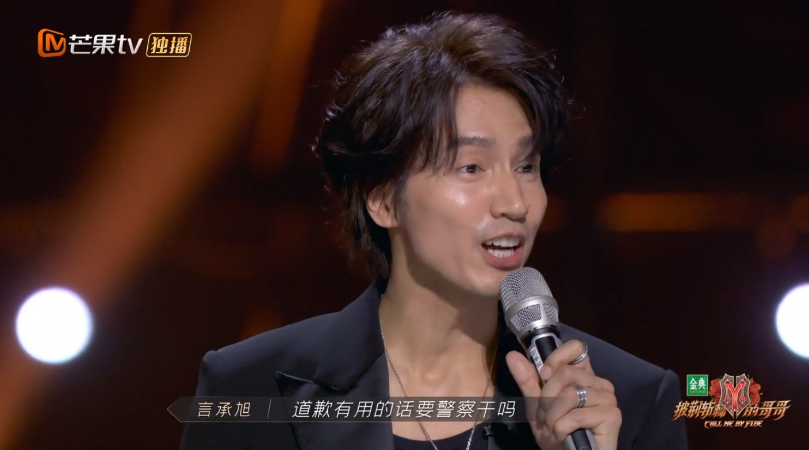

33位哥哥中，基本沒有油膩感。（微博@披荊斬棘的哥哥官微）

雖然已經出道逾20年，但很多人對言承旭的印象似乎依然停留在「道明寺」，對於他為何會參加唱跳成團節目，網友們也充滿疑問，就連他自己亦是如此。節目中，言承旭坦言第一次同節目組的人見面，自己超級緊張同害怕，因為不知道會遇到什麼樣的人：「像我之前，可能遇過有些媒體，它就只是想要找到你不好的東西，然後不斷地把它無限放大。其實有一陣子我就是會覺得盡量不要出現，我希望真的在節目中我可以讓觀眾多多看到，這幾年我怎麼樣面對以前道明寺帶給我的這些東西，然後我自己現在慢慢蛻變成2.0版的道明寺。」

言承旭在微博發文，大談今次參加節目的想法，要證明給大家看，他能做的不只有道明寺。（微博截圖）

令觀眾驚喜的是，在初舞台前，為言承旭加油打氣的親友團竟然是大S徐熙媛，她特別以「杉菜」的口吻送上祝福：「道明寺，我是你的杉菜，我們以前拍戲的時候，動不動就互相耍彆扭，那個時候我覺得你真的是高深莫測的死小孩，現在你反而變成一個大哥哥，然後又變得開朗，又變得更有魅力，你是我人生中第一個男主角，道明寺，杉菜永遠都在。」這一番說話，不止引起全場歡呼，有的觀眾更忍不住留下熱淚，言承旭自己也非常感動，他透露：「作為那時候道明寺F4的時候，突然有幾年我很迷茫，然後我很不知道，我要怎麼樣讓自己更好，因為那個時候你身邊充滿了很多聲音，尤其我覺得最可怕的是，那些聲音都是好聽的，都是稱讚，可是問題是這些東西對你來說，在你人生裏面最受用的嗎？我沒有那麼覺得。」

大S驚喜為言承旭送上祝福。（視頻截圖）

而初舞台上，言承旭依然為觀眾帶來熟悉的歌曲《流星雨》，引發大家的共同回憶。表演完後，他在台上特別多謝大S，更再次演繹了《流星花園》中的經典台詞：「道歉有用的話，要警察幹嘛！」令全場歡呼，看得出大家對他的喜愛，最終也獲得唱演B組的人氣第一位！

言承旭的人氣依然很高。（視頻截圖）
