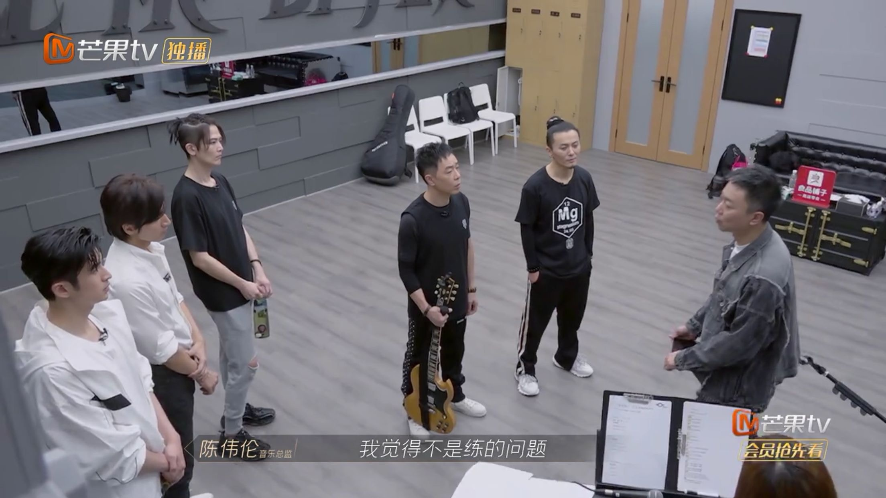
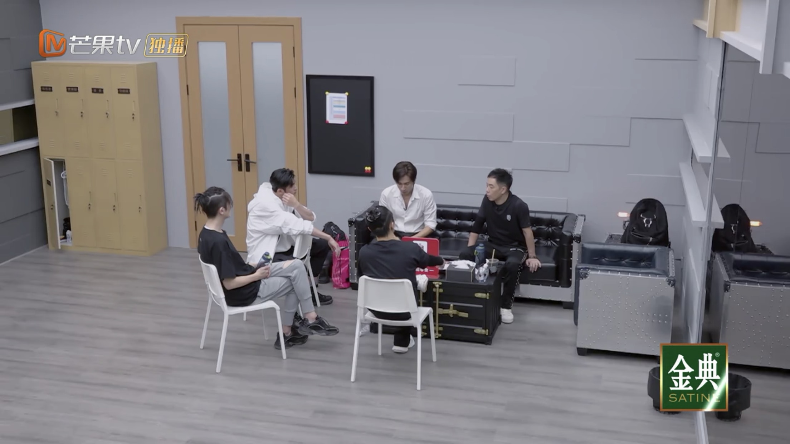
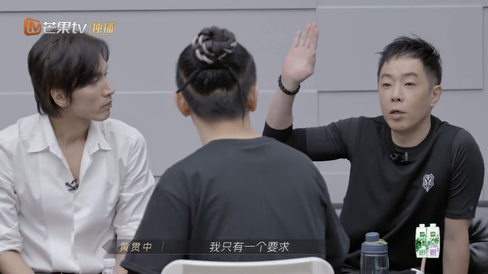
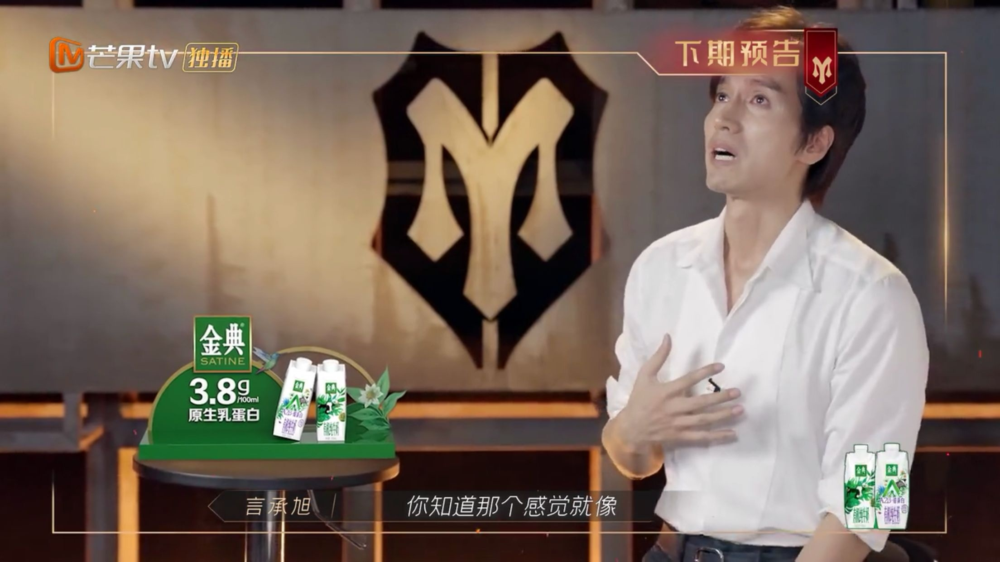

黃貫中（Paul）與言承旭、張雲龍、陳輝、劉瑞瑞組成五人部落。（視頻截圖）

事緣在首次公演的練習中，音樂總監陳偉倫表示自己對《淒美地》這首歌期待很高，但是現在隊內的五個人黃貫中（Paul）、言承旭、張雲龍、陳輝、劉端端的表演有一點鬆散，在走位、動作、合音方面完全不齊，不似是一個合作的作品。聽完陳偉倫的評價後，其他4位哥哥的狀態依然比較輕鬆，唯獨言承旭悶悶不樂，缺乏信心，有些擔憂：「遇到事情，不去處理，每天見面大家都互相尊重、互相客氣，可就是不夠有那種氛圍，反正就覺得很亂吧。我從本來很有信心，然後到最後自己就越來越亂。」

音樂總監認為哥哥們表現鬆散 。（視頻截圖）

言承旭認為，大家一開始都客客氣氣，無人互相指出不足之處，全部都是讚賞的聲音，沒有聽到很真實的評價：「我就在想，我們這個團隊是不是少一個能夠說哪裡不好的人呢。」因此他主動集合隊內成員剖白心聲，希望眾人不要過於美化大家表現：「我覺得我現在的年紀，真的跟以前不一樣了，我以前就是一直在自己的舒適區，這個不敢做那個不敢做，所以你看我也消失了很久，我自己檢討我自己，我覺得以前的言承旭就是害怕失敗，可是反過來講，這不就是自己認識自己一個很好的機會嗎？我的心裏就是說不要再給我講好聽話，因為我覺得那個東西對我們任何一個人都沒有幫助。我自己覺得如果我們真的要變成一個團體，其實就算大家不愉快跟吵架，那個是一個過程。」

言承旭主動集合成員開會。（視頻截圖）

作為大哥哥的阿Paul耐心靜聽後也予以讚同，並直言：「我只有一個要求，大家別想淘汰（的事），可以嗎？我覺得這個（想法）會影響到我們的表現。」

阿Paul鼓勵成員享受比賽。（視頻截圖）

在敞開心扉聊天之後，大家的排練都漸入佳境，而下期預告中，言承旭更泣不成聲，不知道發生了什麼呢？

言承旭爆喊。（視頻截圖）
