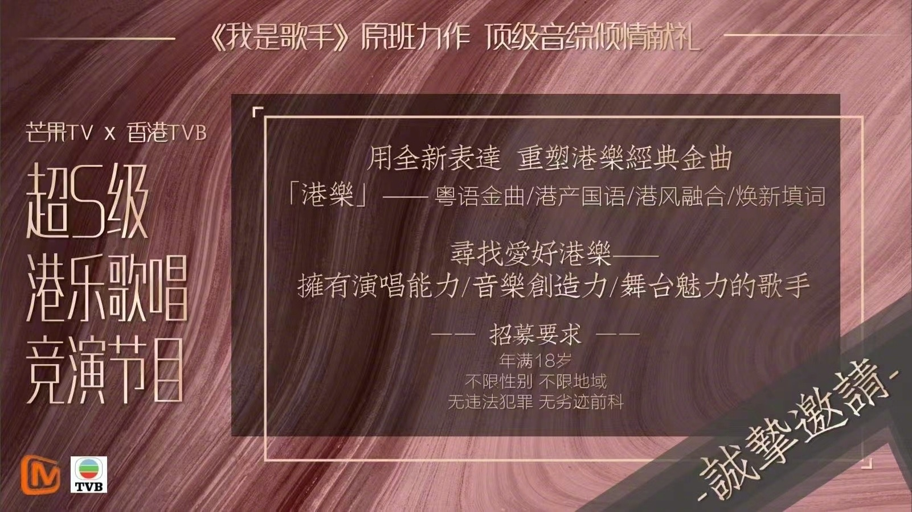
*芒果TV將與TVB合作，舉辦「超S級港樂歌唱競演節目」。（網絡圖片）*

消息傳開後，即刻引起各大網友積極討論，很多粵語歌愛好者都大感期待，也有網友認為這個競爭會非常激烈，除了可能有香港藝人、歌手、素人之外，還有廣東省地區的人才參與，更有網友笑言：「現在國家大力推大灣區，芒果也是會跟政策」等。

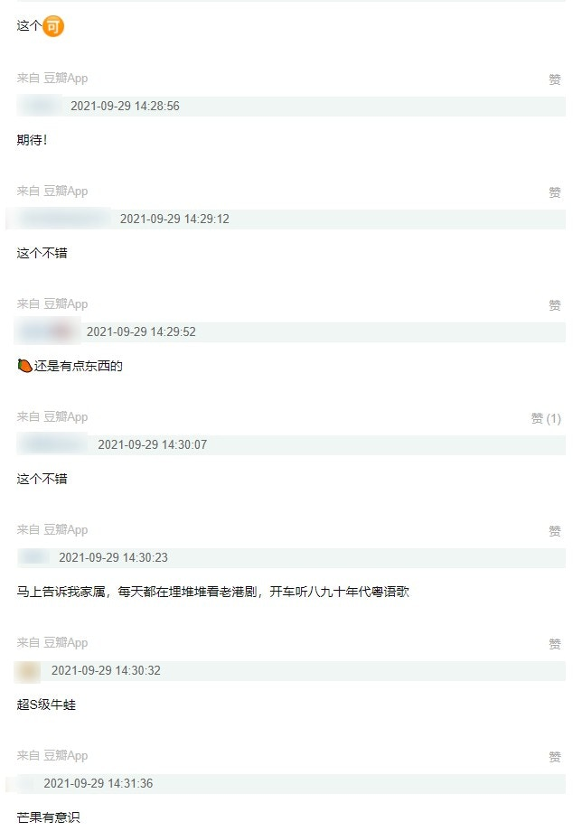
*不少網友都大感期待。（網絡截圖）*

芒果TV是內地八大衛視之一湖南衛視網際網路影片平台，打造了多個熱爆綜藝、劇集，包括《妻子的浪漫旅行》系列、《乘風破浪的姐姐》系列、《披荊斬棘的哥哥》等，向來能夠看準時機，直擊觀眾心理，尤其是正在播出的《披荊斬棘的哥哥》中，幾位港星陳小春、張智霖、梁漢文、謝天華、MC JIN、黃貫中、林曉峰都非常受歡迎，人氣極高，港式情懷正中網友下懷。

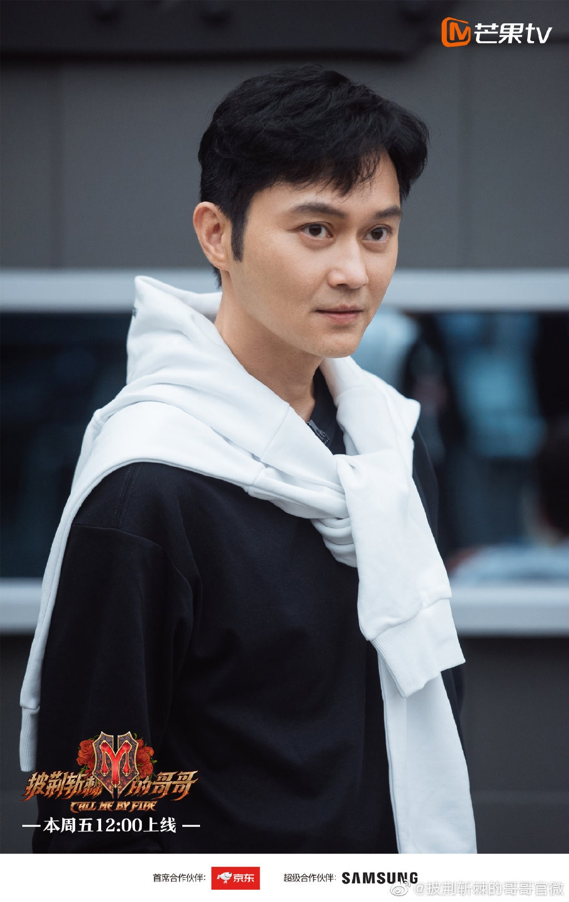
*張智霖在所有哥哥中人氣第一。（微博@披荊斬棘的哥哥官微）*

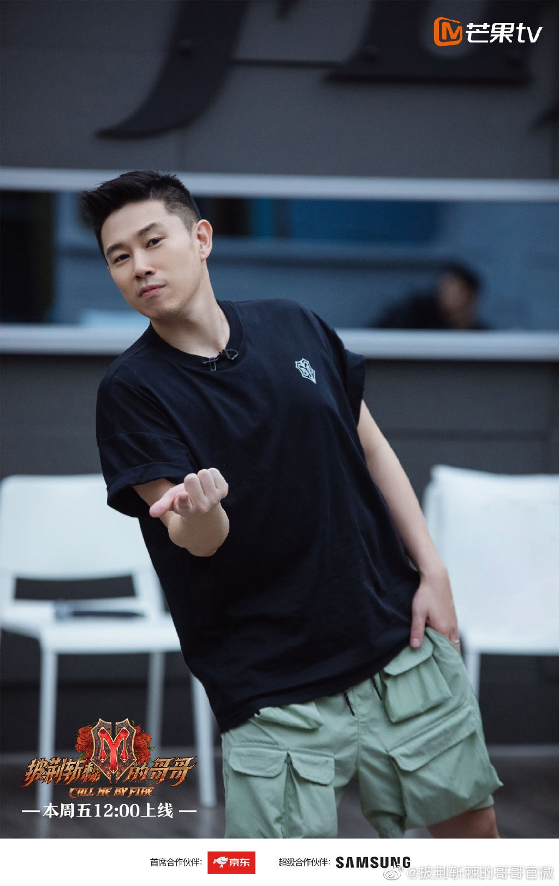
*MC JIN排名也非常靠前。（微博@披荊斬棘的哥哥官微）*

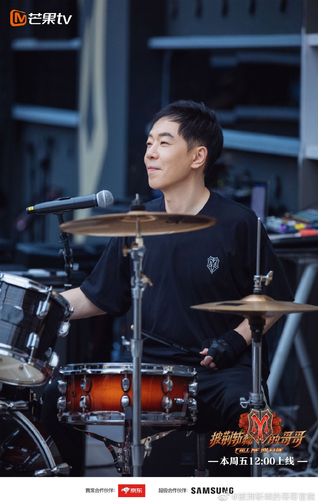
*黃貫中性格很好。（微博@披荊斬棘的哥哥官微）*

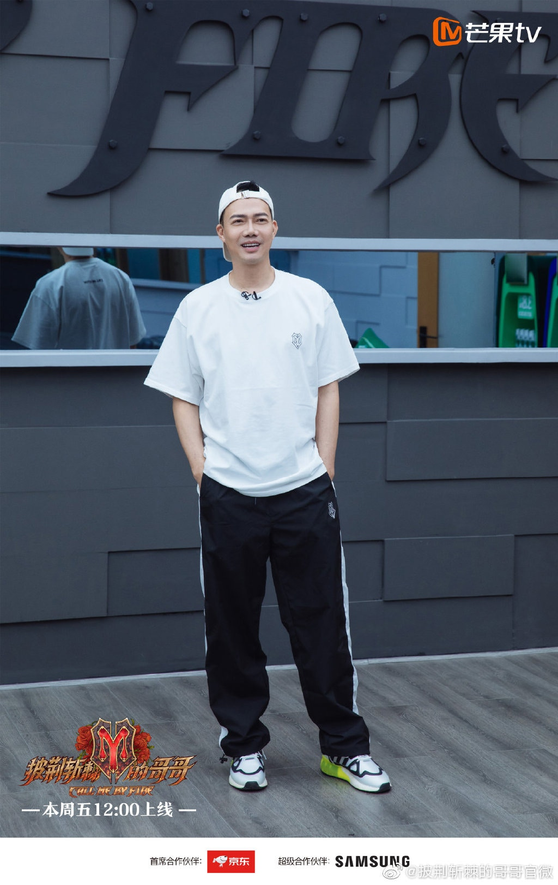
*謝天華同MC JIN回憶拉滿。（微博@披荊斬棘的哥哥官微）*

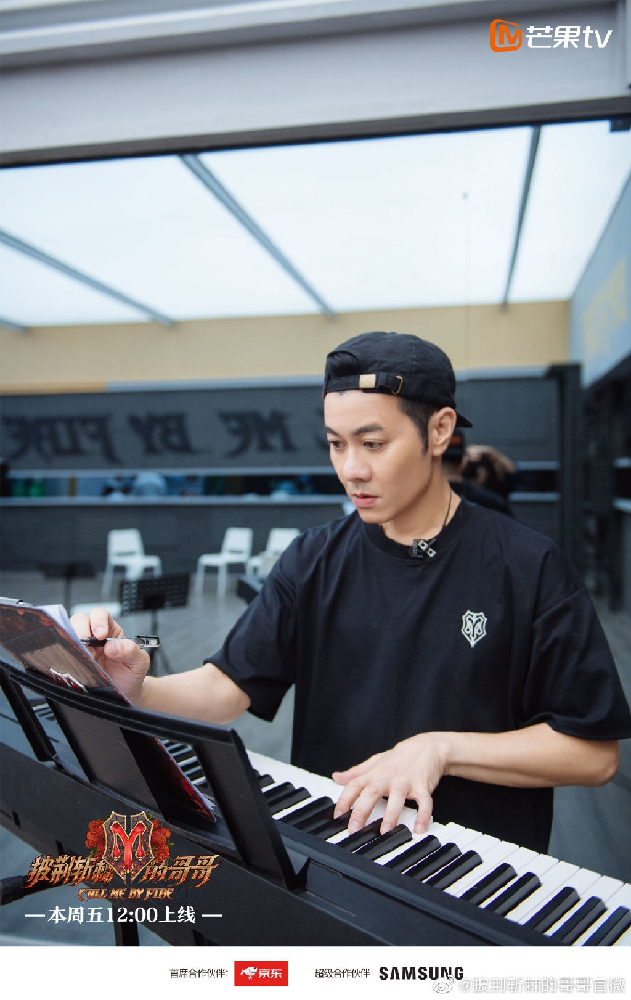
*梁漢文討論度也很高。（微博@披荊斬棘的哥哥官微）*

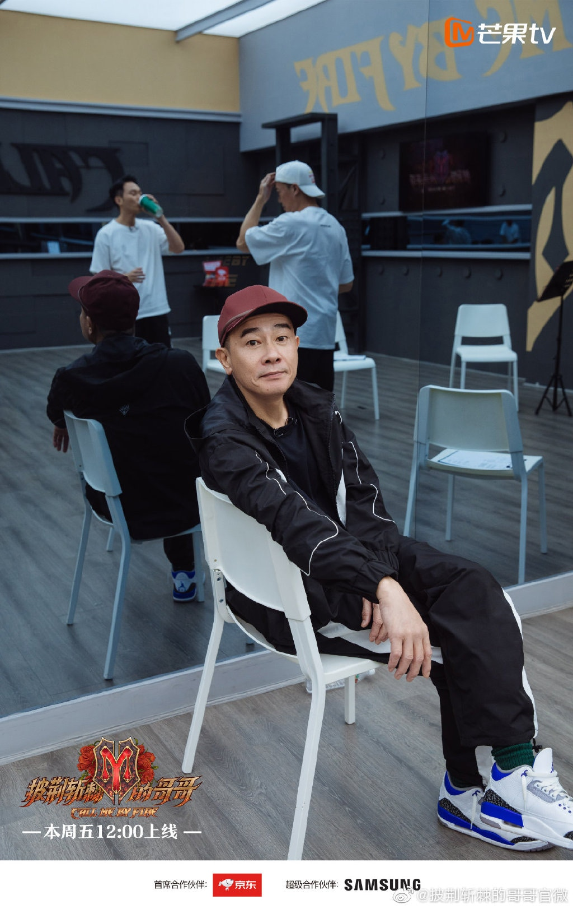
*陳小春搞笑。（微博@披荊斬棘的哥哥官微）*

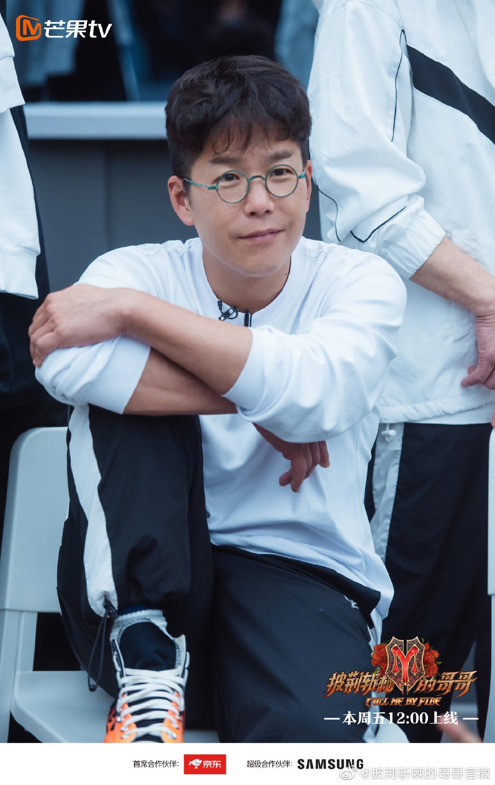
*很多網友都非常喜歡林曉峰。（微博@披荊斬棘的哥哥官微）*

其實這並不是兩大平台首次合作，早在2007年，湖南衛視就已與TVB推出過舞蹈節目《舞動奇跡》，前兩季都有大量無綫藝人參與，包括馬德鐘、謝天華、袁偉豪、黃祥興、陳敏之、郭羨妮、馬國明、鄭嘉穎、王君馨、伍詠薇等，當年節目也引起很大反響。除此之外，王祖藍在9月中接受訪問時曾透露：「今年會有好多同內地綜藝節目嘅合作，嚟緊呢幾個月會公布。」由此看來，很可能是以「重塑港樂經典金曲」為主的節目打頭陣，或者會成為下一個大熱綜藝。

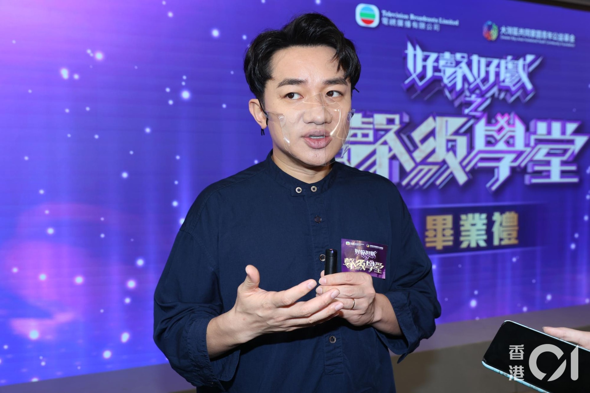
*祖藍前不久在訪問中透露接下來同內地會有很多合作。（資料圖片）*

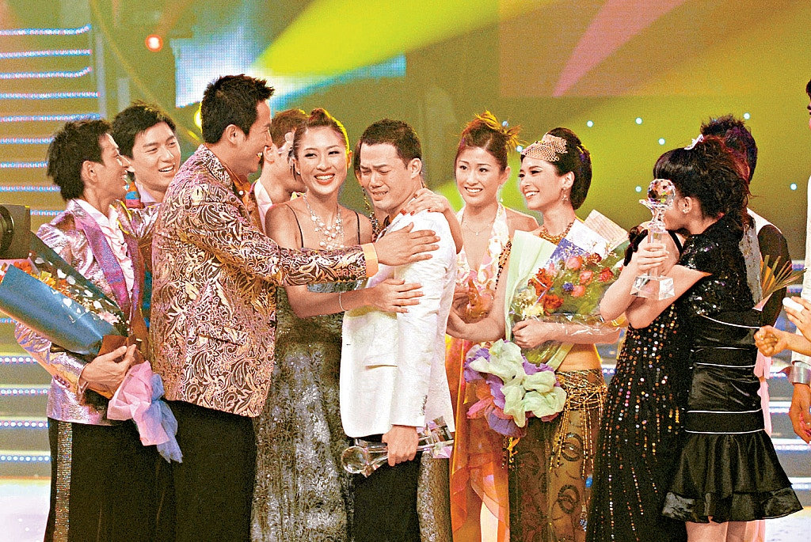
*謝天華是第一季的舞王。（VCG）*

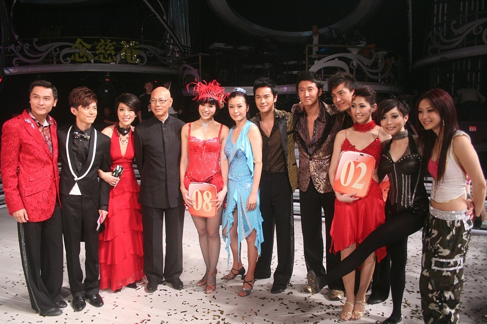
*第二季參與藝人。（VCG）*

*第二季參與藝人。（VCG）*

*王君馨、俞灝明。（VCG）*

*李承鉉、胡定欣。（VCG）*

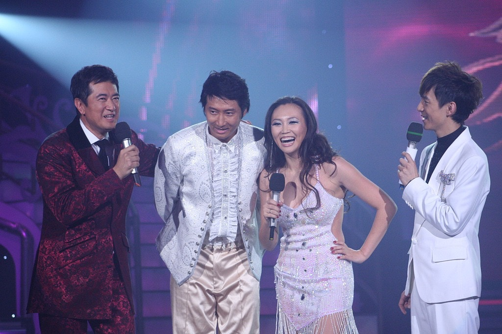
*鄧梓峰任主持，洪天明是參賽者之一。（VCG）*

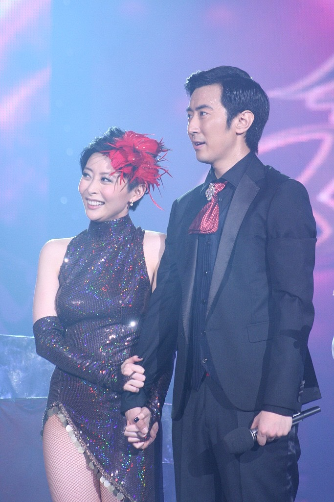
*湯盈盈、高梓淇。（VCG）*

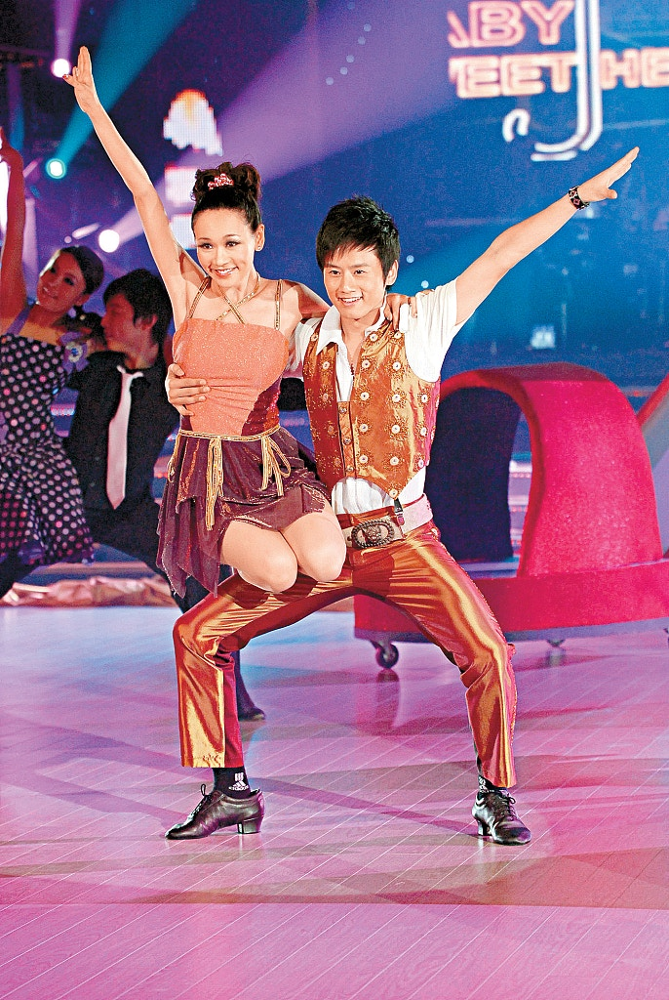
*楊思琦、張杰。（VCG）*
