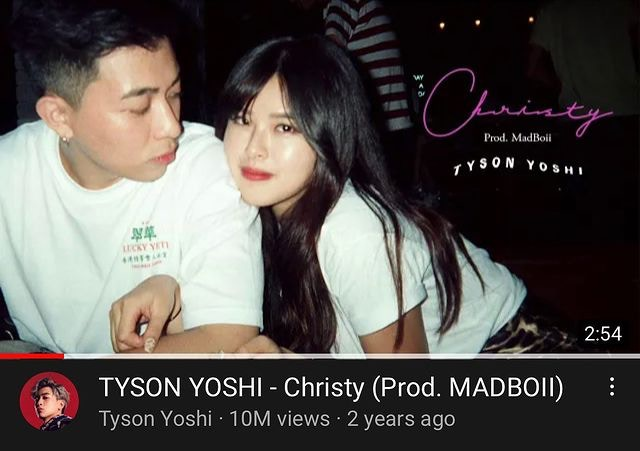
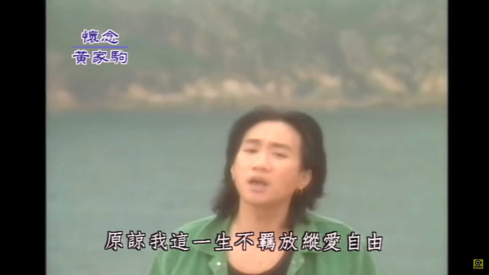

《Christy》在YouTube點擊率突破1000萬，達成里程碑。（Tyson Yoshi Instagram圖片）

> 點擊圖輯，睇下有邊啲音樂單位有份：

鄧紫棋（G.E.M.）已經擁有超過3首作品的MV，在YouTube錄得超過一億次點擊，當中《光年之外》錄得2.3億次點擊，不但成為觀看次數最多的YouTube中文音樂影片，也是首支觀看次數超過兩億的華語MV，相當厲害。（MV截圖）

另一位擁有超過一億點擊率作品的歌手是JC陳詠桐。其代表作《說散就散》擁有1.2億點擊次數，令她以20歲之齡成為MV觀看次數超過一億的最年輕華語歌手。（MV截圖）

要數經典的作品，不得不提Beyond的《海闊天空》。MV在YouTube至今擁有超過8700萬次點擊，僅次於由G.E.M.翻唱的《喜歡你》。（MV截圖）

莫文蔚近年的國語歌經典《慢慢喜歡你》，MV在YouTube至今擁有超過6700萬次點擊次數，剛好超越林俊傑的代表作《可惜沒如果》。（MV截圖）

同樣位列100大觀看次數最多YouTube中文音樂影片名單的，還有傅珮嘉。2014年她以「傅又宣」名義推出的《愛．這件事情》，至今擁有超過5600萬次點擊次數。（MV截圖）

陳奕迅有不少MV在YouTube擁有超過千萬點擊，當中又以與王菲合唱的《因為愛情》最多，有近3200萬次。（MV截圖）

張敬軒在環球時期也有一首作品達標，近年熱度未減的國語歌《只是太愛你》點擊率達2900萬次點擊次數。（MV截圖）

近年Dear Jane推出的MV都叫好叫座，《不許你注定一人》、《到此為止》及《哪裡只得我共你》的MV在YouTube的點擊次數都超過2000萬，當中又以《不許你注定一人》最多，約有2700萬次。（MV截圖）

事實上，《到此為止》不論是男聲或女聲版都同樣受歡迎，原唱連詩雅推出的《到此為止》歌詞版MV，在YouTube的點擊次數也迫近2000萬。（MV截圖）

吳雨霏也有一首單曲達成里程碑，9年前的《我本人》，MV在YouTube已經錄得超過1500萬次點擊。（MV截圖）

薛凱琪過去的《南瓜車》、《886》等作品皆深受歡迎，而能達成千萬點擊里程碑的作品是《Better Me》，擁有約1069萬次點擊。（MV截圖）

周柏豪不論在華納或星夢時期，都有作品在YouTube錄得過千萬點擊。在華納時期就有《傳聞》、《我的宣言》，前者錄得約1800次點擊，屬華納時期最多。而星夢時期就有《讓愛高飛》，錄得超過1100萬次點擊。（MV截圖）

早前談過譚嘉儀即將憑英文歌《Can You Hear》MV躋身千萬歌手行列，結果日前也終於達成里程碑。（MV截圖）

目前星夢歌手中，擁有點擊次數最高作品的歌手依然是HANA菊梓喬，《忘記我自己》在YouTube錄得近1900萬次點擊。（MV截圖）

談到千萬點擊作品，又怎能漏掉當年唱得街知巷聞的《越難越愛》？MV目前在YouTube錄得近1800萬次點擊。（MV截圖）

而胡鴻鈞也有大熱作達標，《到此一遊》在YouTube擁有近1600萬人次點擊。（MV截圖）
